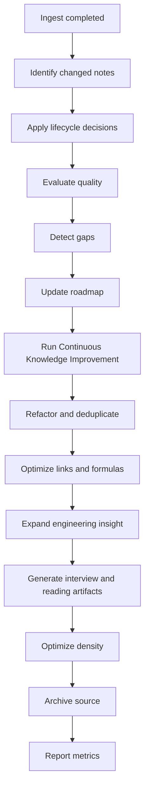

# Continuous Knowledge Improvement Framework

## Purpose

Continuous Knowledge Improvement, abbreviated CKI in this document, is the automatic post-ingest improvement loop for the vault.
It ensures that every ingestion makes the knowledge base more accurate, more connected, more useful for engineering work, and easier to maintain over decades.

The framework exists because a Second Brain does not become valuable by accumulating files.
It becomes valuable when new material improves the existing graph:

- Weak notes become stronger.
- Duplicate notes become visible.
- Missing prerequisites become explicit.
- Equations become usable.
- Cross-links become navigable.
- Research priorities become clearer.
- Interview and career material emerge from technical learning.
- Dense handbook knowledge grows from trustworthy atomic notes.

This document defines the required improvement pass that runs after ingestion and before archive/report.
It integrates the existing lifecycle modules instead of replacing them.

Related operating documents:

- [AGENTS.md](AGENTS.md) for the top-level operating sequence.
- [core/workflow_router.md](core/workflow_router.md) for routing requests into the correct workflows.
- [ingest.md](ingest.md) for source ingestion.
- [knowledge_ingestion_pipeline.md](knowledge_ingestion_pipeline.md) for the end-to-end `00_Inbox/` to `90_Archive/` pipeline.
- [knowledge_evolution.md](knowledge_evolution.md) for note lifecycle decisions.
- [quality_score.md](quality_score.md) for measurable note quality.
- [knowledge_gap.md](knowledge_gap.md) for unresolved technical and source gaps.
- [research_roadmap.md](research_roadmap.md) for reading and research prioritization.
- [merge_knowledge.md](merge_knowledge.md) for safe duplicate handling.
- [build_links.md](build_links.md) for cross-link construction.
- [formula_style.md](formula_style.md) for equations.
- [engineering_notes.md](engineering_notes.md) for engineering depth.
- [indexing.md](indexing.md) for indexes and maps of content.
- [knowledge_architecture.md](knowledge_architecture.md) for scale architecture.
- [core/quality_standards.md](core/quality_standards.md) for global quality gates.

## Scope

CKI applies whenever an ingestion or durable-knowledge edit changes the vault.
It is mandatory for substantial ingest batches and recommended for small edits that affect a single narrow note.

CKI covers these content types:

- Books.
- ISSCC papers.
- JSSC papers.
- Patents.
- Conference slides.
- Blog posts.
- YouTube transcripts.
- PDFs.
- Images.
- Screenshots.
- Whitepapers.
- Reddit discussions.
- Emails.
- Word documents.
- Markdown notes.
- Chat exports.
- Design notes.
- Interview preparation notes.
- Python analysis notes.

CKI does not replace source extraction.
The source must already have passed the relevant parts of [ingest.md](ingest.md) and [knowledge_ingestion_pipeline.md](knowledge_ingestion_pipeline.md).

CKI does not silently delete or rewrite mature knowledge.
When a change could alter technical meaning, CKI creates a merge candidate, review finding, or gap record unless the evidence is clear and traceable.

## Responsibilities

The AI assistant must behave as multiple roles during CKI.
The role definitions in [core/roles.md](core/roles.md) remain authoritative.
This section defines how those roles participate in the improvement loop.

### Researcher

The researcher checks whether new claims are source-backed, current enough, and properly scoped.

Responsibilities:

- Preserve provenance for claims, equations, figures, and standards-sensitive statements.
- Identify primary sources when a note depends on secondary summaries.
- Detect outdated or weak evidence.
- Recommend additional reading when the new source exposes a dependency.
- Keep standards-sensitive PCIe 6.0, PCIe 7.0, SerDes, and protocol claims marked with verification status.

### Technical Writer

The technical writer converts extracted material into durable explanations.

Responsibilities:

- Improve clarity without diluting engineering meaning.
- Split overloaded notes when they mix unrelated concepts.
- Compress repeated wording while preserving essential nuance.
- Turn fragments into readable sections, examples, and design implications.
- Maintain consistent headings and templates.

### Analog IC Expert

The analog IC expert checks whether the note is technically useful to a senior designer.

Responsibilities:

- Verify assumptions, topology context, units, operating region, noise sources, and system-level implications.
- Add tradeoffs, failure modes, debug hooks, and design intuition where the note is too abstract.
- Challenge oversimplified statements about PLLs, CDRs, ADCs, DACs, LDOs, bandgaps, equalizers, and SerDes links.
- Ensure formulas are connected to measurable quantities and practical constraints.

### Knowledge Architect

The knowledge architect protects the graph at scale.

Responsibilities:

- Decide canonical note ownership.
- Prevent uncontrolled folder and tag growth.
- Identify duplicates and near-duplicates.
- Route notes to the correct MOC, index, or handbook candidate.
- Keep the architecture scalable past 100,000 notes.

### Editor

The editor ensures each changed note is coherent, concise, and recoverable by future readers.

Responsibilities:

- Remove avoidable redundancy.
- Keep titles and summaries precise.
- Make uncertainty visible.
- Preserve source trails.
- Keep examples aligned with the note purpose.

### Reviewer

The reviewer applies quality gates before archive.

Responsibilities:

- Score or evaluate changed durable notes using [quality_score.md](quality_score.md).
- Record findings when technical or structural issues remain.
- Open gaps using [knowledge_gap.md](knowledge_gap.md).
- Confirm that CKI metrics have been recorded for meaningful ingest batches.

### Librarian

The librarian makes the knowledge retrievable.

Responsibilities:

- Add or update indexes.
- Add MOC entries when a topic becomes important.
- Maintain source inventories and archive traceability.
- Preserve the distinction between raw sources, reference notes, permanent notes, and handbook synthesis.

## Inputs

CKI starts with the outputs of ingestion.

Required inputs for substantial batches:

- Source packet path or source inventory entry.
- List of notes created or changed.
- Summary of promoted claims.
- Source confidence and verification status.
- Destination folders and note types.
- Any open questions from extraction.
- Any duplicate candidates found during ingest.
- Any links or index entries already added.

Recommended inputs:

- Current MOC entries for the affected domain.
- Existing quality scores.
- Existing roadmap items.
- Existing gap records.
- Existing formula notes.
- Related interview notes.
- Related handbook sections.

## Outputs

CKI produces improvement artifacts.
Not every batch produces every artifact, but each decision must be explicit for substantial ingestion.

Possible outputs:

- Lifecycle updates under [knowledge_evolution.md](knowledge_evolution.md).
- Quality scores or quality bands under [quality_score.md](quality_score.md).
- Refactored note sections.
- Duplicate merge candidates.
- Cross-link additions.
- MOC or index updates.
- Formula improvements.
- Engineering insight expansions.
- Interview questions.
- Gap records.
- Research roadmap items.
- Reading recommendations.
- Density improvements.
- Archive eligibility decision.
- CKI summary in the ingest report.

## Canonical Position In The Workflow

CKI runs after the basic lifecycle, quality, gap, and roadmap decisions have enough information to act, and before source archive/report are finalized.

```text
Capture
  -> Ingest
  -> Knowledge Evolution
  -> Quality Evaluation
  -> Gap Analysis
  -> Research Roadmap
  -> Continuous Knowledge Improvement
  -> Archive
  -> Report
```

For implementation inside the ingestion pipeline, CKI is part of review, integration, and indexing.
It is the pass that asks: "Now that this source changed the vault, what should improve automatically?"



## Mandatory Rules

Mandatory rules are defined in [core/mandatory_rules.md](core/mandatory_rules.md).
The CKI-specific mandatory rules are operational applications of those global rules.

1. CKI must run after every substantial ingestion batch.
2. CKI must not remove source trails.
3. CKI must not silently delete duplicate notes.
4. CKI must not merge contradictory claims without preserving the conflict.
5. CKI must not promote standards-sensitive claims to mature status without source and date context.
6. CKI must not mark formulas complete unless symbols, units, assumptions, and use cases are clear.
7. CKI must record open gaps when important missing information blocks confidence.
8. CKI must update indexes or explain why indexing was not needed.
9. CKI must include measurable quality outcomes in the final report for substantial batches.

## Recommendations

Recommendations guide judgment when several valid options exist.

- Prefer improving an existing canonical note over creating a new note.
- Prefer explicit merge candidates over aggressive auto-merging.
- Prefer a small number of strong links over broad shallow linking.
- Prefer equation usability over equation volume.
- Prefer engineering implications over textbook restatement.
- Prefer roadmap items that change future work over vague curiosity lists.
- Prefer density improvements that preserve context over excessive compression.

## Workflow

### Step 1: Establish The Improvement Boundary

Identify the exact files touched by ingestion.

Include:

- New durable notes.
- Updated durable notes.
- New reference notes.
- Updated source reports.
- Updated MOCs.
- Updated indexes.
- Opened or closed gap records.
- Roadmap updates.

Do not include unrelated files simply because they are nearby.
The improvement boundary prevents CKI from turning every ingest into a vault-wide rewrite.

Good boundary:

```markdown
Changed notes:
- `01_AnalogIC_SerDes/PLL_CDR_Clocking/pcie7_clocking_notes.md`
- `01_AnalogIC_SerDes/Equalization/pam4_ctle_dfe_notes.md`
- `70_Indexes/serdes_moc.md`

Out of scope:
- Older PLL textbook notes not touched by this source.
```

Bad boundary:

```markdown
The source mentions clocking, so rewrite every PLL, CDR, and SerDes note.
```

### Step 2: Run Knowledge Evolution

Apply [knowledge_evolution.md](knowledge_evolution.md) to each changed durable note.

Decision criteria:

- Is the note a raw capture, reference note, seed note, active permanent note, mature note, MOC candidate, handbook candidate, superseded note, or archive-only source?
- Did the new source raise or lower confidence?
- Did the note become canonical for a concept?
- Did the note become too broad and need refactoring?

Engineering example:

```markdown
New JSSC ADC paper adds a measured aperture-jitter discussion.
The existing sampling-jitter note moves from seed to active permanent note because it now has:
- source-backed equation,
- measurement interpretation,
- SerDes ADC implication,
- links to ENOB and clock jitter notes.
```

Edge cases:

- A note may improve technically but remain immature because the source is secondary.
- A standards note may be well written but still require current primary-source verification.
- A mature note may be downgraded if the new source reveals an important contradiction.

### Step 3: Run Quality Evaluation

Apply [quality_score.md](quality_score.md) to notes created, substantially changed, or proposed for maturity.

Decision criteria:

- Is the explanation technically correct?
- Are sources visible?
- Are equations usable?
- Are examples realistic?
- Are assumptions and limitations stated?
- Are links and indexes sufficient?
- Does the note support engineering action?

Good evaluation:

```markdown
PLL phase noise note score: 82/100.
Strong: source-backed jitter integration and link implications.
Weak: needs clearer distinction between random jitter and deterministic jitter.
Action: open one formula clarity gap and keep as active permanent note.
```

Bad evaluation:

```markdown
Looks good.
```

### Step 4: Run Gap Analysis

Apply [knowledge_gap.md](knowledge_gap.md) to unresolved technical, source, formula, standards, or integration questions.

Gap categories:

- Source gap.
- Equation gap.
- Measurement gap.
- Standards gap.
- Tradeoff gap.
- Debug gap.
- Architecture gap.
- Interview gap.
- Tooling gap.

Engineering example:

```markdown
Gap: PCIe 7.0 clocking note mentions target data rate and jitter budget sensitivity, but exact compliance values require the current PCI-SIG primary specification.
Action: create standards verification gap, do not mature the exact-number section.
```

### Step 5: Update Research Roadmap

Apply [research_roadmap.md](research_roadmap.md) when gaps imply future work.

Roadmap-worthy signals:

- The gap blocks multiple notes.
- The gap affects a major learning track.
- The gap affects SerDes, PCIe 7.0, PLL, CDR, ADC, LDO, or DSP design judgment.
- The gap requires primary literature.
- The gap is likely to recur.

Example:

```markdown
Roadmap item: Study ADC front-end bandwidth, aperture jitter, and CTLE interaction in PAM4 receiver architectures.
Priority: High.
Reason: New PCIe 7.0 receiver notes expose repeated uncertainty around ADC sampling margin.
```

### Step 6: Refactor Knowledge

Knowledge refactoring improves structure without changing technical meaning.

Refactor when:

- One note contains multiple separable concepts.
- A source-specific result is mixed into a general concept note.
- Repeated paragraphs appear across notes.
- A note's title no longer matches its content.
- A mature note accumulates too many exceptions.

Safe refactoring actions:

- Split sections into atomic notes.
- Move source-specific details into reference notes.
- Add summary sections.
- Rename headings for precision.
- Consolidate repeated definitions into a canonical note.
- Add links from local mentions to canonical notes.

Unsafe refactoring actions:

- Removing nuance to make a note shorter.
- Combining conflicting claims into one simplified statement.
- Moving content without preserving source links.
- Splitting a note so finely that engineering context disappears.

Good example:

```markdown
Before:
`pll_phase_noise_jitter.md` includes PLL noise sources, jitter integration, CDR jitter tolerance, and PCIe compliance notes.

After:
- Keep PLL noise source explanation in `pll_phase_noise_jitter.md`.
- Move CDR tracking implications to a CDR note.
- Move standards-sensitive compliance details to a PCIe clocking note.
- Add bidirectional links among the three notes.
```

Bad example:

```markdown
Delete the CDR and PCIe sections because they make the PLL note long.
```

### Step 7: Eliminate Duplicates Safely

Duplicate elimination prevents the graph from becoming noisy.
Use [merge_knowledge.md](merge_knowledge.md) for merge mechanics.

Duplicate types:

- Exact duplicate: same content in two files.
- Near duplicate: same concept with minor wording differences.
- Overlapping duplicate: two notes share a large concept area but each has unique material.
- Conflicting duplicate: two notes describe the same concept with incompatible assumptions.
- Stale duplicate: one note is older and superseded by a better source.

Decision criteria:

- Which note is canonical?
- Which note has better source trails?
- Which note has better engineering examples?
- Which note has better links?
- Is the conflict real or just a difference in scope?
- Is a merge safe now, or should it become a merge candidate?

Automation rules:

- Flag exact duplicates automatically.
- Suggest near duplicates using title, headings, tags, and key phrases.
- Never delete a duplicate without preserving unique source history.
- Convert uncertain duplicates into review findings.

Engineering example:

```markdown
Duplicate candidates:
- `adc_aperture_jitter.md`
- `sampling_jitter_adc.md`

Decision:
Use `sampling_jitter_adc.md` as canonical because it contains ENOB formula, SerDes receiver context, and source history.
Move unique aperture uncertainty discussion into canonical note.
Leave redirect note if links already point to the old file.
```

Edge cases:

- Two notes may share terms but differ by domain, such as PLL jitter transfer versus ADC sampling jitter.
- A patent note may intentionally duplicate a concept note because it preserves claim language.
- Interview notes may restate technical notes in question form and should not always be merged.

### Step 8: Optimize Cross-Links

Use [build_links.md](build_links.md) to build navigable relationships.

Cross-link goals:

- Connect prerequisites.
- Connect consequences.
- Connect related topologies.
- Connect formulas to applications.
- Connect source notes to permanent notes.
- Connect gaps to roadmap items.
- Connect interview questions to concept notes.

Link types:

- Parent MOC link.
- Canonical concept link.
- Source reference link.
- Equation dependency link.
- Tradeoff link.
- Debug link.
- Standards verification link.
- Interview preparation link.

Good SerDes example:

```markdown
`pam4_receiver_equalization.md` links to:
- CTLE peaking and noise enhancement.
- DFE error propagation.
- ADC ENOB and sampling jitter.
- CDR jitter tolerance.
- PCIe 7.0 clocking verification gap.
```

Bad example:

```markdown
Every occurrence of "PLL" links to the same PLL index, including repeated mentions in one paragraph.
```

Performance considerations:

- Add links where they change navigation.
- Avoid link spam inside dense technical paragraphs.
- Prefer canonical concept links over repeated local links.
- Batch MOC updates for related notes.

### Step 9: Improve Formulas

Apply [formula_style.md](formula_style.md) to all changed equations.

Formula improvement includes:

- Define every symbol.
- State units.
- State assumptions.
- State approximation limits.
- State topology or context.
- Connect formula to measurement or design use.
- Add a small worked example when useful.
- Link to related formulas.

Formula quality criteria:

- Can a future engineer use the equation without guessing symbols?
- Is the equation valid for the stated operating region?
- Are units consistent?
- Is the formula connected to an engineering decision?
- Are hidden assumptions exposed?

PLL example:

```markdown
RMS jitter is obtained by integrating phase noise over the relevant offset-frequency band.
The note must state the integration bandwidth, carrier frequency, units conversion, and whether spurs are included.
```

ADC example:

```markdown
SNR degradation from aperture jitter must identify input frequency, RMS jitter, and whether the result is used for sine-wave ENOB or link-margin reasoning.
```

LDO example:

```markdown
PSRR formulas must state load current, output capacitor, loop bandwidth, dropout condition, and whether the dominant path is loop gain, pass-device feedthrough, or reference noise.
```

Bad formula example:

```markdown
Jitter = phase noise integrated.
```

Good formula example:

```markdown
Use integrated phase noise over the offset band that matters to the receiver.
State:
- carrier frequency,
- lower and upper integration limits,
- whether deterministic spurs are included,
- conversion from phase variance to time jitter,
- impact on SerDes sampling margin.
```

### Step 10: Expand Engineering Insight

Apply [engineering_notes.md](engineering_notes.md) to ensure the note helps actual design work.

Engineering insight dimensions:

- Design intuition.
- Tradeoffs.
- Failure modes.
- Debug methods.
- Measurement setup.
- Corners and variation.
- Noise, linearity, stability, and timing limits.
- System implications.
- Layout or implementation sensitivity.

Examples:

Analog IC:

```markdown
Bandgap note gains a section on curvature correction tradeoffs:
- resistor ratio sensitivity,
- op amp offset contribution,
- startup failure mode,
- trim strategy,
- temperature sweep interpretation.
```

SerDes:

```markdown
PAM4 note gains a system insight:
Increasing CTLE peaking can improve high-frequency loss compensation but may amplify noise and stress ADC dynamic range.
```

PLL:

```markdown
Phase-noise note gains a debug insight:
If integrated jitter worsens mainly at low offsets, inspect reference noise, loop bandwidth, and supply coupling before blaming VCO thermal noise.
```

PCIe 7.0:

```markdown
Clocking note gains a caution:
Exact compliance limits are standards-controlled and must be verified against the current primary specification before design signoff.
```

ADC:

```markdown
Sampling note gains a system insight:
At high Nyquist input frequencies, aperture jitter can dominate ENOB even when quantization noise appears acceptable.
```

LDO:

```markdown
LDO note gains a debug insight:
Poor high-frequency PSRR may be pass-device feedthrough rather than loop-gain limitation.
```

DSP:

```markdown
Equalization note gains an adaptation insight:
LMS convergence depends on step size, input correlation, slicer error statistics, and interaction with CDR timing errors.
```

### Step 11: Generate Interview Questions

Interview question generation turns technical knowledge into recall, explanation, and career leverage.
Use [core/template_contracts.md](core/template_contracts.md) for interview-note shape when creating standalone interview material.

Generate interview questions when:

- A note becomes mature.
- A concept is central to SerDes, PLL, CDR, ADC, DAC, LDO, bandgap, or DSP design.
- A gap reveals a common interview weakness.
- A source includes a compact explanation of an important tradeoff.
- A concept connects circuit-level and system-level reasoning.

Question types:

- Concept explanation.
- Derivation.
- Design tradeoff.
- Debug scenario.
- Measurement interpretation.
- Architecture comparison.
- Standards awareness.
- Python analysis exercise.

Examples:

PLL:

```markdown
Question: How do reference noise, charge-pump noise, loop-filter noise, and VCO noise shape the PLL output phase-noise spectrum?
Strong answer should include loop bandwidth, transfer functions, and jitter integration implications.
```

ADC:

```markdown
Question: When does aperture jitter dominate ADC SNR, and how would that affect a PAM4 receiver?
Strong answer should connect input frequency, RMS jitter, ENOB, slicer margin, and clocking architecture.
```

LDO:

```markdown
Question: Why can an LDO with good low-frequency PSRR perform poorly at high frequency?
Strong answer should include loop gain rolloff, pass-device feedthrough, output capacitor impedance, and layout parasitics.
```

DSP:

```markdown
Question: What can go wrong when adapting a DFE with a large LMS step size in a PAM4 link?
Strong answer should include noise enhancement, decision error propagation, convergence stability, and interaction with timing recovery.
```

Bad interview generation:

```markdown
Question: Explain PLLs.
```

Good interview generation:

```markdown
Question: A PLL meets phase-noise targets near 1 MHz offset but fails integrated jitter. What offset regions and noise contributors would you inspect first?
```

### Step 12: Detect Research Gaps

Research gap detection is the bridge between what the vault knows and what it must learn next.
Use [knowledge_gap.md](knowledge_gap.md) and [research_roadmap.md](research_roadmap.md).

Gap triggers:

- Missing primary source.
- Conflicting explanations.
- Equation lacks conditions.
- Measurement setup is unknown.
- Standards value may be outdated.
- Important design tradeoff is absent.
- Topic is important but has no MOC.
- Note lacks implementation consequences.
- Several notes ask similar open questions.

Examples:

```markdown
Gap: The vault has multiple notes on CTLE and DFE but lacks a synthesis note explaining equalization partitioning for PCIe 7.0 PAM4 receivers.
Roadmap action: Create a high-priority synthesis task linking analog front-end bandwidth, ADC ENOB, CDR behavior, and DSP adaptation.
```

```markdown
Gap: LDO PSRR notes discuss loop gain but do not cover package and board coupling paths.
Roadmap action: Add a reading item on high-frequency PSRR measurement and layout sensitivity.
```

Failure recovery:

- If a gap cannot be scoped, create a broad gap with a narrow next action.
- If a gap is based on a weak source, mark source confidence low.
- If a gap depends on confidential work knowledge, generalize it without sensitive identifiers.

### Step 13: Recommend Reading

Reading recommendations convert gaps into source acquisition priorities.
Use [research_roadmap.md](research_roadmap.md) for prioritization.

Recommendation criteria:

- Primary source preferred over secondary summary.
- Recent standard or paper preferred for standards-sensitive claims.
- Classic reference preferred for foundational equations.
- High-authority source preferred when design decisions depend on accuracy.
- Practical app notes can be useful for measurement and debug, but should not override peer-reviewed or standards sources.

Recommended reading output should include:

- Topic.
- Reason.
- Source type.
- Priority.
- Expected outcome.
- Related notes.

Example:

```markdown
Topic: PCIe 7.0 receiver clocking and jitter allocation.
Reason: Current notes have architecture intuition but need primary-source verification for compliance-sensitive language.
Source type: Current PCI-SIG specification and recent conference material.
Priority: High.
Expected outcome: Update standards caveats, clocking MOC, and SerDes roadmap.
Related notes: `pcie7_clocking_notes.md`, CDR jitter tolerance note, PLL phase-noise note.
```

### Step 14: Optimize Knowledge Density

Knowledge density measures useful technical content per unit of note complexity.
The goal is not short notes.
The goal is notes that carry high signal with enough context to support engineering decisions.

Density problems:

- Repeated definitions.
- Long quoted material that should be summarized.
- Raw transcript residue.
- Multiple examples that teach the same point.
- Concept notes filled with source-specific details.
- Formula sections with symbols but no interpretation.
- MOC pages that become dumping grounds.

Density improvements:

- Replace repeated text with a canonical link.
- Move source-specific details to a reference note.
- Convert verbose paragraphs into structured tradeoff tables.
- Add one stronger engineering example instead of many weak examples.
- Split handbook-level synthesis from atomic notes.
- Add a summary at the top of a long note.

Good density improvement:

```markdown
A long CTLE note repeats "peaking improves high-frequency loss but increases noise" in four sections.
CKI keeps the best explanation once, links other sections to it, and adds one table comparing peaking, noise, ADC range, and adaptation impact.
```

Bad density improvement:

```markdown
Delete all examples to make the note shorter.
```

## Measurable Quality Metrics

CKI must report metrics for substantial ingestion batches.
For small single-note edits, report the most relevant metrics or state why full metrics were not needed.

### Core Metrics

| Metric | Definition | Target | Why it matters |
| --- | --- | --- | --- |
| Source coverage ratio | Changed durable notes with visible provenance divided by changed durable notes | 100 percent for source-backed changes | Prevents orphan claims |
| Lifecycle decision coverage | Changed durable notes with explicit lifecycle status | 100 percent for substantial batches | Prevents ambiguous maturity |
| Quality evaluation coverage | Changed durable notes scored or explicitly exempted | 100 percent for created, substantial, or matured notes | Makes quality measurable |
| Gap decision coverage | Changed durable notes with gaps opened, closed, or explicitly absent | 100 percent for substantial batches | Prevents hidden uncertainty |
| Roadmap decision coverage | High-priority gaps evaluated for roadmap impact | 100 percent | Converts uncertainty into action |
| CKI completion coverage | Changed durable notes passed through CKI or explicitly exempted | 100 percent for substantial batches | Ensures automatic improvement |
| Archive readiness | Source packets with completed ingest, CKI, and report status | 100 percent before moving to `90_Archive/processed/` | Prevents premature archive |

### Structural Metrics

| Metric | Definition | Target | Why it matters |
| --- | --- | --- | --- |
| Duplicate candidate count | Number of exact or near duplicates discovered | Trend down over time | Controls graph sprawl |
| Duplicate resolution rate | Duplicate candidates resolved or triaged divided by candidates found | High, but not forced | Prevents unsafe merges |
| Orphan note count | Durable notes with no meaningful inbound or outbound links | Trend down | Improves retrieval |
| MOC integration coverage | Important mature notes linked from a relevant MOC or index | High for core domains | Supports navigation at scale |
| Broken link count | Links that do not resolve | Zero after edited batches | Preserves graph integrity |
| Index freshness | Important canonical notes represented in index/MOC layer | High for mature notes | Keeps knowledge discoverable |

### Formula Metrics

| Metric | Definition | Target | Why it matters |
| --- | --- | --- | --- |
| Formula completeness rate | Equations with symbols, units, assumptions, and use cases | 100 percent for newly edited formulas | Makes formulas usable |
| Formula link coverage | Formula notes linked to at least one practical application or measurement context | High | Prevents isolated math |
| Unit consistency findings | Count of unresolved unit or dimensional concerns | Zero for mature notes | Prevents design errors |
| Approximation visibility | Formulas with stated validity limits | High for analog and signal-processing notes | Prevents misuse |

### Engineering Insight Metrics

| Metric | Definition | Target | Why it matters |
| --- | --- | --- | --- |
| Tradeoff coverage | Core technical notes with at least one explicit tradeoff | High for design concepts | Supports engineering judgment |
| Failure-mode coverage | Core notes with failure/debug discussion | High for circuits and systems | Supports real design work |
| Measurement coverage | Notes with measurement or validation context when relevant | High for claims tied to silicon or lab data | Improves practical value |
| System-impact coverage | Circuit notes connected to link, clocking, power, or architecture impact | High for SerDes and mixed-signal topics | Avoids isolated facts |

### Learning And Career Metrics

| Metric | Definition | Target | Why it matters |
| --- | --- | --- | --- |
| Interview question yield | Strong interview questions generated from mature concepts | At least one for important mature concepts | Converts knowledge into readiness |
| Reading recommendation precision | Recommendations tied to a specific gap and expected outcome | 100 percent for roadmap recommendations | Avoids vague reading lists |
| Gap closure rate | Closed gaps divided by opened gaps over a study cycle | Trend up | Shows learning progress |
| Handbook candidate count | Mature synthesis candidates identified | Trend reflects domain maturity | Builds long-form reusable knowledge |

### Density Metrics

| Metric | Definition | Target | Why it matters |
| --- | --- | --- | --- |
| Redundancy ratio | Repeated or overlapping sections divided by useful sections | Trend down | Reduces maintenance cost |
| Concept density | Distinct useful concepts per 1,000 words | Stable or improving | Prevents bloated notes |
| Reference separation rate | Source-specific details stored in reference notes rather than concept notes | High | Keeps permanent notes durable |
| Summary availability | Long notes with concise top summaries | 100 percent for long mature notes | Improves scan speed |

## Decision Criteria

Use these criteria to decide how aggressive CKI should be.

### Light CKI

Use light CKI when:

- One small note changed.
- No new source-backed claims were added.
- No formula changed.
- No lifecycle transition is proposed.
- No duplicate or link issue is obvious.

Minimum output:

- Quality check or exemption.
- Link/index decision.
- Gap decision.
- Final verification note.

### Standard CKI

Use standard CKI when:

- A source was ingested.
- One or more durable notes changed.
- New source-backed claims were promoted.
- A note was created, expanded, or reorganized.

Required output:

- Lifecycle decision.
- Quality evaluation.
- Gap analysis.
- Roadmap decision.
- Duplicate scan.
- Link/index check.
- Formula check if formulas are touched.
- CKI summary.

### Deep CKI

Use deep CKI when:

- A book, large paper batch, transcript series, or major source packet is ingested.
- Multiple domains are affected.
- Mature notes are changed.
- Conflicts or duplicates are discovered.
- Standards-sensitive material is promoted.
- A new MOC or handbook section is justified.

Required output:

- Standard CKI outputs.
- Refactoring plan or implementation.
- Duplicate merge plan.
- Cross-link optimization.
- Formula audit.
- Engineering insight expansion.
- Interview question generation.
- Reading recommendations.
- Metrics table.
- Report section with unresolved risks.

## Automation Rules

Automation should make CKI repeatable without making unsafe decisions invisible.

Safe to automate:

- List changed notes.
- Detect missing provenance sections.
- Detect broken links.
- Detect orphan notes.
- Detect duplicate titles and near-duplicate headings.
- Detect missing formula symbol definitions.
- Detect notes without lifecycle tags or status.
- Detect high-priority notes missing MOC/index entries.
- Generate candidate interview questions.
- Generate candidate reading recommendations from recorded gaps.
- Generate metrics for reports.

Requires review before applying:

- Merging near duplicates.
- Deleting or archiving duplicate notes.
- Changing mature-note claims.
- Updating standards-sensitive values.
- Rewriting formulas.
- Collapsing long notes into summaries.
- Renaming canonical notes.
- Moving notes across top-level folder boundaries.

Must not be automated silently:

- Removing source provenance.
- Deleting original sources.
- Treating AI-generated summaries as primary sources.
- Promoting confidential work context into public technical notes.
- Marking standards compliance values current without verification.

## Failure Recovery

### Incomplete CKI

If CKI cannot complete:

1. Do not pretend the batch is complete.
2. Record which CKI steps were completed.
3. Record which steps failed and why.
4. Keep affected notes below mature status unless evidence supports maturity.
5. Open a gap or roadmap item if the failure matters.
6. Archive only if the report clearly states the unresolved CKI status.

Example:

```markdown
CKI incomplete:
- Duplicate scan completed.
- Link check completed.
- Formula audit blocked because source equation image is unreadable.
Action:
- Open equation extraction gap.
- Keep ADC note as active permanent, not mature.
- Archive source with unresolved equation gap recorded.
```

### Conflicting Sources

If two sources disagree:

- Preserve both claims with source context.
- Identify conditions that may explain the difference.
- Avoid synthesizing a false average.
- Open a conflict gap if resolution requires more evidence.
- Prefer primary source or measured result when appropriate.

Example:

```markdown
One blog states that CTLE peaking always improves PAM4 eye opening.
A paper shows peaking can reduce margin when noise and ADC range dominate.
Resolution:
- General note states conditional tradeoff.
- Blog remains a low-confidence reference.
- Paper result is linked as stronger evidence.
```

### Duplicate Merge Uncertainty

If duplicate handling is uncertain:

- Mark the canonical candidate.
- Preserve both notes.
- Add a merge candidate section or report entry.
- Link both notes to each other.
- Defer destructive cleanup.

### Formula Ambiguity

If a formula cannot be verified:

- Keep the formula if provenance is clear, but mark uncertainty.
- State missing assumptions.
- Open an equation gap.
- Do not use the formula as a mature design rule.

### Standards Uncertainty

If a PCIe or protocol claim may depend on a current standard:

- Mark it as standards-sensitive.
- State source date.
- Require primary-source verification.
- Avoid exact compliance wording unless verified.

## Examples

### Example 1: PCIe 7.0 Clocking Source

Input:

```markdown
Source: Conference slide deck on PCIe 7.0 receiver clocking.
Changed note: `01_AnalogIC_SerDes/PLL_CDR_Clocking/pcie7_clocking_notes.md`
```

CKI actions:

- Knowledge evolution: keep note active permanent because source is secondary.
- Quality evaluation: score explanation and mark standards-sensitive sections.
- Gap analysis: open primary-spec verification gap.
- Roadmap: add high-priority PCIe 7.0 clocking verification item.
- Cross-links: add links to PLL jitter, CDR tracking, ADC sampling, and PAM4 equalization.
- Formula improvement: ensure jitter discussion states bandwidth and units.
- Engineering insight: add how clock jitter affects receiver sampling margin.
- Interview generation: add question on separating PLL, CDR, and channel contributions to timing margin.
- Reading recommendation: current PCI-SIG source plus recent ISSCC/JSSC receiver papers.
- Density: move slide-specific claims to source note if they crowd the durable clocking note.

### Example 2: JSSC ADC Paper

Input:

```markdown
Source: JSSC paper on high-speed ADC in wireline receiver.
Changed notes:
- ADC sampling jitter note.
- PAM4 receiver architecture note.
- DSP equalization note.
```

CKI actions:

- Duplicate elimination: compare aperture-jitter and sampling-jitter notes.
- Formula improvement: verify jitter-limited SNR equation symbols and units.
- Engineering insight: connect ENOB, sampling uncertainty, CTLE gain, and slicer margin.
- Gap detection: open measurement setup gap if input frequency and jitter extraction method are unclear.
- Interview generation: create ADC-in-SerDes questions.
- Reading recommendation: follow-up papers on ADC-based receiver front ends.

### Example 3: LDO PSRR Notes From App Note And Paper

Input:

```markdown
Sources:
- Vendor app note on PSRR measurement.
- Paper on capless LDO stability.
Changed note: LDO PSRR and stability note.
```

CKI actions:

- Knowledge evolution: app note remains reference; synthesis note becomes active permanent.
- Quality evaluation: source quality split between practical measurement and peer-reviewed theory.
- Formula improvement: state PSRR measurement setup, load current, output capacitor, and frequency range.
- Engineering insight: add pass-device feedthrough and package coupling failure modes.
- Gap detection: open high-frequency layout coupling gap.
- Reading recommendation: LDO PSRR measurement papers and classic stability references.
- Density: keep vendor-specific setup details out of the general LDO concept note.

### Example 4: DSP Equalization Transcript

Input:

```markdown
Source: YouTube transcript on LMS adaptation and DFE.
Changed notes:
- DSP equalization overview.
- PAM4 DFE note.
- Interview question set.
```

CKI actions:

- Quality evaluation: mark transcript as secondary and check claims against existing notes.
- Duplicate elimination: avoid duplicating DFE basics already in canonical note.
- Cross-link optimization: link LMS, DFE error propagation, CDR timing, and PAM4 slicing.
- Engineering insight: add convergence and error-propagation failure modes.
- Interview generation: add scenario questions.
- Gap detection: open source gap for rigorous derivation if transcript is informal.

## Edge Cases

### Large Books

Do not run deep CKI on an entire book at once unless the source has already been chunked.
Run CKI per chapter, section, or theme.
Maintain a book-level reference note and promote only durable concepts.

### Patents

Patents often contain broad claims and implementation-specific language.
Do not treat patent claims as general design truth without corroboration.
Use patents as source notes, invention maps, prior-art references, or architecture prompts.

### Reddit Discussions

Reddit can expose practical debugging intuition and disputed claims.
Treat it as low-authority unless supported by primary sources or strong engineering reasoning.
Preserve useful questions and failure modes, but do not mature claims on Reddit alone.

### Screenshots And Images

If OCR or visual interpretation is uncertain:

- Record uncertainty.
- Preserve the image source.
- Extract only visible claims.
- Open image/OCR extraction gaps for equations or plots that matter.

### Confidential Work Material

Generalize learnings.
Remove sensitive names, customer details, proprietary measurements, internal schedules, and unreleased product information.
Keep private context out of durable general notes.

### AI-Generated Summaries

Treat AI summaries as processing artifacts, not sources.
Use them to locate candidate claims, then preserve or seek source-backed evidence.

### Mature Notes

Mature notes require extra care.
Do not make sweeping changes from one new source unless the evidence is strong.
Prefer adding a "New evidence" or "Limitations" section before restructuring the whole note.

## Quality Checklist

Before CKI is considered complete for a substantial batch:

- Changed files are listed.
- Source trail is preserved.
- Lifecycle decisions are recorded.
- Quality evaluation is complete or explicitly exempted.
- Gaps are opened, closed, or explicitly absent.
- Roadmap impact is evaluated.
- Duplicate candidates are resolved, triaged, or explicitly absent.
- Cross-links are useful and not excessive.
- Index or MOC updates are complete or explicitly unnecessary.
- Formulas touched by the batch follow [formula_style.md](formula_style.md).
- Engineering insight has been expanded where notes were too abstract.
- Interview questions are generated for important mature concepts or explicitly unnecessary.
- Reading recommendations are tied to gaps or roadmap items.
- Knowledge density was checked.
- Archive eligibility is clear.
- Report includes CKI actions, metrics, and unresolved risks.

## CKI Report Section

For substantial batches, include a CKI section in the ingest report.

Suggested structure:

```markdown
## Continuous Knowledge Improvement

### Scope

- Changed durable notes:
- Changed reference notes:
- Index/MOC updates:

### Actions Completed

- Knowledge evolution:
- Refactoring:
- Duplicate elimination:
- Cross-link optimization:
- Formula improvement:
- Engineering insight expansion:
- Interview question generation:
- Gap detection:
- Reading recommendation:
- Density optimization:

### Metrics

| Metric | Result | Notes |
| --- | --- | --- |
| Source coverage ratio |  |  |
| Quality evaluation coverage |  |  |
| Gap decision coverage |  |  |
| Duplicate candidates |  |  |
| Broken links |  |  |
| Formula completeness findings |  |  |

### Remaining Risks

- 

### Follow-Up

- 
```

The empty fields above define the report shape.
When writing an actual report, fill them with concrete values or state "not applicable" with a reason.

## Automation Opportunities

Near-term automations:

- Changed-note detector.
- Source provenance scanner.
- Missing lifecycle scanner.
- Broken Obsidian link checker.
- Duplicate title and heading detector.
- Formula symbol-definition checker.
- Orphan note detector.
- MOC coverage checker.
- CKI metric generator.
- Report section generator.

Medium-term automations:

- Semantic duplicate candidate finder.
- Link recommendation engine.
- Reading recommendation generator from gap clusters.
- Interview question generator from mature notes.
- Formula consistency checker with unit validation.
- Density analyzer for repeated sections.
- Roadmap priority recommender.

Long-term automations:

- Vault health dashboard.
- Domain maturity heat map.
- Standards-sensitive claim monitor.
- Research backlog optimizer.
- Personalized study scheduler.
- Graph-based prerequisite recommender.
- Multi-source claim confidence tracker.

## Future Evolution

CKI should evolve as the repository matures.

Future extensions:

- Add machine-readable frontmatter for CKI status.
- Add a dedicated `70_Indexes/cki_dashboard.md` when indexes exist at scale.
- Add per-domain quality thresholds for PLL, CDR, ADC, LDO, DSP, and SerDes notes.
- Add formula-specific lint rules for common analog and signal-processing equations.
- Add source authority ranking by source type.
- Add graph analytics for centrality, orphan clusters, and duplicate neighborhoods.
- Add periodic review cycles for standards-sensitive notes.
- Add handbook synthesis triggers when clusters reach maturity.
- Add interview readiness scores for career knowledge.

## Final Operating Principle

Every ingestion should leave the vault better than it found it.
Better does not always mean more notes.
It can mean one duplicate removed, one formula clarified, one gap exposed, one link added, one roadmap item sharpened, or one note made dense enough to be useful under real engineering pressure.

CKI exists so the repository compounds in quality, not just in size.
