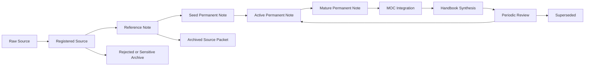

# Knowledge Evolution

## Purpose

This document defines how knowledge changes state over time in this repository.
It is the lifecycle engine of the AI Operating Manual: it tells future agents how raw source material becomes reference notes, permanent notes, MOCs, handbooks, archived sources, or superseded knowledge.

This document extends:

- [knowledge_architecture.md](knowledge_architecture.md)
- [knowledge_ingestion_pipeline.md](knowledge_ingestion_pipeline.md)
- [quality_score.md](quality_score.md)
- [knowledge_gap.md](knowledge_gap.md)
- [research_roadmap.md](research_roadmap.md)
- [continuous_knowledge_improvement.md](continuous_knowledge_improvement.md)

It does not duplicate mandatory rules from [core/mandatory_rules.md](core/mandatory_rules.md) or quality gates from [core/quality_standards.md](core/quality_standards.md).

## Scope

Use this document for:

- Moving a note from seed to active or mature.
- Deciding whether a source should become a reference note, permanent note, MOC entry, or handbook section.
- Deciding when to archive or supersede old knowledge.
- Maintaining long-lived technical areas such as SerDes, PCIe7, PLL/CDR, ADC, LDO, and DSP.
- Preventing the vault from becoming a fossil bed of old drafts.

Do not use this document for:

- Initial source extraction. Use [knowledge_ingestion_pipeline.md](knowledge_ingestion_pipeline.md).
- Detailed review procedure. Use [review.md](review.md).
- Duplicate merge procedure. Use [merge_knowledge.md](merge_knowledge.md).

## Responsibilities

Role responsibilities are defined globally in [core/roles.md](core/roles.md).
For evolution work, emphasize:

- Researcher: verify source quality before status upgrades.
- Analog IC expert: check technical correctness and assumptions.
- Knowledge architect: decide note type and lifecycle state.
- Librarian: update indexes, MOCs, and archive links.
- Reviewer: approve mature status and identify residual risk.

## Inputs

Inputs may include:

- Raw source packets from `00_Inbox/`.
- Reference notes from papers, books, patents, videos, or discussions.
- Seed notes created from previous AI sessions.
- Existing active notes under `01_AnalogIC_SerDes/`.
- Quality scores from [quality_score.md](quality_score.md).
- Gaps from [knowledge_gap.md](knowledge_gap.md).
- Roadmap priorities from [research_roadmap.md](research_roadmap.md).
- CKI findings from [continuous_knowledge_improvement.md](continuous_knowledge_improvement.md), especially duplicate, refactoring, density, and handbook-candidate signals.

## Outputs

Outputs may include:

- Updated note status.
- New or improved permanent notes.
- MOC entries.
- Handbook candidates.
- Superseded-note notices.
- Archive decisions.
- Updated indexes.
- Updated quality score or gap record.
- Handoff signals for CKI when lifecycle changes imply refactoring, duplicate elimination, link optimization, formula improvement, or handbook synthesis.

## Lifecycle Model



## Workflow

1. Identify the current lifecycle state.
2. Confirm note type using [knowledge_architecture.md](knowledge_architecture.md).
3. Check source trail and confidence.
4. Score the note using [quality_score.md](quality_score.md) when maturity is being considered.
5. Identify open gaps using [knowledge_gap.md](knowledge_gap.md).
6. Decide the next lifecycle transition.
7. Apply the transition only if decision criteria are met.
8. Update metadata, links, MOCs, indexes, and archive records.
9. Hand off changed notes to [continuous_knowledge_improvement.md](continuous_knowledge_improvement.md) when the transition affects durable knowledge.
10. Record residual uncertainty.
11. Report the transition and checks performed.

## Decision Criteria

### Raw Source to Registered Source

Promote when:

- Source path exists.
- Source type is known or explicitly unknown.
- Sensitivity status is recorded.

### Registered Source to Reference Note

Promote when:

- Source has durable relevance.
- Metadata is sufficient for retrieval.
- Copyright and confidentiality constraints are understood.

### Reference Note to Seed Permanent Note

Promote when:

- At least one reusable concept is extracted.
- The concept is not merely source-specific.
- The destination note type is clear.

### Seed to Active

Promote when:

- Purpose is clear.
- Technical claims are not obviously wrong.
- Source status is visible.
- Links to related notes or MOCs exist when relevant.

### Active to Mature

Promote when:

- Review has been performed.
- Quality score is typically 80 or higher.
- Important equations, assumptions, and units are clear.
- Major gaps are closed or explicitly recorded.
- The note is safe to use as a MOC or handbook source.

### Active or Mature to Superseded

Supersede when:

- A better source replaces the note.
- A canonical note absorbs it.
- The claim is outdated or standards-sensitive and no longer current.

## Examples

### Analog IC

Input:
Bandgap reference notes from a textbook chapter.

Evolution:

```text
book chapter -> reference note -> bandgap startup atomic note -> LDO/bandgap MOC -> analog IC handbook section
```

### SerDes

Input:
Conference slides on PAM4 receiver link training.

Evolution:

```text
slide deck -> reference note -> PAM4 link-training note -> SerDes MOC -> SerDes receiver handbook
```

### PLL / CDR

Input:
JSSC paper on PLL phase noise.

Evolution:

```text
paper note -> phase-noise integration note -> PLL/CDR MOC -> clocking handbook
```

### PCIe7

Input:
Public PCIe7 overview source.

Evolution:

```text
public source note -> PCIe7 overview note -> PCIe7 MOC -> standards-sensitive review queue
```

### ADC

Input:
ISSCC ADC-based PAM4 receiver paper.

Evolution:

```text
paper note -> ADC-based receiver note -> sampling jitter note -> ADC RX MOC -> ADC-based PAM4 handbook
```

### LDO

Input:
Personal LDO debug memory.

Evolution:

```text
generalized design note -> LDO stability note -> SerDes power integrity note -> LDO/bandgap MOC
```

### DSP

Input:
Blog post on LMS equalization.

Evolution:

```text
reference note -> LMS adaptation atomic note -> DSP/equalization MOC -> SerDes receiver handbook
```

## Edge Cases

### Source Is High Quality but Concept Is Not Durable

Keep a reference note, but do not create a permanent note.

### Note Is Useful but Low Confidence

Keep status as `seed` or `active`.
Open a gap in [knowledge_gap.md](knowledge_gap.md).

### Note Is Technically Correct but Poorly Linked

Do not mark mature.
Fix links using [build_links.md](build_links.md).

### Standards Claim Becomes Old

Move the note into review, not archive.
Only supersede after a better source is recorded.

### Duplicate Note Appears

Use [merge_knowledge.md](merge_knowledge.md).
Do not evolve both duplicates independently.

## Failure Recovery

- If a status upgrade was premature, revert the status and record the missing criterion.
- If a mature note is found to contain an error, mark `status/needs_review` and open a gap.
- If source provenance is lost, downgrade confidence until provenance is restored.
- If MOC or index links break after a transition, fix links before completing the task.
- If an archive move breaks traceability, restore the source path or create an archive manifest.

## Quality Checklist

Before completing a lifecycle transition:

- Current state is known.
- Target state is justified.
- Source trail is visible.
- Note type is correct.
- Quality score supports the transition or an exception is explained.
- Open gaps are recorded.
- Links, indexes, and MOCs are updated if needed.
- Status and confidence metadata are updated.
- Residual uncertainty is explicit.

## Automation Opportunities

Useful automation:

- Detect notes stuck in `status/seed`.
- Detect mature notes with no source section.
- Detect active notes not linked to any MOC.
- Generate lifecycle dashboards by note type and status.
- Flag standards-sensitive notes for periodic review.
- Suggest superseded candidates when duplicate canonical notes exist.

Automation must not silently upgrade note status.
Lifecycle changes require agent judgment.

## Future Evolution

Future versions may add:

- Lifecycle dashboards in `70_Indexes/`.
- Maturity review queues by domain.
- Automated status-change reports.
- Handbook readiness reports.
- Standard cadence for PCIe7 and standards-sensitive notes.

## References

- [AGENTS.md](AGENTS.md)
- [knowledge_architecture.md](knowledge_architecture.md)
- [knowledge_ingestion_pipeline.md](knowledge_ingestion_pipeline.md)
- [quality_score.md](quality_score.md)
- [knowledge_gap.md](knowledge_gap.md)
- [research_roadmap.md](research_roadmap.md)
- [continuous_knowledge_improvement.md](continuous_knowledge_improvement.md)
- [review.md](review.md)
- [merge_knowledge.md](merge_knowledge.md)
- [indexing.md](indexing.md)
