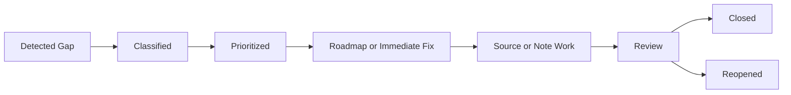

# Knowledge Gap Analysis

## Purpose

This document defines how to identify, classify, prioritize, track, and close knowledge gaps.
It turns uncertainty into a managed research object instead of letting it hide inside notes.

This document extends:

- [knowledge_architecture.md](knowledge_architecture.md)
- [quality_score.md](quality_score.md)
- [research_roadmap.md](research_roadmap.md)
- [review.md](review.md)
- [continuous_knowledge_improvement.md](continuous_knowledge_improvement.md)

## Scope

Use this document when the vault lacks enough trustworthy knowledge to support:

- Analog IC design reasoning.
- SerDes architecture synthesis.
- PLL/CDR analysis.
- PCIe7 public-source discussion.
- ADC/DAC receiver or transmitter reasoning.
- LDO/bandgap power integrity.
- DSP/equalization understanding.
- Interview preparation.
- Handbook construction.

Do not use this document as a generic task list.
Gaps must identify missing knowledge, evidence, structure, or integration.

## Responsibilities

- Researcher: identify missing sources and source quality.
- Analog IC expert: identify technical gaps and incorrect assumptions.
- Reviewer: identify gaps during review.
- Knowledge architect: route gaps to notes, MOCs, or roadmap items.
- Librarian: track links, indexes, and closure status.

## Inputs

Inputs may include:

- Review findings.
- Low quality scores.
- User questions.
- Missing MOC sections.
- Weak interview answers.
- Standards-sensitive claims.
- Source ingestion reports.
- Duplicate detection reports.
- CKI findings such as formula ambiguity, link gaps, duplicate clusters, density problems, or missing engineering insight.

## Outputs

Outputs may include:

- Gap record.
- Roadmap item.
- Source search plan.
- Target note update.
- MOC update.
- Quality score change.
- CKI action or metric update when the gap can be addressed by refactoring, linking, formula improvement, interview generation, or reading recommendation.
- Closure report.

## Gap Types

| Gap Type | Meaning |
| --- | --- |
| Concept gap | Missing explanation of a technical idea |
| Source gap | No reliable source or citation |
| Equation gap | Formula missing, unclear, or unscoped |
| Tradeoff gap | Design decision lacks pros/cons |
| Debug gap | No failure modes or validation method |
| Link gap | Note is orphaned or absent from MOC/index |
| Standards gap | Standards claim lacks current source |
| Experience gap | Interview story lacks truthful technical grounding |
| Synthesis gap | Sources exist but no permanent note connects them |

## Gap Lifecycle



## Workflow

1. Detect the gap.
2. Classify gap type.
3. Identify affected notes, MOCs, indexes, or handbooks.
4. Determine impact and priority.
5. Decide whether to fix immediately or create a roadmap item.
6. Define needed evidence or work.
7. Update target notes or ingest sources.
8. Route improvement-style gaps through [continuous_knowledge_improvement.md](continuous_knowledge_improvement.md) when the fix is structural, formula-related, link-related, or density-related.
9. Review the result.
10. Close, defer, or reopen the gap.

## Decision Criteria

### Fix Immediately

Fix now when:

- The correction is small and source-backed.
- The gap creates a misleading claim.
- The note is currently being edited.
- A link or metadata issue is blocking retrieval.

### Create Roadmap Item

Use [research_roadmap.md](research_roadmap.md) when:

- The gap requires source research.
- Multiple notes are affected.
- The gap is central to a MOC or handbook.
- The gap affects career or interview readiness.

### Defer

Defer when:

- The topic is low-priority.
- Required sources are unavailable.
- The gap is acknowledged and not misleading.

## Gap Record Format

```markdown
## Gap: CDR Jitter Tolerance Source Support

- Type: source gap / standards gap
- Domain: PLL_CDR_Clocking
- Impact: high
- Current state: explanation exists but lacks primary source references
- Needed evidence: textbook, paper, or public standard-adjacent source
- Target note: `cdr_jitter_tolerance.md`
- Owner role: Researcher + Analog IC expert
- Next action: find and ingest source
- Status: open
```

## Examples

### Analog IC

Gap:
Bandgap note explains PTAT/CTAT but lacks startup, trimming, and curvature correction.

Closure:
Ingest source, expand note, add failure modes, rescore.

### SerDes

Gap:
SerDes overview lacks link-training flow.

Closure:
Create atomic link-training note and add it to SerDes MOC.

### PLL

Gap:
PLL phase-noise note lacks worked jitter integration example.

Closure:
Add example under [formula_style.md](formula_style.md).

### PCIe7

Gap:
PCIe7 note mentions public signaling goals but lacks source date.

Closure:
Add source metadata and review cadence.

### ADC

Gap:
ADC-based receiver note does not separate standalone ADC ENOB from link margin.

Closure:
Add converter-metric versus receiver-metric section.

### LDO

Gap:
LDO PSRR note ignores high-frequency package and decap limitations.

Closure:
Add frequency-dependent PSRR discussion and link to SerDes power integrity.

### DSP

Gap:
Equalization note defines FFE/DFE but lacks adaptation objective.

Closure:
Create LMS/adaptation note and link into DSP/equalization MOC.

## Edge Cases

### Gap Is Real but Not Worth Closing

Record as low priority or rejected.
Do not let low-value gaps clutter the roadmap.

### Gap Is Caused by Bad Source

Do not patch around it.
Replace source or downgrade confidence.

### Gap Is a User Experience Gap

Do not invent stories.
Use truthful experience mapping from existing notes.

### Gap Is Standards-Sensitive

Do not close without source metadata and review date.

## Failure Recovery

- If a gap was closed incorrectly, reopen it and explain why.
- If a fix introduces new uncertainty, create a follow-on gap.
- If a roadmap item stalls, downgrade priority or split into smaller gaps.
- If a gap duplicates another gap, merge records and preserve history.
- If the gap depends on inaccessible sources, record that limitation.

## Quality Checklist

Before closing a gap:

- Gap type is clear.
- Impact and priority are stated.
- Target note or MOC is identified.
- Evidence or reasoning was added.
- Links and indexes were updated if needed.
- Quality score was updated if materially affected.
- Residual uncertainty is explicit.

## Automation Opportunities

Useful automation:

- Detect notes with no source section.
- Detect notes with low quality scores.
- Detect orphan notes not linked to MOCs.
- Detect exact numbers without citations.
- Detect stale standards-sensitive notes.
- Generate gap dashboards by domain and priority.
- Suggest roadmap items from repeated gap types.

Automation should propose gaps.
It should not close gaps automatically.

## Future Evolution

Future versions may add:

- Gap registry under `70_Indexes/`.
- Domain-specific gap dashboards.
- Link between gap records and quality score history.
- Standard gap severity taxonomy.
- Periodic gap review cadence tied to research roadmap.

## References

- [knowledge_architecture.md](knowledge_architecture.md)
- [quality_score.md](quality_score.md)
- [research_roadmap.md](research_roadmap.md)
- [continuous_knowledge_improvement.md](continuous_knowledge_improvement.md)
- [knowledge_evolution.md](knowledge_evolution.md)
- [review.md](review.md)
- [expand_note.md](expand_note.md)
- [build_links.md](build_links.md)
