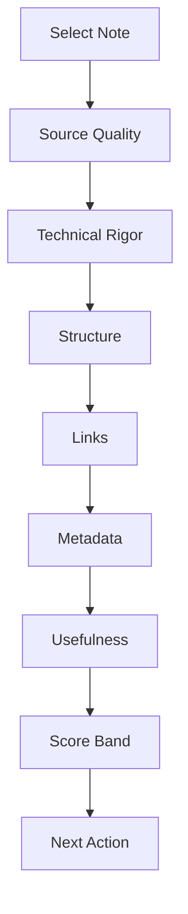

# Quality Score

## Purpose

This document defines a practical scoring model for evaluating note quality.
It helps future agents decide whether a note is a raw draft, seed, active note, mature reference, MOC candidate, or handbook source.

This document complements:

- [core/quality_standards.md](core/quality_standards.md)
- [review.md](review.md)
- [knowledge_evolution.md](knowledge_evolution.md)
- [knowledge_gap.md](knowledge_gap.md)
- [continuous_knowledge_improvement.md](continuous_knowledge_improvement.md)

The score is a decision aid.
It is not a substitute for engineering review.

## Scope

Use this scoring system for:

- Permanent notes.
- Atomic notes.
- Reference notes.
- MOCs.
- Handbook sections.
- Interview notes.
- Design notes.

Do not use the score to judge raw source files directly.
For raw sources, use [knowledge_ingestion_pipeline.md](knowledge_ingestion_pipeline.md).

## Responsibilities

- Researcher: score source quality and provenance.
- Analog IC expert: score technical rigor.
- Editor: score structure and readability.
- Librarian: score links and metadata.
- Reviewer: validate final score and residual risk.
- Knowledge architect: use score to decide lifecycle transitions.

## Inputs

Inputs:

- Target note.
- Source/reference notes.
- Related MOC or index.
- Existing frontmatter.
- Review findings.
- Open gaps.
- CKI metrics or findings when the note was changed by a post-ingest improvement pass.

## Outputs

Outputs:

- Numeric score from 0 to 100.
- Score band.
- Strengths.
- Weaknesses.
- Recommended next action.
- Optional quality-score section in the note.
- CKI-relevant improvement targets such as formula cleanup, link repair, duplicate triage, insight expansion, or density improvement.

## Score Model

```text
Source quality        20
Technical rigor       25
Structure/readability 15
Link integration      15
Retrieval metadata    10
Practical usefulness  15
Total                100
```



## Score Bands

| Score | Band | Meaning | Typical Action |
| --- | --- | --- | --- |
| 0-39 | weak | Not reliable | Keep as draft/source or rewrite |
| 40-59 | seed | Useful but incomplete | Expand and source |
| 60-79 | active | Usable with caveats | Link, gap-close, review |
| 80-89 | strong | MOC candidate | Review for maturity |
| 90-100 | mature | Handbook candidate | Integrate and maintain |

## Workflow

1. Identify note type.
2. Read the note and source/provenance section.
3. Score source quality.
4. Score technical rigor.
5. Score structure and readability.
6. Score link integration.
7. Score retrieval metadata.
8. Score practical usefulness.
9. Assign score band.
10. Recommend next action.
11. Send improvement targets to [continuous_knowledge_improvement.md](continuous_knowledge_improvement.md) when score weaknesses imply post-ingest cleanup.
12. Record score only if useful.

## Decision Criteria

### Source Quality: 20

- 20: primary source, complete citation, clear source trail.
- 15: reliable secondary source or user design note with clear context.
- 10: vault synthesis with partial source trail.
- 5: AI-generated or informal source with caveats.
- 0: no source or unverifiable source.

### Technical Rigor: 25

Award points for:

- Stated assumptions.
- Units and conditions.
- Equations with valid scope.
- Design tradeoffs.
- Failure modes or debug hooks.
- Correct domain-specific distinctions.

### Structure and Readability: 15

Award points for:

- Clear purpose.
- Good headings.
- No source dumping.
- Readable Markdown.
- Logical flow.

### Link Integration: 15

Award points for:

- Parent MOC or index link.
- Related notes.
- Source/reference links.
- No broken links.

### Retrieval Metadata: 10

Award points for:

- Frontmatter.
- Controlled tags from [knowledge_architecture.md](knowledge_architecture.md).
- Status, confidence, aliases, and note type.

### Practical Usefulness: 15

Award points for:

- Design reasoning.
- Debug value.
- Interview value.
- Research synthesis.
- Handbook readiness.

## Examples

### SerDes

High score:

- PAM4 vertical margin note distinguishes bit rate, symbol rate, vertical eye, noise, linearity, equalization, and CDR implications.

Low score:

- Note says "PAM4 is faster" without mechanism.

### PLL

High score:

- Phase-noise note states carrier frequency, integration bandwidth, loop noise sources, and jitter conversion assumptions.

Low score:

- Note reports one jitter number with no integration range.

### PCIe7

High score:

- Public-source-backed PCIe7 note avoids unsourced compliance limits and links to PAM4, SerDes, CDR, and clocking notes.

### ADC

High score:

- ADC-based receiver note distinguishes ENOB, SNDR, aperture jitter, quantization noise, DSP equalization limits, and link margin.

### LDO

High score:

- LDO note separates PSRR, output noise, stability, transient response, and supply-noise-to-jitter coupling.

### DSP

High score:

- Equalization note connects LMS adaptation to channel cursor, DFE error propagation, noise enhancement, and ADC constraints.

## Edge Cases

### Short Atomic Note

Do not penalize for being concise if the note is scoped, sourced, linked, and technically correct.

### Excellent Source, Weak Synthesis

Score source quality high, but structure and usefulness low.
Recommend synthesis rather than more research.

### Polished Unsourced Note

Do not give a high score.
Good writing cannot compensate for missing provenance.

### Interview Note

Score usefulness and technical grounding.
Do not reward fabricated or exaggerated experience.

## Failure Recovery

- If a score was inflated, rescore after review and record the reason.
- If source quality changes, update score and confidence.
- If broken links reduce score, fix links using [build_links.md](build_links.md).
- If a note has low technical rigor, open a gap using [knowledge_gap.md](knowledge_gap.md).
- If a note cannot be scored due to missing context, mark the scoring attempt incomplete and list missing inputs.

## Quality Checklist

Before accepting a score:

- Note type is known.
- Score categories were evaluated separately.
- Source quality did not mask technical weakness.
- Technical rigor did not mask poor retrieval.
- Broken links were checked.
- Open gaps were recorded.
- Recommended next action is concrete.

## Automation Opportunities

Useful automation:

- Frontmatter completeness scoring.
- Broken link scoring.
- Source-section detection.
- Tag vocabulary validation.
- Orphan-note detection.
- Score dashboard by folder, topic, and status.
- Automatic candidate list for mature-note review.

Automation can pre-score objective fields.
It must not finalize technical rigor or usefulness scores without review.

## Future Evolution

Future versions may add:

- Domain-specific sub-rubrics for PLL, CDR, ADC, LDO, DSP, and SerDes.
- Weighted scoring by note type.
- Score history in note frontmatter.
- Vault health dashboards.
- Review queues sorted by score and importance.

## References

- [core/quality_standards.md](core/quality_standards.md)
- [review.md](review.md)
- [knowledge_evolution.md](knowledge_evolution.md)
- [knowledge_gap.md](knowledge_gap.md)
- [continuous_knowledge_improvement.md](continuous_knowledge_improvement.md)
- [knowledge_architecture.md](knowledge_architecture.md)
- [build_links.md](build_links.md)
- [obsidian_style.md](obsidian_style.md)
