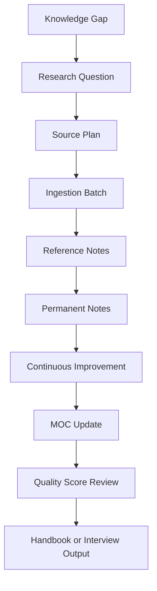

# Research Roadmap

## Purpose

This document defines how the repository turns knowledge gaps into prioritized research plans.
It is the planning layer that connects source ingestion, note evolution, quality scoring, MOCs, handbooks, and interview readiness.

This document complements:

- [knowledge_gap.md](knowledge_gap.md)
- [knowledge_evolution.md](knowledge_evolution.md)
- [quality_score.md](quality_score.md)
- [knowledge_architecture.md](knowledge_architecture.md)
- [knowledge_ingestion_pipeline.md](knowledge_ingestion_pipeline.md)
- [continuous_knowledge_improvement.md](continuous_knowledge_improvement.md)

## Scope

Use this document for:

- Planning research tracks.
- Prioritizing high-value knowledge gaps.
- Coordinating source ingestion with note improvement.
- Building MOCs and handbooks.
- Preparing technical interview knowledge.
- Turning vague learning goals into concrete outputs.

Do not use this document as a daily task list.
Use it for structured research direction.

## Responsibilities

- Researcher: identify source plan and evidence path.
- Knowledge architect: connect roadmap items to MOCs, indexes, and handbooks.
- Analog IC expert: ensure research goals are technically meaningful.
- Librarian: track outputs and source traceability.
- Reviewer: confirm done criteria and residual risk.

## Inputs

Inputs may include:

- Gap records from [knowledge_gap.md](knowledge_gap.md).
- Low quality scores from [quality_score.md](quality_score.md).
- User career goals.
- Active study plans.
- Paper/source backlog.
- Weak MOC areas.
- Standards-sensitive notes.
- CKI findings, especially reading recommendations, repeated gaps, duplicate clusters, weak formulas, and interview-question opportunities.

## Outputs

Outputs may include:

- Roadmap item.
- Source acquisition plan.
- Ingestion batch.
- Updated permanent notes.
- MOC update.
- Handbook section.
- Interview Q&A improvement.
- Quality score target.
- CKI improvement targets and measurable completion criteria.

## Roadmap Flow



## Workflow

1. Start from a gap, user goal, or low-scoring note.
2. Define the research question.
3. Assign domain and priority.
4. Identify current assets.
5. Identify missing evidence.
6. Define source plan.
7. Define expected outputs.
8. Set done criteria.
9. Process sources through [knowledge_ingestion_pipeline.md](knowledge_ingestion_pipeline.md).
10. Run [continuous_knowledge_improvement.md](continuous_knowledge_improvement.md) to capture refactoring, duplicate, formula, link, engineering-insight, interview-question, reading-recommendation, and density outcomes.
11. Update notes, MOCs, and indexes.
12. Re-score affected notes.
13. Close, defer, or split the roadmap item.

## Decision Criteria

### High Priority

Use for:

- Work-critical topics.
- Interview-critical topics.
- Core architecture dependencies.
- Notes that could mislead future agents if weak.

Examples:

- PCIe7 clocking source support.
- PLL phase noise and jitter maturity.
- ADC-based PAM4 receiver architecture.
- LDO supply noise to PLL jitter.

### Medium Priority

Use for:

- Important but non-blocking learning.
- MOC enrichment.
- Secondary source review.

Examples:

- DAC transmitter architecture.
- DSP adaptation details.
- Patent landscape for TI-SAR calibration.

### Low Priority

Use for:

- Optional enrichment.
- Historical background.
- Interesting but non-central sources.

## Roadmap Item Format

```markdown
## Roadmap Item: Source-Backed PCIe7 Clocking Path

- Domain: PCIe7 / PLL_CDR_Clocking
- Priority: high
- Time horizon: 2 weeks
- Research question: What public-source-backed clocking concepts are essential for PCIe7 SerDes preparation?
- Current assets:
  - `pcie7_clocking_notes.md`
  - `pll_phase_noise_jitter.md`
- Gaps:
  - PCIe7 source metadata gap
  - CDR jitter tolerance source gap
- Source plan:
  - Public PCI-SIG material
  - SerDes clocking papers
  - PLL/CDR textbook references
- Outputs:
  - Updated PCIe7 clocking note
  - PLL/CDR MOC section
  - Interview Q&A improvements
- Done criteria:
  - Sources recorded
  - Links updated
  - Quality score target met or residual risk documented
```

## Research Tracks

### Track 1: SerDes / PCIe7 System Architecture

Goal:
Build source-backed understanding of PCIe7, PAM4, link training, equalization, and receiver architecture.

Outputs:

- `pcie7_moc.md`
- `serdes_moc.md`
- `serdes_receiver_handbook.md`

### Track 2: PLL / CDR / Clocking

Goal:
Connect PLL phase noise, CDR behavior, jitter transfer, jitter tolerance, clock distribution, and supply coupling.

Outputs:

- `pll_cdr_clocking_moc.md`
- `pll_cdr_clocking_handbook.md`
- Interview Q&A upgrades.

### Track 3: ADC-Based PAM4 Receiver

Goal:
Connect ADC architecture, sampling jitter, TI-SAR calibration, DSP equalization, and receiver margin.

Outputs:

- `adc_based_receiver_moc.md`
- `adc_based_pam4_receiver_handbook.md`
- Source-backed paper index.

### Track 4: LDO / Bandgap / Power Integrity

Goal:
Connect LDO and bandgap knowledge to SerDes power integrity and PLL/ADC sensitivity.

Outputs:

- `ldo_bandgap_power_moc.md`
- `serdes_power_integrity.md` upgrade.
- Interview story-bank upgrades.

### Track 5: DSP and Equalization

Goal:
Build enough DSP/equalization knowledge to reason about modern PAM4 receivers without turning the vault into a generic DSP textbook.

Outputs:

- `dsp_equalization_moc.md`
- Atomic notes on FFE, DFE, LMS, adaptation, and noise enhancement.

## Examples

### Analog IC

Roadmap item:
Mature bandgap and LDO fundamentals for SerDes power integrity.

Outputs:

- Bandgap reference note upgrade.
- LDO PSRR note upgrade.
- LDO interview Q&A improvement.

### SerDes

Roadmap item:
Build SerDes receiver MOC.

Outputs:

- PAM4 receiver map.
- Equalization notes.
- CDR/ADC links.

### PLL

Roadmap item:
Create source-backed PLL jitter path.

Outputs:

- Phase noise reference notes.
- Worked jitter example.
- Clocking handbook section.

### PCIe7

Roadmap item:
Create public-source-backed PCIe7 study path.

Outputs:

- PCIe7 MOC.
- Updated clocking note.
- Interview answer set.

### ADC

Roadmap item:
Build ADC-based receiver paper trail.

Outputs:

- ISSCC/JSSC paper notes.
- ADC RX permanent notes.
- Sampling jitter quality upgrade.

### LDO

Roadmap item:
Connect regulator experience to SerDes value.

Outputs:

- SerDes power integrity note.
- LDO-to-PLL jitter explanation.
- Technical story bank entries.

### DSP

Roadmap item:
Build equalization adaptation fundamentals.

Outputs:

- LMS adaptation note.
- DFE error propagation note.
- DSP/equalization MOC.

## Edge Cases

### Roadmap Item Is Too Broad

Split by output:

- Source search.
- Permanent note.
- MOC.
- Handbook.
- Interview answer.

### Source Plan Is Weak

Do not start synthesis.
Improve source plan first.

### Roadmap Item Stalls

Reclassify as deferred, split into smaller items, or lower priority.

### User Goal Changes

Preserve old roadmap history, but update active priorities.

## Failure Recovery

- If roadmap output fails review, reopen linked gap.
- If source ingestion produces no useful content, record rejection and revise source plan.
- If quality score target is not met, identify missing score categories.
- If MOC integration is noisy, narrow scope.
- If a roadmap item duplicates another, merge records and preserve source history.

## Quality Checklist

Before marking a roadmap item done:

- Research question was answered or explicitly deferred.
- Sources were ingested or rejected with reasons.
- Target notes were updated.
- Links, indexes, and MOCs were updated if affected.
- Quality score target was met or residual risk was recorded.
- Gaps were closed, deferred, or reopened.
- Outputs support the stated audience.

## Automation Opportunities

Useful automation:

- Roadmap dashboard by priority and domain.
- Gap-to-roadmap converter.
- Quality-score target tracker.
- Source backlog integration.
- MOC update reminders.
- Stale roadmap item detector.
- Quarterly roadmap review generator.

Automation can organize roadmap items.
It should not decide research priority without agent judgment.

## Future Evolution

Future versions may add:

- `70_Indexes/research_roadmap_index.md`.
- Domain-specific roadmap pages.
- Roadmap status frontmatter.
- Integration with study plans.
- Automated dependency graphs from gaps to notes to handbooks.

## References

- [knowledge_gap.md](knowledge_gap.md)
- [quality_score.md](quality_score.md)
- [knowledge_evolution.md](knowledge_evolution.md)
- [knowledge_architecture.md](knowledge_architecture.md)
- [knowledge_ingestion_pipeline.md](knowledge_ingestion_pipeline.md)
- [continuous_knowledge_improvement.md](continuous_knowledge_improvement.md)
- [indexing.md](indexing.md)
- [build_links.md](build_links.md)
- [review.md](review.md)
