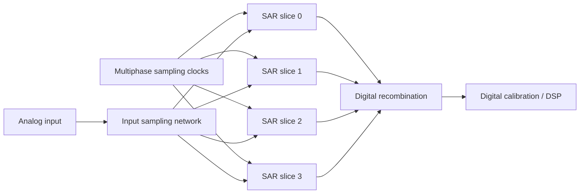
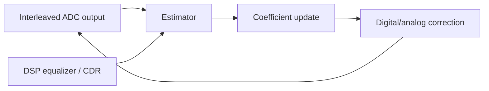

# TI-SAR Mismatch Calibration

## 中文补充翻译

这篇笔记更系统地整理 TI-SAR ADC mismatch calibration。time-interleaving 通过多个 SAR ADC 并行轮流采样来提高总采样率，但会引入通道间不一致。主要 mismatch 包括 offset、gain、timing skew 和 bandwidth mismatch，其中 timing skew 在高频 SerDes 输入下尤其敏感。

数学上，通道 mismatch 会表现为周期性误差，因此常常产生 spur。offset mismatch 主要表现为固定偏移 spur；gain mismatch 让不同通道的幅度比例不同；timing skew 近似产生 `dV/dt * delta_t` 的电压误差；bandwidth mismatch 则让通道响应随频率不同而变化。

校准方法分为 foreground 和 background。foreground 简单、可控，但需要训练或停机；background 可以持续追踪 PVT 和 aging，但容易和真实数据、equalization、CDR adaptation 相互耦合。对 PAM4 ADC-based RX，校准目标最终应映射到 eye margin、BER、spur、SNDR 和 link robustness。

## Purpose

This note explains mismatch and calibration in time-interleaved SAR ADCs for high-speed SerDes receivers. It is aimed at someone preparing for ADC / SerDes / PCIe 7.0 mixed-signal work where ADC sampling, clocking, LDO noise, and DSP calibration all interact.

Related notes: [[ti_sar_adc_calibration]], [[adc_based_receiver]], [[sampling_jitter_adc]], [[pam4_adc_based_rx]], [[pll_phase_noise_jitter]], [[cdr_jitter_tolerance]], [[serdes_power_integrity]].

## Why Time-Interleave SAR ADCs?

A single SAR ADC is energy efficient and digitally friendly, but its conversion speed is limited by sampling, DAC settling, comparator decisions, and logic timing. To reach very high effective sample rates, multiple SAR slices can sample in a staggered sequence.

For \(M\) interleaved slices, each slice samples at:

$$
f_{slice}=\frac{f_s}{M}
$$

but the recombined output has sample rate \(f_s\). The cost is that the converter now behaves like \(M\) slightly different ADCs stitched together.

## The Four Main Mismatch Types

| Mismatch | Error model | Main symptom | Typical correction |
|---|---|---|---|
| Offset mismatch | slice-dependent DC shift | spur near \(k f_s/M\) | subtract per-slice offset |
| Gain mismatch | slice-dependent scale factor | amplitude modulation spurs | per-slice digital gain |
| Timing skew | slice samples early/late | slope-dependent error, high-frequency spurs | phase adjust or derivative-based correction |
| Bandwidth mismatch | slice-dependent frequency response | frequency-dependent distortion | FIR / equalization / analog matching |

In a PAM4 receiver, these errors reduce vertical margin, distort equalizer inputs, and can create deterministic symbol errors.

## Mathematical Error Model

For slice \(m\), a simplified sampled output is:

$$
y_m[n] = (1+g_m)x(t_n+\tau_m)+o_m+q_m[n]
$$

where:

| Term | Meaning |
|---|---|
| \(g_m\) | gain error of slice \(m\) |
| \(o_m\) | offset error |
| \(\tau_m\) | timing skew |
| \(q_m[n]\) | quantization and thermal noise |

For small timing skew:

$$
x(t_n+\tau_m) \approx x(t_n)+\tau_m\frac{dx}{dt}
$$

So:

$$
y_m[n] \approx x(t_n)+g_mx(t_n)+o_m+\tau_m\frac{dx}{dt}+q_m[n]
$$

This equation explains why timing skew is often the most painful mismatch at high input frequency. Its error grows with signal slope.

## Offset Mismatch

Offset mismatch means each slice has a different zero-input output code. In an \(M\)-way interleaved ADC, offset mismatch creates a periodic sequence with period \(M\), which produces tones at multiples of:

$$
\frac{f_s}{M}
$$

### Worked Example: Offset Spur Location

For an 8-way interleaved ADC with:

$$
f_s=64\ \text{GS/s},\quad M=8
$$

the fundamental interleaving spur spacing is:

$$
\frac{f_s}{M}=8\ \text{GHz}
$$

Offset mismatch can create spurs at 8 GHz, 16 GHz, 24 GHz, and so on, folded by Nyquist zones. In a receiver, these spurs can corrupt ADC samples and interact with DSP adaptation.

## Gain Mismatch

Gain mismatch means the same input voltage produces different code amplitudes in different slices:

$$
y_m[n]=(1+g_m)x[n]
$$

Gain mismatch acts like periodic amplitude modulation. For a sinusoidal input at \(f_{in}\), mismatch produces images around:

$$
k\frac{f_s}{M}\pm f_{in}
$$

### Worked Example: Gain Error Size

Assume slice 3 has a gain error of 1 percent and the input full-scale differential amplitude is 800 mVpp. A rough peak amplitude error near full scale is:

$$
\Delta V = 0.01\cdot400\ \text{mV}=4\ \text{mV}
$$

For PAM4 with three eyes across 800 mVpp, the nominal level spacing is approximately:

$$
\Delta V_{PAM4}\approx\frac{800\ \text{mV}}{3}=267\ \text{mV}
$$

The gain error is:

$$
\frac{4}{267}=1.5\%
$$

This may be tolerable alone, but it combines with thermal noise, ISI, reference noise, timing skew, and equalizer residual error.

## Timing Skew

Timing skew means a slice samples at the wrong time:

$$
\Delta V \approx \frac{dV}{dt}\Delta t
$$

For a sinusoid:

$$
x(t)=A\sin(2\pi f_{in}t)
$$

The maximum slope is:

$$
\left|\frac{dx}{dt}\right|_{max}=2\pi f_{in}A
$$

So the worst-case voltage error is:

$$
\Delta V_{max}=2\pi f_{in}A\Delta t
$$

### Worked Example: 100 fs Timing Skew

Assume:

| Parameter | Value |
|---|---:|
| Input frequency | 16 GHz |
| Input peak amplitude | 200 mV |
| Timing skew | 100 fs |

Then:

$$
\Delta V_{max}=2\pi\cdot16\times10^9\cdot0.2\cdot100\times10^{-15}
$$

$$
\Delta V_{max}=2.01\ \text{mV}
$$

This is only one mismatch source. At higher slopes, larger amplitudes, or worse skew, the error quickly becomes significant. Timing skew also changes sign with slope, making it signal-dependent rather than a simple DC correction.

## Bandwidth Mismatch

Bandwidth mismatch means each slice has a different transfer function:

$$
Y_m(f)=H_m(f)X(f)
$$

If \(H_m(f)\) differs across slices, a single gain correction cannot fix the problem over frequency. Causes include sampling switch resistance, input capacitance, routing parasitics, bootstrapped switch variation, package asymmetry, and local clock path differences.

Bandwidth mismatch is especially relevant in ADC-based SerDes because the input spectrum is wide and shaped by channel loss, CTLE, package, and equalization.

## SAR-Specific Mismatch

Time interleaving creates slice-to-slice mismatch, but each SAR slice also has internal mismatch:

| SAR nonideality | Effect |
|---|---|
| CDAC capacitor mismatch | INL/DNL, harmonic distortion |
| comparator offset | decision threshold shift |
| reference settling error | code-dependent conversion error |
| switch charge injection | sampling distortion |
| kickback | input-dependent disturbance |
| asynchronous logic variation | timing variation |

Calibration may need to correct both per-slice interleaving mismatch and intra-slice SAR linearity.

## Foreground vs Background Calibration

| Calibration type | When it runs | Strength | Weakness |
|---|---|---|---|
| Foreground | startup, test mode, idle | known stimulus, easier estimation | cannot track drift during traffic |
| Background | during normal operation | tracks PVT and aging | can interact with data, CDR, equalization |
| Hybrid | foreground seed plus background tracking | practical for high-speed links | more control complexity |

For SerDes, background calibration is attractive because temperature and supply can drift during operation. But the adaptation must not corrupt link data or fight other loops.

## Calibration Techniques

### Offset Calibration

Estimate each slice average:

$$
\hat{o}_m = E[y_m] - E[y]
$$

Then subtract:

$$
y_{corr,m}=y_m-\hat{o}_m
$$

For random data, the estimator must avoid confusing data imbalance with ADC offset.

### Gain Calibration

Estimate slice energy:

$$
\hat{P}_m=E[(y_m-\hat{o}_m)^2]
$$

Then scale:

$$
y_{corr,m}=\alpha_m(y_m-\hat{o}_m)
$$

where:

$$
\alpha_m\approx\sqrt{\frac{P_{target}}{\hat{P}_m}}
$$

### Timing Skew Calibration

Timing skew can be estimated by correlating slice error with the input derivative:

$$
e_m[n]\approx \tau_m\frac{dx}{dt}
$$

A digital correction can use:

$$
y_{corr,m}[n]=y_m[n]-\hat{\tau}_m\widehat{\frac{dx}{dt}}
$$

In practice, derivative estimation is noisy and data-dependent. Analog phase adjustment is often preferred when available, with digital calibration steering delay controls.

### Bandwidth Calibration

Bandwidth mismatch may require slice-specific FIR correction:

$$
y_{corr,m}[n]=\sum_k h_m[k]y_m[n-k]
$$

This is more expensive but can correct frequency-dependent errors.

## Calibration Loop Stability

Background calibration is an adaptive loop. It has convergence rate, noise, and interaction risk.

If the update step is too large, coefficients can wander or inject adaptation noise. If too small, calibration cannot track drift. If the estimator is biased by equalizer errors or CDR phase error, calibration can converge to the wrong value.

## Design Implications

### PLL and Clocking

Sampling phase mismatch is clock mismatch. PLL phase noise, divider mismatch, PI nonlinearity, and clock buffer skew directly affect TI-ADC performance. Clock phase generation must be considered part of ADC design.

### CDR

The CDR controls where samples are taken. If time-interleaved slices have residual skew, the timing detector sees slice-dependent errors. This can create CDR limit cycles or biased phase estimates.

### SerDes RX

PAM4 receiver margin is sensitive to vertical error. Offset, gain, and bandwidth mismatch reduce level accuracy. Timing skew converts waveform slope to voltage error and can degrade equalizer training.

### ADC

ADC calibration must separate offset, gain, skew, bandwidth, CDAC mismatch, comparator offset, and reference settling. A calibration that fixes a sine-wave test may not fully fix real PAM4 traffic.

### LDO and References

Supply and reference noise affect comparator delay, CDAC settling, bootstrapped switches, input buffers, and reference ladders. LDO PSRR and decap influence both raw ADC error and calibration stability.

### Verification

Verification should include spur analysis, SNDR, ENOB, PAM4 symbol error impact, background convergence, PVT drift, supply injection, jitter injection, Monte Carlo mismatch, and interaction with CDR/equalizer adaptation.

## Common Mistakes

1. Treating timing skew like a static offset error.
2. Calibrating offset and gain while ignoring bandwidth mismatch.
3. Assuming a sine-wave SNDR improvement guarantees PAM4 link margin improvement.
4. Ignoring calibration interaction with CDR and DFE adaptation.
5. Estimating background calibration coefficients from biased data statistics.
6. Forgetting that reference noise can look like gain or threshold error.
7. Ignoring slice clock duty-cycle and phase-generator mismatch.
8. Reporting spur improvements without checking BER or eye margin.

## Interview Q&A

### Why use a time-interleaved SAR ADC in a SerDes receiver?

Time interleaving lets several moderate-speed SAR slices create a much higher effective sample rate. SAR slices are energy efficient, but mismatch between slices must be calibrated for high-speed PAM4 operation.

### What are the main mismatch sources?

The big four are offset mismatch, gain mismatch, timing skew, and bandwidth mismatch. SAR-specific CDAC mismatch, comparator offset, reference settling, and switch nonidealities also matter.

### Why is timing skew usually the hardest?

Timing skew creates an error proportional to input slope: \(\Delta V\approx(dV/dt)\Delta t\). At high input frequency or steep PAM4 transitions, tiny timing errors become meaningful voltage errors.

### How do foreground and background calibration differ?

Foreground calibration runs during startup or test with controlled conditions. Background calibration runs during normal operation and tracks drift, but it must avoid corrupting data or interacting badly with CDR and equalization.

### How does LDO noise affect TI-SAR calibration?

LDO noise and finite PSRR can disturb ADC references, comparator delay, sampling switches, clock buffers, and bias circuits. This can create apparent offset/gain/skew changes and add adaptation noise.

### How would you verify calibration?

I would check spectral spurs, SNDR, ENOB, PAM4 eye margin, BER impact, convergence time, coefficient stability, PVT drift tracking, supply noise sensitivity, and interaction with CDR/equalizer loops.
