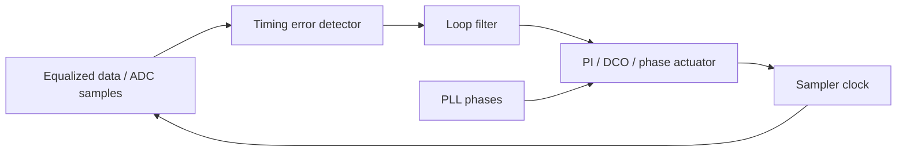
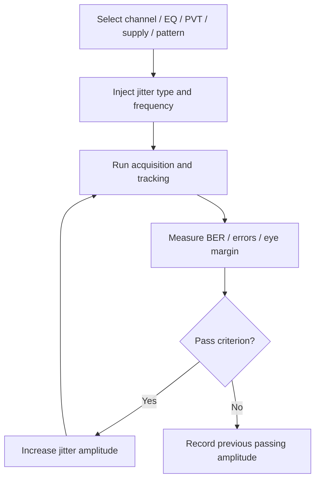
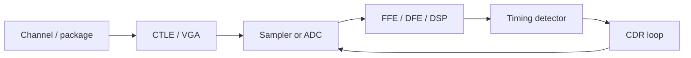

# CDR Jitter Tolerance

## 0. Status and Scope

| Item | Content |
|---|---|
| Maturity | Senior / Staff-level design-review reference; still needs project-specific spec and lab correlation |
| Target use | PCIe 7.0-class PAM4 SerDes RX, CDR loop design, clocking review, verification planning, interview preparation |
| Covers | jitter tolerance, jitter transfer, jitter generation, CDR residual error, PAM4 timing detector behavior, PI effects, equalizer interaction, supply-noise coupling, simulation and lab debug |
| Does not claim | official PCIe 7.0 JTOL mask, compliance pass/fail limits, vendor-specific receiver architecture, or proprietary Synopsys implementation |
| Spec caveat | Any compliance limit, stress profile, BER criterion, filtering method, SSC condition, and calibration mode must be verified against the official spec or internal IP requirement |

This note is not a list of magic numbers. It is a design framework for defending a CDR jitter-tolerance result from device noise to link margin:

```text
Input jitter spectrum
-> CDR tracking / residual transfer
-> sampler phase error
-> equalized PAM4 eye closure
-> timing detector reliability
-> BER / FEC / compliance margin
```

Related notes: [[cdr_fundamentals]], [[pll_phase_noise_jitter]], [[pcie7_clocking_notes]], [[pam4_adc_based_rx]], [[ctle_ffe_dfe_notes]], [[sampling_jitter_adc]], [[serdes_power_integrity]].

## 1. Executive Summary

CDR jitter tolerance means the maximum input data jitter a receiver can tolerate while still meeting a defined error criterion. It is frequency-dependent because the CDR tracks slow phase movement and rejects, only partially tracks, or fails to follow faster phase movement.

The important senior-level distinction is:

- Jitter transfer describes how input jitter moves to recovered clock or retimed output.
- Jitter tolerance describes how much input jitter the receiver can survive.
- Jitter generation describes jitter created by the receiver clocking path itself.
- Residual sampling error is often the quantity that most directly closes the eye.

A useful first-order mental model is:

$$
J_{res}(f)=|H_{err}(j2\pi f)|J_{in}(f)
$$

and a receiver passes when residual timing error plus internal timing uncertainty plus ISI/DDJ plus margin reserve stays below the available horizontal margin:

$$
J_{res}+J_{int}+J_{ISI/DDJ}+J_{eq/adapt}+J_{reserve}<M_t
$$

This equation is not a compliance rule. It is a review model. The real pass/fail criterion must come from protocol requirements, internal signoff methodology, and measured BER/margin.

For PAM4, timing tolerance cannot be reviewed as a purely horizontal problem. Timing error is converted to voltage error through waveform slope:

$$
\Delta V \approx \frac{dV}{dt}\Delta t
$$

Because PAM4 vertical eyes are smaller and transition slopes vary by symbol class, the same timing jitter can create different error probability for different transitions and levels.

## 2. 中文资深设计要点速查

### 2.1 一句话定位

CDR jitter tolerance 不是单纯的 CDR bandwidth 指标，而是 RX 在给定 channel、EQ、PVT、supply、pattern 和 BER criterion 下，对输入 timing modulation 的系统级承受能力。真正进入 BER 的不是输入 jitter 本身，而是经过 CDR tracking 后剩下的 residual sampling phase error，再叠加 internal jitter、DDJ/ISI、PI/clock path error、sampler aperture jitter 和 margin reserve。

### 2.2 设计评审时必须问清楚

| Review question | 为什么重要 |
|---|---|
| JTOL 曲线的 BER / error-count / confidence criterion 是什么？ | 没有 pass/fail criterion，tolerance 数字没有工程意义 |
| jitter amplitude 是 peak、peak-to-peak、RMS 还是 UI？ | amplitude convention 错了会直接导致预算错误 |
| 注入的是 SJ、RJ、PJ、DDJ、SSC 还是组合 stress？ | 不同 jitter 类型不能用同一个处理方式 |
| CDR 是 bang-bang、linear、Mueller-Muller 还是 DSP timing recovery？ | detector gain、非线性、pattern dependency 完全不同 |
| EQ 是 frozen、ideal converged，还是真实 adaptation running？ | 真实 link training 下 CDR/EQ 可能互相拉偏 |
| JTOL stress 是加在 TX 端、channel 前、receiver pad，还是 behavioral input？ | 注入点不同，经过 channel 和 equalizer 后的实际 stress 不同 |
| 是否包含 PLL、divider、PI、clock tree、sampler aperture jitter？ | PLL output jitter 不等于 final sampler jitter |
| 是否包含 supply noise、spurs、PI limit cycle、DDJ？ | deterministic jitter 不能简单当 RJ RSS |
| PAM4 UI 用的是 15.625 ps symbol UI 还是 7.8125 ps bit-equivalent interval？ | UI 归一化错了会把 margin 估错一倍 |

### 2.3 高级判断框架

低频 jitter 主要考验 CDR tracking range、SSC/wander/frequency-offset 能力和 cycle-slip margin；bandwidth 附近主要考验 loop peaking、damping、latency、detector gain collapse 和 equalizer interaction；高频 jitter 主要考验 residual eye margin、internal jitter、sampler aperture、PAM4 vertical margin 和 post-EQ ISI/DDJ。

如果 JTOL 在低频失败，优先看 tracking range、frequency offset、SSC、loop gain、PI range 和 acquisition。

如果 JTOL 在 bandwidth 附近失败，优先看 peaking、phase margin、loop latency、bang-bang limit cycle、detector gain 和 EQ/CDR 交互。

如果 JTOL 在高频失败，优先看 actual eye opening、internal clock jitter、PI noise、sampler aperture jitter、channel DDJ 和 crosstalk。

### 2.4 资深工程口径

一个可信的 JTOL claim 应该同时给出：

- CDR architecture、loop bandwidth、damping、update rate、latency。
- timing detector 输入点、PAM4 transition weighting、threshold calibration 状态。
- channel / package / crosstalk / EQ state / adaptation sequence。
- jitter stress 类型、频率、幅度 convention、注入点、校准方法。
- residual transfer、internal jitter generation、deterministic jitter breakdown。
- BER / bathtub / eye margin 结果，以及 PVT、supply、layout extraction 覆盖。
- 哪些结果是 spec-compliance，哪些只是 internal design-margin estimate。

资深设计 review 的重点不是说“CDR bandwidth 是 10 MHz，所以能过 JTOL”，而是说明“在这个 stress frequency 下，输入 jitter 通过 $H_{err}$ 后剩余多少 sampling error；剩下的 horizontal/vertical margin 被 internal jitter、ISI/DDJ、PI/supply deterministic jitter 和 margin reserve 吃掉多少；最终 BER criterion 是否仍然满足”。

## 3. Key Definitions

| Term | Meaning | Design-review question |
|---|---|---|
| Input jitter | Phase/timing modulation on incoming data | What type: SJ, RJ, PJ, DDJ, SSC, wander, crosstalk-correlated? |
| Jitter tolerance, JTOL | Max input jitter amplitude that still passes target criterion | What BER, confidence, stress pattern, EQ state, PVT, and supply condition? |
| Jitter transfer, JTRAN | Input jitter to recovered clock/output transfer | What loop bandwidth, peaking, detector gain, and data pattern? |
| Jitter generation, JGEN | Jitter produced internally by RX/CDR/clock path | Does it include PLL, PI, clock tree, sampler, supply, quantization, limit cycle? |
| Residual jitter | Input jitter not tracked by CDR and left as sampling phase error | Is the residual mapped to the actual sampler/ADC clock node? |
| TIE | Timing error versus ideal reference | Which reference, filter, time window, and clock-recovery setting? |
| SJ | Sinusoidal jitter | What frequency and amplitude convention: peak, peak-to-peak, UI? |
| RJ | Random jitter | Gaussian assumption valid? What RMS bandwidth and extrapolation? |
| DDJ | Data-dependent jitter | Which channel, equalizer setting, pattern, and symbol history? |
| SSC / wander | Low-frequency phase/frequency modulation | Does CDR track it without cycle slip or excessive phase error? |

## 4. CDR Loop Model

The simplest linearized CDR model treats input phase as the command and recovered sampling phase as the loop output.



For a first-order tracking approximation:

$$
H_{trk}(s)=\frac{\omega_c}{s+\omega_c}
$$

$$
H_{err}(s)=1-H_{trk}(s)=\frac{s}{s+\omega_c}
$$

For sinusoidal jitter at frequency $f_j$:

$$
|H_{trk}(j2\pi f_j)|=\frac{f_c}{\sqrt{f_j^2+f_c^2}}
$$

$$
|H_{err}(j2\pi f_j)|=\frac{f_j}{\sqrt{f_j^2+f_c^2}}
$$

Interpretation:

- $f_j \ll f_c$: CDR tracks most of the jitter; residual sampling error is small.
- $f_j \approx f_c$: tolerance is sensitive to loop peaking, damping, latency, and detector gain.
- $f_j \gg f_c$: CDR barely tracks; input jitter appears mostly as sampling phase error.

Real CDRs are often nonlinear, especially bang-bang loops. The model is still useful, but the effective gain depends on transition density, jitter amplitude, slicer/ADC noise, ISI, and equalizer state.

## 5. What Makes a JTOL Curve

JTOL is typically measured or simulated by injecting jitter into the input data and sweeping jitter frequency and amplitude.



The curve is usually high at low jitter frequency, rolls off near the CDR bandwidth, and flattens at a high-frequency floor set by eye margin and internal jitter.

Important: the measured curve is not only a loop response. It includes the entire RX:

```text
TX stress + channel + package + CTLE/VGA + ADC/slicer
+ FFE/DFE + timing detector + CDR + PI/clock tree
+ adaptation sequence + supply noise + decision criterion
```

## 6. Architecture Assumptions to Record

Before discussing numbers, record these assumptions.

| Area | Must be explicit |
|---|---|
| CDR type | bang-bang, linear, Mueller-Muller, baud-rate, oversampling, ADC/DSP-based |
| Actuator | phase interpolator, DCO, local VCO, clock mux, fractional divider |
| Loop order | proportional/integral path, damping, latency, update rate, loop bandwidth |
| Timing detector input | raw slicer samples, ADC samples, equalized samples, edge samples, decision-directed error |
| Equalization state | CTLE/VGA fixed or adaptive, FFE/DFE enabled, adaptation frozen or running |
| PAM4 handling | which transitions contribute to timing, threshold calibration, level weighting |
| Clock source | PLL phase noise, divider, phase generation, PI, clock tree, sampler local buffer |
| Stress condition | pattern, channel loss, crosstalk, SSC, frequency offset, supply noise, PVT |
| Pass criterion | BER, error count, confidence, FEC assumption, bathtub margin, eye opening |

If these are not stated, a JTOL number is not reviewable.

## 7. PAM4-Specific Design Points

PAM4 makes CDR harder because timing information is not uniform across transitions.

| PAM4 effect | CDR/JTOL impact | Design implication |
|---|---|---|
| Smaller vertical eyes | Noise and threshold errors more easily corrupt timing decisions | Timing detector must reject unreliable decisions or weight them |
| Multiple transition sizes | Large transitions have stronger slope than small transitions | Detector gain is data-dependent |
| Three slicer thresholds | Threshold offset creates symbol-dependent timing bias | Threshold calibration and CDR must be co-verified |
| ISI and precursor/postcursor residue | Apparent edge position shifts with symbol history | DDJ must be included in timing budget |
| DFE error propagation | Wrong decision can corrupt both data and timing update | Freeze/weight/qualify timing updates during high error periods |
| FEC/FLIT traffic patterns | Transition density can differ from simple PRBS assumptions | Verify with protocol-relevant traffic, not only ideal random data |

For PCIe 7.0-class PAM4, use the correct UI convention in analysis. 128 GT/s bit-equivalent signaling corresponds to 64 Gbaud PAM4 electrical symbols, so the PAM4 symbol UI is:

$$
UI_{sym}=\frac{1}{64\times10^9}=15.625\text{ ps}
$$

The 7.8125 ps value is bit-equivalent interval, not the PAM4 symbol UI used for sampler phase placement, unless the context explicitly defines bit-equivalent normalization.

## 8. Equalization and CDR Coupling

The CDR does not see an ideal waveform. It sees whatever the receiver front-end and DSP create.



Critical interactions:

- CTLE peaking changes transition slope and noise enhancement.
- FFE changes precursor/postcursor ISI and therefore timing bias.
- DFE decisions can improve eye opening but can also inject error propagation into decision-directed timing.
- CDR phase error changes the samples used by equalizer adaptation.
- Equalizer convergence can move the apparent CDR lock point.

Senior review question:

```text
Was JTOL measured after ideal EQ convergence, during realistic adaptation, or with adaptation frozen at a worst-case setting?
```

A receiver can pass JTOL with a frozen, optimized equalizer and fail during real link training.

## 9. Internal Jitter and Actuator Limits

Input jitter tolerance is reduced by internally generated jitter. The relevant node is the actual sampling instant, not merely the standalone PLL output.

Internal contributors:

- PLL phase noise and spurs after relevant clock-path shaping.
- Divider and multi-phase generator additive jitter.
- Duty-cycle distortion and quadrature/phase-spacing error.
- Phase interpolator noise, INL, DNL, monotonicity error, and supply sensitivity.
- PI quantization and digital control limit cycles.
- Clock-tree additive jitter and supply-induced delay modulation.
- Sampler aperture jitter.
- ADC time-interleaving skew, if ADC-based.
- Timing detector noise and false early/late decisions.
- Digital loop latency and update quantization.

PI step example for a 64 Gbaud PAM4 symbol UI:

$$
t_{LSB}=\frac{15.625\text{ ps}}{64}=244.1\text{ fs}
$$

If the CDR limit cycles by one PI LSB, this creates bounded deterministic phase modulation. It should not be hidden inside an RMS random jitter number without checking spectral content and BER impact.

## 10. Bandwidth Tradeoffs

| CDR bandwidth choice | Helps | Hurts | Review question |
|---|---|---|---|
| Wider bandwidth | tracks more low/mid-frequency jitter, SSC, wander, frequency offset; faster acquisition | passes more input jitter to recovered clock, passes more detector noise, may amplify peaking, can interact with EQ adaptation | Is added tracking worth the noise and peaking penalty? |
| Narrower bandwidth | rejects more input jitter and detector noise, lower recovered-clock jitter | poorer SSC/wander tracking, slower acquisition, larger low-frequency residual phase error | Can it track required offset and modulation without slips? |
| Higher damping | less peaking, more robust stability | slower response, lower tracking near bandwidth | Is acquisition still acceptable? |
| Lower damping | faster response | jitter peaking, ringing, possible instability | Is peaking counted in JTOL and JTRAN? |

Loop bandwidth should be chosen against the combined spectrum:

```text
input jitter + SSC + frequency offset + channel DDJ + detector noise
+ PLL/PI jitter + supply-induced tones + adaptation dynamics
```

The best bandwidth is the one that maximizes link margin, not the one that gives the cleanest single block metric.

## 11. Budget Method

A practical JTOL budget separates tracked input jitter, residual input jitter, internal jitter, deterministic effects, and margin reserve.

| Budget item | Treatment | Notes |
|---|---|---|
| Residual sinusoidal jitter | $J_{res}=|H_{err}|J_{in}$ | amplitude convention must be explicit |
| Random jitter | statistical RMS / BER extrapolation | integration bandwidth and Gaussian assumption matter |
| Periodic/spur jitter | deterministic pk or pp | track by frequency and source; do not blindly RSS |
| DDJ / ISI | bounded or pattern-conditioned | depends on channel and EQ |
| PI quantization / limit cycle | bounded deterministic or shaped quantization | check spectral tones |
| Supply-induced jitter | deterministic or random depending on aggressor | use supply-to-phase/delay transfer |
| Sampler aperture | RMS plus deterministic clock coupling | pre-DSP error in ADC-based RX |
| Margin reserve | explicit engineering reserve | covers modeling error and correlation risk |

Example budget:

| Parameter | Value |
|---|---:|
| Available horizontal margin after setup/hold and lock-point offset | 0.25 UI |
| Internal random-equivalent timing allowance | 0.035 UI |
| ISI/DDJ allowance | 0.055 UI |
| PI/supply deterministic allowance | 0.030 UI |
| Reserve | 0.030 UI |
| Residual transfer at stress frequency | 0.50 |

Remaining residual SJ margin:

$$
M_{rem}=0.25-0.035-0.055-0.030-0.030=0.10\ UI
$$

Estimated input SJ tolerance:

$$
J_{in,max}=\frac{M_{rem}}{|H_{err}|}=\frac{0.10}{0.50}=0.20\ UI
$$

This is an intuition estimate, not a compliance result. It is useful because it shows which contributor is consuming margin.

## 12. Worked Residual-Tracking Example

Assume:

| Parameter | Value |
|---|---:|
| CDR bandwidth | 10 MHz |
| Input SJ frequency | 100 MHz |
| Input SJ amplitude | 0.10 UI peak |

Using the first-order residual transfer:

$$
|H_{err}|=\frac{100}{\sqrt{100^2+10^2}}=0.995
$$

$$
J_{res}=0.995\cdot0.10=0.0995\ UI
$$

The CDR barely tracks 100 MHz jitter.

At 1 MHz:

$$
|H_{err}|=\frac{1}{\sqrt{1^2+10^2}}=0.0995
$$

$$
J_{res}=0.00995\ UI
$$

Slow jitter is mostly tracked. This is why JTOL curves are high at low frequency and lower at high frequency.

## 13. Supply Noise Coupling

Supply noise can degrade JTOL even when the injected input jitter is unchanged.

| Coupling path | Effect |
|---|---|
| PLL VCO supply pushing | phase/frequency modulation of source clock |
| Clock buffer supply sensitivity | delay modulation after PLL loop suppression |
| PI supply sensitivity | sampling phase modulation and INL shift |
| Sampler/ADC supply noise | aperture shift and threshold/reference disturbance |
| Digital CDR supply noise | loop update jitter, metastability risk, limit-cycle modulation |
| Shared rail/package resonance | correlated multi-lane jitter and frequency-specific JTOL holes |

Supply-induced timing can be represented as:

$$
J_{supply}(f)=|K_{\phi,VDD}(f)|V_{noise}(f)
$$

or, for delay-sensitive blocks:

$$
\Delta t(f)=|K_{d,VDD}(f)|V_{noise}(f)
$$

Design review should include supply injection sweeps, not only clean-supply JTOL.

## 14. Verification Matrix

Minimum verification coverage for a senior design review:

| Category | Cases |
|---|---|
| Loop behavior | lock acquisition, phase step response, frequency offset, SSC tracking, cycle-slip margin |
| JTOL | SJ sweep across frequency, high-frequency floor, bandwidth-region peaking, low-frequency wander |
| JTRAN | recovered clock/output transfer, peaking, data-pattern dependence |
| JGEN | clean-input recovered clock jitter, PI quantization, limit cycle, PLL/clock-tree contribution |
| Jitter types | RJ, PJ, SJ, DDJ, DCD, crosstalk-induced jitter, supply-induced jitter |
| Channel/EQ | channel loss corners, CTLE/VGA gain, FFE/DFE settings, adaptation frozen/running |
| PAM4 | level thresholds, transition-class weighting, small-slope transitions, error propagation |
| ADC-based RX | aperture jitter, TI skew, sampling-clock phase spacing, DSP latency |
| PVT/layout | process, voltage, temperature, mismatch, extracted clock tree, extracted PI routing |
| Lab correlation | instrument CDR settings, stress calibration, jitter injection point, measured rail noise, BER confidence |

Recommended result package:

- JTOL curves for multiple PVT and channel corners.
- JTRAN magnitude/peaking with stated detector gain assumptions.
- JGEN breakdown at the sampler clock node.
- Eye/bathtub or BER result under the same conditions.
- Explicit statement of adaptation sequence and whether coefficients are frozen.
- Supply-noise sensitivity plot for PLL, PI, clock tree, and sampler paths.

## 15. Debug Strategy

When JTOL fails, do not immediately change loop bandwidth. Isolate the failure mode.

```text
Failure frequency?
-> low frequency: SSC/wander/frequency-offset tracking, loop range, acquisition
-> near bandwidth: peaking, damping, latency, detector gain, adaptation interaction
-> high frequency: eye margin, internal jitter, sampler aperture, EQ residue
```

Debug checklist:

- Does BER improve with manual sampling phase sweep?
- Is the CDR lock point centered in the post-EQ eye?
- Does failure correlate with a specific jitter frequency or supply spur?
- Does freezing EQ improve or worsen JTOL?
- Does disabling DFE change timing detector stability?
- Does a specific PAM4 transition class dominate errors?
- Does recovered clock show peaking or limit-cycle tones?
- Are PI steps monotonic and calibrated across PVT?
- Is CDR bandwidth what the model predicts after detector gain variation?
- Does the failure appear only under crosstalk or realistic traffic?
- Is the lab instrument clock-recovery setting hiding or exaggerating the issue?

## 16. Design Review Red Flags

1. JTOL number reported without jitter frequency.
2. No BER/error-count/confidence criterion.
3. No statement of amplitude convention: peak, peak-to-peak, RMS, UI.
4. Loop bandwidth stated without detector gain and latency assumptions.
5. PAM4 symbol UI confused with bit-equivalent interval.
6. Jitter transfer used as a substitute for jitter tolerance.
7. PLL output jitter treated as final sampler jitter.
8. PI quantization, INL/DNL, or limit cycle ignored.
9. DDJ hidden inside random jitter budget.
10. Spurs RSS-combined as Gaussian RJ.
11. Clean-supply simulation used as product-level proof.
12. Equalizer assumed ideal or fully converged without startup/adaptation cases.
13. CDR simulated with ideal two-level data for PAM4 signoff.
14. No channel/crosstalk stress during JTOL.
15. No PVT, mismatch, or extracted clock-path coverage.
16. Lab stress not calibrated at the receiver input.
17. Instrument clock recovery settings not documented.
18. Compliance implied without official spec condition verification.

## 17. Senior-Level Talking Points

Short explanation:

```text
CDR jitter tolerance is the receiver's ability to maintain the target error rate under input timing modulation. The curve is shaped by how much input phase the CDR tracks versus leaves as residual sampling error, and by how much margin remains after internal jitter, ISI, PAM4 detector uncertainty, equalizer interaction, and supply-induced timing noise.
```

Design-review explanation:

```text
I would not review JTOL as a standalone CDR loop number. I would state the CDR architecture, detector input, loop bandwidth, actuator resolution, PLL/PI clock path, EQ state, channel stress, jitter type, amplitude convention, and BER criterion. Then I would separate residual input jitter from internal jitter generation and deterministic effects such as DDJ, spurs, PI limit cycles, and supply modulation. For PAM4, I would also check transition-dependent detector gain and timing-to-voltage conversion.
```

Interview-ready explanation:

```text
At low jitter frequency the CDR can track phase motion, so tolerance is high. Around loop bandwidth, peaking, latency, and detector gain are critical. At high jitter frequency, most input jitter becomes residual sampling error, so tolerance is limited by horizontal eye margin, internal jitter, ISI, and PAM4 decision margin. A robust verification plan must include equalization, supply noise, PVT, acquisition, and realistic data patterns.
```

## 18. Common Interview Q&A

### Q1. What is CDR jitter tolerance?

It is the maximum input data jitter the receiver can tolerate while meeting a defined error criterion. It is a curve versus jitter frequency, not a single universal number.

### Q2. Why is JTOL frequency-dependent?

Because the CDR tracks low-frequency phase movement better than high-frequency movement. High-frequency jitter becomes residual sampling error.

### Q3. What is the difference between jitter tolerance and jitter transfer?

Jitter tolerance asks how much input jitter the receiver survives. Jitter transfer asks how much input jitter appears at the recovered clock or output. Transfer is a loop response; tolerance is a robustness result.

### Q4. Why can low jitter transfer still have poor jitter tolerance?

Because tolerance also depends on eye margin, internal jitter, equalizer residue, sampler noise, PAM4 vertical margin, and timing detector reliability.

### Q5. Why is PAM4 harder for CDR?

PAM4 has smaller vertical eyes, multiple transition amplitudes, threshold sensitivity, and stronger ISI/DDJ interaction. Timing detector gain becomes data-dependent.

### Q6. How does CDR bandwidth affect JTOL?

Wider bandwidth improves tracking of slower input jitter, SSC, and wander, but can pass more detector noise and create peaking. Narrower bandwidth rejects more jitter but may fail low-frequency tracking and acquisition.

### Q7. What should be included in CDR jitter generation?

PLL/clock-path noise, PI noise and quantization, clock-tree additive jitter, supply-induced delay modulation, sampler aperture jitter, detector noise, and digital loop limit cycles.

### Q8. How do equalization and CDR interact?

Equalization changes waveform slope and ISI seen by the timing detector. CDR phase changes the samples used for equalizer adaptation. The two loops can help or destabilize each other depending on startup and adaptation sequence.

### Q9. How would you verify JTOL?

Run SJ sweeps across frequency and amplitude under realistic channel, pattern, EQ, PVT, supply, SSC, and adaptation conditions. Also measure JTRAN, JGEN, lock behavior, recovered clock peaking, eye/bathtub margin, and BER confidence.

### Q10. What is a common senior-level mistake?

Reporting one clean JTOL curve without stating the stress pattern, EQ state, BER criterion, supply condition, amplitude convention, UI normalization, and whether adaptation was running.

## 19. Principal-Level Checklist

### Architecture

- [ ] CDR type, detector, loop filter, actuator, update rate, and latency documented.
- [ ] PI/DCO gain, range, resolution, INL/DNL, monotonicity, and calibration documented.
- [ ] PLL, divider, clock tree, and sampler clock nodes included in the timing path.
- [ ] PAM4 transition selection and detector weighting documented.

### Modeling

- [ ] Linear loop model correlated to nonlinear/time-domain behavior.
- [ ] Detector gain variation over amplitude, ISI, threshold, and transition density covered.
- [ ] Loop bandwidth and peaking extracted under PVT and EQ states.
- [ ] Residual transfer $H_{err}$ used for sampler phase error, not confused with JTRAN.

### Budget

- [ ] Residual input jitter separated from internal jitter.
- [ ] RJ, PJ/SJ, DDJ, spurs, supply-induced jitter, and PI limit cycles separated.
- [ ] UI convention is correct for PAM4 symbol timing.
- [ ] Margin reserve explicitly stated.

### Verification

- [ ] JTOL, JTRAN, and JGEN are all measured or simulated.
- [ ] Channel, package, crosstalk, PVT, supply, and layout extraction included.
- [ ] Equalizer adaptation sequence matches expected product behavior.
- [ ] BER criterion, confidence, and stress calibration documented.

### Lab

- [ ] Jitter injection calibrated at the relevant receiver input.
- [ ] Instrument clock recovery/filter settings recorded.
- [ ] Rail noise measured during JTOL test.
- [ ] Failure frequencies correlated with recovered clock, supply spectrum, and error logs.

## 20. Open Items for Project-Specific Completion

- TODO: verify official PCIe 7.0 JTOL stress profile, mask, filters, and pass/fail criterion.
- TODO: confirm target CDR architecture: bang-bang, linear, Mueller-Muller, or DSP timing recovery.
- TODO: confirm symbol UI convention used in internal SerDes documentation.
- TODO: confirm CDR loop bandwidth, damping, update rate, and latency assumptions.
- TODO: confirm PI range, step size, INL/DNL, and calibration scheme.
- TODO: confirm whether JTOL signoff runs EQ adaptation frozen or active.
- TODO: confirm supply-noise injection levels and rail impedance model.
- TODO: confirm lab instrument clock recovery and jitter injection methodology.

## 21. Related Notes

- [[cdr_fundamentals]]
- [[pll_phase_noise_jitter]]
- [[pcie7_clocking_notes]]
- [[pcie7_gtps_vs_gbaud_ui]]
- [[pam4_adc_based_rx]]
- [[sampling_jitter_adc]]
- [[ctle_ffe_dfe_notes]]
- [[phase_interpolator]]
- [[clock_distribution_jitter]]
- [[serdes_power_integrity]]
- [[ldo_psrr_notes]]
- [[serdes_verification_methodology]]
