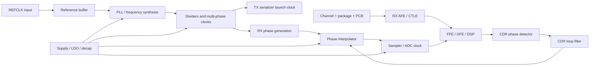
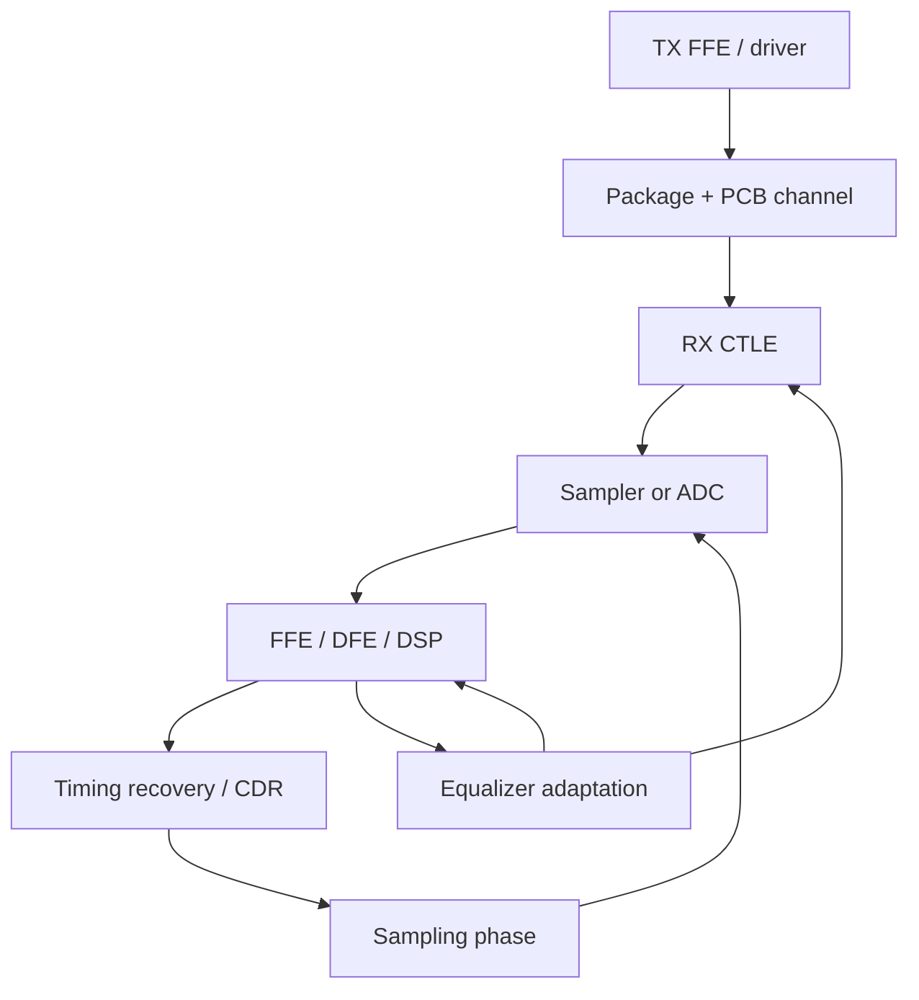

# PCIe 7.0 Clocking Notes

## 中文补充翻译

这篇笔记的核心结论是：PCIe 7.0 的公开速率是 128 GT/s per lane，但由于使用 PAM4，每个 symbol 携带 2 bits，所以电气 symbol rate 是 64 Gbaud，PAM4 symbol UI 是 15.625 ps，baseband Nyquist 是 32 GHz。`7.8125 ps` 是 bit-equivalent interval，不应直接拿来做 PAM4 CDR sampling phase 或 symbol eye margin。

PCIe 7.0 clocking 的难点不是简单生成一个高速 clock，而是把 REFCLK、PLL phase noise、serializer launch clock、clock distribution、CDR recovered clock、PI、sampler aperture、ADC clock 和 supply-induced jitter 全部映射到最终 eye margin。任何 jitter budget 都必须说明 measurement point、integration bandwidth、jitter type、PVT 和 UI 定义。

PAM4 通过降低 symbol rate 减轻带宽压力，但代价是 vertical margin 变小。timing error 会通过 `Delta V ~= dV/dt * Delta t` 转化为 voltage error，因此 PLL/CDR、channel、equalization、ADC aperture jitter、TI-ADC skew 和 LDO/power integrity 都要联合考虑。

## 0. Status

| Item | Value |
|---|---|
| Maturity | Sample note / interview preparation / design review primer |
| Related role | Synopsys PCIe 7.0 Clocking / PLL / CDR / SerDes AMS role |
| Last updated | 2026-07-01 |
| Main audience | Analog / mixed-signal IC engineer working on high-speed SerDes |
| Scope | Clocking, PLL, CDR, jitter, PAM4 timing, channel Nyquist, ADC-based RX, equalization, verification |

这是一份面向工程准备的 self-contained note。它不复述官方 PCIe 7.0 electrical compliance mask，也不替代内部 design spec。任何涉及具体限值、test fixture、receiver tolerance、SSC mask、jitter tolerance mask、Tx/Rx compliance methodology 的地方，都应标记为：

TODO: verify against PCIe 7.0 spec

相关基础笔记包括 [[pll_phase_noise_jitter]]、[[cdr_jitter_tolerance]]、[[pam4_adc_based_rx]]、[[serdes_channel_equalization]]。

## 1. One-Sentence Summary

PCIe 7.0 的公开 headline 是 128 GT/s per lane，但因为它使用 PAM4，电气 symbol rate 是 64 Gbaud，真正用于 CDR sampling phase、PI step、horizontal eye margin 和 channel Nyquist 的 symbol UI 是 15.625 ps，而不是 7.8125 ps。

## 2. Why This Topic Matters

PCIe 7.0 clocking 的难点不是简单生成一个高速 clock，而是把 reference clock、PLL phase noise、serializer launch clock、clock distribution、CDR recovered clock、phase interpolator、sampler aperture、ADC clock 和 supply-induced jitter 全部映射到最终 eye margin。

对 analog / mixed-signal IC engineer 来说，最关键的问题是：

$$
\text{How much timing uncertainty reaches the TX launch edge or RX sampling instant?}
$$

这个问题会同时影响：

| Area             | Why clocking matters                                                                                       |
| ---------------- | ---------------------------------------------------------------------------------------------------------- |
| PLL              | phase noise、spur、supply pushing、loop bandwidth 会变成 output timing uncertainty                               |
| CDR              | sampling phase 决定 receiver 在 symbol eye 的哪个位置判决                                                            |
| Jitter budget    | UI 定义错误会让 jitter margin 估算错一倍                                                                              |
| Channel          | 64 Gbaud PAM4 的 Nyquist 是 32 GHz，决定 channel loss 和 equalizer burden                                        |
| ADC-based RX     | aperture jitter 和 TI-ADC skew 会把 timing error 转换成 voltage error                                            |
| CTLE / FFE / DFE | equalization 改变 edge slope、ISI、data-dependent jitter 和 CDR phase detector behavior                         |
| Verification     | behavioral model、transistor simulation、post-layout extraction 和 compliance test 必须使用一致的 rate/UI definition |

如果在面试中把 PCIe 7.0 的 128 GT/s 直接说成 128 Gbaud，然后得到 7.8125 ps symbol UI 和 64 GHz Nyquist，这是一个明显的 PAM4 概念错误。

更深入地看，PCIe 7.0 clocking 同时跨越三个层次。第一个层次是 information rate，也就是每条 lane 每秒传多少 bit-equivalent information。第二个层次是 electrical waveform，也就是 channel 上真实变化的 PAM4 symbol rate、eye opening、ISI、reflection 和 noise。第三个层次是 implementation clocking，也就是 PLL、divider、serializer、PI、CDR 和 sampler 如何用有限相位精度、有限带宽和非理想 supply 去实现这个 waveform。

很多设计错误来自把这三个层次压成一个数字。例如说 "PCIe 7.0 is 128G, so clock is 128 GHz" 就同时混淆了 bit-equivalent rate、symbol rate 和 implementation clock frequency。一个严谨的回答应该先拆开：public rate 是 128 GT/s，PAM4 每 symbol 2 bits，所以 electrical symbol rate 是 64 Gbaud；至于 PLL 输出频率，要看 full-rate、half-rate、quarter-rate、multi-phase serializer 和 CDR 架构。

## 3. PCIe 7.0 Signaling Overview

PCIe 7.0 的关键公开 signaling point 是：

| Feature | High-level meaning |
|---|---|
| Per-lane headline rate | 128 GT/s |
| Modulation | PAM4 |
| Bits per PAM4 symbol | 2 bits/symbol |
| Electrical symbol rate | 64 Gbaud |
| Symbol UI | 15.625 ps |
| Nyquist frequency | 32 GHz |
| Main PHY implication | 更高 spectral efficiency，但 vertical margin 比 NRZ 小很多 |

PCIe 传统上用 GT/s 表达 transfer rate。对 NRZ PCIe generation，1 transfer 通常可以直接理解为 1 bit-equivalent transfer，因此 GT/s、Gb/s、Gbaud 在直觉上容易混在一起。但 PCIe 6.0/7.0 使用 PAM4 后，必须把 bit-equivalent rate 和 electrical symbol rate 分开。

PAM4 有四个 amplitude levels，例如可以抽象为：

| PAM4 level | Example bits |
|---:|---|
| -3 | 00 |
| -1 | 01 |
| +1 | 11 |
| +3 | 10 |

实际 mapping、precoding、FEC、FLIT mode、scrambling、lane training 等细节不在本文展开。这里关心的是 clocking：receiver 每个 PAM4 symbol 做一次有效 symbol decision，因此 clock phase 的基本时间单位是 symbol UI。

TODO: verify against PCIe 7.0 spec for exact coding, training, compliance, and electrical assumptions.

从 analog waveform 角度，PAM4 的四个电平不是四个“独立数字值”那么简单。每个 symbol transition 都要经过 TX driver、package、PCB channel、connector、receiver termination 和 equalizer。channel 的 frequency-dependent loss 会把一个理想 rectangular symbol stream 变成带有 precursor/postcursor ISI 的连续时间波形。CDR 看到的不是抽象 bit stream，而是带 noise、ISI、crosstalk、supply modulation 和 equalizer residue 的 waveform。

这也是为什么 PCIe 7.0 clocking 不能只讨论 PLL。PLL phase noise 只是一部分；真正决定 sample margin 的是 high-speed clock edge 到达 sampler 的时间误差，以及这个误差在 PAM4 三个 vertical eyes 上造成的 voltage error。

## 4. GT/s vs Gb/s vs Gbaud vs UI

这些术语在高速 SerDes 里经常被混用，但它们对应不同物理量。

| Term | Unit | Meaning | PCIe 7.0 PAM4 example | Common trap |
|---|---:|---|---:|---|
| GT/s | transfers/s | PCIe headline transfer rate，通常是 bit-equivalent lane rate | 128 GT/s | 直接当成 electrical Gbaud |
| Gb/s | bits/s | raw bit rate 或 payload bit rate，取决于上下文 | 128 Gb/s raw lane rate | 忘记 protocol overhead |
| Gbaud | symbols/s | electrical symbol rate | 64 Gbaud | 对 PAM4 误写成 128 Gbaud |
| UI | seconds | unit interval，可指 bit UI 或 symbol UI，必须说明 | 15.625 ps symbol UI | 不说明 UI 是 bit-equivalent 还是 symbol |
| Bit-equivalent UI | seconds | $1/R_b$ | 7.8125 ps | 错拿去做 sampler spacing |
| Nyquist frequency | Hz | symbol-rate channel 的 baseband Nyquist | 32 GHz | 错用 64 GHz |

对 clocking 和 CDR 来说，推荐在文档中显式写成：

$$
UI_{sym} = 15.625\text{ ps}
$$

而不是只写 "UI = 7.8125 ps" 或 "UI = 15.625 ps"。如果上下文是 bit-rate arithmetic，可以写：

$$
UI_{bit,eq} = 7.8125\text{ ps}
$$

这两个数都存在，但用途不同。

一个实用判断方法是问："这个数字描述的是 information throughput，还是描述 channel 上的 waveform spacing？" 如果是在算 bandwidth、x16 throughput 或 payload efficiency，可以使用 bit-equivalent rate。如果是在算 CDR sampling position、PI LSB、symbol-spaced equalizer tap、ADC sample placement 或 channel Nyquist，应该使用 symbol rate。

还要注意，implementation clock frequency 可能小于 symbol rate。例如一个 quarter-rate architecture 可以用 16 GHz multi-phase clock 来服务 64 Gbaud symbol stream；一个 half-rate architecture 可能围绕 32 GHz clock phases 设计；某些 architecture 还可能用 edge interleaving、muxing 或 local phase generation。因此 "64 Gbaud" 不自动意味着 "PLL output is 64 GHz"。

## 5. PAM4 Symbol Rate and UI Derivation

对一个 $M$-level modulation，单个 symbol 能表达的 bit 数是：

$$
b_{sym} = \log_2(M)
$$

如果 raw bit rate 是 $R_b$，symbol rate 是：

$$
R_s = \frac{R_b}{\log_2(M)}
$$

对 PAM4：

$$
M = 4
$$

$$
\log_2(4) = 2
$$

所以：

$$
R_s = \frac{R_b}{2}
$$

对 PCIe 7.0 headline 128 GT/s，可以把它作为 128 Gb/s bit-equivalent lane rate 来做 clocking conversion：

$$
R_s = \frac{128\text{ Gb/s}}{2} = 64\text{ Gbaud}
$$

PAM4 symbol UI 是：

$$
UI_{sym} = \frac{1}{R_s}
$$

代入：

$$
UI_{sym} = \frac{1}{64 \times 10^9} = 15.625\text{ ps}
$$

baseband Nyquist frequency 是 symbol rate 的一半：

$$
f_{Nyquist} = \frac{R_s}{2} = 32\text{ GHz}
$$

注意：

$$
UI_{bit,eq} = \frac{1}{128 \times 10^9} = 7.8125\text{ ps}
$$

这个 7.8125 ps 是 bit-equivalent interval，不是 PAM4 electrical symbol spacing。它可以用于 raw bit-rate arithmetic，但不能直接作为 CDR sampling phase 的 symbol UI。

下面的 flow diagram 是最安全的推导路径。先从 headline bit-equivalent rate 出发，再经过 modulation bits/symbol，得到 symbol rate；从 symbol rate 得到 UI 和 Nyquist。不要从 128 GT/s 直接跳到 symbol UI。

```mermaid
flowchart TD
  A[PCIe 7.0 headline rate: 128 GT/s] --> B[Treat as bit-equivalent raw lane rate]
  B --> C[R_b = 128 Gb/s]
  C --> D[PAM4 has M = 4 levels]
  D --> E[bits per symbol = log2(4) = 2]
  E --> F[R_s = R_b / 2 = 64 Gbaud]
  F --> G[Symbol UI = 1 / R_s = 15.625 ps]
  F --> H[Nyquist = R_s / 2 = 32 GHz]
  C --> I[Bit-equivalent UI = 1 / R_b = 7.8125 ps]
  I --> J[Use for bit-rate arithmetic, not PAM4 sample spacing]
```

这张图也适合在 interview whiteboard 上画。它把候选人是否真的理解 PAM4 的关键点暴露得很清楚：PAM4 让 symbol rate 减半，但没有免费增加 vertical margin。

### 5.1 Random Binary Sequence (RBS) 频谱分析和推导

Random binary sequence (RBS) 是理解 SerDes data spectrum 的最基本模型。它假设每个 bit 或 symbol 独立随机，概率相同，然后把离散时间 symbol sequence 通过一个 pulse shape 变成连续时间 waveform。这个模型不能替代真实 PCIe scrambling、coding、FFE、channel 和 package model，但它给出了 data spectrum、Nyquist frequency、AC coupling、equalizer stress 和 CDR transition density 的 first-order intuition。

先从 binary NRZ RBS 开始。令 bit interval 为 $T_b$，bit rate 为：

$$
R_b = \frac{1}{T_b}
$$

定义独立同分布的 polar binary sequence：

$$
a_k \in \{-A, +A\}
$$

且：

$$
P(a_k = +A) = P(a_k = -A) = \frac{1}{2}
$$

因此：

$$
\mu_a = E[a_k] = 0
$$

$$
\sigma_a^2 = E[a_k^2] - \mu_a^2 = A^2
$$

连续时间 NRZ waveform 可以写成：

$$
x(t) = \sum_{k=-\infty}^{\infty} a_k p(t-kT_b)
$$

其中 $p(t)$ 是单个 bit 的 transmit pulse。对 iid zero-mean symbol sequence，data waveform 的功率谱密度为：

$$
S_x(f) = \frac{\sigma_a^2}{T_b}|P(f)|^2
$$

这里 $P(f)$ 是 $p(t)$ 的 Fourier transform。这个公式是 RBS 频谱推导的核心：随机性由 $\sigma_a^2/T_b$ 决定，pulse shape 由 $|P(f)|^2$ 决定。

#### 5.1.1 Rectangular NRZ Pulse

如果使用理想 rectangular NRZ pulse：

$$
p(t) =
\begin{cases}
1, & 0 \le t < T_b \\
0, & \text{otherwise}
\end{cases}
$$

它的 Fourier transform 是：

$$
P(f) = T_b \cdot \text{sinc}(fT_b)e^{-j\pi fT_b}
$$

其中：

$$
\text{sinc}(x) = \frac{\sin(\pi x)}{\pi x}
$$

所以：

$$
|P(f)|^2 = T_b^2\text{sinc}^2(fT_b)
$$

代入 RBS PSD：

$$
S_x(f) = \frac{A^2}{T_b}T_b^2\text{sinc}^2(fT_b)
$$

得到：

$$
S_x(f) = A^2T_b\text{sinc}^2(fT_b)
$$

这个结果说明了几个重要事实：

| Property                | Meaning                                                              |
| ----------------------- | -------------------------------------------------------------------- |
| Spectrum envelope       | rectangular NRZ RBS 有 $\text{sinc}^2(fT_b)$ envelope                 |
| First null              | $f = R_b$                                                            |
| Null locations          | $f = nR_b,\ n=\pm1,\pm2,\ldots$                                      |
| Low-frequency content   | zero-mean polar RBS 没有 DC discrete line，但连续 PSD 在低频不为零               |
| High-frequency roll-off | ideal rectangular pulse 的 sidelobe roll-off 比实际 band-limited pulse 慢 |

需要注意，"first null at $R_b$" 不等于 "Nyquist is $R_b$"。对于 binary NRZ，symbol rate 等于 bit rate，所以 baseband Nyquist 是：

$$
f_{Nyquist,NRZ} = \frac{R_b}{2}
$$

而 rectangular pulse 的 sinc null 来自 pulse shape。Nyquist frequency 来自 symbol sampling theory。工程讨论中经常把这两个概念混在一起：一个描述 pulse spectrum envelope 的零点，另一个描述 symbol-rate baseband channel 的最低无 ISI 采样带宽 anchor。

#### 5.1.2 Non-Zero Mean Binary Sequence

如果使用 unipolar binary sequence：

$$
a_k \in \{0, A\}
$$

且 0/1 等概率，则：

$$
\mu_a = \frac{A}{2}
$$

$$
\sigma_a^2 = \frac{A^2}{4}
$$

PSD 会分成 continuous random data spectrum 和 discrete line spectrum：

$$
S_x(f) =
\frac{\sigma_a^2}{T_b}|P(f)|^2
+
\frac{\mu_a^2}{T_b^2}\sum_{n=-\infty}^{\infty}
|P(\frac{n}{T_b})|^2\delta(f-\frac{n}{T_b})
$$

对 rectangular NRZ pulse，$P(n/T_b)$ 在非零整数 $n$ 处为零，因此主要 discrete line 是 DC：

$$
S_{line}(f) = \mu_a^2\delta(f)
$$

这就是为什么 high-speed serial links 通常避免有 DC bias 的 raw unipolar data，并使用 differential signaling、scrambling、coding 或 AC coupling strategy 来控制低频和 DC content。真实链路中，finite pattern length、coding、scrambler polynomial、idle/training sequence 和 SSC 都会改变低频 spectrum。

#### 5.1.3 Transition Density and CDR Intuition

对 iid polar binary RBS，连续两个 bit 不同的概率是：

$$
P(a_k \ne a_{k-1}) = \frac{1}{2}
$$

所以 ideal random NRZ 的 average transition density 是 0.5 transition/bit。CDR 不能只看平均 transition density，还要看 run length distribution。长度为 $m$ 的 same-symbol run 的概率按几何分布下降：

$$
P(\text{run length}=m) = \left(\frac{1}{2}\right)^m
$$

长 run 会降低 CDR 可用 timing information，低频 data content 也会影响 AC coupling baseline wander。PCIe 这类链路会通过 scrambling、encoding/training pattern 和 CDR tolerance requirement 来避免把真实接收机完全暴露在 pathological raw RBS 假设下，但 RBS 仍然是做 first-order spectrum 和 transition-density sanity check 的好模型。

#### 5.1.4 Extension to PAM4 Symbol Sequence

对 PAM4，可以把 binary bit sequence 先映射成四电平 symbol sequence。假设 ideal independent equiprobable PAM4 levels：

$$
a_k \in \{-3A, -A, +A, +3A\}
$$

则：

$$
\mu_a = 0
$$

$$
\sigma_a^2 =
\frac{1}{4}\left(9A^2 + A^2 + A^2 + 9A^2\right)
= 5A^2
$$

连续时间 PAM4 waveform 是：

$$
x(t) = \sum_{k=-\infty}^{\infty} a_k p(t-kT_s)
$$

其中：

$$
T_s = UI_{sym} = \frac{1}{R_s}
$$

zero-mean iid PAM4 data spectrum 同样满足：

$$
S_x(f) = \frac{\sigma_a^2}{T_s}|P(f)|^2
$$

如果仍假设 rectangular symbol pulse：

$$
S_x(f) = 5A^2T_s\text{sinc}^2(fT_s)
$$

对 PCIe 7.0 PAM4：

$$
R_s = 64\text{ Gbaud}
$$

$$
T_s = 15.625\text{ ps}
$$

rectangular symbol pulse 的 first null 在：

$$
f = R_s = 64\text{ GHz}
$$

但 baseband Nyquist anchor 仍然是：

$$
f_{Nyquist} = \frac{R_s}{2} = 32\text{ GHz}
$$

因此不能把 RBS rectangular-pulse first null 误认为 channel Nyquist。对于 practical SerDes，TX FFE、package/channel loss、CTLE、RX equalizer、finite rise/fall time 和 bandwidth limitation 会把 ideal $\text{sinc}^2$ envelope 改成实际 waveform spectrum。对 raised-cosine 或 root-raised-cosine 类 Nyquist pulse，理想 baseband spectrum 的主要占用带宽通常写成：

$$
B = \frac{1+\alpha}{2}R_s
$$

其中 $\alpha$ 是 roll-off factor。$\alpha=0$ 时是理想 brick-wall Nyquist pulse，带宽为 $R_s/2$；$\alpha>0$ 时需要更宽带宽，但 time-domain pulse 更容易实现。

#### 5.1.5 Engineering Use in PCIe 7.0 Clocking

RBS spectrum 推导对 PCIe 7.0 clocking 的价值不是给出 official compliance mask，而是帮助建立几个判断：

| Question               | RBS-derived intuition                                                |
| ---------------------- | -------------------------------------------------------------------- |
| Data spectrum 由什么决定？   | symbol variance 和 pulse shape                                        |
| 32 GHz 从哪里来？           | 64 Gbaud PAM4 的 baseband Nyquist                                     |
| 64 GHz first null 是什么？ | ideal rectangular PAM4 symbol pulse 的 sinc null                      |
| 为什么要看低频？               | DC balance、AC coupling、baseline wander、CDR low-frequency tracking    |
| 为什么要看高频？               | edge slope、jitter-to-voltage conversion、equalizer boost、crosstalk    |
| 为什么不能只看 RBS？           | 真实 PCIe data 有 scrambling、coding、training、FFE、channel 和 equalization |

一个实用说法是：

$$
\text{Data PSD} = \text{symbol statistics} \times \text{pulse-shape spectrum}
$$

对于 PCIe 7.0 PAM4，clocking 分析应该使用 $R_s=64\text{ Gbaud}$ 和 $UI_{sym}=15.625\text{ ps}$；频谱分析中可以用 RBS PSD 做 sanity check，但 channel/equalizer/CDR signoff 必须用真实 pattern、实际 pulse shape、transmitter equalization、channel S-parameter 和 receiver adaptation model。

## 6. Worked Example 1: 128 GT/s PCIe 7.0 UI and Nyquist

假设分析对象是 PCIe 7.0 单 lane，headline rate 为 128 GT/s，使用 PAM4。

### 6.1 Raw Bit Rate

把 128 GT/s 作为 bit-equivalent lane rate：

$$
R_b = 128 \times 10^9\text{ bit/s}
$$

也就是：

$$
R_b = 128\text{ Gb/s}
$$

### 6.2 Bits per Symbol

PAM4 有四个 amplitude levels：

$$
b_{sym} = \log_2(4) = 2\text{ bits/symbol}
$$

### 6.3 Symbol Rate

$$
R_s = \frac{R_b}{b_{sym}}
$$

$$
R_s = \frac{128\text{ Gb/s}}{2} = 64\text{ Gbaud}
$$

### 6.4 Symbol UI

$$
UI_{sym} = \frac{1}{64 \times 10^9} = 15.625\text{ ps}
$$

这个数是 high-speed analog clocking 里最重要的时间尺度。CDR 的 phase detector、PI step、sampler aperture、ADC sampling edge、DFE decision timing 都围绕这个 symbol UI 工作。

### 6.5 Bit-Equivalent UI

$$
UI_{bit,eq} = \frac{1}{128 \times 10^9} = 7.8125\text{ ps}
$$

这个数只表示 bit-equivalent interval。如果一段文字说 "128 GT/s means UI is 7.8125 ps"，必须追问它说的是 bit-equivalent UI 还是 PAM4 symbol UI。

### 6.6 Nyquist Frequency

对 64 Gbaud PAM4 baseband channel：

$$
f_{Nyquist} = \frac{R_s}{2} = \frac{64\text{ Gbaud}}{2} = 32\text{ GHz}
$$

这意味着 channel、package、connector、PCB trace、vias、termination、CTLE 和 FFE/DFE 的主要 high-frequency burden 是围绕 32 GHz Nyquist 展开的。实际需要更高频率的模型，因为 transition shape、equalizer behavior、jitter、reflection 和 nonlinear effects 不会在 Nyquist 处突然停止。

### 6.7 x16 Raw Bandwidth

单 lane 单方向 raw byte rate：

$$
\frac{128\text{ Gb/s}}{8} = 16\text{ GB/s}
$$

x16 单方向 raw bandwidth：

$$
16\text{ GB/s} \times 16 = 256\text{ GB/s}
$$

x16 bidirectional raw bandwidth：

$$
256\text{ GB/s} \times 2 = 512\text{ GB/s}
$$

如果考虑 FLIT mode 的 $242/256$ payload efficiency：

$$
16\text{ GB/s} \times \frac{242}{256} = 15.125\text{ GB/s/lane}
$$

$$
15.125\text{ GB/s} \times 16 = 242\text{ GB/s}
$$

$$
242\text{ GB/s} \times 2 = 484\text{ GB/s bidirectional}
$$

TODO: verify against PCIe 7.0 spec for exact payload accounting and overhead definitions.

## 7. NRZ vs PAM4 Comparison

| Property | NRZ | PAM4 | Engineering consequence |
|---|---|---|---|
| Levels | 2 | 4 | PAM4 needs multiple thresholds |
| Bits per symbol | 1 | 2 | PAM4 halves symbol rate for same bit rate |
| Symbol rate for 128 Gb/s | 128 Gbaud | 64 Gbaud | PAM4 reduces bandwidth demand |
| Symbol UI for 128 Gb/s | 7.8125 ps | 15.625 ps | PAM4 timing UI is longer than NRZ at same bit rate |
| Vertical eyes | 1 | 3 | PAM4 has smaller vertical eye openings |
| Ideal level spacing for same swing | Full swing eye | About one-third spacing per adjacent level | PAM4 is more sensitive to noise and linearity |
| Equalization | Required at high speed | More delicate | PAM4 needs amplitude accuracy and timing accuracy |
| CDR | Binary edge/timing information | Multi-level waveform and symbol decisions | CDR can be biased by ISI and level-dependent transition density |
| ADC-based RX | Optional in some architectures | More attractive | DSP equalization and soft decisions become valuable |

PAM4 is not "easier because the UI is longer" in a simple sense. It trades horizontal bandwidth pressure for vertical margin pressure. Even though PCIe 7.0 PAM4 has 15.625 ps symbol UI, each eye has much less amplitude margin than an NRZ eye at the same full-scale swing.

Sampling time error converts into voltage error through local waveform slope:

$$
\Delta V \approx \frac{dV}{dt}\Delta t
$$

For PAM4，$\Delta V$ consumes a smaller vertical eye. Therefore the same timing error can be more damaging than the UI-only number suggests.

### 7.1 Worked Example 2: NRZ 128 Gb/s vs PAM4 128 Gb/s

假设目标 raw bit rate 都是 128 Gb/s。比较 NRZ 和 PAM4 的 first-order rate conversion：

| Quantity | NRZ at 128 Gb/s | PAM4 at 128 Gb/s |
|---|---:|---:|
| Modulation levels | 2 | 4 |
| Bits per symbol | 1 | 2 |
| Symbol rate | 128 Gbaud | 64 Gbaud |
| Symbol UI | 7.8125 ps | 15.625 ps |
| Baseband Nyquist | 64 GHz | 32 GHz |
| Ideal adjacent level spacing for same full swing | Large | About one-third |

NRZ:

$$
R_{s,NRZ} = \frac{128\text{ Gb/s}}{\log_2(2)} = 128\text{ Gbaud}
$$

$$
UI_{NRZ} = \frac{1}{128\times10^9} = 7.8125\text{ ps}
$$

$$
f_{Nyquist,NRZ} = \frac{128\text{ Gbaud}}{2} = 64\text{ GHz}
$$

PAM4:

$$
R_{s,PAM4} = \frac{128\text{ Gb/s}}{\log_2(4)} = 64\text{ Gbaud}
$$

$$
UI_{PAM4} = \frac{1}{64\times10^9} = 15.625\text{ ps}
$$

$$
f_{Nyquist,PAM4} = \frac{64\text{ Gbaud}}{2} = 32\text{ GHz}
$$

这个例子说明 PAM4 的主要价值是 spectral efficiency：同样 128 Gb/s raw rate，PAM4 的 symbol rate 和 Nyquist frequency 都是 NRZ 的一半。但这不是无代价的。相同 full-scale voltage swing 下，PAM4 的相邻 level spacing 约为 NRZ eye opening 的三分之一，因此 thermal noise、offset、linearity、threshold error、ISI residue 和 timing-induced voltage error 都更敏感。

从 analog design 角度，NRZ 的主要压力偏向 extremely high bandwidth 和 very small UI；PAM4 的压力则更均衡地分布在 bandwidth、linearity、noise、jitter、equalization 和 calibration 上。PCIe 7.0 使用 PAM4 后，clocking engineer 仍然要关心 sub-ps jitter，但不能把 timing budget 和 amplitude budget 分开看。

## 8. Clocking Architecture

PCIe 7.0 PHY clocking is a chain, not a single PLL number. A realistic architecture includes reference clock input、PLL、clock dividers、multi-phase generation、serializer clock、local clock distribution、CDR、phase interpolator、recovered clock、sampler/ADC clock。



### 8.1 Reference Clock

REFCLK 通常是低频 clock source，用于提供 frequency reference。它不是 high-speed serial data clock 本身。REFCLK noise 在 PLL loop bandwidth 内可能传递到 output；REFCLK spur、SSC、board coupling 和 input buffer noise 都可能进入 high-speed clock path。

在系统设计里，REFCLK 的重要性经常被低估，因为它的 nominal frequency 远低于 64 Gbaud symbol rate。但 PLL 是一个 phase-domain system：低频 reference phase error 会通过 loop transfer function 传到 output phase。对于 close-in phase noise、reference spur、spread-spectrum modulation 和 board-level coupling，真正的问题不是 "REFCLK frequency is low"，而是 "PLL loop 对这些相位扰动的传递函数是多少"。

需要关注：

| Concern | Engineering question |
|---|---|
| REFCLK phase noise | PLL loop bandwidth 内会传多少到输出？ |
| REFCLK spur | 会不会变成 deterministic jitter 或 periodic jitter？ |
| SSC | CDR 能否 track low-frequency modulation？ |
| Input buffer | buffer additive jitter 是否已经计入？ |

TODO: verify against PCIe 7.0 spec for exact REFCLK and SSC requirements.

### 8.2 PLL

PLL 负责把 reference 转换成 high-speed clock phases。PLL output 可以是 full-rate、half-rate、quarter-rate 或其它架构相关 frequency，不一定等于 64 GHz 或 128 GHz。实际 serializer 可能用 multi-phase clocks、muxing、edge combining、fractional dividers 或 forwarded internal clocks。

PLL phase noise 的简化表达：

$$
\Phi_{out}(s) \approx H_{ref}(s)\Phi_{ref}(s) + H_{vco}(s)\Phi_{vco}(s) + \Phi_{add}(s)
$$

其中 $\Phi_{add}(s)$ 包括 PFD/CP noise、divider noise、DSM noise、buffer noise、supply-induced noise 等。

对 PCIe 7.0 preparation，PLL frequency planning 至少要回答三个问题。第一，PLL 输出 clock domain 如何映射到 64 Gbaud symbol stream？例如 16 GHz quarter-rate clock 需要多少相位，phase spacing 如何保证，duty-cycle error 如何影响 serializer。第二，PLL phase noise 在 CDR 能 track 的 frequency range 内如何被处理？TX launch jitter 和 RX local sampling jitter 的意义不同。第三，PLL 之外的 divider、phase generator、clock buffer 和 PI 是否把原本干净的 PLL output 变差。

一个好的 PLL answer 不会只说 "make jitter low"。它会说：specify phase-noise mask or integrated jitter band, separate reference/VCO/divider/buffer/supply contributors, verify across PVT and extracted loading, and translate the final clock edge uncertainty to fraction of 15.625 ps symbol UI.

### 8.3 Serializer Clock

TX serializer launch clock 决定 bit-equivalent data stream 或 PAM4 symbol stream 的 launch timing。它的 deterministic jitter、duty-cycle distortion、multi-phase mismatch 和 supply sensitivity 会直接转成 TX eye closure。

对 PAM4 TX，还要考虑：

| Effect | Why it matters |
|---|---|
| Clock-to-DAC timing skew | 不同 level transition 的 timing mismatch 会形成 data-dependent jitter |
| Driver segment mismatch | PAM4 level linearity 和 timing 交织 |
| Pre-emphasis timing | FFE tap timing error 会改变 channel input waveform |
| Supply coupling | 同时影响 clock edge 和 output amplitude |

如果 TX 使用 multi-phase clock，phase spacing error 会表现为 periodic deterministic jitter。如果 PAM4 level generation 使用多个 current segments 或 DAC-like driver，clock skew 还会和 amplitude mismatch 交织：某些 transition 可能比其它 transition 更早或更晚，形成 level-dependent jitter。对 compliance 和 link margin 来说，这类 jitter 不能简单当成 independent random jitter RSS。

### 8.4 Local Clock Distribution

PLL output 到 serializer 或 sampler 之间的 clock tree 是高风险路径。clock buffer additive jitter、supply-induced delay modulation、routing mismatch、duty-cycle distortion、crosstalk 和 substrate coupling 都可能在 PLL 之后引入，因此不会出现在 standalone PLL phase-noise plot 里。

clock buffer delay 对 supply 的一阶敏感性可以写成：

$$
\Delta t_d \approx K_{d,VDD}\Delta V_{DD}
$$

如果某段 clock tree 的 delay sensitivity 是 $1\text{ ps}/10\text{ mV}$，而 local supply ripple 是 $1\text{ mV}$ peak，那么 clock edge 会有约 $100\text{ fs}$ peak movement。相对 PCIe 7.0 PAM4 symbol UI：

$$
\frac{100\text{ fs}}{15.625\text{ ps}} = 0.0064 UI_{sym}
$$

这看起来小，但它可能是 periodic、correlated 或 data-dependent 的，不能总是和 random jitter 做 RSS。clock distribution 的 signoff 必须包含 extracted parasitics 和 realistic switching activity。

### 8.5 CDR and Sampling Phase

RX CDR 不是简单恢复一个理想 clock。它通过 phase detector 从 data transitions 或 sampled waveform 中估计 phase error，再调节 PI/DCO/sampling phase。CDR loop bandwidth 决定哪些 jitter 被 track，哪些变成 residual sampling error。

一阶直觉模型：

$$
H_{track}(s) = \frac{\omega_c}{s + \omega_c}
$$

$$
H_{error}(s) = 1 - H_{track}(s) = \frac{s}{s + \omega_c}
$$

low-frequency phase variation 倾向被 CDR track；high-frequency variation 倾向变成 residual timing error。实际 high-order loop、bang-bang PD、Alexander PD、ADC/DSP-based timing recovery 会更复杂。

recovered clock 也不是“从线缆中取出来的干净 clock”。它是本地 oscillator/PI/DCO 在 CDR loop 控制下生成的 sampling phase。输入 data jitter、phase detector noise、loop quantization、PI INL/DNL、sampler metastability 和 equalizer adaptation 都会影响 recovered phase。因此讨论 recovered clock 必须同时说明 loop bandwidth、phase detector type、equalization state 和 jitter transfer function。

## 9. Jitter and Phase Noise Implications

### 9.1 Jitter Types

| Jitter type | Typical source | How to treat |
|---|---|---|
| Random jitter | VCO thermal noise, buffer noise, sampler noise | RMS, BER tail, RSS if independent |
| Deterministic jitter | duty-cycle distortion, mismatch, crosstalk | bounded or peak-to-peak |
| Data-dependent jitter | ISI, unequal transitions, PAM4 level dependence | channel/equalizer dependent |
| Periodic jitter | spurs, switching regulators, digital clocks | narrowband stress, mask/jitter tolerance concern |
| Supply-induced jitter | VCO pushing, buffer delay modulation, PI delay modulation | supply injection and PSRR co-sim |
| Quantization jitter | PI step, DCO step, digital loop resolution | phase granularity and limit cycles |

不要把所有 jitter 直接 RSS。只有 independent Gaussian-like random terms 才适合简单 RSS。correlated jitter、bounded deterministic jitter、data-dependent jitter 应该用 separate budget 或 bathtub/BER analysis。

### 9.2 Phase Noise to RMS Jitter

single-sideband phase noise $L(f)$ 到 RMS timing jitter 的常用关系是：

$$
\sigma_t = \frac{1}{2\pi f_0}\sqrt{2\int_{f_1}^{f_2}10^{L(f)/10}df}
$$

其中：

| Symbol | Meaning |
|---|---|
| $f_0$ | carrier / clock frequency |
| $f_1, f_2$ | integration bandwidth |
| $L(f)$ | single-sideband phase noise in dBc/Hz |
| $\sigma_t$ | RMS timing jitter |

任何 meaningful jitter number 都必须说明：

| Required detail | Example |
|---|---|
| Measurement point | PLL output, clock-tree output, PI output, sampler clock |
| Frequency | 16 GHz carrier, 32 GHz clock, architecture-dependent |
| Integration band | 10 kHz to 100 MHz, or spec-defined band |
| Conditions | PVT, supply, activity, extracted layout |
| Included sources | PLL-only, or PLL + divider + clock tree + PI + supply |
| RMS vs peak-to-peak | 80 fs RMS is not same as 80 fs p-p |

TODO: verify against PCIe 7.0 spec for official jitter integration bands and compliance definitions.

从 engineering signoff 角度，phase noise plot 只是起点。要把它用于 link margin，需要决定 integration band，并明确这个 band 和 CDR loop 的关系。例如 TX launch jitter 可能直接影响 transmitted data edge，而 RX local oscillator noise 在 CDR bandwidth 内外的 effect 不同：一部分可能被 loop correction 抑制，一部分可能直接出现在 sampling edge。官方 compliance 对这些带宽和测试方法有严格定义时，必须以 spec 为准。

### 9.3 UI Definition Changes the Budget

假设 sampler clock total random jitter 是 140 fs RMS。

如果错误使用 7.8125 ps 作为 PAM4 symbol UI：

$$
\frac{140\text{ fs}}{7.8125\text{ ps}} = 0.0179 UI
$$

如果正确使用 15.625 ps symbol UI：

$$
\frac{140\text{ fs}}{15.625\text{ ps}} = 0.0090 UI_{sym}
$$

二者相差 2x。错误 UI 会直接影响 jitter budget、PI LSB interpretation、CDR margin discussion 和 interview answer。

### 9.4 Worked Example 3: Jitter Budget Interpretation Using 15.625 ps UI

假设 RX sampling clock 的 independent RMS contributors 为：

| Contributor | RMS jitter |
|---|---:|
| PLL integrated jitter | 80 fs |
| Divider and multi-phase generation | 45 fs |
| Clock distribution | 60 fs |
| Phase interpolator | 50 fs |
| Supply-induced timing noise | 70 fs |
| Sampler aperture uncertainty | 50 fs |

RSS:

$$
\sigma_t =
\sqrt{80^2 + 45^2 + 60^2 + 50^2 + 70^2 + 50^2}\text{ fs}
$$

$$
\sigma_t = 146.4\text{ fs}
$$

归一化到 PCIe 7.0 PAM4 symbol UI：

$$
\sigma_{UI} = \frac{146.4\text{ fs}}{15.625\text{ ps}} = 0.00937 UI_{sym}
$$

这个计算不能证明 compliance。它的价值是建立 discipline：必须说明 measurement point、bandwidth、random/deterministic classification 和 correlation。

进一步解释这个 0.00937 UI。它表示 one-sigma RMS timing uncertainty 约占 symbol UI 的 0.94%。如果把 random jitter extrapolate 到 very low BER，peak-equivalent margin 会乘上一个和 BER 目标有关的 sigma factor；如果还有 deterministic jitter，不能把它简单地吸收到 RMS 里。比如 146 fs RMS random jitter 加上 300 fs bounded deterministic jitter，其 margin interpretation 和单纯 330 fs RMS 完全不同。

另一个关键点是 PAM4 的 vertical penalty。即使 horizontal jitter 只占 1% UI，它通过 local slope 造成的 voltage error 可能接近某个 PAM4 eye 的可用 vertical margin。因此 jitter budget 最后应进入 link-level eye/bathtub 或 statistical analysis，而不是停留在 fs 和 UI 的换算。

## 10. CDR Implications

CDR 的核心任务是把 sampling phase 放在 symbol eye 的合适位置。对于 PCIe 7.0 PAM4，它工作在 64 Gbaud symbol timing 上，而不是 128 Gbaud timing 上。

在 NRZ 中，很多 CDR intuition 来自 transition zero crossing 和 binary decision。但 PAM4 的 transition 有多种幅度：outer transition、inner transition、one-level transition、two-level transition、three-level transition 的 slope 和 probability 都不同。phase detector 如果没有处理好 level dependence，可能会被某些 transition type bias。ADC/DSP-based receiver 可以用更多信息估计 timing error，但也引入 quantization、latency 和 digital loop stability 问题。

### 10.1 PAM4 CDR Timing

PAM4 receiver 每个 symbol 有一个 amplitude decision。理想情况下 sampling instant 位于 symbol eye 的水平中心；但实际中它会被以下因素移动：

| Source | Effect on CDR |
|---|---|
| Channel ISI | transition zero-crossing 或 eye center 被 skew |
| CTLE peaking | 改变 edge slope 和 noise enhancement |
| FFE tap setting | 改变 precursor/postcursor ISI |
| DFE error propagation | wrong decision 会影响后续 correction |
| PAM4 level dependence | 不同 transition amplitude 和 slope 不同 |
| Supply noise | PI/sampler delay modulation |
| Loop bandwidth | 决定 jitter transfer / jitter tolerance |

### 10.2 PI Resolution Example

如果 phase interpolator 在一个 symbol UI 内有 64 steps：

$$
t_{LSB} = \frac{UI_{sym}}{64}
$$

$$
t_{LSB} = \frac{15.625\text{ ps}}{64} = 244.1\text{ fs}
$$

如果系统使用 128 steps：

$$
t_{LSB} = \frac{15.625\text{ ps}}{128} = 122.1\text{ fs}
$$

注意 122.1 fs 对应的是 128 steps per PAM4 symbol UI，或者错误地用 7.8125 ps / 64 得到的结果。必须写清楚 PI step 是基于 symbol UI 还是 bit-equivalent UI。

### 10.3 CDR Loop Tradeoff

CDR bandwidth 过宽：

- 会 track 更多 input jitter，可能把 channel jitter 带进 sampling clock。
- 会引入更多 internal loop noise。
- bang-bang CDR 可能出现 limit cycle 或 pattern-dependent behavior。

CDR bandwidth 过窄：

- 可能无法 track frequency offset、wander、SSC 或 slow thermal/supply drift。
- sampling phase 可能偏离 eye center。
- jitter tolerance 可能不满足要求。

面试中可以这样回答：CDR bandwidth 是 jitter transfer、jitter tolerance、jitter generation 和 equalizer interaction 的折中，不是越大越好，也不是越小越好。

## 11. Channel and Nyquist Implications

64 Gbaud PAM4 的 baseband Nyquist frequency 是：

$$
f_{Nyquist} = \frac{64\text{ Gbaud}}{2} = 32\text{ GHz}
$$

这不是说 channel 只需要到 32 GHz。实际 channel modeling 通常需要覆盖更高频率，因为 transitions、reflections、package resonance、crosstalk 和 equalizer response 都会影响 time-domain waveform。

Nyquist frequency 的正确用途是建立 first-order bandwidth target。对 symbol-spaced equalizer 来说，32 GHz 是 64 Gbaud PAM4 waveform 的基本 spectral anchor。对 analog front-end 来说，CTLE 需要在接近 Nyquist 的区域补偿 insertion loss，但 peaking 会同时放大 noise 和 crosstalk。对 TX FFE 来说，pre-emphasis 可以帮助 channel loss，但会消耗 swing、power 和 linearity margin。对 DFE 来说，它主要处理 postcursor ISI，但错误 decision 会导致 error propagation，PAM4 三个 thresholds 让这个问题更敏感。

### 11.1 Why 32 GHz Matters

Nyquist frequency 是理解 loss budget 和 equalization burden 的 first-order anchor：

| Item | Why 32 GHz matters |
|---|---|
| Package | bump、escape routing、via、substrate loss 在高频恶化 |
| PCB | insertion loss、return loss、via stub、connector resonance |
| CTLE | 需要补偿 high-frequency loss，但会 boost noise |
| TX FFE | 预补偿 channel loss，同时受 swing 和 power 限制 |
| RX FFE | digital/analog post-cursor correction，受 noise enhancement 限制 |
| DFE | 去除 postcursor ISI，但依赖正确 decisions |
| CDR | phase detector 看到的是 equalized waveform，不是 ideal data |

一个常见工程流程是先用 channel S-parameters 估算 32 GHz 附近 loss，再选择 TX FFE preset、CTLE peaking 和 RX equalizer complexity。然后把 equalized waveform 送入 CDR/timing recovery model，观察 timing bias、data-dependent jitter 和 residual ISI。这个流程必须闭环，因为 equalizer setting 会改变 CDR 看到的 slope，而 CDR sampling phase 又会改变 equalizer adaptation 的 error signal。

### 11.2 Equalization and Timing Coupling



equalization 和 clocking 是闭环耦合的：

- CTLE 改变 edge slope，因此改变 timing error 到 voltage error 的转换。
- FFE 改变 precursor/postcursor ISI，因此改变 data-dependent jitter。
- DFE 依赖 previous decisions，timing error 会提高 wrong decision probability。
- CDR phase detector 看到的是 equalized signal，equalizer setting 会影响 phase error estimate。

## 12. ADC-Based RX Implications

PCIe 7.0 PAM4 可以使用 slicer-based 或 ADC/DSP-heavy receiver architecture。对 ADC-based RX 来说，sampling clock 是 signal path 的核心性能限制之一。

ADC-based RX 的直觉是“先把 waveform 数字化，再让 DSP 处理复杂 equalization”。但这并不意味着 analog clocking 可以放松。ADC 采样瞬间的 aperture jitter、clock duty-cycle error、interleaving skew 和 sampling network bandwidth 会在数字化之前损坏信号。DSP 只能处理已经采到的 samples；如果 sample time 错了，它看到的就是错误 amplitude。

### 12.1 Aperture Jitter

ADC aperture jitter 会把输入斜率转换成电压噪声：

$$
\sigma_v \approx \left|\frac{dV}{dt}\right|\sigma_t
$$

对 sinusoidal input，aperture jitter 限制的 SNR 是：

$$
SNR_{jitter} \approx -20\log_{10}(2\pi f_{in}\sigma_t)
$$

如果 $\sigma_t = 150\text{ fs}$，且 $f_{in}=16\text{ GHz}$：

$$
2\pi f_{in}\sigma_t
= 2\pi \cdot 16\times10^9 \cdot 150\times10^{-15}
= 0.0151
$$

$$
SNR_{jitter} \approx -20\log_{10}(0.0151) = 36.4\text{ dB}
$$

这个例子不是 PCIe compliance calculation，只是说明 aperture jitter 在 tens of GHz waveform content 下很快变成 hard limit。

在 PAM4 SerDes 中，这个 SNR 公式只是 sinusoidal approximation。真实 waveform 有 ISI、非正弦 spectrum 和 equalizer shaping，但公式给出一个重要直觉：输入频率越高、采样 jitter 越大，jitter-induced noise 越严重。对 32 GHz Nyquist 附近的 content，aperture jitter 会非常快地吃掉 PAM4 vertical margin。

### 12.2 TI-ADC Timing Skew

Time-interleaved ADC 使用多个 sub-ADC 交错采样。每个 sub-ADC 的 timing skew 会产生 spur 和 distortion。对 $N$-way TI-ADC，如果 sub-ADC sampling instant 误差为 $\Delta t_i$，则它等效为 periodic sampling time modulation。

关键问题：

| Concern | Effect |
|---|---|
| Static skew | 产生 pattern-like distortion 或 spurs |
| Dynamic skew | 变成 jitter/noise |
| Clock distribution mismatch | 限制 calibration floor |
| Supply-induced skew | 与 digital activity 相关，可能 data-dependent |
| Calibration resolution | 决定 residual timing error |

相关笔记：[[ti_sar_mismatch_calibration]]、[[pam4_adc_based_rx]]。

TI-ADC skew 的工程难点在于它既有 static mismatch，也有 dynamic modulation。static skew 可以通过 foreground 或 background calibration 降低；dynamic skew 可能来自 supply noise、clock buffer delay modulation、substrate coupling 或 temperature gradient。后者更难校准，因为它随 activity 和 operating condition 变化。对 PCIe 7.0 这类高速 PAM4 receiver，TI skew budget 最好直接折算成 equivalent sampling jitter 和 voltage error，再进入 link margin model。

### 12.3 Digital Equalization

ADC-based RX 的优势是可以用 DSP 做 FFE/DFE、timing recovery、offset/gain calibration、threshold adaptation 和 soft information processing。但它把 clocking 问题转移成：

- ADC sample clock phase noise。
- sampling aperture uncertainty。
- TI skew calibration。
- DSP timing recovery loop stability。
- quantization noise 和 thermal noise 的联合 budget。
- clock/data/supply coupling 的 behavioral model accuracy。

## 13. Common Mistakes

1. Treating 128 GT/s as 128 Gbaud。
2. Using 7.8125 ps as the PCIe 7.0 PAM4 symbol UI。
3. Confusing bit-equivalent UI and symbol UI。
4. Using 64 GHz as the Nyquist frequency for PCIe 7.0 PAM4 instead of 32 GHz。
5. Ignoring PAM4 amplitude margin loss and only celebrating the longer symbol UI。
6. Mixing data rate and clock frequency, for example assuming PLL must output exactly 64 GHz or 128 GHz。
7. Assuming REFCLK directly equals high-speed data clock。
8. Ignoring CDR loop bandwidth, jitter transfer, jitter tolerance, and jitter generation。
9. Quoting "80 fs jitter" without integration bandwidth, measurement point, PVT, or included noise sources。
10. RSS-combining deterministic jitter, correlated supply jitter, and random jitter as if all were independent Gaussian noise。
11. Treating PLL output jitter as identical to sampler clock jitter after clock tree、PI、CDR 和 layout。
12. Forgetting that PAM4 timing error also creates vertical error through $\Delta V \approx (dV/dt)\Delta t$。
13. Designing CTLE/FFE/DFE as if clocking were fixed and independent。
14. Building a behavioral model with 128 Gbaud sampling assumptions for a 64 Gbaud PAM4 link。
15. Assuming public headline bandwidth equals usable application payload bandwidth without overhead.

## 14. How to Answer in Interview

面试回答要避免堆术语。最有效的方式是先给结论，再给推导，再说明工程后果。下面是几个 polished English answers，可以直接用于 Synopsys-style PCIe 7.0 clocking / PLL / CDR interview。

### 14.1 Polished English Answers

**Question: What is the key clocking fact for PCIe 7.0?**

PCIe 7.0 is advertised at 128 GT/s per lane, but with PAM4 that is a bit-equivalent rate. Since PAM4 carries two bits per symbol, the electrical symbol rate is 64 Gbaud. Therefore the symbol UI used for CDR sampling, PI resolution, and horizontal eye margin is 15.625 ps, while 7.8125 ps is only the bit-equivalent interval.

**Question: What is the Nyquist frequency and why does it matter?**

For a 64 Gbaud PAM4 waveform, the baseband Nyquist frequency is 32 GHz. That number anchors the channel loss, CTLE peaking, TX FFE, RX equalization, package and PCB modeling. In practice I would still model beyond 32 GHz because transitions, reflections, crosstalk, and equalizer response affect the time-domain eye.

**Question: How would you connect PLL phase noise to link margin?**

I would not stop at PLL integrated jitter. I would specify the integration band and measurement point, propagate the clock through dividers, phase generation, buffers, PI, and local distribution, include supply-induced jitter and CDR residual phase error, and then normalize the final sampler timing uncertainty to the 15.625 ps PAM4 symbol UI.

**Question: Why is PAM4 harder even though the symbol UI is longer?**

PAM4 halves the symbol rate for the same bit rate, which helps bandwidth, but it reduces vertical level spacing. Timing error becomes voltage error through the waveform slope, so jitter, ISI, equalization error, noise, and linearity all interact. The design is not just a horizontal timing problem.

**Question: How would you discuss CDR bandwidth?**

CDR bandwidth sets the tradeoff between tracking low-frequency phase movement and rejecting high-frequency jitter and internal noise. A wider loop can track wander and SSC better, but it may pass more jitter. A narrower loop filters more jitter but may fail tolerance or tracking requirements. The answer depends on jitter transfer, jitter tolerance, jitter generation, and the equalized PAM4 waveform.

### 14.2 Interview Q&A

### Q1. What does 128 GT/s mean for PCIe 7.0?

It is the headline per-lane bit-equivalent transfer rate. For PAM4 clocking calculations, treat it as 128 Gb/s raw bit-equivalent lane rate, then divide by 2 bits/symbol to get 64 Gbaud.

### Q2. Why is PCIe 7.0 not 128 Gbaud?

Because PCIe 7.0 uses PAM4. PAM4 carries 2 bits per symbol, so the electrical symbol rate is:

$$
R_s = \frac{128\text{ Gb/s}}{2} = 64\text{ Gbaud}
$$

### Q3. What is the PAM4 symbol UI?

$$
UI_{sym} = \frac{1}{64\times10^9} = 15.625\text{ ps}
$$

This is the UI relevant to sampler phase, CDR timing, PI step size, and horizontal symbol eye margin.

### Q4. What is 7.8125 ps then?

It is the bit-equivalent interval:

$$
UI_{bit,eq} = \frac{1}{128\times10^9} = 7.8125\text{ ps}
$$

It is useful for raw bit-rate arithmetic, but it is not the PAM4 symbol spacing.

### Q5. What is PCIe 7.0 PAM4 Nyquist frequency?

For 64 Gbaud PAM4:

$$
f_{Nyquist} = \frac{64\text{ Gbaud}}{2} = 32\text{ GHz}
$$

### Q6. Does PAM4 make clocking easier because UI is longer?

Not really. PAM4 reduces symbol rate for a given bit rate, but vertical eye margin is much smaller. Timing error converts to voltage error through waveform slope, so horizontal and vertical margins are coupled.

### Q7. What is the most important jitter number?

The most important number is timing uncertainty at the actual TX launch edge or RX sampling instant, with measurement point、integration bandwidth、PVT、supply condition and included noise sources specified.

### Q8. Why is PLL output jitter not enough?

Because jitter can be added after the PLL by dividers、clock buffers、phase interpolators、local routing、sampler aperture、supply noise and CDR loop dynamics. The sampler clock is what matters for RX margin.

### Q9. How do you convert phase noise to RMS jitter?

Use integrated phase noise:

$$
\sigma_t = \frac{1}{2\pi f_0}\sqrt{2\int_{f_1}^{f_2}10^{L(f)/10}df}
$$

Then state $f_0$、integration band and measurement point.

### Q10. How does CDR bandwidth affect jitter?

Low-frequency input phase variation tends to be tracked; high-frequency variation tends to become residual sampling error. Wider bandwidth can track more wander but may pass more jitter/noise; narrower bandwidth may improve filtering but hurt tolerance to low-frequency movement.

### Q11. How does PAM4 affect CDR?

PAM4 has multiple levels and smaller vertical eyes. ISI、level-dependent transitions、CTLE/FFE/DFE settings and threshold errors can bias the timing estimate. CDR cannot be designed independently from equalization.

### Q12. What should you say if someone asks "What clock frequency does PCIe 7.0 need?"

Do not answer with a single number without architecture. The symbol rate is 64 Gbaud, but PLL output frequency may be full-rate、half-rate、quarter-rate or multi-phase depending on serializer/CDR architecture. Clarify the clock domain.

### Q13. Why does 32 GHz Nyquist matter for analog design?

It anchors channel loss、package/PCB modeling、CTLE peaking、TX FFE strength、RX equalization and jitter-to-voltage conversion. But models usually need bandwidth beyond 32 GHz.

### Q14. What matters for ADC-based RX?

Sampling clock phase noise、aperture jitter、TI-ADC skew、clock distribution mismatch、calibration residuals and DSP timing recovery. Timing errors become voltage errors before digital equalization can fix them.

### Q15. What would you ask before accepting a "100 fs jitter" claim?

Where is it measured? RMS or peak-to-peak? What integration bandwidth? What carrier frequency? Which PVT and supply? Does it include clock tree, PI, CDR, sampler, and supply noise? Is it random, deterministic, or correlated?

### Q16. How would you debug excessive RX timing margin loss?

Separate by measurement point and spectrum: PLL phase noise/spurs, clock tree additive jitter, PI nonlinearity, CDR bandwidth, supply ripple sensitivity, sampler aperture, equalizer settings, channel ISI and data-dependent jitter. Then classify jitter before choosing a fix.

## 15. Design Checklist

### 15.1 Rate and Timing Definitions

- [ ] State whether 128 GT/s is being used as bit-equivalent lane rate.
- [ ] Use $R_s = 64\text{ Gbaud}$ for PCIe 7.0 PAM4 symbol timing.
- [ ] Use $UI_{sym}=15.625\text{ ps}$ for sampler/CDR/PI timing.
- [ ] Use $UI_{bit,eq}=7.8125\text{ ps}$ only for bit-equivalent arithmetic.
- [ ] Use $f_{Nyquist}=32\text{ GHz}$ for baseband channel anchor.
- [ ] Distinguish RBS rectangular-pulse first null from symbol-rate Nyquist frequency.
- [ ] Mark official compliance assumptions with TODO: verify against PCIe 7.0 spec.

### 15.2 PLL Preparation

- [ ] Identify PLL architecture: LC PLL, ring PLL, digital PLL, fractional/integer-N, injection-locked, or other.
- [ ] Specify output frequency and how it maps to 64 Gbaud symbol timing.
- [ ] Separate reference noise, VCO noise, divider noise, PFD/CP noise, DSM noise and buffer noise.
- [ ] Define phase-noise integration band and measurement point.
- [ ] Simulate supply pushing and spur sensitivity.
- [ ] Include extracted clock loading and clock distribution.
- [ ] Explain loop bandwidth tradeoff between reference noise、VCO noise、spur、lock time and downstream CDR needs.

### 15.3 CDR Preparation

- [ ] Explain jitter transfer、jitter tolerance and jitter generation.
- [ ] State CDR loop bandwidth relative to expected wander、SSC and high-frequency jitter.
- [ ] Model phase detector type and PAM4/equalization interaction.
- [ ] Include PI resolution, INL/DNL, supply sensitivity and quantization noise.
- [ ] Check lock acquisition、tracking range、frequency offset and pattern dependence.
- [ ] Use symbol UI, not bit-equivalent UI, for phase step calculations.

### 15.4 Jitter Budget

- [ ] Create separate buckets for random、deterministic、data-dependent、periodic and supply-induced jitter.
- [ ] RSS only independent random contributors.
- [ ] Normalize jitter to $UI_{sym}=15.625\text{ ps}$.
- [ ] Track measurement point from PLL output to final sampler clock.
- [ ] Include CDR residual error, not just input jitter.
- [ ] Include supply and layout parasitics.

### 15.5 Channel and Equalization

- [ ] Use 32 GHz Nyquist as the first-order channel anchor.
- [ ] Use RBS/PRBS spectrum only as a sanity check, then verify with actual pattern, pulse shape, channel S-parameters and equalizer settings.
- [ ] Model channel beyond Nyquist for waveform integrity.
- [ ] Include package、PCB、connector、vias、return loss and crosstalk.
- [ ] Co-simulate CTLE/FFE/DFE with CDR behavior.
- [ ] Evaluate PAM4 vertical eye, not only horizontal UI.
- [ ] Check data-dependent jitter caused by residual ISI.

### 15.6 ADC-Based RX

- [ ] Budget aperture jitter as voltage noise.
- [ ] Budget TI-ADC static and dynamic timing skew.
- [ ] Include sampling clock distribution mismatch.
- [ ] Model quantization noise、thermal noise and jitter-induced noise together.
- [ ] Verify DSP timing recovery and equalizer adaptation with realistic clock noise.
- [ ] Connect ADC clock quality to link-level BER or margin metrics.

### 15.7 Verification

- [ ] Run phase noise and transient jitter simulations.
- [ ] Run extracted clock-tree simulations.
- [ ] Run supply ripple injection on PLL、clock buffers、PI and sampler.
- [ ] Verify CDR jitter transfer/tolerance/generation.
- [ ] Run behavioral link simulations with correct 64 Gbaud PAM4 assumptions.
- [ ] Check bathtub/BER/margin with random and deterministic jitter separated.
- [ ] Confirm every official mask/limit with TODO: verify against PCIe 7.0 spec before design signoff.

## 16. Related Notes

- [[pll_phase_noise_jitter]]
- [[cdr_jitter_tolerance]]
- [[pam4_adc_based_rx]]
- [[ti_sar_mismatch_calibration]]
- [[serdes_channel_equalization]]
- [[pcie7_gtps_vs_gbaud_ui]]
- [[pll_fundamentals]]
- [[cdr_fundamentals]]
- [[serdes_power_integrity]]
