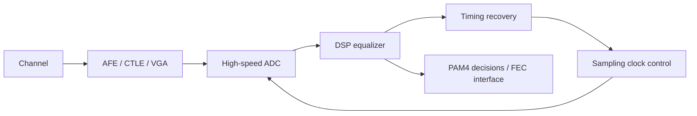
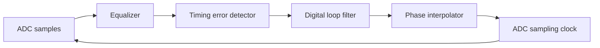

# PAM4 ADC-Based Receiver

## 中文补充翻译

这篇笔记说明为什么 PAM4 receiver 会使用 ADC-based 架构。PAM4 有四个电平和三个眼图，vertical margin 比 NRZ 小得多；在高速 lossy channel 下，单纯依赖模拟 slicer 和固定 equalization 会很困难。ADC-based RX 先采样波形，再用 DSP 做 FFE/DFE、timing recovery support、threshold adaptation、calibration 和 soft decision。

这种架构的优势是数字域可编程、可校准、适合复杂 equalization，也更容易处理 channel variation 和 PAM4 多电平信息。代价是 ADC 需要足够高的 sampling rate、resolution、ENOB 和低 aperture jitter；time-interleaved ADC 还会带来 offset/gain/skew/bandwidth mismatch 和校准负担。

对 PCIe 7.0 / SerDes，ADC-based RX 的关键不是“ADC 越强越好”，而是 ADC、PLL/CDR、clock distribution、LDO supply、AFE、CTLE、DSP equalizer 和 link-level BER 必须一起预算。采样 timing error 会直接变成电压误差，DSP 无法完全修复采样前已经损坏的信息。

## Purpose

This note explains PAM4 ADC-based SerDes receivers and connects the architecture to PLL jitter, CDR timing, time-interleaved ADC calibration, LDO noise, and PCIe 7.0-class verification. It is written for analog / mixed-signal interview preparation and early technical onboarding.

Related notes: [[pcie7_clocking_notes]], [[pll_phase_noise_jitter]], [[cdr_jitter_tolerance]], [[ti_sar_mismatch_calibration]], [[adc_based_receiver]], [[sampling_jitter_adc]], [[pam4_receiver_basics]], [[ctle_ffe_dfe_notes]], [[serdes_power_integrity]].

## Why ADC-Based Receivers Exist

Traditional high-speed receivers often use analog equalization and slicers. An ADC-based receiver samples the incoming waveform with sufficient resolution, then performs equalization, timing recovery, adaptation, and decisions in digital logic or DSP.

The benefit is flexibility: digital equalization can be powerful, programmable, and calibratable. The cost is ADC power, sampling-clock quality, calibration complexity, latency, and high-speed digital integration.

## PAM4 Basics

PAM4 uses four voltage levels to carry two bits per symbol. With evenly spaced levels, the normalized values are often represented as:

$$
\{-3,-1,+1,+3\}
$$

There are three decision thresholds:

$$
\{-2,0,+2\}
$$

Compared with NRZ, PAM4 has roughly one-third the vertical spacing for the same full-scale swing:

| Feature | NRZ | PAM4 |
|---|---|---|
| levels | 2 | 4 |
| bits per symbol | 1 | 2 |
| eyes | 1 | 3 |
| vertical spacing | large | smaller |
| equalization burden | lower | higher |
| sensitivity to ADC linearity | lower | higher |

This is why ADC noise, reference error, clock jitter, and calibration accuracy matter so much.

## Receiver Signal Chain

### Analog Front End

The AFE may include termination, ESD, CTLE, VGA, linearity correction, and common-mode control. It must preserve signal integrity while presenting a driveable input to the ADC. Excessive CTLE peaking can improve high-frequency content but increase noise.

### ADC

The ADC converts the waveform to digital samples. For PCIe 7.0-class speeds, an ADC-based architecture may use time interleaving. Exact implementation is project-specific. TODO: verify whether a given Synopsys PCIe 7.0 RX uses slicers, ADCs, or a hybrid architecture.

### DSP Equalizer

Digital equalization can include FFE, DFE, MLSE-like techniques, adaptation loops, offset/gain correction, and threshold tracking. ADC samples give the DSP more information than hard slicer decisions.

### CDR

Timing recovery can be performed digitally using sampled data. The CDR adjusts the sampling phase through a PI, DCO, or sampling clock control loop. The timing detector must be robust to PAM4 levels and ISI.

## ADC Resolution and PAM4 Margin

For a full-scale range \(V_{FS}\), an \(N\)-bit ADC has ideal LSB:

$$
LSB=\frac{V_{FS}}{2^N}
$$

If PAM4 spans the ADC full scale, nominal adjacent level spacing is:

$$
\Delta V_{PAM4}=\frac{V_{FS}}{3}
$$

The number of LSBs per PAM4 level spacing is:

$$
\frac{\Delta V_{PAM4}}{LSB}=\frac{2^N}{3}
$$

### Worked Example: 6-Bit ADC

Assume:

$$
V_{FS}=600\ \text{mV},\quad N=6
$$

Then:

$$
LSB=\frac{600\ \text{mV}}{64}=9.375\ \text{mV}
$$

PAM4 adjacent level spacing:

$$
\Delta V_{PAM4}=\frac{600\ \text{mV}}{3}=200\ \text{mV}
$$

LSBs per level spacing:

$$
\frac{200}{9.375}=21.3
$$

This looks comfortable for ideal quantization, but real margin must include thermal noise, ISI, ADC nonlinearity, reference noise, offset, gain error, clock jitter, and equalizer residual error.

## Sampling Jitter Creates Voltage Error

The most important clocking equation for ADC-based receivers is:

$$
\Delta V \approx \frac{dV}{dt}\Delta t
$$

For a sinusoidal component:

$$
SNR_{jitter}\approx -20\log_{10}(2\pi f_{in}\sigma_t)
$$

### Worked Example: Jitter-Limited SNR

Assume:

| Parameter | Value |
|---|---:|
| Input frequency | 16 GHz |
| RMS aperture jitter | 100 fs |

Then:

$$
SNR_{jitter}=-20\log_{10}(2\pi\cdot16\times10^9\cdot100\times10^{-15})
$$

$$
SNR_{jitter}=40.0\ \text{dB}
$$

If jitter worsens to 200 fs:

$$
SNR_{jitter}=34.0\ \text{dB}
$$

Doubling jitter costs about 6 dB of jitter-limited SNR.

## ADC-Based vs Slicer-Based RX

| Topic | Slicer-based RX | ADC-based RX |
|---|---|---|
| Main decision element | comparators / slicers | ADC plus DSP decisions |
| Equalization | more analog / mixed-signal | more digital |
| Observability | limited hard decisions | richer sampled waveform |
| Power | often lower | often higher |
| Calibration | thresholds, offsets, DFE taps | ADC mismatch, DSP, timing, thresholds |
| CDR | often bang-bang or mixed-signal | can be DSP-assisted |
| Flexibility | less programmable | more programmable |
| Main risk | analog margin and slicer offsets | ADC power, jitter, calibration, latency |

Neither architecture is universally better. The right choice depends on data rate, channel loss, process, power, latency, protocol, and design team expertise.

## Time-Interleaved ADC in the RX

If the ADC sample rate is too high for one slice, time interleaving is used:

$$
f_s=Mf_{slice}
$$

The receiver must then calibrate offset, gain, timing skew, and bandwidth mismatch. See [[ti_sar_mismatch_calibration]].

Time-interleaving errors can look like deterministic noise to the DSP. If uncorrected, they can degrade equalizer adaptation and cause symbol-dependent errors.

## CDR in an ADC-Based Receiver

An ADC-based CDR can use digital timing error detectors. A simplified loop is:

The timing detector may estimate whether samples are early or late by looking at symbol transitions, equalizer outputs, or decision-directed errors. PAM4 makes this more complex because transitions have different sizes and wrong symbol decisions can bias timing.

## Equalization

ADC samples enable digital equalization:

$$
y[n]=\sum_{k=0}^{K-1}c_kx[n-k]
$$

For DFE:

$$
z[n]=y[n]-\sum_{i=1}^{L}b_i\hat{a}[n-i]
$$

where \(\hat{a}[n-i]\) are previous symbol decisions.

DFE is powerful but decision-directed. If timing is poor or PAM4 thresholds are wrong, bad decisions feed back into the equalizer and can cause error propagation.

## Noise and Error Budget

ADC-based receiver margin is consumed by many contributors:

| Contributor          | Domain          | Impact                                 |
| -------------------- | --------------- | -------------------------------------- |
| channel loss         | analog          | ISI and reduced high-frequency content |
| thermal noise        | analog          | vertical noise                         |
| ADC quantization     | converter       | quantization noise                     |
| ADC INL/DNL          | converter       | distortion and threshold error         |
| TI mismatch          | converter/clock | spurs and deterministic errors         |
| aperture jitter      | clock           | voltage error proportional to slope    |
| PLL phase noise      | clock           | sampling uncertainty                   |
| CDR phase error      | clock/control   | residual timing error                  |
| reference noise      | ADC/LDO         | gain and threshold variation           |
| DSP adaptation error | digital         | residual ISI or wrong thresholds       |

The receiver does not care which team owns the impairment. It sees total margin loss.

## Design Implications

### PLL

PLL jitter directly affects ADC aperture uncertainty. Integrated jitter should be evaluated at the ADC sampling clock, not only the PLL output. Spur frequencies can create deterministic sampling errors.

### CDR

CDR timing controls ADC sampling phase. CDR loop bandwidth, phase detector gain, PI resolution, and equalizer latency all affect final timing. Timing recovery must be verified with realistic PAM4 channels and ADC nonidealities.

### SerDes RX

ADC-based RX design is a system optimization across AFE linearity, ADC resolution, sampling clock quality, equalization, calibration, and power. Improving ADC ENOB alone may not improve BER if timing jitter or CDR bias dominates.

### SerDes TX

TX jitter and transmitter nonlinearity create stress for the far-end ADC receiver. TX FFE settings influence the waveform slope, which changes jitter-to-voltage conversion at the receiver.

### ADC

ADC resolution, bandwidth, aperture jitter, interleaving mismatch, reference noise, comparator kickback, and calibration all affect link margin. ADC metrics should be translated to PAM4 eye and BER impact.

### LDO and Power Integrity

LDO noise affects ADC references, sampling switch timing, comparator delay, clock buffers, and PLL/PI jitter. Supply noise can appear as vertical noise, timing jitter, gain modulation, or spur tones.

### Verification

Verification should combine transistor-level blocks, extracted clock paths, behavioral ADC/DSP models, channel models, jitter injection, supply injection, calibration loops, and link-level BER or margin metrics.

## Common Mistakes

1. Treating ADC ENOB as the only receiver metric.
2. Ignoring aperture jitter at high input frequency.
3. Simulating CDR with ideal ADC samples.
4. Calibrating TI-ADC mismatch with sine waves only and assuming PAM4 traffic is fixed.
5. Ignoring reference and LDO noise in ADC threshold stability.
6. Assuming DSP can correct all analog impairments.
7. Forgetting latency in digital CDR and adaptation loops.
8. Evaluating equalization without realistic clock jitter and ADC nonlinearity.

## Interview Q&A

### Why use an ADC-based PAM4 receiver?

It provides digital observability and flexible equalization for lossy high-speed channels. ADC samples allow DSP-based FFE/DFE, adaptation, and timing recovery, but the architecture costs power and requires careful ADC and clock calibration.

### Why is clock jitter so important for ADC-based RX?

Sampling jitter creates voltage error proportional to waveform slope. At high frequencies, even femtosecond-level jitter can become meaningful voltage noise and reduce PAM4 margin.

### How does ADC resolution relate to PAM4?

PAM4 has three level spacings across full scale. An \(N\)-bit ADC ideally gives \(2^N/3\) codes per PAM4 spacing, but real margin is reduced by noise, ISI, nonlinearity, jitter, and calibration errors.

### What are the main ADC calibration issues?

For time-interleaved ADCs, the main issues are offset mismatch, gain mismatch, timing skew, and bandwidth mismatch. SAR slices also have CDAC mismatch, comparator offset, and reference settling error.

### How does CDR work in an ADC-based receiver?

The receiver estimates timing error from sampled and often equalized data, filters the timing error, and adjusts a PI or sampling clock. The timing detector must handle PAM4 levels, ISI, noise, and decision errors.

### What would you verify before trusting an ADC-based RX model?

I would verify ADC nonidealities, jitter injection, CDR loop dynamics, equalizer adaptation, TI calibration convergence, supply/reference noise sensitivity, stressed-channel performance, and correlation between block metrics and link margin.
