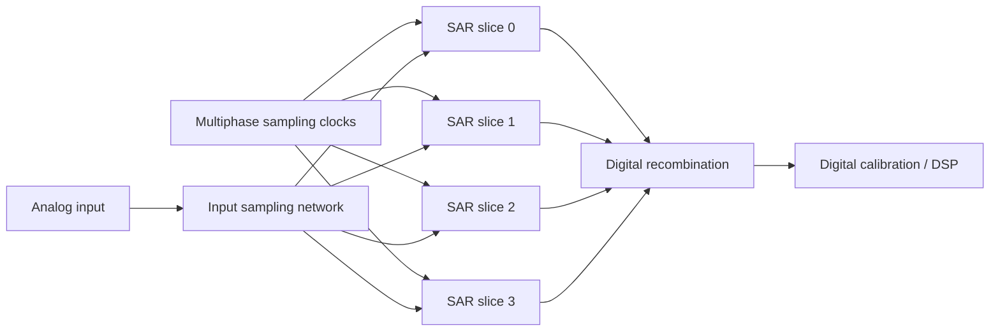
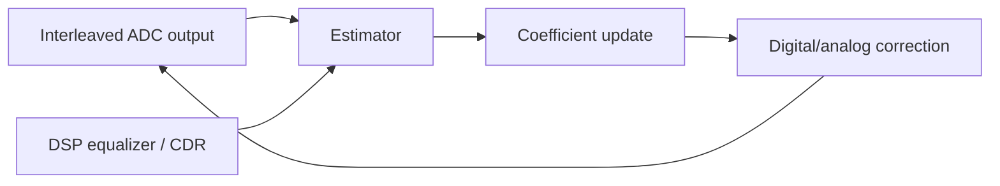

# TI-SAR Mismatch Calibration

## 中文补充翻译

这篇笔记更系统地整理 TI-SAR ADC mismatch calibration。time-interleaving 通过多个 SAR ADC 并行轮流采样来提高总采样率，但会引入通道间不一致。主要 mismatch 包括 offset、gain、timing skew 和 bandwidth mismatch，其中 timing skew 在高频 SerDes 输入下尤其敏感。

数学上，通道 mismatch 会表现为周期性误差，因此常常产生 spur。offset mismatch 主要表现为固定偏移 spur；gain mismatch 让不同通道的幅度比例不同；timing skew 近似产生 `dV/dt * delta_t` 的电压误差；bandwidth mismatch 则让通道响应随频率不同而变化。

校准方法分为 foreground 和 background。foreground 简单、可控，但需要训练或停机；background 可以持续追踪 PVT 和 aging，但容易和真实数据、equalization、CDR adaptation 相互耦合。对 PAM4 ADC-based RX，校准目标最终应映射到 eye margin、BER、spur、SNDR 和 link robustness。

## Purpose

This note explains mismatch and calibration in time-interleaved SAR ADCs for high-speed SerDes receivers. It is aimed at someone preparing for ADC / SerDes / PCIe 7.0 mixed-signal work where ADC sampling, clocking, LDO noise, and DSP calibration all interact.

Related notes: [[adc_based_receiver]], [[sampling_jitter_adc]], [[pam4_adc_based_rx]], [[pam4_receiver_basics]], [[ctle_ffe_dfe_notes]], [[pll_phase_noise_jitter]], [[cdr_jitter_tolerance]], [[serdes_power_integrity]], [[ti_adc_calibration_moc]].

> **Note (2026-07-04):** This is the single canonical note for time-interleaved SAR ADC mismatch and calibration. The former `ADC/ti_sar_adc_calibration.md` was merged here so that `ADC/` holds only non-TI-SAR ADC material. Its unique practical content (spur signatures, calibration-method taxonomy, skew-vs-bandwidth debug, Synopsys framing) is preserved in the "Merged Practical Notes" section below.

## Why Time-Interleave SAR ADCs?

A single SAR ADC is energy efficient and digitally friendly, but its conversion speed is limited by sampling, DAC settling, comparator decisions, and logic timing. To reach very high effective sample rates, multiple SAR slices can sample in a staggered sequence.



For \(M\) interleaved slices, each slice samples at:

$$
f_{slice}=\frac{f_s}{M}
$$

but the recombined output has sample rate \(f_s\). The cost is that the converter now behaves like \(M\) slightly different ADCs stitched together.

## The Four Main Mismatch Types

| Mismatch | Error model | Main symptom | Typical correction |
|---|---|---|---|
| Offset mismatch | slice-dependent DC shift | spur near \(k f_s/M\) | subtract per-slice offset |
| Gain mismatch | slice-dependent scale factor | amplitude modulation spurs | per-slice digital gain |
| Timing skew | slice samples early/late | slope-dependent error, high-frequency spurs | phase adjust or derivative-based correction |
| Bandwidth mismatch | slice-dependent frequency response | frequency-dependent distortion | FIR / equalization / analog matching |

In a PAM4 receiver, these errors reduce vertical margin, distort equalizer inputs, and can create deterministic symbol errors.

## Mathematical Error Model

For slice \(m\), a simplified sampled output is:

$$
y_m[n] = (1+g_m)x(t_n+\tau_m)+o_m+q_m[n]
$$

where:

| Term | Meaning |
|---|---|
| \(g_m\) | gain error of slice \(m\) |
| \(o_m\) | offset error |
| \(\tau_m\) | timing skew |
| \(q_m[n]\) | quantization and thermal noise |

For small timing skew:

$$
x(t_n+\tau_m) \approx x(t_n)+\tau_m\frac{dx}{dt}
$$

So:

$$
y_m[n] \approx x(t_n)+g_mx(t_n)+o_m+\tau_m\frac{dx}{dt}+q_m[n]
$$

This equation explains why timing skew is often the most painful mismatch at high input frequency. Its error grows with signal slope.

## Offset Mismatch

Offset mismatch means each slice has a different zero-input output code. In an \(M\)-way interleaved ADC, offset mismatch creates a periodic sequence with period \(M\), which produces tones at multiples of:

$$
\frac{f_s}{M}
$$

### Worked Example: Offset Spur Location

For an 8-way interleaved ADC with:

$$
f_s=64\ \text{GS/s},\quad M=8
$$

the fundamental interleaving spur spacing is:

$$
\frac{f_s}{M}=8\ \text{GHz}
$$

Offset mismatch can create spurs at 8 GHz, 16 GHz, 24 GHz, and so on, folded by Nyquist zones. In a receiver, these spurs can corrupt ADC samples and interact with DSP adaptation.

## Gain Mismatch

Gain mismatch means the same input voltage produces different code amplitudes in different slices:

$$
y_m[n]=(1+g_m)x[n]
$$

Gain mismatch acts like periodic amplitude modulation. For a sinusoidal input at \(f_{in}\), mismatch produces images around:

$$
k\frac{f_s}{M}\pm f_{in}
$$

### Worked Example: Gain Error Size

Assume slice 3 has a gain error of 1 percent and the input full-scale differential amplitude is 800 mVpp. A rough peak amplitude error near full scale is:

$$
\Delta V = 0.01\cdot400\ \text{mV}=4\ \text{mV}
$$

For PAM4 with three eyes across 800 mVpp, the nominal level spacing is approximately:

$$
\Delta V_{PAM4}\approx\frac{800\ \text{mV}}{3}=267\ \text{mV}
$$

The gain error is:

$$
\frac{4}{267}=1.5\%
$$

This may be tolerable alone, but it combines with thermal noise, ISI, reference noise, timing skew, and equalizer residual error.

## Timing Skew

Timing skew means a slice samples at the wrong time:

$$
\Delta V \approx \frac{dV}{dt}\Delta t
$$

For a sinusoid:

$$
x(t)=A\sin(2\pi f_{in}t)
$$

The maximum slope is:

$$
\left|\frac{dx}{dt}\right|_{max}=2\pi f_{in}A
$$

So the worst-case voltage error is:

$$
\Delta V_{max}=2\pi f_{in}A\Delta t
$$

### Worked Example: 100 fs Timing Skew

Assume:

| Parameter | Value |
|---|---:|
| Input frequency | 16 GHz |
| Input peak amplitude | 200 mV |
| Timing skew | 100 fs |

Then:

$$
\Delta V_{max}=2\pi\cdot16\times10^9\cdot0.2\cdot100\times10^{-15}
$$

$$
\Delta V_{max}=2.01\ \text{mV}
$$

This is only one mismatch source. At higher slopes, larger amplitudes, or worse skew, the error quickly becomes significant. Timing skew also changes sign with slope, making it signal-dependent rather than a simple DC correction.

## Bandwidth Mismatch

Bandwidth mismatch means each slice has a different transfer function:

$$
Y_m(f)=H_m(f)X(f)
$$

If \(H_m(f)\) differs across slices, a single gain correction cannot fix the problem over frequency. Causes include sampling switch resistance, input capacitance, routing parasitics, bootstrapped switch variation, package asymmetry, and local clock path differences.

Bandwidth mismatch is especially relevant in ADC-based SerDes because the input spectrum is wide and shaped by channel loss, CTLE, package, and equalization.

## SAR-Specific Mismatch

Time interleaving creates slice-to-slice mismatch, but each SAR slice also has internal mismatch:

| SAR nonideality | Effect |
|---|---|
| CDAC capacitor mismatch | INL/DNL, harmonic distortion |
| comparator offset | decision threshold shift |
| reference settling error | code-dependent conversion error |
| switch charge injection | sampling distortion |
| kickback | input-dependent disturbance |
| asynchronous logic variation | timing variation |

Calibration may need to correct both per-slice interleaving mismatch and intra-slice SAR linearity.

## Foreground vs Background Calibration

| Calibration type | When it runs | Strength | Weakness |
|---|---|---|---|
| Foreground | startup, test mode, idle | known stimulus, easier estimation | cannot track drift during traffic |
| Background | during normal operation | tracks PVT and aging | can interact with data, CDR, equalization |
| Hybrid | foreground seed plus background tracking | practical for high-speed links | more control complexity |

For SerDes, background calibration is attractive because temperature and supply can drift during operation. But the adaptation must not corrupt link data or fight other loops.

## Calibration Techniques

### Offset Calibration

Estimate each slice average:

$$
\hat{o}_m = E[y_m] - E[y]
$$

Then subtract:

$$
y_{corr,m}=y_m-\hat{o}_m
$$

For random data, the estimator must avoid confusing data imbalance with ADC offset.

### Gain Calibration

Estimate slice energy:

$$
\hat{P}_m=E[(y_m-\hat{o}_m)^2]
$$

Then scale:

$$
y_{corr,m}=\alpha_m(y_m-\hat{o}_m)
$$

where:

$$
\alpha_m\approx\sqrt{\frac{P_{target}}{\hat{P}_m}}
$$

### Timing Skew Calibration

Timing skew can be estimated by correlating slice error with the input derivative:

$$
e_m[n]\approx \tau_m\frac{dx}{dt}
$$

A digital correction can use:

$$
y_{corr,m}[n]=y_m[n]-\hat{\tau}_m\widehat{\frac{dx}{dt}}
$$

In practice, derivative estimation is noisy and data-dependent. Analog phase adjustment is often preferred when available, with digital calibration steering delay controls.

### Bandwidth Calibration

Bandwidth mismatch may require slice-specific FIR correction:

$$
y_{corr,m}[n]=\sum_k h_m[k]y_m[n-k]
$$

This is more expensive but can correct frequency-dependent errors.

## Calibration Loop Stability

Background calibration is an adaptive loop. It has convergence rate, noise, and interaction risk.



If the update step is too large, coefficients can wander or inject adaptation noise. If too small, calibration cannot track drift. If the estimator is biased by equalizer errors or CDR phase error, calibration can converge to the wrong value.

## Design Implications

### PLL and Clocking

Sampling phase mismatch is clock mismatch. PLL phase noise, divider mismatch, PI nonlinearity, and clock buffer skew directly affect TI-ADC performance. Clock phase generation must be considered part of ADC design.

### CDR

The CDR controls where samples are taken. If time-interleaved slices have residual skew, the timing detector sees slice-dependent errors. This can create CDR limit cycles or biased phase estimates.

### SerDes RX

PAM4 receiver margin is sensitive to vertical error. Offset, gain, and bandwidth mismatch reduce level accuracy. Timing skew converts waveform slope to voltage error and can degrade equalizer training.

### ADC

ADC calibration must separate offset, gain, skew, bandwidth, CDAC mismatch, comparator offset, and reference settling. A calibration that fixes a sine-wave test may not fully fix real PAM4 traffic.

### LDO and References

Supply and reference noise affect comparator delay, CDAC settling, bootstrapped switches, input buffers, and reference ladders. LDO PSRR and decap influence both raw ADC error and calibration stability.

### Verification

Verification should include spur analysis, SNDR, ENOB, PAM4 symbol error impact, background convergence, PVT drift, supply injection, jitter injection, Monte Carlo mismatch, and interaction with CDR/equalizer adaptation.

## Common Mistakes

1. Treating timing skew like a static offset error.
2. Calibrating offset and gain while ignoring bandwidth mismatch.
3. Assuming a sine-wave SNDR improvement guarantees PAM4 link margin improvement.
4. Ignoring calibration interaction with CDR and DFE adaptation.
5. Estimating background calibration coefficients from biased data statistics.
6. Forgetting that reference noise can look like gain or threshold error.
7. Ignoring slice clock duty-cycle and phase-generator mismatch.
8. Reporting spur improvements without checking BER or eye margin.

## Interview Q&A

### Why use a time-interleaved SAR ADC in a SerDes receiver?

Time interleaving lets several moderate-speed SAR slices create a much higher effective sample rate. SAR slices are energy efficient, but mismatch between slices must be calibrated for high-speed PAM4 operation.

### What are the main mismatch sources?

The big four are offset mismatch, gain mismatch, timing skew, and bandwidth mismatch. SAR-specific CDAC mismatch, comparator offset, reference settling, and switch nonidealities also matter.

### Why is timing skew usually the hardest?

Timing skew creates an error proportional to input slope: \(\Delta V\approx(dV/dt)\Delta t\). At high input frequency or steep PAM4 transitions, tiny timing errors become meaningful voltage errors.

### How do foreground and background calibration differ?

Foreground calibration runs during startup or test with controlled conditions. Background calibration runs during normal operation and tracks drift, but it must avoid corrupting data or interacting badly with CDR and equalization.

### How does LDO noise affect TI-SAR calibration?

LDO noise and finite PSRR can disturb ADC references, comparator delay, sampling switches, clock buffers, and bias circuits. This can create apparent offset/gain/skew changes and add adaptation noise.

### How would you verify calibration?

I would check spectral spurs, SNDR, ENOB, PAM4 eye margin, BER impact, convergence time, coefficient stability, PVT drift tracking, supply noise sensitivity, and interaction with CDR/equalizer loops.

---

## Merged Practical Notes (from former ti_sar_adc_calibration, Batch 1/2)

中文：本节整合原 `ADC/ti_sar_adc_calibration.md` 中不重复的实用内容——spur 位置与失配"指纹"、校准方法清单、skew 与 bandwidth mismatch 的区分调试，以及 Synopsys 备战框架和待确认问题。前面的严格推导与本节的工程清单互补：前者告诉你"界在哪里"，后者告诉你"实际怎么测、怎么调、怎么排错"。

English: This section consolidates the non-duplicate practical material from the former `ADC/ti_sar_adc_calibration.md` — spur locations and mismatch "fingerprints," a calibration-method menu, skew-vs-bandwidth debug, and the Synopsys preparation framing with open questions. It complements the rigorous derivations above: those tell you *where the bounds are*, this tells you *how to measure, tune, and debug in practice*.

### Spur Locations and Mismatch Signatures

For an `M`-way interleaved array (`f_s` total sample rate, `f_in` input tone), mismatch produces images at:

$$
f_{spur} = \left| k\,\frac{f_s}{M} \pm f_{in} \right|,\quad k = 1 \ldots (M-1)
$$

中文：不同失配在频谱上有不同"指纹"，可用来定位问题来源。

English: Each mismatch type leaves a distinct spectral fingerprint useful for root-causing:

- **Offset mismatch:** spurs near `k·f_s/M` (independent of the input tone — a dead giveaway).
- **Gain mismatch:** spurs near `k·f_s/M ± f_in` (amplitude-modulation images).
- **Timing skew:** spurs near `k·f_s/M ± f_in`, with amplitude **increasing with `f_in`** (the frequency dependence distinguishes it from gain).
- **Bandwidth mismatch:** similar image locations, but the effective error is frequency-dependent in both magnitude and phase.

### Calibration Method Menu

中文：实际工程里可选的校准手段可以排成一个清单，从简单前台到复杂后台：

English: The practical calibration options form a menu, from simple foreground to complex background:

- **Foreground sine spur-minimization:** inject a known tone; tune per-slice delay/PI until the mismatch images are minimized.
- **Ramp / edge calibration:** use `e = S·Δt` when the input slope `S` is known.
- **Background derivative LMS:** estimate the per-slice timing error from the correlation of the slice error with the signal derivative and adapt:

$$
e_m \approx \Delta t_m\,x'(t),\qquad
\Delta t_m[n+1] = \Delta t_m[n] - \mu\,e_m[n]\,\hat{x}'[n]
$$

  where `μ` is the adaptation step (stability vs tracking-speed tradeoff) and `x̂'[n]` is the estimated input derivative.
- **Adjacent-channel / reference-channel correlation:** correlate neighboring sub-ADC outputs, or a dedicated reference ADC, to infer relative timing error. (The rigorous cross-correlation form of this is the book's algorithm in the Deep Ingest section below.)
- **Digital correction:** Taylor correction `y_corr = y_m − Δt̂·x̂'`, or fractional-delay / Farrow filters (power-limited at multi-GS/s).
- **Broadband joint reconstruction:** solve the periodically time-varying mixing problem instead of assuming one scalar skew per channel (needed when bandwidth mismatch is significant).

### Skew vs Bandwidth Mismatch Debug

中文：一个实用判据：如果"最佳拟合 skew"随输入频率变化，那么误差就不是纯粹的恒定 timing skew，很可能混入了通道相关的模拟带宽或相位失配。

English: A practical test: if the best-fit skew changes with input frequency, the error is not pure constant timing skew — it likely includes channel-dependent analog bandwidth or phase mismatch. Recommended calibration order:

```text
offset -> gain -> skew -> bandwidth/phase mismatch -> residual image cancellation
```

### Synopsys Preparation Framing and Open Questions

中文：备战要点：掌握四类失配、解释为什么 timing skew 在高频最致命、把校准与 PAM4 margin 联系起来、把时钟相位质量与 ADC 精度联系起来、把 LDO/reference 噪声与校准稳定性联系起来，并把实际内部校准架构标为未知。

English: Preparation focus: know the four mismatch categories; explain why timing skew is most damaging at high frequency; connect calibration to PAM4 margin; connect clock-phase quality to ADC accuracy; connect LDO/reference noise to calibration stability; and mark the actual internal calibration architecture as unknown. Prior discussion included 4-way, 8-way, and 16-way TI-SAR examples; treat exact project details and any Synopsys usage as `待确认`.

Open tracking questions (`待确认`):

- Does the relevant Synopsys receiver use a time-interleaved ADC? If so, is it SAR, flash, pipeline, or hybrid, and how many slices?
- Which mismatch sources dominate, and which corrections are foreground vs background?
- How is timing skew detected, and how is calibration stability verified?
- How does calibration interact with equalization and CDR?
- What supply and reference noise limits are needed for calibration accuracy?

### Additional Source Provenance (merged)

- `../../00_Inbox/raw_chat_exports/chatgpt_export_2026-07-01/md_by_conversation/2026-05-24__高速TI-ADC时钟偏移.md`
- `../../00_Inbox/raw_chat_exports/chatgpt_export_2026-07-01/md_by_conversation/2026-05-04__总结A_224Gbs_Transceiver.md`
- `../../00_Inbox/manual_batches/batch2_serdes_pcie_pll_cdr_adc_2026-07-01/source_packet.md`
- Legacy conversation-inventory rows that previously routed to `ADC/ti_sar_adc_calibration.md` now conceptually map to this note; those inventory files are left unchanged per the inbox-lane rule.

---

## Deep Ingest 2026-07-04: Closed-Form Mismatch Bounds and Background Timing-Skew Calibration

Source: El-Chammas, M. and Murmann, B., *Background Calibration of Time-Interleaved Data Converters*, Springer, Analog Circuits and Signal Processing series, 2012 (ISBN 978-1-4614-1510-7). See [[core_serdes_papers]] for the full citation and reading status. This section promotes the book's rigorous error-analysis framework (Ch. 2) and its statistics-based background timing-skew calibration algorithm (Ch. 3), which the earlier Batch 1 material only referenced qualitatively as "adjacent-channel correlation."

### The Best-Fit Error Model

中文：本书用一个更严谨的方法量化 mismatch。它把 `M`-way（书中记为 `N`-way）TI-ADC 输出 `y[n]` 拆成两部分：一个是原始输入的"最佳拟合"版本 `x_o[n] = Ĝ · x(nT_s − τ̂)`，即一个只被整体缩放和整体平移的干净信号；另一个是误差 `e[n]`。`Ĝ` 和 `τ̂` 通过最大化输出 SNR（等价于最小化均方误差）求得，使 `x_o` 与 `e` 正交。关键洞见是：只有各通道之间的 gain/offset/skew *差异* 才产生失真，均匀的整体 gain 或 skew 只是无害的缩放和延迟。

English: The book quantifies mismatch rigorously by splitting the `M`-way (book notation `N`-way) TI-ADC output `y[n]` into a "best-fit" replica of the input, `x_o[n] = Ĝ · x(nT_s − τ̂)` — a cleanly scaled-and-shifted copy — plus an error `e[n]`. The best-fit gain `Ĝ` and skew `τ̂` are found by maximizing output SNR (equivalently minimizing mean-square error), which makes `x_o` and `e` orthogonal. The key insight is that only the *differences* among channel gains/offsets/skews create distortion; a uniform overall gain or skew is a harmless scale and delay. This subsumes the narrower sine-input analysis.

For an ADC of resolution `B` bits, the quantization-noise SNR used as the reference is:

$$
\mathrm{SNR}_Q = \frac{3}{2}\cdot 2^{2B}
$$

where `B` is the number of bits. The array is "quantization-noise limited" when the mismatch SNR exceeds `SNR_Q`, and "mismatch limited" otherwise. Setting the mismatch-induced SNR equal to `SNR_Q` gives the tolerable per-parameter variance bounds below.

### Closed-Form Mismatch Variance Bounds

中文：把 mismatch 造成的 SNR 降到与量化噪声相当，可以得到每种失配的方差上界。假设各通道误差是独立同分布随机变量，均值为零：offset 的界与输入信号功率 `P` 成正比（信号越大越能容忍固定偏移）；gain 的界与信号功率无关，只取决于相对增益误差；timing skew 的界取决于输入信号自相关在零点的曲率 `R''(0)`，也就是信号"变化有多快"。

English: Forcing the mismatch-induced SNR down to the quantization floor yields a tolerable variance for each error type, assuming the per-channel errors are zero-mean IID random variables. Offset scales with signal power `P` (a larger signal tolerates larger fixed offsets); gain is independent of signal power; timing skew depends on the curvature `R''(0)` of the input autocorrelation at zero lag — i.e. how "fast" the signal moves.

$$
\sigma_o^2 \;\le\; \frac{N}{N-1}\cdot\frac{2}{3}\cdot\frac{P}{2^{2B}}
\qquad\text{(offset)}
$$

$$
\sigma_G^2 \;\le\; \frac{N}{N-1}\cdot\frac{2}{3}\cdot\frac{1}{2^{2B}}
\qquad\text{(gain, dimensionless relative error)}
$$

$$
\sigma_\tau^2 \;\le\; \frac{N}{N-1}\cdot\frac{2}{3}\cdot\frac{1}{2^{2B}\,\lvert R''(0)\rvert}
\qquad\text{(timing skew)}
$$

where:

- `N` is the interleaving factor (number of sub-ADCs).
- `B` is the ADC resolution in bits.
- `P` is the input signal power in V², with autocorrelation `R(τ)` and `R(0)=P`.
- `σ_o` is RMS offset in volts, `σ_G` is RMS relative gain error (unitless), `σ_τ` is RMS timing skew in seconds.
- `R''(0)` is the second derivative (curvature) of the autocorrelation at zero lag, in V²/s²; for a sine of frequency `f_in`, `R''(0) = -(2π f_in)²`.

These bounds assume small mismatch, zero-mean IID errors, a differentiable autocorrelation, and large `SNR_Q`. They do **not** capture bandwidth mismatch (frequency-dependent `H_m(f)`) or intra-slice SAR nonlinearity, which need the separate treatments already in this note.

#### Worked Example — Offset Bound (verified)

For `P = 0.5` V², `B = 10`, `N = 2`:

$$
\sigma_o \le \sqrt{\frac{2}{1}\cdot\frac{2}{3}\cdot\frac{0.5}{2^{20}}} \approx 8.0\times10^{-4}\ \text{V} = 0.8\ \text{mV}
$$

which matches the book. This says a 10-bit, 2-way array with a 0.5 V² input can tolerate about 0.8 mV RMS of per-slice offset before offset mismatch limits SNR below the quantization floor.

#### Worked Example — Timing-Skew Bound (sine input)

For a sine input, `|R''(0)| = (2π f_in)²`, so:

$$
\sigma_\tau \le \sqrt{\frac{N}{N-1}\cdot\frac{2}{3\cdot 2^{2B}}}\cdot\frac{1}{2\pi f_{in}}
$$

For `B = 5`, `N = 2`, `f_in = 8` GHz: `σ_τ ≤ 0.72` ps. This is the origin of the book's headline conclusion that for input frequencies above about 4 GHz, **sub-picosecond** timing skew is required to preserve even 5-bit resolution — a regime that is not achievable by layout matching alone and therefore motivates active calibration.

中文：gain 的界（`N=2, B=10`）按上式约为 `0.08%–0.11%` 量级（含 `N/(N-1)` 因子时约 0.11%）。书中该处示例给出的数值待与原始一手文献核对，因为它与量化参考 `SNR_Q=(3/2)2^{2B}` 推出的量级不完全一致；此处以公式和自洽推导为准。

English: The gain bound for `N=2, B=10` evaluates to roughly `0.08%–0.11%` RMS (about 0.11% with the `N/(N-1)` factor). The book's printed numeric example at that point should be re-checked against the primary text, because it does not fully reconcile with the value implied by the quantization reference `SNR_Q=(3/2)2^{2B}`; treat the closed-form and the self-consistent derivation as authoritative and flag the printed figure as `待确认`.

### Signal Statistics Matter: The Sine-Wave Over-Constraint

中文：因为 skew 的界依赖 `R''(0)`，而 `R''(0)` 由输入频谱决定，所以用单频正弦去估计允许 skew 会过于保守。对带宽受限到 `f_c` 的白噪声（理想低通），用正弦分析会把允许的 skew 方差收紧 3 倍；对二阶低通信道，收紧倍数是 `1/α`（其中 `f_3dB = α·f̂`）。工程含义：真实 SerDes 波形（受 channel、CTLE 整形）的允许 skew 通常比"最坏正弦"估计更宽，前提是知道输入统计。

English: Because the skew bound depends on `R''(0)`, which is set by the input spectrum, estimating tolerable skew with a single sine tone is pessimistic. For white noise band-limited to `f_c` (ideal low-pass, `R(τ)=\mathrm{sinc}(2f_c τ)`), sine analysis over-constrains the tolerable skew variance by a factor of 3; for a second-order low-pass channel the factor is `1/α` where `f_3dB = α·f̂`. Engineering implication: a real, channel-and-CTLE-shaped SerDes waveform usually tolerates more skew than the worst-case sine estimate — provided the input statistics are known.

### Ways to Deal With Timing Skew

中文：本书总结了三条路线。(1) 前端单一 track-and-hold：把整个阵列前面放一个采样率等于总速率的 T/H，使各子 ADC 采到的是已经保持住的常数电压，从而对子 ADC 采样时刻的 skew 不敏感——但在多 GS/s 下 T/H 本身难做。(2) 纯数字校正：用 fractional-delay（分数延迟）滤波器在数字域插值补偿 skew——但在多 GS/s 串行链路里所需 tap 数和功耗过高，通常不可行。(3) 混合信号校正：数字后端检测 skew，反过来调节模拟延迟线——增大设计空间、功耗划分更高效，是本书采用的方案。

English: The book frames three routes. (1) A single front-end track-and-hold clocked at the full sample rate holds the input constant while each sub-ADC samples it, making the sub-ADC sampling instant insensitive to skew — but a multi-GS/s T/H is itself hard to build. (2) Purely digital correction interpolates with fractional-delay filters to undo skew — but the required tap count and power make it infeasible in multi-GS/s serial links. (3) Mixed-signal correction lets a digital backend detect skew and steer analog delay lines — enlarging the design space and partitioning power efficiently, which is the book's chosen approach.

### Background Timing-Skew Calibration by Cross-Correlation (Core Contribution)

中文：这是本书的核心算法。最大化 SNR 等价于让每个通道的 skew `τ_i → 0`，也等价于最大化输入自相关 `R(τ)`（它在 `τ=0` 取最大）。问题是：无法从子 ADC 输出直接算输入自相关。解决办法是引入一个额外的"校准 ADC"（使总数变成 `N+1` 个），用每个子 ADC 输出与校准 ADC 输出的*互相关*来代替输入自相关——这个互相关同样在 `τ_i=0` 处取最大。于是校准分两步：先估互相关，再用可变延迟线调节 `τ_i` 把互相关顶到最大。

English: This is the book's core algorithm. Maximizing SNR is equivalent to driving every channel skew `τ_i → 0`, which is equivalent to maximizing the input autocorrelation `R(τ)` (maximal at `τ=0`). The obstacle: the input autocorrelation cannot be computed directly from sub-ADC outputs. The fix is to add one extra **calibration ADC** (making `N+1` total) and replace the input autocorrelation with the **cross-correlation** between each sub-ADC output and the calibration-ADC output — which also peaks at `τ_i = 0`. Calibration then has two steps: estimate the cross-correlation, then adjust `τ_i` with a per-slice variable delay line to push that cross-correlation to its maximum.

The correlation is estimated by averaging the product of the two ADC outputs over `M` samples:

$$
\hat{R}(\tau) = \frac{1}{M}\sum_{n=1}^{M} y[n]\,y_c[n] = R(\tau) + E(M)
$$

where `y[n]` is the sub-ADC output (skewed by `τ`), `y_c[n]` is the calibration-ADC output, and `E(M)` is an estimation-noise term whose variance is inversely proportional to the number of averaged samples `M`. The calibration ADC does not contribute to the data output; it only feeds the correlation logic.

#### Simplification 1 — One-Bit Calibration ADC

中文：校准 ADC 不需要和子 ADC 有相同的转移函数；把它降到 1 bit（一个比较器）不会改变相关函数的形状，因为信号与其非线性函数的互相关只是 `R(τ)` 的缩放版本。若子 ADC 也取 1-bit 表示，则相关服从 Van Vleck 关系。代价是：粗量化让算法对 offset 更敏感——校准 ADC 的 offset 会在相关峰附近制造一段"平顶"，使最大值不唯一、无法收敛。因此要给校准 ADC 的 offset 定界。

English: The calibration ADC need not share the sub-ADC transfer function; reducing it to 1 bit (a single comparator) does not change the shape of the correlation, because the cross-correlation of a signal with a nonlinear function of that signal is just a scaled version of `R(τ)`. If the sub-ADC is also taken to 1-bit, the correlation follows the Van Vleck relationship:

$$
R_1(\tau) = \frac{2}{\pi}\,\sin^{-1}\!\big(R(\tau)\big)
$$

The cost is offset sensitivity: a calibration-ADC offset `v_o` flattens the correlation near its peak, destroying the unique maximum the loop needs. The offset must therefore be bounded so the flat region stays smaller than the skew bound:

$$
\sigma_{v_o} \lesssim 2\pi f_{in}\,\sigma_\tau \le \sqrt{\frac{N}{N-1}\cdot\frac{2}{3\cdot 2^{2B}}}
$$

Using more than one sub-ADC bit shrinks the flat region and relaxes this, so the 1-bit expression is a pessimistic upper bound; a calibration-ADC offset-correction step may still be needed.

#### Simplification 2 — Subsampled Calibration ADC Cycling Through All Slices

中文：校准 ADC 的采样率也可以降低（只要输入遍历性成立，慢时钟算出的相关与快时钟一致），从而省功耗。更重要的是：一个慢速的单比较器校准 ADC 可以*轮流*对准每个子 ADC 的理想采样点，用一套硬件校准全部通道。做法是让校准时钟频率取 `f_s/M`，且 `M` 与交织因子 `N` 互质（`gcd(M,N)=1`），这样校准边沿会依次落在所有子 ADC 的理想采样相位上。书中 8 通道原型用 `f_s/9` 或 `f_s/17` 的校准时钟。要点：校准时钟路径必须保持恒定，否则周期性路径变化会产生确定性 skew 谐波。

English: The calibration ADC can also run at a reduced sample rate — as long as the input is ergodic, a slow clock yields the same correlation as a fast one — saving power. More importantly, a single slow calibration comparator can be **time-shared** across all slices: give each sub-ADC a delay line and let one calibration ADC cycle its sampling edge through every sub-ADC's ideal sampling point. This works when the calibration clock runs at `f_s/M` with `gcd(M, N) = 1`, so the calibration edge visits all `N` ideal phases in turn. The book's 8-way prototype used `f_s/9` or `f_s/17` calibration clocks (generated externally, or on-chip by clock-gating the reference or by an integer/fractional PLL). Critical caveat: the calibration-clock path must stay constant; periodic path changes inject harmonics that appear as deterministic skew.

#### Convergence: Self-Normalizing With Input Frequency

中文：估计相关所需的样本数取决于信号"变化速度"。单看这一点，慢信号很吃亏——所需样本数随频率比的 4 次方增长（`f_2 = 0.5 f_1` 需要 16 倍样本）。但在 TI-ADC 语境里这个悲观结论被抵消了：因为允许 skew 的界本身正比于 `1/f_in`，慢信号允许更大的 skew 步长，两个频率依赖恰好相消。结果是——为达到*相同的 ADC 性能*，所需样本数与输入频率基本无关。这是该算法放宽输入带宽约束的关键原因。

English: The number of samples needed to estimate the correlation depends on how fast the signal moves. Taken alone this penalizes slow signals — the required sample count grows with the **fourth power** of the frequency ratio (`f_2 = 0.5 f_1` needs 16× the samples). But in the TI-ADC context this pessimism cancels: because the tolerable skew bound itself scales as `1/f_in`, a slower signal permits a proportionally larger skew step, and the two frequency dependencies cancel. The net result is that, to reach the *same ADC performance*, the required sample count is essentially independent of input frequency. This self-normalization is why the algorithm relaxes the input-bandwidth constraints that limit many earlier background-calibration schemes.

### Extracting Residual Skew and Jitter From Measured Spurs (Appendix E)

中文：给正弦输入，`N-1` 个 skew spur 的复幅度 `A[k]` 与各通道 skew 通过一个已知矩阵 `B(N)` 相关：`A = B·C`，其中 `C[i] = exp(-j2π τ_i f_in)`。因此可由伪逆求 `C = B⁻¹A`，再取 `τ_i = ln(C_i)/(-j2π f_in)`，得到残余 skew 的 RMS `σ_τ = sqrt(Σ τ_i²/N)`。把 skew 谱线去掉后，SNR 随频率的额外下降即归因于随机 jitter，从而把确定性 skew 与随机 jitter 分离。

English: For a sine input, the complex magnitudes `A[k]` of the `N-1` skew spurs relate to the per-channel skews through a known matrix `B(N)`: `A = B·C` with `C[i] = exp(-j2π τ_i f_in)`. So `C = B⁻¹A` (pseudo-inverse), then `τ_i = ln(C_i)/(-j2π f_in)`, giving the residual-skew RMS `σ_τ = sqrt(Σ τ_i²/N)`. After removing the skew spurs, any remaining SNR degradation that grows with input frequency is attributed to random jitter — cleanly separating deterministic skew from random jitter in measured data.

### Concrete Prototype Data Point

中文：书中原型是 65 nm CMOS 的 5-bit、12 GS/s 时间交织 flash ADC，用上述统计后台校准把采样时序对齐到亚皮秒（"约为光走 0.3 mm 的时间"），并用约 250 个辅助 offset 校准 DAC 做器件级 trim，得到当时高速链路中效率领先的转换器之一。

English: The book's prototype is a 5-bit, 12-GS/s time-interleaved flash ADC in 65 nm CMOS. The statistics-based background calibration aligned sampler timing to within a fraction of 1 ps ("the time light travels ~0.3 mm"), and about 250 auxiliary offset-trim DACs handled device-level offset, yielding one of the most energy-efficient high-speed-link converters published at the time.

### New Common Mistakes (from this source)

9. Estimating tolerable timing skew with a single sine tone when the real input is broadband — over-constrains the skew budget by up to 3× (ideal-LP) or `1/α` (2nd-order LP).
10. Assuming pure-digital fractional-delay skew correction is affordable at multi-GS/s serial-link rates; the tap count and power usually make mixed-signal (analog delay-line) correction the practical choice.
11. Forgetting that a 1-bit calibration ADC's offset creates a flat correlation peak and can stall convergence.
12. Letting the calibration-clock path vary; a non-constant cal path injects deterministic skew harmonics.

### Provenance and Verification Status

- Primary source: El-Chammas & Murmann, Springer 2012 (see [[core_serdes_papers]] for citation). Archived at `../../90_Archive/processed/2026/books/background_calibration_of_ti_data_converters/`.
- Formulas re-derived and dimensionally checked here; the offset worked example (0.8 mV) and the sub-ps skew conclusion were reproduced independently. The book's printed **gain-mismatch numeric example** did not reconcile with the quantization reference and is marked `待确认` pending primary-source recheck.
- Bandwidth-mismatch bounds, SAR intra-slice nonlinearity, and PAM4/BER mapping are outside this book's scope and remain covered by the earlier sections of this note and by [[pam4_adc_based_rx]].
