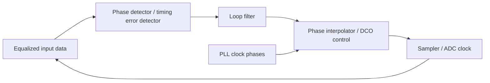
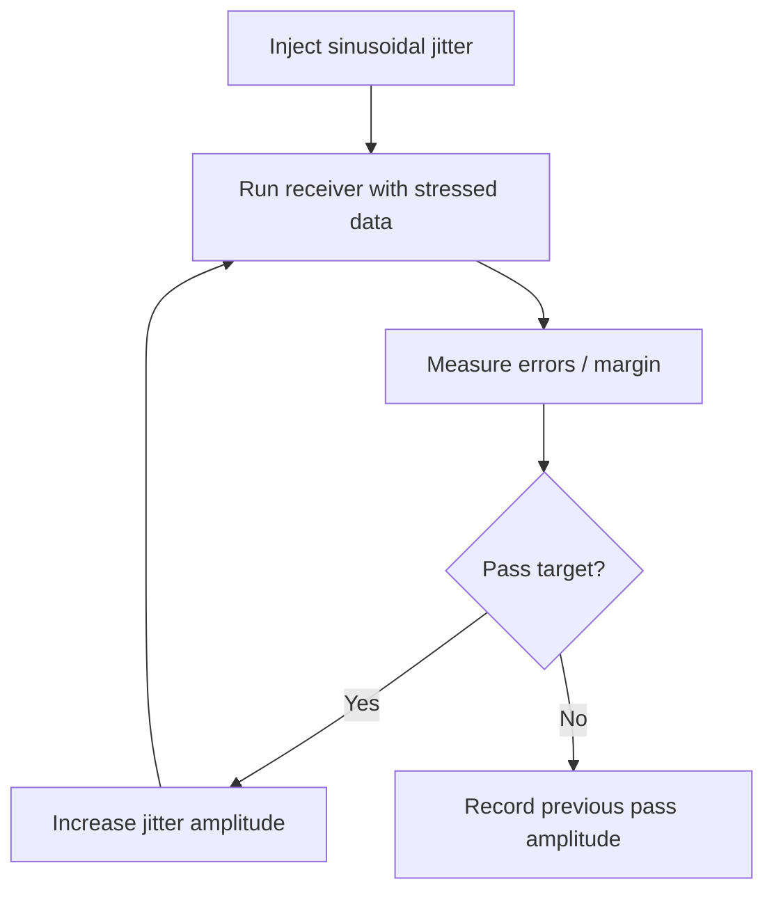
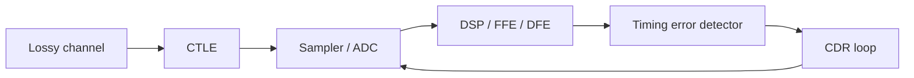

# CDR Jitter Tolerance

## 中文补充翻译

这篇笔记解释 CDR jitter tolerance：receiver 在维持目标 BER 的前提下，能承受多少输入 jitter。它通常是随 jitter frequency 变化的曲线，而不是一个单一数字。

CDR 会跟踪低频相位变化，但对高频 jitter 的跟踪能力有限。低频 jitter 如果在 CDR bandwidth 内，可能被 recovered clock 跟随；高频 jitter 往往变成 residual sampling error，直接消耗 eye margin。jitter transfer 描述输入 jitter 如何传到 recovered clock 或 output，jitter generation 描述 CDR 自己产生多少 jitter。

PAM4 下 jitter tolerance 更敏感，因为 vertical eye 小、threshold 多、ISI 和 equalization residue 会影响 phase detector。验证 CDR robust 时，应同时看 sinusoidal jitter tolerance、random jitter、periodic jitter、data-dependent jitter、equalizer setting、PI resolution、supply noise 和 link-level BER。

## Purpose

This note explains CDR jitter tolerance, jitter transfer, and jitter generation for high-speed SerDes receivers, with emphasis on PCIe 7.0-class PAM4 links. The goal is to connect CDR loop behavior to PLL noise, equalization, ADC sampling, jitter compliance, and practical verification.

Related notes: [[pcie7_clocking_notes]], [[pll_phase_noise_jitter]], [[cdr_fundamentals]], [[pam4_adc_based_rx]], [[ctle_ffe_dfe_notes]], [[sampling_jitter_adc]].

## What the CDR Actually Does

A clock and data recovery loop aligns the receiver sampling phase to the incoming data. In simple terms, the CDR observes timing information in the received waveform and adjusts a local sampling phase until the receiver samples near the desired point in the eye.

The CDR is not just a digital control loop. Its behavior depends on the phase detector, equalized waveform, transition density, slicer or ADC noise, PI resolution, loop latency, and the PLL clock feeding it.

## Three Core Jitter Metrics

| Metric | Question it answers | Typical use |
|---|---|---|
| Jitter transfer | How much input jitter appears on recovered clock/output? | loop bandwidth and tracking behavior |
| Jitter tolerance | How much input jitter can be tolerated before errors? | compliance and robustness |
| Jitter generation | How much jitter does the receiver/clocking create itself? | intrinsic clock quality |

These are related but not interchangeable. A CDR can have low jitter transfer but poor jitter tolerance if its sampler margin is small. It can have good tolerance but high jitter generation if its PI or local clock is noisy.

## CDR Tracking Model

A first-order CDR tracking model is:

$$
H_{track}(s)=\frac{\omega_c}{s+\omega_c}
$$

The residual phase error from input phase jitter is:

$$
H_{error}(s)=1-H_{track}(s)=\frac{s}{s+\omega_c}
$$

For sinusoidal input jitter at angular frequency \(\omega_j\):

$$
|H_{track}(j\omega_j)|=\frac{\omega_c}{\sqrt{\omega_j^2+\omega_c^2}}
$$

$$
|H_{error}(j\omega_j)|=\frac{\omega_j}{\sqrt{\omega_j^2+\omega_c^2}}
$$

Low-frequency jitter is tracked. High-frequency jitter is not tracked and becomes sampling phase error.

## Jitter Tolerance Curve

Jitter tolerance is usually measured by applying sinusoidal jitter of varying frequency and amplitude to the input data, then finding the maximum jitter amplitude the receiver can tolerate while meeting a target error criterion.

The tolerance curve is usually high at low jitter frequency because the CDR tracks slow movement. It rolls off near the CDR bandwidth and becomes limited by residual eye margin at high frequency.

## Intuitive Eye-Margin Model

Let available horizontal margin be \(M_t\), input sinusoidal jitter amplitude be \(J_{in}\), and residual error be:

$$
J_{err}(f)=|H_{error}(j2\pi f)|J_{in}
$$

A simplified pass condition is:

$$
J_{err}(f)+J_{internal}+J_{ISI}+J_{margin\ allowance}<M_t
$$

This is not a compliance equation. It is a mental model. It shows that jitter tolerance depends on CDR tracking, internal jitter, ISI, equalization, sampler noise, and eye opening.

## Worked Example: Residual Jitter vs CDR Bandwidth

Assume:

| Parameter | Value |
|---|---:|
| CDR bandwidth | 10 MHz |
| Input sinusoidal jitter frequency | 100 MHz |
| Input jitter amplitude | 0.10 UI peak |

Using the first-order residual transfer:

$$
|H_{error}|=\frac{100}{\sqrt{100^2+10^2}}=0.995
$$

Residual sampling jitter:

$$
J_{err}=0.995\cdot0.10\ UI=0.0995\ UI
$$

The CDR barely tracks this high-frequency jitter. Nearly all of it appears as sampling error.

Now use \(f_j=1\ \text{MHz}\):

$$
|H_{error}|=\frac{1}{\sqrt{1^2+10^2}}=0.0995
$$

$$
J_{err}=0.00995\ UI
$$

Slow jitter is mostly tracked, so residual sampling error is much smaller.

## Bandwidth Tradeoffs

| CDR bandwidth choice | Advantage | Risk |
|---|---|---|
| Wider bandwidth | tracks low/mid-frequency input jitter and SSC better, faster acquisition | transfers more input jitter, passes more detector noise, can interact with equalizer |
| Narrower bandwidth | rejects more input jitter, less noisy recovered clock | poorer wander/SSC tracking, slower acquisition, larger low-frequency phase error |
| High damping | less jitter peaking | slower response |
| Low damping | faster response | jitter peaking and instability |

The right bandwidth depends on protocol requirements, SSC, channel loss, transition density, phase detector type, latency, PI resolution, and PLL noise.

## CDR Phase Detector Types

| Phase detector | Basic idea | Strength | Risk |
|---|---|---|---|
| Alexander / bang-bang | early/late decisions around transitions | simple and robust | nonlinear gain, limit cycles, pattern dependence |
| Linear phase detector | proportional timing error estimate | easier loop modeling | needs amplitude information and linear region |
| Mueller-Muller | decision-directed timing from symbol samples | useful in baud-rate receivers | sensitive to wrong decisions and ISI |
| ADC/DSP timing detector | computes timing error digitally | flexible and calibratable | latency, power, algorithm complexity |

PAM4 complicates phase detection because there are multiple levels, unequal transition classes, and smaller vertical margin. Phase detector gain can depend on equalization, thresholds, and symbol distribution.

## PAM4-Specific Issues

PAM4 has three eyes and multiple transition amplitudes. A transition from level 0 to level 3 has a much larger slope than a transition from level 1 to level 2. Timing-error information can therefore be data-dependent.

| PAM4 issue | CDR impact |
|---|---|
| Smaller vertical eyes | more timing detector errors under noise |
| Unequal transition slopes | data-dependent phase detector gain |
| ISI after channel | timing bias and data-dependent jitter |
| FEC / FLIT traffic patterns | possible transition-density differences |
| Decision errors | can corrupt decision-directed timing recovery |

The CDR should be analyzed with realistic equalized data, not only an ideal two-level waveform.

## Equalization and CDR Coupling

Equalization changes the waveform used for timing recovery. Timing recovery changes the samples used for equalization. If the loops adapt at the same time, they can interact.

Important verification scenarios:

1. CDR acquisition before equalizer convergence.
2. Equalizer adaptation with CDR phase error.
3. CDR tolerance under worst-case channel and crosstalk.
4. Timing recovery with realistic PAM4 symbol statistics.
5. Background calibration interaction in ADC-based receivers.

## Jitter Generation

Jitter generation is the jitter created by the receiver clocking path even with a clean input. Sources include PLL jitter, PI quantization, PI thermal noise, loop filter noise, phase detector noise, supply-induced delay modulation, digital control limit cycles, and sampler aperture uncertainty.

If a PI has 64 steps per UI at PCIe 7.0:

$$
t_{LSB}=\frac{7.8125\ \text{ps}}{64}=122.1\ \text{fs}
$$

If the PI control toggles by one LSB in a limit cycle, that quantization can become visible as deterministic jitter unless shaped or averaged.

## Jitter Transfer

Jitter transfer describes how input jitter appears in the recovered clock or retimed output. A narrow CDR bandwidth gives low high-frequency transfer, while a wide CDR bandwidth passes more input phase modulation.

For retimers and repeaters, jitter transfer is system-level important because excessive transfer can pass upstream jitter downstream. For endpoint receivers, the more important quantity may be residual sampling error and BER.

## Worked Example: Tolerance From Eye Margin

Assume:

| Parameter | Value |
|---|---:|
| Available horizontal margin after setup/hold | 0.25 UI |
| Internal random-equivalent jitter allowance | 0.04 UI |
| ISI/DDJ allowance | 0.06 UI |
| Margin reserve | 0.03 UI |
| CDR residual transfer at stress frequency | 0.5 |

Remaining margin for residual sinusoidal jitter:

$$
M_{rem}=0.25-0.04-0.06-0.03=0.12\ UI
$$

Input jitter tolerance estimate:

$$
J_{in,max}=\frac{M_{rem}}{|H_{error}|}=\frac{0.12}{0.5}=0.24\ UI
$$

This is a design intuition calculation, not a spec limit. It shows why equalization and internal jitter reduce tolerance even if the CDR loop tracks well.

## Design Implications

### PLL

PLL jitter feeds the CDR through local clock phases. If high-frequency PLL jitter is outside the CDR correction path, it may directly become sampling jitter. PLL phase noise and CDR bandwidth should be reviewed together.

### CDR

The CDR must balance acquisition, tracking, jitter rejection, jitter generation, and stability. For PAM4, phase detector design must be robust to multiple levels, ISI, threshold offsets, and decision errors.

### SerDes RX

Receiver jitter tolerance depends on the actual equalized eye. CTLE, FFE, DFE, VGA, ADC resolution, slicer thresholds, and CDR timing all contribute. A receiver with good standalone CDR behavior can still fail under a stressed channel if timing detector gain collapses.

### SerDes TX

TX jitter affects the input stress seen by the far-end CDR. TX clock spurs, duty-cycle distortion, and data-dependent jitter can reduce the far-end receiver margin.

### ADC

In ADC-based receivers, timing error creates voltage error:

$$
\Delta V \approx \frac{dV}{dt}\Delta t
$$

The CDR therefore affects not only decision timing but also ADC sample accuracy and DSP equalizer input quality.

### Verification

CDR verification should include jitter tolerance sweeps, jitter transfer, jitter generation, stressed-eye tests, SSC tracking, frequency offset, acquisition, lock robustness, equalizer interaction, PVT, supply injection, and Monte Carlo mismatch.

## Common Mistakes

1. Confusing jitter tolerance with jitter transfer.
2. Assuming low jitter transfer automatically means good tolerance.
3. Ignoring phase detector gain variation with PAM4 level transitions.
4. Simulating CDR with ideal equalized data only.
5. Ignoring PI quantization and limit cycles.
6. Choosing CDR bandwidth without considering PLL phase noise.
7. Ignoring SSC and low-frequency wander.
8. Treating CDR as independent from CTLE / FFE / DFE adaptation.

## Interview Q&A

### What is CDR jitter tolerance?

It is the amount of input data jitter the receiver can tolerate while still meeting the target error criterion. It is frequency-dependent because the CDR tracks low-frequency jitter better than high-frequency jitter.

### What is the difference between jitter tolerance and jitter transfer?

Jitter tolerance asks how much input jitter the receiver can survive. Jitter transfer asks how much input jitter appears at the recovered clock or output. One is a robustness metric; the other is a loop transfer metric.

### Why does CDR bandwidth matter?

Bandwidth sets the boundary between tracked phase movement and residual sampling error. Wider bandwidth tracks more input movement but can pass more jitter and noise. Narrower bandwidth rejects more jitter but may fail low-frequency tracking or acquisition requirements.

### Why is PAM4 harder for CDR than NRZ?

PAM4 has smaller vertical margin and multiple transition sizes. Timing detector decisions are more vulnerable to noise, ISI, threshold error, and incorrect symbol decisions.

### How does equalization affect CDR?

Equalization changes the waveform slope and ISI seen by the timing detector. If equalization is poor, the CDR can see biased timing information. If CDR timing is poor, equalizer adaptation can converge incorrectly.

### How would you verify CDR robustness?

I would run jitter tolerance sweeps across frequency, jitter transfer, jitter generation, SSC tracking, acquisition under stressed channels, equalizer interaction, supply noise injection, PVT, and Monte Carlo. I would inspect both loop metrics and final BER / eye margin.
