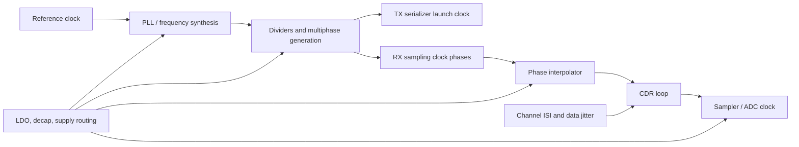
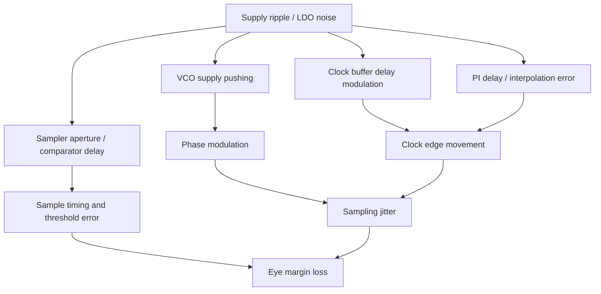

# PCIe 7.0 Clocking Notes

## Purpose

This note explains PCIe 7.0 clocking from the perspective of an analog / mixed-signal SerDes engineer preparing for PLL, CDR, LDO, ADC, and high-speed receiver work. The focus is not protocol minutiae. The focus is how the clock path determines the final timing margin at the transmitter launch point and receiver sampler.

Related notes: [[pll_phase_noise_jitter]], [[cdr_jitter_tolerance]], [[phase_noise_jitter]], [[pll_fundamentals]], [[cdr_fundamentals]], [[pam4_adc_based_rx]], [[ldo_psrr_notes]], [[serdes_power_integrity]], [[pcie7_overview]].

## Public PCIe 7.0 Facts

As of 2026-07-01, public PCI-SIG announcements state that the final PCIe 7.0 specification was released on 2025-06-11. Public headline targets include 128.0 GT/s transfer rate, PAM4 signaling, up to 512 GB/s bidirectional bandwidth for a x16 link, improved power efficiency, low latency, high reliability, and backward compatibility.

The exact electrical jitter masks, compliance methodology, receiver test assumptions, and implementation details are not reproduced here because those belong in the official member specification and company design documents.

TODO: verify exact PCIe 7.0 electrical jitter, reference clock, SSC, receiver tolerance, and compliance masks against the official PCI-SIG member specification.

## Clocking Is the SerDes Timing Spine

In a PCIe 7.0 PHY, the clocking chain includes more than a single PLL. It includes the reference clock input, PLL, dividers, phase generators, clock buffers, phase interpolators, TX launch clock, RX sampling clock, CDR loop, equalization interaction, supply network, and post-layout routing.

The practical clocking question is:

$$
\text{How much timing uncertainty reaches the final sampler or TX launch edge?}
$$

At PCIe 7.0 speed, a clean-looking PLL number is not enough. The relevant number is the residual timing error at the actual decision point after clock distribution, CDR tracking, phase interpolation, supply noise, and layout parasitics.

## Unit Interval and Why It Matters

The unit interval is the time represented by one transfer interval:

$$
UI = \frac{1}{R}
$$

For PCIe 7.0:

$$
R = 128 \times 10^9\ \text{transfers/s}
$$

$$
UI = \frac{1}{128 \times 10^9} = 7.8125\ \text{ps}
$$

This is the central timing fact. A picosecond is not small in a 7.8125 ps UI system. A 100 fs RMS jitter contributor is:

$$
\frac{100\ \text{fs}}{7.8125\ \text{ps}} = 0.0128\ UI
$$

That is 1.28 percent of a UI before including clock distribution, CDR error, channel jitter, supply-induced jitter, sampler aperture uncertainty, and equalization residuals.

### Worked Example: Timing Budget Consumption

Assume a simplified RMS timing budget at the receiver sampler:

| Contributor | RMS jitter |
|---|---:|
| PLL integrated jitter | 80 fs |
| Clock distribution | 60 fs |
| Phase interpolator noise | 50 fs |
| Supply-induced clock jitter | 70 fs |
| Sampler aperture uncertainty | 50 fs |

If these are independent random contributors, combine by root-sum-square:

$$
\sigma_t = \sqrt{80^2 + 60^2 + 50^2 + 70^2 + 50^2}\ \text{fs}
$$

$$
\sigma_t = 140\ \text{fs}
$$

Normalized to PCIe 7.0 UI:

$$
\sigma_{UI} = \frac{140\ \text{fs}}{7.8125\ \text{ps}} = 0.0179\ UI
$$

This simplified calculation does not prove compliance. It teaches the discipline: specify where the jitter is measured, what bandwidth is used, which contributors are random, and which contributors are deterministic or correlated.

## PAM4 Makes Clocking Less Forgiving

PCIe 7.0 uses PAM4 in public descriptions. PAM4 sends two bits per symbol using four amplitude levels. That improves spectral efficiency, but it reduces vertical noise margin compared with NRZ.

| Property | NRZ | PAM4 |
|---|---|---|
| Levels | 2 | 4 |
| Bits per symbol | 1 | 2 |
| Vertical eye openings | 1 | 3 |
| Amplitude spacing for same full scale | Larger | About one-third |
| Main benefit | Simpler margin | Higher data throughput |
| Main analog cost | Higher baud for same bits/s | More sensitive to noise, linearity, ISI, and timing |

Clock jitter closes the eye horizontally. PAM4 already has less vertical spacing. In practice, horizontal and vertical impairments interact because a sample taken at the wrong time lands on a different part of an ISI-distorted waveform, creating amplitude error.

For a local waveform slope, sampling timing error creates voltage error:

$$
\Delta V \approx \frac{dV}{dt}\Delta t
$$

This is why clocking cannot be separated from equalization. The same timing error is more damaging when the waveform slope is high or the equalizer has not fully removed ISI.

## Clocking Blocks and Their Failure Modes

### Reference Clock Input

The reference clock sets the low-frequency timing foundation. In a PLL, reference noise inside the loop bandwidth can transfer to the output. Reference spurs, spread-spectrum clocking, input buffer noise, and board-level coupling can all matter.

### PLL

The PLL multiplies the reference to high-speed clock phases. In a charge-pump PLL or digital PLL, output phase noise usually includes reference noise, PFD / charge pump noise, divider noise, VCO noise, supply noise, and buffer noise.

The simplified transfer idea is:

$$
\Phi_{out}(s) \approx H_{ref}(s)\Phi_{ref}(s) + H_{vco}(s)\Phi_{vco}(s)
$$

Inside loop bandwidth, reference and in-loop noise matter strongly. Outside loop bandwidth, VCO noise tends to dominate.

### Clock Distribution

Clock buffers, dividers, duty-cycle correctors, and routing can add jitter after the PLL. This matters because the PLL output pin is not where the PHY makes decisions. The final load is the TX serializer, RX sampler, ADC, or phase detector.

Delay sensitivity to supply noise is often approximated as:

$$
\Delta t_d \approx K_{d,VDD}\Delta V_{DD}
$$

where \(K_{d,VDD}\) is the clock path delay sensitivity.

### Phase Interpolator

Many CDRs use phase interpolation to place the sampling clock between available clock phases. PI nonlinearity, mismatch, quantization, control noise, and supply sensitivity create timing error.

If a PI has \(N\) equally spaced steps over one UI, the nominal LSB is:

$$
t_{LSB} = \frac{UI}{N}
$$

For \(N = 64\) at PCIe 7.0:

$$
t_{LSB} = \frac{7.8125\ \text{ps}}{64} = 122.1\ \text{fs}
$$

Even one PI LSB is a meaningful timing quantity.

### CDR

The CDR decides where the receiver samples incoming data. It tracks some input phase movement and rejects other movement. It also generates its own jitter.

For a first-order mental model:

$$
H_{track}(s) = \frac{\omega_c}{s + \omega_c}
$$

$$
H_{error}(s) = 1 - H_{track}(s) = \frac{s}{s + \omega_c}
$$

Low-frequency input phase variation is mostly tracked. High-frequency input phase variation tends to become residual sampling error.

## Jitter Taxonomy

| Jitter type | Typical source | Why it matters |
|---|---|---|
| Random jitter | VCO thermal noise, buffer noise, sampler noise | Sets statistical BER tail |
| Deterministic jitter | duty-cycle distortion, crosstalk, periodic supply ripple | Often bounded but can be large |
| Data-dependent jitter | channel ISI, unequal transitions | Interacts with equalization and CDR phase detector |
| Periodic jitter | spurs, switching regulators, digital activity | Creates narrowband stress, can fail tolerance tests |
| Supply-induced jitter | VCO pushing, buffer delay modulation, PI delay modulation | Connects LDO / power integrity to timing margin |
| Quantization jitter | finite PI or digitally controlled oscillator step | Limits fine phase placement |

Do not add all jitter terms blindly. Random independent terms can often be RSS-combined. Correlated or deterministic terms need different treatment, often peak-to-peak, bounded, or bathtub / BER-based analysis.

## Phase Noise to RMS Jitter

Single-sideband phase noise \(L(f)\) is commonly integrated to estimate RMS timing jitter:

$$
\sigma_t = \frac{1}{2\pi f_0}\sqrt{2\int_{f_1}^{f_2}10^{L(f)/10}df}
$$

Every meaningful integrated jitter number must include:

| Required detail | Example |
|---|---|
| Carrier / output frequency | 16 GHz |
| Integration band | 10 kHz to 100 MHz |
| Measurement point | PLL output, PI output, sampler clock |
| PVT and supply | TT, 25 C, nominal VDD |
| RMS or peak-to-peak | RMS |
| Noise sources included | PLL-only, extracted clock tree, supply injection |

Bad statement: "PLL jitter is 80 fs."

Good statement: "The extracted RX sampler clock has 120 fs RMS integrated jitter from 10 kHz to 100 MHz at TT, nominal supply, including PLL, divider, PI, and clock distribution noise."

## Supply Noise to Clock Jitter

Supply noise reaches timing margin through several paths:

For oscillator supply pushing:

$$
K_{VDD} = \frac{\Delta f}{\Delta V_{DD}}
$$

If supply ripple \(v_n(t)\) modulates frequency, the phase error is:

$$
\phi_n(t) = 2\pi \int K_{VDD}v_n(t)dt
$$

For a sinusoidal supply ripple \(v_n(t)=A\sin(2\pi f_m t)\):

$$
\phi_{pk} = \frac{K_{VDD}A}{f_m}
$$

and timing jitter peak is:

$$
t_{pk} = \frac{\phi_{pk}}{2\pi f_0}
$$

### Worked Example: LDO PSRR to VCO Spur

Assume:

| Parameter | Value |
|---|---:|
| External ripple | 10 mV peak |
| LDO PSRR at ripple frequency | 40 dB |
| Residual VCO supply ripple | 100 uV peak |
| VCO supply pushing | 20 MHz/V |
| Ripple frequency | 1 MHz |
| Clock frequency | 16 GHz |

Residual ripple:

$$
A = \frac{10\ \text{mV}}{10^{40/20}} = 100\ \mu\text{V}
$$

Frequency deviation:

$$
\Delta f = 20 \times 10^6 \frac{\text{Hz}}{\text{V}} \cdot 100 \times 10^{-6}\text{V} = 2\ \text{kHz}
$$

Phase modulation peak:

$$
\phi_{pk} = \frac{\Delta f}{f_m} = \frac{2\ \text{kHz}}{1\ \text{MHz}} = 0.002\ \text{rad}
$$

Timing jitter peak:

$$
t_{pk} = \frac{0.002}{2\pi \cdot 16\ \text{GHz}} = 19.9\ \text{fs}
$$

This example is intentionally simplified. Real analysis must use the supply noise spectrum, PLL transfer functions, AM-to-PM conversion, clock tree sensitivity, and spur compliance limits.

## Clocking and Equalization Interaction

At high speeds, the receiver clock and equalizer are coupled in behavior:

| Block | What it tries to correct | Clocking interaction |
|---|---|---|
| CTLE | channel high-frequency loss | changes edge slope seen by CDR |
| FFE | precursor / postcursor ISI | changes data-dependent jitter |
| DFE | postcursor ISI after decisions | wrong timing causes wrong decisions, which corrupt adaptation |
| ADC | samples waveform for DSP | sampling jitter becomes voltage error |
| CDR | places sampling phase | phase detector depends on equalized waveform |

If CDR sees unequalized data, ISI can bias timing. If equalization adapts using poorly timed samples, the equalizer may converge to a suboptimal state. For PAM4, this is more delicate because symbol decisions have three eyes and multiple thresholds.

## Design Implications

### PLL

PLL phase noise must be specified by integration band and output frequency. The PLL bandwidth should be chosen by balancing reference noise, VCO noise, lock time, spur behavior, and CDR requirements. For PCIe 7.0, PLL design must be verified with supply noise and post-layout clock loading, not only ideal schematic phase noise.

### CDR

CDR loop bandwidth determines which input jitter is tracked and which becomes residual sampling error. Too much bandwidth can pass jitter and internal noise. Too little bandwidth can fail to track low-frequency wander, SSC, or frequency offset. See [[cdr_jitter_tolerance]].

### SerDes TX

TX clock jitter directly modulates launch timing. Duty-cycle distortion and multiphase mismatch can create deterministic jitter. If TX jitter is correlated across lanes or with supply activity, it may show up as periodic or bounded jitter rather than purely random jitter.

### SerDes RX

RX sampling clock quality determines horizontal eye margin. In ADC-based receivers, jitter converts to amplitude noise through \(\Delta V \approx (dV/dt)\Delta t\). In slicer-based receivers, jitter changes the probability of sampling near transitions and interacts with CDR phase detector decisions.

### ADC

ADC aperture jitter limits high-frequency SNDR:

$$
SNR_{jitter} \approx -20\log_{10}(2\pi f_{in}\sigma_t)
$$

For ADC-based SerDes, clocking is an ADC performance limiter and a link margin limiter at the same time. See [[pam4_adc_based_rx]].

### LDO and Power Integrity

LDO PSRR, output noise, load transient behavior, and supply routing are clocking design parameters. The question is not only "is the LDO stable?" but "how much of its residual noise becomes clock jitter, ADC reference error, or threshold movement?"

### Verification

Clocking verification should include phase noise, integrated jitter, transient jitter, extracted clock-tree simulation, supply ripple injection, CDR jitter tolerance, jitter transfer, jitter generation, eye / bathtub analysis, and correlation to link-level simulations.

## Common Mistakes

1. Quoting integrated jitter without integration bandwidth.
2. Treating PLL output jitter as the same thing as sampler clock jitter.
3. RSS-combining deterministic and correlated jitter as if all sources were independent Gaussian noise.
4. Ignoring clock distribution after the PLL.
5. Ignoring LDO noise and PSRR at the frequencies where the VCO or clock buffers are sensitive.
6. Forgetting that PAM4 timing error also creates vertical error through ISI and finite waveform slope.
7. Discussing CDR without specifying bandwidth, phase detector type, and equalization interaction.
8. Assuming official PCIe electrical limits from public marketing numbers.

## Interview Q&A

### Why is PCIe 7.0 clocking difficult?

PCIe 7.0 reaches 128 GT/s, so one UI is only 7.8125 ps. PLL phase noise, CDR error, PI quantization, clock buffer delay modulation, supply-induced jitter, and sampler aperture uncertainty all consume that margin. PAM4 also reduces vertical margin, so timing and amplitude impairments interact.

### What is the most important jitter number?

The most important number is the timing uncertainty at the actual TX launch point or RX sampling point, with a stated bandwidth and conditions. PLL output jitter is useful, but it is not sufficient if clock distribution, PI, CDR, and supply effects add significant error.

### How does LDO design connect to PCIe 7.0 clocking?

Finite LDO PSRR and LDO output noise leave residual supply noise on sensitive clock blocks. That noise can modulate VCO frequency, clock buffer delay, PI delay, sampler aperture, and ADC reference. The result can be phase noise, periodic jitter, eye closure, or degraded ADC SNDR.

### How would you debug excess jitter in a PCIe 7.0 PHY?

Separate the problem by measurement point and spectrum. Check PLL phase noise and spurs, clock tree supply sensitivity, PI linearity, CDR bandwidth, supply ripple correlation, lane-to-lane coupling, and post-layout parasitics. Then classify the jitter as random, deterministic, periodic, or data-dependent before choosing a fix.

### What should you ask when given "100 fs jitter"?

Ask where it is measured, whether it is RMS or peak-to-peak, what integration bandwidth was used, what clock frequency and PVT corner apply, whether clock tree and supply noise are included, and whether it is correlated with data or supply activity.

## Sources and Verification Notes

Public PCIe 7.0 facts in this note are based on PCI-SIG public announcements available as of 2026-07-01. Detailed electrical limits remain TODO: verify against the official PCI-SIG member specification and internal Synopsys documentation.

