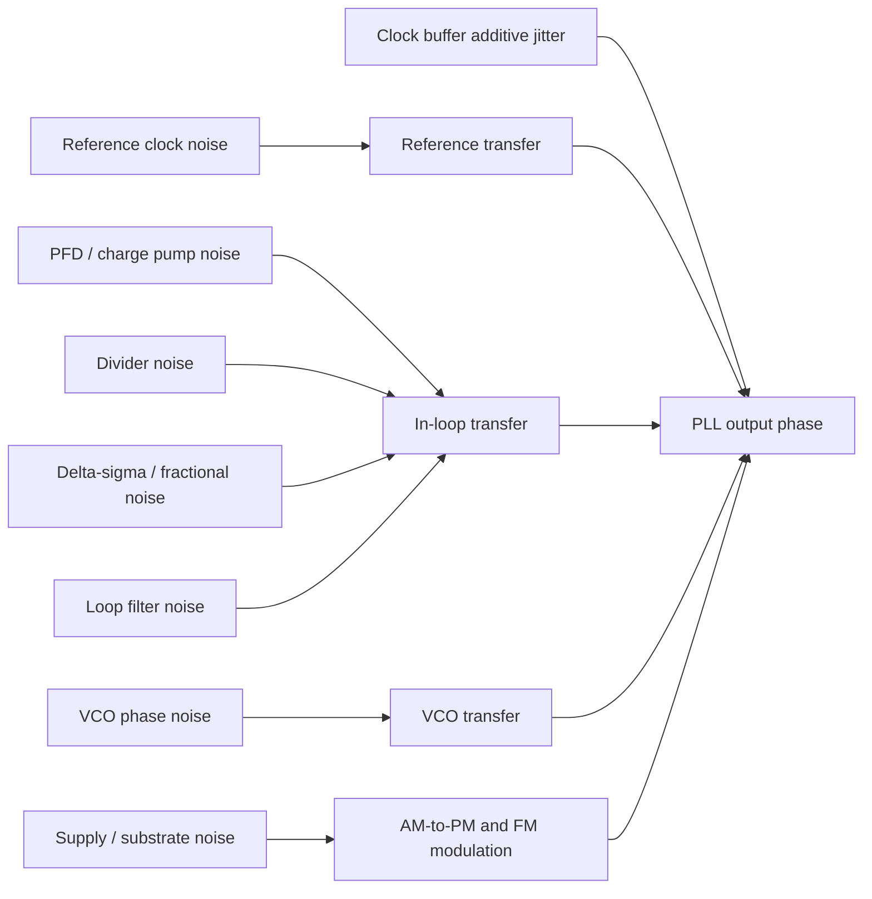
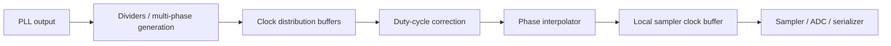
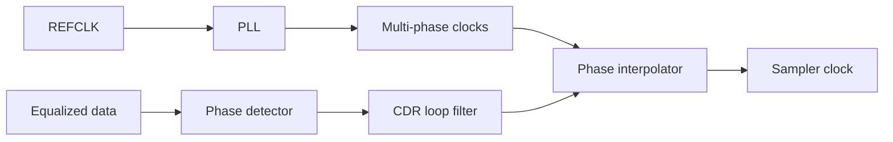
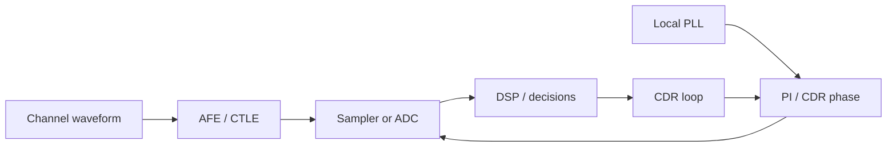
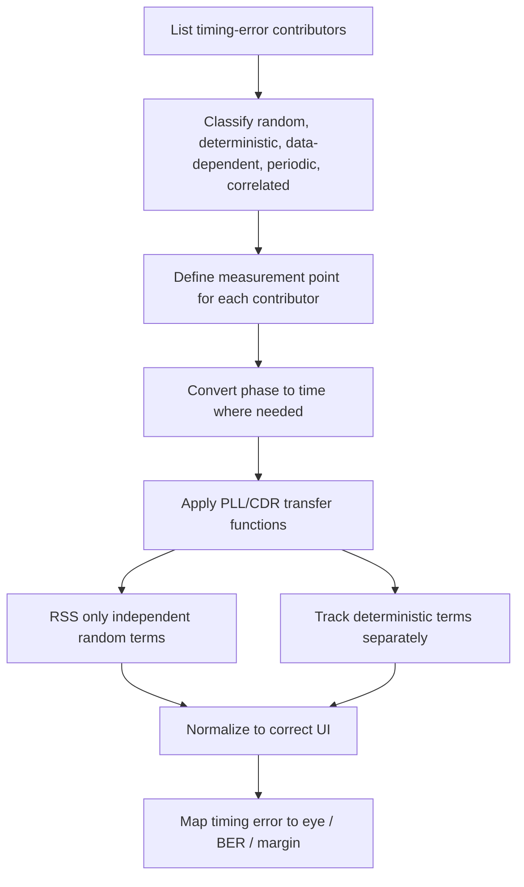

# PLL Phase Noise and Jitter

## 中文补充翻译

这篇笔记系统解释 PLL phase noise 如何变成 time-domain jitter，并最终影响 TX launch edge 或 RX sampling instant。Phase noise 是频域描述，jitter 是时域边沿误差；通过对 `L(f)` 在指定 offset band 积分，再除以 `2*pi*f0`，可以从 phase-noise plot 得到 RMS jitter。

在设计 review 中，单独说“PLL jitter 是 80 fs / 100 fs”是不完整的。必须说明 carrier frequency、integration bandwidth、measurement point、包含的噪声源、是否包含 spurs、PVT、supply、clock tree、PI、sampler 和 CDR residual error。PLL output jitter 不等于最终 sampler clock jitter。

对 PCIe 7.0 PAM4，timing budget 应明确使用 `UI_sym = 15.625 ps` 作为 symbol UI；`7.8125 ps` 只是 bit-equivalent interval。PAM4 下 jitter 不只是 horizontal margin，还会通过 `dV/dt` 转成 voltage error，因此 PLL、CDR、ADC aperture、LDO supply、clock buffer 和 equalization 必须一起看。

## 0. Status

| Item | Value |
|---|---|
| Maturity | Study note / interview preparation / design review primer |
| Related role | Synopsys PCIe 7.0 Clocking / PLL / CDR / SerDes AMS role |
| Last updated | 2026-07-01 |
| Main audience | Analog / mixed-signal IC engineer working on PLL and high-speed SerDes clocking |
| Scope | Phase noise, RMS jitter, PLL noise shaping, spurs, supply-induced jitter, CDR interaction, ADC aperture jitter, LDO and verification |

This is a self-contained engineering note. It does not define official PCIe 7.0 jitter compliance limits, masks, receiver tolerance requirements, REFCLK requirements, or test methodology. Any number that would be used as a signoff limit should be marked:

TODO: verify against PCIe 7.0 spec or internal IP requirement

Related notes: [[pcie7_clocking_notes]], [[phase_noise_jitter]], [[pll_fundamentals]], [[cdr_jitter_tolerance]], [[cdr_fundamentals]], [[sampling_jitter_adc]], [[pam4_adc_based_rx]], [[ldo_psrr_notes]], [[serdes_power_integrity]].

## 1. One-Sentence Summary

PLL phase noise is the frequency-domain description of clock phase fluctuation; integrated over the relevant offset band and divided by the carrier angular frequency, it becomes time-domain jitter at the TX launch edge or RX sampling instant, where it directly consumes SerDes eye margin.

## 2. Why This Topic Matters

In a high-speed SerDes, the clock is not just a periodic timing reference. It is part of the signal path. A noisy PLL can move the TX launch edge, move the RX sampling edge, corrupt an ADC sample, bias a CDR, and convert supply noise into deterministic timing error.

The core design-review question is:

$$
\text{How much timing uncertainty reaches the actual edge that launches or samples data?}
$$

That question is more useful than asking only for "PLL jitter", because a standalone PLL number often hides the most important assumptions:

| Hidden assumption | Why it matters |
|---|---|
| Carrier frequency | The same phase error maps to different time jitter at different frequencies |
| Integration bandwidth | Different offset bands can dominate the result |
| Measurement point | PLL output, divider output, PI output, sampler clock, and recovered clock are not identical |
| Included sources | VCO, reference, PFD/CP, divider, buffers, supply, substrate, and spurs may or may not be included |
| Jitter type | Random jitter, periodic jitter, data-dependent jitter, and correlated supply jitter do not combine the same way |
| Clock architecture | Full-rate, half-rate, quarter-rate, multi-phase, and PI-based architectures map noise differently |
| CDR behavior | Some phase movement is tracked; some becomes residual sampling error |

For PCIe 7.0-class links, the public headline is 128 GT/s per lane, but the electrical PAM4 symbol rate is 64 Gbaud. The symbol UI relevant to CDR sampling and horizontal eye margin is:

$$
UI_{sym} = \frac{1}{64\times10^9} = 15.625\text{ ps}
$$

The bit-equivalent interval is:

$$
UI_{bit,eq} = \frac{1}{128\times10^9} = 7.8125\text{ ps}
$$

For PLL and CDR timing discussions, the UI must be named explicitly. A jitter budget normalized to the wrong UI can be wrong by 2x.

## 3. Phase Noise, Phase Error, and Jitter

### 3.1 Ideal and Real Clocks

An ideal sinusoidal clock can be written as:

$$
v(t)=A\cos(2\pi f_0t)
$$

A real clock has amplitude and phase perturbations:

$$
v(t)=A(t)\cos(2\pi f_0t+\phi(t))
$$

For digital clocking, the phase perturbation is usually the first-order concern because it moves the zero crossing or switching threshold crossing in time. Amplitude noise can still matter when it converts to timing error through finite edge slope or nonlinear buffer delay, but the PLL phase-noise plot primarily describes fluctuations in $\phi(t)$.

### 3.2 Phase Noise Definition

Single-sideband phase noise is usually written as:

$$
L(f)
$$

where $f$ is the offset frequency from the carrier. It is reported in dBc/Hz.

Example:

$$
L(1\text{ MHz})=-100\text{ dBc/Hz}
$$

This means the noise power in a 1 Hz bandwidth at 1 MHz offset from the carrier is 100 dB below the carrier power, using a single-sideband convention.

Important distinctions:

| Quantity | Domain | Common unit | Comment |
|---|---|---|---|
| Phase noise | Frequency | dBc/Hz | Offset-frequency density around carrier |
| Phase error | Time waveform or RMS scalar | rad | Phase fluctuation after integrating or filtering |
| Jitter | Time | s, fs, ps, UI | Edge displacement caused by phase error |
| Period jitter | Time | s | Variation of one period |
| Cycle-to-cycle jitter | Time | s | Difference between adjacent periods |
| Long-term jitter | Time | s | Accumulated edge movement over many cycles |

## 4. Phase Error to Time Error

Phase and time are linked by:

$$
\Delta\phi = 2\pi f_0\Delta t
$$

Therefore:

$$
\Delta t = \frac{\Delta\phi}{2\pi f_0}
$$

For RMS quantities:

$$
\sigma_t = \frac{\sigma_\phi}{2\pi f_0}
$$

This is the bridge from a PLL phase-noise plot to SerDes eye margin.

### 4.1 Worked Example: Radians to Femtoseconds

Assume a 16 GHz clock has RMS phase error:

$$
\sigma_\phi = 0.01\text{ rad}
$$

Then:

$$
\sigma_t=\frac{0.01}{2\pi\cdot16\times10^9}=99.5\text{ fs}
$$

If this is used in a PCIe 7.0 PAM4 RX sampling budget, normalize to the symbol UI:

$$
\sigma_{UI,sym}=\frac{99.5\text{ fs}}{15.625\text{ ps}}=0.00637\ UI_{sym}
$$

If someone instead normalizes to the bit-equivalent interval:

$$
\sigma_{UI,bit,eq}=\frac{99.5\text{ fs}}{7.8125\text{ ps}}=0.0127\ UI_{bit,eq}
$$

Both arithmetic results are valid, but they answer different questions. For PAM4 sampler placement and CDR phase margin, use $UI_{sym}$ unless the context explicitly requires bit-equivalent arithmetic.

### 4.2 Same Phase Error at Different Frequencies

For a fixed RMS phase error of $0.01$ rad:

| Clock frequency | RMS jitter |
|---:|---:|
| 4 GHz | 398 fs |
| 8 GHz | 199 fs |
| 16 GHz | 99.5 fs |
| 32 GHz | 49.7 fs |

This does not mean a higher-frequency clock is automatically cleaner. It means that the same phase error in radians corresponds to less time error at a higher carrier. Real oscillator phase noise often changes with frequency, architecture, tank Q, buffer chain, divider ratio, and power.

## 5. Integrated RMS Jitter from Phase Noise

For small phase noise, integrated RMS jitter is commonly estimated by:

$$
\sigma_t =
\frac{1}{2\pi f_0}
\sqrt{2\int_{f_1}^{f_2}10^{L(f)/10}df}
$$

where:

| Symbol | Meaning |
|---|---|
| $\sigma_t$ | RMS timing jitter |
| $f_0$ | Carrier / clock frequency |
| $L(f)$ | Single-sideband phase noise in dBc/Hz |
| $f_1,f_2$ | Offset-frequency integration limits |
| Factor of 2 | Converts single-sideband noise to total phase variance under the usual small-noise convention |

The integration band is not bookkeeping. It changes the answer.

Bad statement:

> PLL jitter is 80 fs.

Better statement:

> PLL output integrated RMS jitter is 80 fs from 10 kHz to 100 MHz offset at a 16 GHz carrier, TT/0.8 V/25 C, including VCO, reference, divider, and output buffer noise, excluding supply ripple and post-PLL clock tree.

### 5.1 Why Integration Band Matters

Different offset-frequency bands map to different physical behavior:

| Offset region | Typical concern |
|---|---|
| Very close-in | Wander, flicker noise, reference wander, SSC interaction |
| In-band | Reference noise, PFD/CP noise, divider noise, fractional quantization noise |
| Near loop bandwidth | Peaking, stability margin, crossover between reference and VCO noise |
| Far-out | VCO noise, oscillator buffer noise, divider/buffer white floor |
| Spur offsets | Reference spurs, fractional spurs, supply spurs, digital coupling |

A CDR may track low-frequency phase movement but reject high-frequency movement. An ADC aperture-jitter limit may care strongly about wideband sampling uncertainty. A spectral mask may care about a narrow spur even when RMS jitter looks good. Therefore the correct integration band depends on the system question.

### 5.2 Worked Example: Flat Phase-Noise Approximation

Assume a simplified phase-noise density:

$$
L(f)=-120\text{ dBc/Hz}
$$

flat from:

$$
f_1=1\text{ MHz}
$$

to:

$$
f_2=100\text{ MHz}
$$

The linear density is:

$$
10^{L(f)/10}=10^{-12}
$$

The integrated single-sideband area is:

$$
\int_{f_1}^{f_2}10^{-12}df
=10^{-12}(100\text{ MHz}-1\text{ MHz})
=9.9\times10^{-5}
$$

Total phase variance is approximately:

$$
\sigma_\phi^2=2\cdot9.9\times10^{-5}=1.98\times10^{-4}
$$

So:

$$
\sigma_\phi=0.0141\text{ rad}
$$

At $f_0=16\text{ GHz}$:

$$
\sigma_t=\frac{0.0141}{2\pi\cdot16\times10^9}=140\text{ fs}
$$

This example is intentionally simple. Real phase-noise curves are not flat, and numerical integration should use the actual simulated or measured spectrum.

## 6. Practical PLL Noise Model

A PLL output phase contains multiple contributors:



A simplified linear model is:

$$
\Phi_{out}(s)
\approx
H_{ref}(s)\Phi_{ref}(s)
+H_{vco}(s)\Phi_{vco}(s)
+H_{n}(s)\Phi_{inloop}(s)
+\Phi_{add}(s)
$$

where $\Phi_{add}(s)$ includes additive noise from output buffers, clock dividers, clock muxes, duty-cycle correction, and other downstream circuits not fully represented by the simple loop model.

### 6.1 Reference Path

Reference noise is multiplied by the PLL multiplication ratio and shaped by the closed-loop response. Inside the PLL bandwidth, output phase tends to follow the reference path.

Key implications:

| Issue | Consequence |
|---|---|
| Noisy REFCLK | Can dominate in-band phase noise |
| Large multiplication ratio | Reference phase noise is scaled at the output |
| Reference spur | Can create periodic output jitter |
| SSC or modulation | Must be tracked or filtered depending on architecture and spec |

### 6.2 VCO Path

VCO phase noise is shaped approximately as a high-pass contribution. Inside the PLL bandwidth, the loop suppresses VCO phase noise; outside the bandwidth, VCO noise dominates.

Key VCO concerns:

| Source | Typical effect |
|---|---|
| Tank thermal noise | Far-out phase noise in LC oscillators |
| Flicker upconversion | Close-in phase noise |
| Low tank Q | Higher noise and more power pressure |
| Supply pushing | Frequency modulation from supply ripple |
| Bias noise | Phase and amplitude noise modulation |
| Varactor noise | Frequency-control sensitivity to device noise |

### 6.3 In-Loop Circuit Noise

PFD, charge pump, loop filter, divider, and fractional-N modulator noise can dominate the in-band region.

| Contributor | Design-review questions |
|---|---|
| PFD | Dead zone, reset delay, metastability, reference edge quality |
| Charge pump | Current mismatch, noise, switching glitch, compliance |
| Loop filter | Resistor thermal noise, capacitor leakage, parasitic poles |
| Divider | Additive jitter, supply sensitivity, duty-cycle distortion |
| Fractional-N DSM | Quantization noise shaping, fractional spurs, calibration |

### 6.4 Post-PLL Clocking

The PLL output is rarely the final sampling clock. Downstream circuits add and shape jitter:



Important rule:

$$
\text{PLL output jitter} \ne \text{sampler clock jitter}
$$

The final budget must state the measurement point.

## 7. PLL Bandwidth Tradeoff

PLL loop bandwidth is a design knob, not a number to maximize or minimize blindly.

| Choice | Benefit | Cost |
|---|---|---|
| Wider bandwidth | Suppresses more VCO close-in noise, faster lock, stronger tracking | Passes more reference/PFD/CP noise, more spur risk, harder stability |
| Narrower bandwidth | Filters reference and in-loop noise more strongly, can reduce some spurs | More VCO noise, slower lock, weaker tracking |
| Higher damping | Less peaking, more robust response | Slower transient response |
| Lower damping | Faster response | More jitter peaking and stability risk |

For SerDes, PLL bandwidth should be chosen together with:

- Reference clock quality.
- VCO noise profile.
- Fractional/integer-N architecture.
- Spur requirements.
- Lock and relock time.
- SSC tracking requirements.
- CDR loop bandwidth.
- Supply-noise spectrum.
- Clock distribution additive jitter.

### 7.1 Reference and VCO Crossover

The common first-order mental model is:

```text
Inside PLL bandwidth: reference and in-loop noise matter more.
Outside PLL bandwidth: VCO noise matters more.
```

This mental model is useful, but incomplete. Real loops have peaking, parasitic poles, sampled behavior, divider delay, charge-pump nonidealities, fractional quantization noise, and post-PLL additive noise. The correct review question is not just "what is the loop bandwidth?" It is "what sources dominate each offset decade, and why?"

### 7.2 CDR Interaction

In a PI-based receiver, a PLL may generate a local multi-phase clock while the CDR adjusts sampling phase. The PLL and CDR form a system:



Low-frequency data phase movement may be tracked by the CDR. High-frequency PLL noise may appear directly as sampling uncertainty. PI quantization and phase-step nonlinearity can add their own error. Therefore a standalone PLL jitter minimum does not guarantee the best receiver margin.

## 8. Noise Slopes and Physical Meaning

Oscillator phase noise is often discussed by slope:

| Region | Approximate slope | Common physical source |
|---|---:|---|
| Flicker FM | -30 dB/dec | Flicker noise upconverted into frequency noise |
| White FM | -20 dB/dec | Thermal noise in resonator or active devices |
| Flicker PM | -10 dB/dec | Device flicker converted directly to phase |
| White PM floor | 0 dB/dec | Buffers, dividers, measurement floor |

For an LC PLL, far-out VCO noise may be tied to tank Q, negative-resistance device noise, oscillation amplitude, and bias current. For ring or digitally controlled oscillators, supply pushing and delay-cell noise are often stronger. For clock buffers and dividers, the white PM floor can dominate far from the carrier.

### 8.1 Leeson-Style Intuition

A simplified Leeson-style view says oscillator phase noise improves with:

- Higher resonator Q.
- Larger signal swing, within reliability and linearity limits.
- Lower device noise.
- Lower flicker upconversion.
- Lower supply and substrate sensitivity.

This is only intuition. Modern PLL design requires transistor-level Pnoise/PSS, transient noise, supply injection, extracted layout, and system-level jitter propagation.

## 9. Spurs Are Not Random Jitter

Spurs create deterministic phase modulation. They can come from:

| Spur type | Typical source |
|---|---|
| Reference spur | PFD/CP ripple, reference feedthrough, loop filter ripple |
| Fractional-N spur | DSM pattern, fractional quantization, calibration residue |
| Supply spur | Switching regulator ripple, digital activity, package resonance |
| Substrate spur | Digital clock coupling, clock harmonics |
| Clock-tree spur | Duty-cycle correction, muxing, divider pattern |

Spurs may contribute little to an RMS integrated jitter number but still create periodic sampling stress, spectral mask issues, or deterministic eye closure.

For sinusoidal phase modulation:

$$
\phi(t)=\phi_{pk}\sin(2\pi f_mt)
$$

The peak timing error is:

$$
t_{pk}=\frac{\phi_{pk}}{2\pi f_0}
$$

### 9.1 Worked Example: Spur Phase to Timing

Assume:

| Parameter | Value |
|---|---:|
| Clock frequency | 16 GHz |
| Spur phase modulation peak | 0.005 rad |

Then:

$$
t_{pk}=\frac{0.005}{2\pi\cdot16\times10^9}=49.7\text{ fs}
$$

This is bounded periodic jitter. It should not be combined with independent Gaussian random jitter by blind RSS.

### 9.2 Supply Spur Example

If a switching regulator creates a 2 MHz ripple that reaches the PLL supply, and the VCO has supply pushing, the output phase may contain a 2 MHz spur. If 2 MHz is inside the CDR tracking band, the receiver may partly follow it. If it is outside the tracking band, it may become sampling error. If the spur is correlated across lanes, it may also create system-level timing correlation that a lane-independent random model misses.

## 10. Supply Noise Conversion

PLL supplies matter because oscillators, dividers, buffers, bias circuits, and phase interpolators convert voltage noise into phase noise and jitter.

### 10.1 VCO Supply Pushing

VCO supply pushing is:

$$
K_{VDD}=\frac{\Delta f}{\Delta V_{DD}}
$$

For supply ripple $v_n(t)$:

$$
\Delta f(t)=K_{VDD}v_n(t)
$$

Phase is the integral of frequency:

$$
\phi_n(t)=2\pi\int\Delta f(t)dt
$$

For a sinusoidal supply ripple:

$$
v_n(t)=V_n\sin(2\pi f_mt)
$$

the frequency deviation is:

$$
\Delta f(t)=K_{VDD}V_n\sin(2\pi f_mt)
$$

and the approximate peak phase modulation is:

$$
\phi_{pk}\approx\frac{K_{VDD}V_n}{f_m}
$$

This shows why low-frequency supply ripple can be dangerous: frequency modulation integrates into phase, so lower modulation frequency creates larger phase modulation for the same frequency deviation.

### 10.2 Worked Example: VCO Supply Ripple to Jitter

Assume:

| Parameter | Value |
|---|---:|
| VCO supply pushing | $K_{VDD}=100\text{ MHz/mV}$ |
| Supply ripple amplitude | $V_n=0.1\text{ mV}$ |
| Ripple frequency | $f_m=10\text{ MHz}$ |
| Clock frequency | $f_0=16\text{ GHz}$ |

Frequency deviation:

$$
\Delta f_{pk}=100\frac{\text{MHz}}{\text{mV}}\cdot0.1\text{ mV}=10\text{ MHz}
$$

Approximate phase modulation peak:

$$
\phi_{pk}\approx\frac{10\text{ MHz}}{10\text{ MHz}}=1\text{ rad}
$$

Timing peak:

$$
t_{pk}=\frac{1}{2\pi\cdot16\times10^9}=9.95\text{ ps}
$$

This example uses intentionally large pushing to show the mechanism. It also shows why supply-pushing units can be alarming: even small ripple can matter when the VCO is sensitive and the ripple sits at an unfortunate frequency. Real designs rely on lower pushing, filtering, loop suppression, supply isolation, and measured transfer functions.

### 10.3 Clock Buffer Delay Modulation

Clock buffer delay varies with supply:

$$
\Delta t_d \approx K_{d,VDD}\Delta V_{DD}
$$

If:

$$
K_{d,VDD}=0.5\text{ ps/mV}
$$

and residual ripple is:

$$
\Delta V_{DD}=0.2\text{ mV}
$$

then:

$$
\Delta t_d=0.5\frac{\text{ps}}{\text{mV}}\cdot0.2\text{ mV}=0.1\text{ ps}=100\text{ fs}
$$

Normalized to PCIe 7.0 PAM4 symbol UI:

$$
\frac{100\text{ fs}}{15.625\text{ ps}}=0.0064\ UI_{sym}
$$

This is only one buffer-chain contribution. Multiple supply-sensitive stages can make the final sampling clock worse than the PLL output.

### 10.4 LDO and Power Integrity Implications

An LDO helps only over the frequencies where its output impedance and PSRR actually suppress the noise that couples into timing.

Important questions:

| Question | Why it matters |
|---|---|
| What is the LDO output noise spectrum? | LDO noise can become PLL supply noise |
| What is PSRR versus frequency? | PSRR is not a DC scalar |
| Is there PSRR peaking? | Peaking can amplify certain ripple bands |
| What package/decap resonance exists? | Anti-resonance can inject narrowband supply noise |
| Is the PLL rail shared? | Digital or CDR activity can modulate clock supply |
| How is supply noise correlated across lanes? | Correlated jitter cannot be treated as independent lane noise |

The useful power-integrity chain is:

```text
External supply noise
-> regulator and package transfer
-> local PLL / clock supply ripple
-> VCO pushing and buffer delay modulation
-> phase noise, spurs, and jitter
-> TX launch or RX sampling margin
```

## 11. Jitter Taxonomy for SerDes

SerDes design reviews should separate jitter sources before combining them.

| Jitter type | Typical source | Statistical behavior | Combine by RSS? |
|---|---|---|---|
| Random jitter | Thermal noise, VCO noise, buffer noise | Often modeled Gaussian | Usually, if independent |
| Periodic jitter | Supply ripple, reference spur | Bounded sinusoidal or periodic | No |
| Data-dependent jitter | ISI, duty-cycle pattern, slicer behavior | Pattern-dependent | No |
| Duty-cycle distortion | Clock path mismatch, divider asymmetry | Deterministic | No |
| Crosstalk-induced jitter | Aggressor coupling | Can be data-correlated | Usually no |
| Correlated supply jitter | Shared rail or package mode | Correlated across circuits | No as independent RSS |
| Quantization jitter | PI step, digital loop resolution | Bounded or shaped | Depends on model |

### 11.1 Random Jitter

Random jitter is often described by RMS value. For BER extrapolation, it is frequently modeled as Gaussian, but that assumption should be stated. Random jitter has unbounded tails in the mathematical model, so peak-to-peak value depends on observation time or BER target.

### 11.2 Deterministic Jitter

Deterministic jitter is bounded or pattern-related. It includes duty-cycle distortion, periodic jitter, data-dependent jitter, and ISI-induced jitter. It should not be hidden inside one RMS number unless the model clearly explains how the deterministic component was converted.

### 11.3 Correlated Jitter

Shared supply, substrate, reference, or package noise can create correlated jitter. Correlation matters because independent random contributors reduce by averaging or RSS assumptions, while correlated movement can shift many clocks or lanes together.

## 12. PCIe 7.0 Timing Scale

For PCIe 7.0 PAM4:

| Quantity | Value |
|---|---:|
| Headline per-lane rate | 128 GT/s |
| Modulation | PAM4 |
| Bits per symbol | 2 |
| Electrical symbol rate | 64 Gbaud |
| Symbol UI | 15.625 ps |
| Bit-equivalent interval | 7.8125 ps |
| Baseband Nyquist | 32 GHz |

TODO: verify official PCIe 7.0 electrical and jitter compliance requirements.

### 12.1 RMS Jitter as Symbol UI Fraction

Normalize common RMS jitter values to $UI_{sym}=15.625\text{ ps}$:

| RMS jitter | Fraction of symbol UI |
|---:|---:|
| 25 fs | 0.0016 UI |
| 50 fs | 0.0032 UI |
| 100 fs | 0.0064 UI |
| 200 fs | 0.0128 UI |
| 500 fs | 0.0320 UI |
| 1 ps | 0.0640 UI |

These are scale references, not PCIe 7.0 limits.

### 12.2 Why UI Normalization Can Mislead

UI normalization is useful, but it can hide physics:

| Normalized number misses | Explanation |
|---|---|
| Spectrum | 100 fs low-frequency jitter and 100 fs high-frequency jitter affect a CDR differently |
| Deterministic shape | A spur and random noise with the same RMS can stress the link differently |
| Measurement point | PLL output and sampler clock are different nodes |
| PAM4 vertical margin | Timing error also creates voltage error through waveform slope |
| Correlation | Shared supply jitter may move multiple paths together |

For PAM4, timing error creates voltage error:

$$
\Delta V \approx \frac{dV}{dt}\Delta t
$$

Because PAM4 has smaller vertical eyes than NRZ, the same timing error can be more damaging than the horizontal UI fraction suggests.

## 13. PLL Jitter in the TX Path

The TX launches symbols using a high-speed clock path:


TX clock jitter moves the launch time of the waveform. Its link impact depends on:

| Factor | Effect |
|---|---|
| Launch-clock random jitter | Broadens horizontal eye at receiver |
| Duty-cycle distortion | Creates even/odd edge asymmetry or symbol-dependent timing |
| Serializer mux timing | Can add lane or bit-slice skew |
| Supply-induced driver delay | Creates periodic or activity-correlated timing error |
| TX FFE timing | Tap timing error changes pre/post-cursor shape |

For PAM4, TX jitter is not only a clock issue. If the driver has level-dependent delay or slew, the transition timing can depend on the symbol transition amplitude. That becomes data-dependent jitter and interacts with equalization.

## 14. PLL Jitter in the RX Path

The RX samples an equalized waveform:



RX jitter matters at the final sampler or ADC aperture. The clock can be degraded after the PLL by:

- Multi-phase clock generation.
- Phase interpolator INL/DNL.
- PI quantization.
- CDR loop noise.
- Local clock buffer additive jitter.
- Supply-induced delay modulation.
- Sampler aperture uncertainty.
- ADC interleaving skew.

### 14.1 CDR Residual Error

The CDR tries to place the sampling clock at the correct phase. Its residual timing error is the difference between the ideal sampling instant and actual sampling instant after loop tracking:

$$
e_t(t)=t_{sample,actual}(t)-t_{sample,ideal}(t)
$$

This residual includes:

| Contributor | Example |
|---|---|
| Input data jitter not tracked | High-frequency channel/data jitter |
| PLL jitter | Local clock phase noise |
| Loop quantization | Digital accumulator or PI step |
| Phase detector noise | Decision noise, PAM4 threshold uncertainty |
| Equalizer interaction | ISI and CTLE/DFE setting biasing phase estimate |
| Supply modulation | PI and local buffer delay movement |

### 14.2 CDR Bandwidth Tradeoff

| CDR bandwidth choice | Benefit | Cost |
|---|---|---|
| Wider | Tracks low-frequency wander and some SSC/data phase movement | Passes more input jitter, more PD noise, more loop noise |
| Narrower | Filters more high-frequency jitter and PD noise | Worse tolerance to wander, frequency offset, SSC, and slow channel movement |

The right answer depends on jitter transfer, jitter tolerance, and jitter generation. A PLL engineer should be able to explain how PLL noise and CDR bandwidth interact, not just quote one integrated jitter number.

## 15. ADC-Based Receiver Implications

ADC-based PAM4 receivers convert timing error into voltage error before DSP can correct anything.

### 15.1 Aperture Jitter

For an input waveform:

$$
\sigma_v \approx \left|\frac{dV}{dt}\right|\sigma_t
$$

For a sinusoidal input, jitter-limited SNR is:

$$
SNR_{jitter}\approx -20\log_{10}(2\pi f_{in}\sigma_t)
$$

### 15.2 Worked Example: ADC Jitter-Limited SNR

If:

$$
f_{in}=16\text{ GHz}
$$

and:

$$
\sigma_t=100\text{ fs}
$$

then:

$$
2\pi f_{in}\sigma_t
=2\pi\cdot16\times10^9\cdot100\times10^{-15}
=0.0101
$$

so:

$$
SNR_{jitter}\approx -20\log_{10}(0.0101)=40.0\text{ dB}
$$

At:

$$
\sigma_t=200\text{ fs}
$$

the SNR becomes:

$$
SNR_{jitter}\approx 34.0\text{ dB}
$$

This is a sinusoidal approximation, not a PCIe compliance calculation. Its value is intuition: at tens of GHz, aperture jitter quickly becomes a hard limit.

### 15.3 Time-Interleaved ADC Skew

A time-interleaved ADC uses multiple sub-ADCs. Static timing skew creates periodic sampling error and spurs. Dynamic skew becomes jitter or activity-dependent distortion.

| Skew source | Effect |
|---|---|
| Clock path mismatch | Fixed timing skew between sub-ADCs |
| PI or divider mismatch | Phase spacing error |
| Supply-induced delay | Dynamic skew and jitter |
| Temperature gradient | Slowly changing skew |
| Calibration residual | Floor after foreground/background correction |

For SerDes margin, residual TI skew should be converted to equivalent sampling-time error and then to voltage error using waveform slope.

## 16. Measurement and Simulation

### 16.1 Phase Noise Simulation

Typical PLL phase-noise work includes:

- PSS/Pnoise or equivalent periodic steady-state noise simulation.
- Open-loop VCO phase noise.
- Closed-loop PLL output phase noise.
- Reference, PFD/CP, divider, loop filter, and VCO noise breakdown.
- Spur analysis.
- Supply pushing and supply injection.
- Extracted layout and clock-load effects.

Always record:

| Metadata | Why |
|---|---|
| Carrier frequency | Required for rad-to-time conversion |
| Output node | Defines measurement point |
| Integration range | Changes RMS jitter result |
| Included contributors | Prevents false comparison |
| PVT corner | Noise and delay sensitivity vary strongly |
| Supply condition | Supply noise and headroom matter |
| Load condition | Buffers and dividers depend on loading |
| PLL bandwidth and peaking | Explains spectral shape |

### 16.2 Transient Noise Jitter

Transient noise simulation can capture time-domain jitter directly. It is useful for:

| Use | Comment |
|---|---|
| Period jitter | Cycle-level clock variation |
| Cycle-to-cycle jitter | Adjacent-period variation |
| Long-term jitter | Wander over many cycles |
| Nonlinear effects | Large-signal behavior not captured by linear noise |
| Supply injection | Time-domain ripple and activity patterns |
| Clock-tree analysis | Downstream buffers and dividers |

Transient noise can be expensive. It also needs enough simulation time to estimate low-frequency jitter and tails, so it should complement phase-noise integration rather than replace it blindly.

### 16.3 Lab Measurement

In lab measurement, ask:

| Question | Reason |
|---|---|
| Is the instrument noise floor lower than the DUT? | Avoid measuring the analyzer |
| Is jitter measured as RMS or peak-to-peak? | Different meaning |
| What filter or integration band is used? | Changes the result |
| Is the clock divided before measurement? | Division changes phase and time interpretation |
| Are spurs included or excluded? | RMS number may hide deterministic components |
| Is the supply realistic? | Clean lab supplies may hide product issues |
| Is the load representative? | Clock buffer jitter depends on load |

## 17. Combining Jitter Contributions

A practical budgeting flow:



### 17.1 Example Budget Table

| Contributor | Type | Example value | Combine method |
|---|---|---:|---|
| PLL random integrated jitter | Random | 80 fs RMS | RSS if independent |
| Clock buffer additive jitter | Random | 50 fs RMS | RSS if independent |
| PI quantization | Bounded | 40 fs pk | Keep separate or model explicitly |
| Supply ripple spur | Periodic | 60 fs pk | Deterministic |
| Data-dependent jitter | Pattern | 120 fs pp | Deterministic / channel model |
| Sampler aperture noise | Random | 70 fs RMS | RSS if independent |

Independent random subtotal:

$$
\sigma_{RJ}=\sqrt{80^2+50^2+70^2}=118\text{ fs}
$$

Normalize to PCIe 7.0 PAM4 symbol UI:

$$
\frac{118\text{ fs}}{15.625\text{ ps}}=0.0076\ UI_{sym}
$$

The deterministic terms must still be included in the eye or BER model. They do not disappear because the random subtotal looks small.

## 18. Design Implications

### 18.1 PLL

PLL design must balance phase noise, spur performance, lock time, power, area, supply sensitivity, loop stability, and downstream clocking. The lowest standalone integrated jitter is not always the best system design if it creates spur, tracking, or CDR problems.

### 18.2 Clock Distribution

Clock distribution is part of the jitter path. Routing, shielding, supply isolation, buffer sizing, duty-cycle correction, and local loading can dominate the final sampler clock. Extracted simulation is required for credible numbers.

### 18.3 CDR

CDR design determines which input phase variations are tracked and which become sampling error. PAM4 CDR is coupled to equalization because the phase detector sees an equalized multi-level waveform, not an ideal binary edge stream.

### 18.4 TX and RX Equalization

FFE, CTLE, and DFE change waveform slope and ISI. Since timing error creates voltage error through slope, equalization and jitter cannot be treated as independent budgets.

### 18.5 ADC

ADC-based receivers move much of the equalization into DSP, but they do not remove the analog clocking problem. Aperture jitter and TI skew damage the samples before DSP has a chance to correct them.

### 18.6 LDO and Power

Clocking supplies should be reviewed as transfer functions, not DC rails. LDO output noise, PSRR, package resonance, decap anti-resonance, load transient response, and shared-rail coupling all affect phase noise and jitter.

## 19. Common Mistakes

1. Saying "PLL jitter is 100 fs" without carrier frequency, integration bandwidth, and measurement point.
2. Treating PLL output jitter as equal to final sampler-clock jitter.
3. Using PCIe 7.0 7.8125 ps bit-equivalent interval as the PAM4 symbol UI.
4. Ignoring CDR bandwidth when interpreting PLL jitter.
5. RSS-combining deterministic, periodic, data-dependent, and correlated jitter as if all were independent Gaussian noise.
6. Ignoring spurs because the integrated RMS jitter number looks small.
7. Simulating clean supplies while the real PLL shares rails with digital or clock buffers.
8. Treating LDO PSRR as a single DC number.
9. Forgetting that clock buffer delay modulation can dominate supply-induced jitter.
10. Reporting phase-noise plots without source breakdown.
11. Comparing jitter numbers with different integration bands.
12. Forgetting PI quantization, INL/DNL, and local clock distribution in CDR budgets.
13. Ignoring PAM4 timing-to-voltage conversion.
14. Assuming a wider PLL bandwidth is always better.
15. Assuming an ADC/DSP receiver relaxes aperture jitter requirements.

## 20. How to Answer in Interview

The strongest answers start with the domain conversion, then state assumptions, then connect to link margin.

### 20.1 Polished English Answers

**Question: What is the difference between phase noise and jitter?**

Phase noise is the frequency-domain description of phase fluctuation around a clock carrier, usually in dBc/Hz versus offset frequency. Jitter is the time-domain edge uncertainty caused by that phase fluctuation. They are related by $\Delta t=\Delta\phi/(2\pi f_0)$, so after integrating phase noise over a relevant offset band, I can convert RMS phase error into RMS timing jitter.

**Question: Why is a standalone PLL jitter number incomplete?**

Because the number depends on integration bandwidth, carrier frequency, measurement point, included noise sources, PVT, supply condition, and whether spurs are included. For a SerDes, the important quantity is timing uncertainty at the TX launch edge or RX sampling instant, not just at the PLL output.

**Question: How does PLL bandwidth affect phase noise?**

PLL bandwidth sets the tradeoff between reference/in-loop noise and VCO noise. Inside the bandwidth, output phase tends to follow the reference and in-loop sources. Outside the bandwidth, VCO noise dominates. A wider loop can suppress VCO close-in noise and lock faster, but it may pass more reference noise and spurs; a narrower loop filters reference noise better but leaves more VCO noise.

**Question: Why do spurs matter if RMS jitter is acceptable?**

Spurs are deterministic periodic phase modulation. They may not add much integrated RMS jitter, but they can create periodic eye closure, narrowband stress, or spectral-mask problems. I would track them separately from random jitter rather than hiding them in an RSS number.

**Question: How does supply noise create jitter?**

Supply noise can modulate VCO frequency through supply pushing and can modulate buffer, divider, PI, and sampler delay. VCO frequency modulation integrates into phase modulation, while buffer delay modulation directly moves edges in time. The relevant metric is the supply-to-timing transfer function versus frequency.

**Question: What matters for PCIe 7.0 timing normalization?**

PCIe 7.0 is 128 GT/s per lane, but with PAM4 the electrical symbol rate is 64 Gbaud, so the symbol UI is 15.625 ps. The 7.8125 ps number is the bit-equivalent interval. For CDR sampling and PAM4 horizontal eye margin, I would normalize jitter to the symbol UI unless the context explicitly asks for bit-equivalent arithmetic.

### 20.2 Interview Q&A

### Q1. How do you convert phase noise to RMS jitter?

Convert $L(f)$ from dBc/Hz to linear units, integrate over the offset-frequency band, multiply by two for single-sideband to total phase variance, take the square root to get RMS phase error, and divide by $2\pi f_0$:

$$
\sigma_t =
\frac{1}{2\pi f_0}
\sqrt{2\int_{f_1}^{f_2}10^{L(f)/10}df}
$$

### Q2. What information must accompany a jitter number?

Carrier frequency, measurement node, integration bandwidth, RMS or peak-to-peak definition, PVT, supply condition, included noise sources, spur treatment, and whether clock tree / PI / sampler loading are included.

### Q3. Why does carrier frequency appear in the conversion?

Because phase error is angular displacement, while jitter is time displacement. One radian corresponds to a shorter time interval at a higher carrier:

$$
\Delta t=\frac{\Delta\phi}{2\pi f_0}
$$

### Q4. What dominates PLL phase noise inside and outside loop bandwidth?

Inside bandwidth, reference and in-loop noise sources tend to dominate. Outside bandwidth, VCO noise tends to dominate. Around bandwidth, loop peaking and stability margin can strongly affect the result.

### Q5. What is the difference between random jitter and deterministic jitter?

Random jitter is statistical and often modeled as Gaussian RMS timing error. Deterministic jitter is bounded or pattern-related, such as duty-cycle distortion, spurs, ISI, or supply ripple. They should not be blindly combined by RSS.

### Q6. Why can supply ripple be dangerous for a VCO?

Supply ripple can modulate VCO frequency. Since phase is the integral of frequency, low-frequency frequency modulation can create large phase modulation. Supply ripple can also directly modulate clock buffer delay.

### Q7. Why is PLL output jitter not the final answer for RX margin?

The RX sampling clock passes through dividers, clock buffers, phase interpolators, local routing, and sampler aperture circuits. The CDR loop also adds residual phase error. RX margin depends on the final sampling instant.

### Q8. How does CDR bandwidth interact with jitter?

The CDR tracks some low-frequency phase movement and rejects or fails to track high-frequency movement. Wider bandwidth improves tracking of slow wander but can pass more jitter and phase-detector noise. Narrower bandwidth filters more jitter but can hurt tolerance to wander, SSC, or frequency offset.

### Q9. How does PAM4 change the jitter discussion?

PAM4 has smaller vertical eye openings than NRZ. Timing jitter causes horizontal movement, but through waveform slope it also creates voltage error. Therefore timing, ISI, equalization, noise, and linearity are coupled.

### Q10. What would you ask when reviewing a PLL phase-noise plot?

I would ask for the carrier frequency, output node, loop bandwidth, source breakdown, integration band, PVT, supply condition, load condition, spur treatment, clock-tree inclusion, and how the number maps to TX launch or RX sampling margin.

### Q11. How would you debug excessive jitter at the sampler?

Separate the path by measurement point: PLL output, divider, clock tree, PI, local buffer, sampler aperture, and CDR residual. Then separate spectrum and type: random phase noise, spurs, supply-induced jitter, PI nonlinearity, data-dependent jitter, and equalizer-induced timing bias.

### Q12. How does ADC aperture jitter connect to PLL phase noise?

The PLL and clock tree determine sampling-time uncertainty. In an ADC, sampling-time uncertainty converts input waveform slope into voltage noise:

$$
\sigma_v \approx \left|\frac{dV}{dt}\right|\sigma_t
$$

For high-frequency PAM4 content, even sub-ps aperture jitter can consume significant vertical margin.

## 21. Design Checklist

### 21.1 Phase Noise and Jitter Definition

- [ ] State carrier frequency.
- [ ] State phase-noise integration band.
- [ ] State measurement point.
- [ ] State included and excluded noise sources.
- [ ] State RMS, peak, or peak-to-peak definition.
- [ ] Keep spurs separate from random jitter unless explicitly modeled.
- [ ] Convert phase error to time error using $2\pi f_0$.

### 21.2 PLL Design

- [ ] Identify PLL architecture: LC, ring, digital, integer-N, fractional-N, injection-locked, or other.
- [ ] Break down reference, PFD/CP, loop filter, divider, DSM, VCO, and buffer noise.
- [ ] Check loop bandwidth, damping, peaking, and stability margin.
- [ ] Evaluate reference spurs and fractional spurs.
- [ ] Evaluate VCO supply pushing.
- [ ] Evaluate divider and buffer additive jitter.
- [ ] Include extracted loading where possible.

### 21.3 Supply and LDO

- [ ] Simulate supply-to-phase and supply-to-delay transfer functions.
- [ ] Check LDO output noise and PSRR versus frequency.
- [ ] Check package and decap resonance.
- [ ] Include shared-rail digital activity.
- [ ] Separate random supply noise from periodic ripple.
- [ ] Track correlated supply jitter across lanes or clock domains.

### 21.4 CDR and RX Sampling

- [ ] Include PI resolution, INL, DNL, and quantization noise.
- [ ] Include local clock buffer additive jitter.
- [ ] Include sampler aperture uncertainty.
- [ ] Model CDR jitter transfer, tolerance, and generation.
- [ ] Simulate equalization and CDR together.
- [ ] Normalize PCIe 7.0 PAM4 timing to $UI_{sym}=15.625\text{ ps}$ where appropriate.

### 21.5 ADC-Based RX

- [ ] Convert aperture jitter to voltage noise using waveform slope.
- [ ] Check jitter-limited SNR for relevant input-frequency content.
- [ ] Budget TI-ADC static skew and dynamic skew.
- [ ] Include clock distribution mismatch across sub-ADCs.
- [ ] Verify calibration residuals over PVT and supply.

### 21.6 Verification

- [ ] Run phase-noise integration with documented limits.
- [ ] Run transient noise jitter where needed.
- [ ] Run supply ripple injection on VCO, divider, buffers, PI, and sampler.
- [ ] Run extracted clock-tree simulations.
- [ ] Run spur analysis.
- [ ] Run behavioral link simulations with separated random and deterministic jitter.
- [ ] Map final timing uncertainty to eye margin, bathtub, BER, or link metric.
- [ ] Mark official compliance assumptions with TODO: verify against PCIe 7.0 spec.

## 22. Related Notes

- [[pcie7_clocking_notes]]
- [[phase_noise_jitter]]
- [[pll_fundamentals]]
- [[cdr_jitter_tolerance]]
- [[cdr_fundamentals]]
- [[pam4_adc_based_rx]]
- [[sampling_jitter_adc]]
- [[ti_sar_mismatch_calibration]]
- [[ldo_psrr_notes]]
- [[serdes_power_integrity]]
- [[serdes_channel_equalization]]
