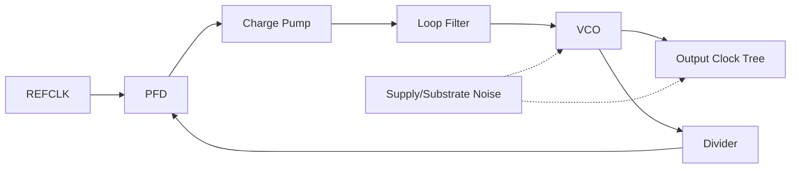
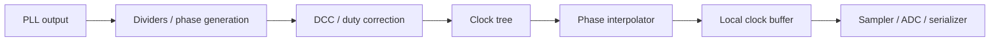
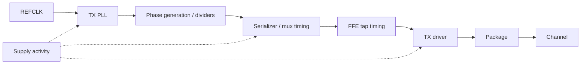
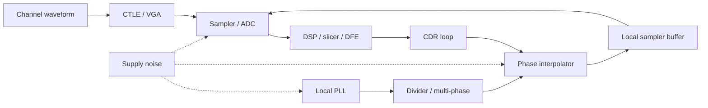
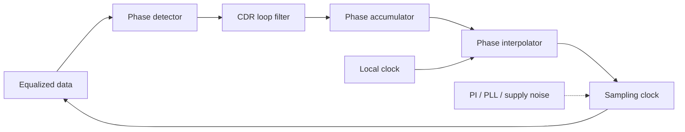
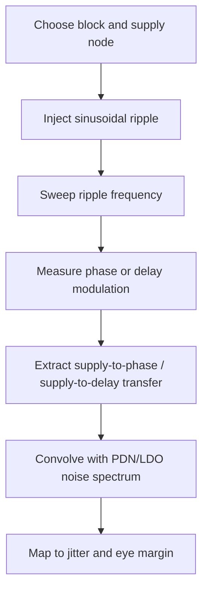
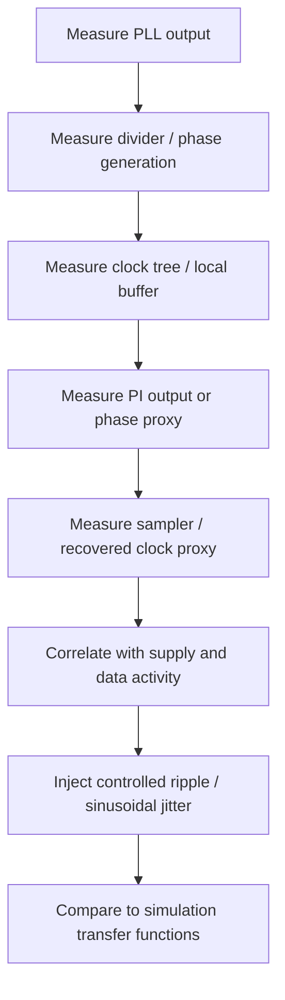

# PLL Phase Noise and Jitter

## 0. Status and Scope

| Item | Content |
|---|---|
| Maturity | Principal / Senior Staff 级 design-review reference；仍需项目 signoff 数据校准 |
| Target role | PCIe 7.0 SerDes clocking、PLL、CDR、ADC-based RX、LDO / power integrity 面试与设计评审 |
| Intended audience | 有经验的 Analog / Mixed-Signal IC、SerDes、PLL/CDR、AMS verification 工程师 |
| Covers | phase noise、integrated jitter、PLL noise shaping、spurs、supply-induced jitter、CDR、PAM4 UI、ADC aperture jitter、simulation、lab debug、review checklist |
| Does not claim | official PCIe 7.0 compliance masks、jitter tolerance limits、Tx/Rx electrical limits、REFCLK requirements 或 pass/fail methodology |
| Spec caveat | 所有官方 spec-level 数值必须查 PCIe 7.0 spec 或 internal IP requirement |

官方合规占位项：

- PCIe 7.0 Tx jitter masks: TODO: verify against PCIe 7.0 spec or internal IP requirement
- PCIe 7.0 Rx jitter tolerance profile: TODO: verify against PCIe 7.0 spec or internal IP requirement
- PCIe 7.0 jitter generation / measurement filters: TODO: verify against PCIe 7.0 spec or internal IP requirement
- PCIe 7.0 REFCLK / SSC assumptions: TODO: verify against PCIe 7.0 spec or internal IP requirement

本笔记不是给出某个项目的 signoff number，而是建立一个可以在 design review 中 defend 的分析框架：从 phase-noise plot 追踪到 TX launch edge、RX sampling instant、ADC aperture、CDR residual error、supply-induced deterministic jitter，以及最终 PAM4 eye / BER margin。

## 1. Executive Summary

Phase noise 是频域的相位扰动描述；jitter 是时域的边沿时间不确定性。二者转换依赖 carrier frequency、offset integration bandwidth、single-sideband convention、spur policy 和 measurement node。

核心关系：

$$
\sigma_t =
\frac{1}{2\pi f_0}
\sqrt{2\int_{f_1}^{f_2}10^{L(f)/10}df}
$$

但在 SerDes 中，PLL output jitter 不是 final sampler jitter。最终 timing margin 还受到 CDR、phase interpolator、clock tree、divider、serializer、TX driver、sampler aperture、ADC clock tree、equalization、LDO output noise、PSRR peaking、package resonance 和 supply pushing 的影响。

PCIe 7.0 PAM4 的关键 timing scale：128 GT/s headline rate 对应 64 Gbaud electrical symbol rate。PAM4 每个 symbol 携带 2 bit，因此：

$$
UI_{sym}=\frac{1}{64\times10^9}=15.625\text{ ps}
$$

$$
UI_{bit,eq}=\frac{1}{128\times10^9}=7.8125\text{ ps}
$$

7.8125 ps 是 bit-equivalent interval，不是 PAM4 symbol UI。讨论 CDR phase placement、sampler timing、horizontal eye closure 时，应默认归一化到 15.625 ps 的 symbol UI，除非上下文明确是在讨论 throughput 或 bit-equivalent 表达。

## 2. Mental Model: From Phase Noise Plot to Eye Closure

phase-noise plot 本身不是 link margin。SerDes review 要把它转成系统影响：phase variance -> RMS time jitter -> TX/RX timing uncertainty -> horizontal eye closure -> timing-to-voltage error -> PAM4 vertical margin loss -> BER / bathtub / link margin。

```mermaid
flowchart LR
  PN[Phase-noise plot<br/>L(f), dBc/Hz] --> VAR[Phase variance<br/>integrate S_phi]
  VAR --> JT[RMS time jitter<br/>divide by 2*pi*f0]
  JT --> PATH[Clock path shaping<br/>PLL / divider / PI / CDR / tree]
  PATH --> H[Horizontal eye closure]
  H --> SLOPE[dV/dt conversion]
  SLOPE --> V[Vertical PAM4 margin loss]
  V --> BER[BER / bathtub / link margin]
```

设计评审中最重要的问题不是 "PLL jitter 几 fs"，而是：这个 jitter number 是哪个节点、哪个 offset band、哪个 carrier、包含哪些 noise sources、是否包含 spurs、经过 CDR 后残留多少、映射到 PAM4 symbol UI 是多少。

## 3. Definitions and Units

### 3.1 Clock and Phase Definitions

Ideal clock:

$$
v_{ideal}(t)=A\cos(2\pi f_0t)
$$

Real clock:

$$
v(t)=A(t)\cos(2\pi f_0t+\phi(t))
$$

其中 $f_0$ 是 carrier frequency，$A(t)$ 是 amplitude variation，$\phi(t)$ 是 phase error。对 clock edge，一阶 timing error 为：

$$
\Delta t(t)\approx \frac{\phi(t)}{2\pi f_0}
$$

### 3.2 Jitter Types

| Quantity | Domain | Unit | Practical use | Notes |
|---|---|---:|---|---|
| phase noise, $L(f)$ | Frequency | dBc/Hz | PLL/VCO spectrum review | Single-sideband, offset from carrier |
| phase-noise PSD, $S_\phi(f)$ | Frequency | rad^2/Hz | 数学积分 | convention 必须明确 |
| RMS phase error, $\sigma_\phi$ | Scalar | rad RMS | Loop/noise budget | 依赖 integration band |
| RMS jitter, $\sigma_t$ | Time | fs, ps | Eye/jitter budget | $\sigma_\phi/(2\pi f_0)$ |
| TIE | Time sequence | s, UI | 长期 edge displacement | edge vs ideal reference |
| period jitter | Time sequence | s RMS | 单周期变化 | 偏重高频 edge noise |
| cycle-to-cycle jitter | Time sequence | s RMS | 相邻周期差 | digital timing 关注 |
| long-term jitter | Time sequence | s RMS/pp | wander | lower integration bound 关键 |
| random jitter, RJ | Statistical | RMS | BER bathtub tail | 常假设 Gaussian，需验证 |
| deterministic jitter, DJ | Bounded | pp | Eye closure | DCD、ISI、spurs、DDJ |
| periodic jitter, PJ | Deterministic | pk/pp | Spur stress | 按 frequency/amplitude 跟踪 |
| data-dependent jitter, DDJ | Pattern | pp | channel/equalization | 与 symbol history 相关 |
| correlated jitter | Cross-domain | RMS/pk/covariance | multi-lane / shared rail | 不能独立 RSS |

### 3.3 Review Terms

| Term | Meaning | Typical review question |
|---|---|---|
| integrated jitter | 对 phase noise 积分得到的 RMS jitter | $f_1$、$f_2$ 是多少？ |
| jitter generation | block 自身产生的 jitter | 是否包含 clock tree？ |
| jitter transfer | input phase modulation 到 output 的传递 | bandwidth 和 peaking？ |
| jitter tolerance | receiver 能承受的 input jitter | spec 还是 internal model？ |
| aperture jitter | ADC/sampler sampling instant uncertainty | 是否 pre-DSP、pre-calibration？ |
| supply pushing | VCO frequency 对 supply 敏感度 | $K_{VDD}(f)$ 和 supply spectrum？ |
| additive jitter | buffer/divider/PI 加入的 jitter | random、deterministic 还是 correlated？ |

## 4. Relationship Between L(f), S_phi(f), Phase Error, and Jitter

Real clock:

$$
v(t)=A(t)\cos(2\pi f_0t+\phi(t))
$$

Small phase-noise 条件下，常用 SSB phase noise 与 phase-noise PSD 的关系为：

$$
S_\phi(f) \approx 2 \cdot 10^{L(f)/10}
$$

其中 $L(f)$ 单位是 dBc/Hz，$S_\phi(f)$ 近似为 rad^2/Hz。Integrated phase variance：

$$
\sigma_\phi^2 = \int_{f_1}^{f_2} S_\phi(f)df
$$

RMS time jitter：

$$
\sigma_t = \frac{\sigma_\phi}{2\pi f_0}
$$

Compact form：

$$
\sigma_t =
\frac{1}{2\pi f_0}
\sqrt{2\int_{f_1}^{f_2}10^{L(f)/10}df}
$$

| Assumption | Why it matters |
|---|---|
| small phase noise | $L(f)$ 到 $S_\phi(f)$ 的近似需要 small-angle |
| single-sideband convention | factor of 2 来自 SSB convention |
| integration offset band | $f_1,f_2$ 改变结果和物理含义 |
| valid carrier frequency | $f_0$ 必须是被转换的 clock carrier |
| spur policy explicit | spurs 可排除、单独表列、或显式建模 |
| linear units | dBc/Hz 必须转 linear 后积分 |
| measurement node | PLL output、divider、PI、sampler clock 不同 |

如果工具直接给 integrated jitter，也必须记录：

$$
\{f_0,\ f_1,\ f_2,\ node,\ PVT,\ supply,\ load,\ spur\ policy\}
$$

## 5. Numerical Integration of Phase Noise

### 5.1 Practical Integration Rules

| Step | Correct method | Common failure |
|---|---|---|
| Convert units | $L_{lin}=10^{L_{dBc/Hz}/10}$ | 直接积分 dB |
| Interpolate | log-frequency / log-density 或足够 dense points | sparse points 漏掉 peaking |
| Integrate | linear frequency domain trapezoid | 目测平均 dBc/Hz |
| Spurs | 单独记录 deterministic tones | 把 spur 混进 RJ |
| Document | 写清 offset band 和 filter | 只说 "100 fs" |
| Resolution | 捕捉 bandwidth / peaking / notch | offset spacing 太粗 |

对相邻点 $(f_i,L_i)$ 与 $(f_{i+1},L_{i+1})$，令：

$$
N(f)=10^{L(f)/10}
$$

若 $N(f)\approx af^m$：

$$
\int_{f_i}^{f_{i+1}}N(f)df=
\begin{cases}
\frac{a}{m+1}\left(f_{i+1}^{m+1}-f_i^{m+1}\right), & m\ne -1 \\
a\ln\left(\frac{f_{i+1}}{f_i}\right), & m=-1
\end{cases}
$$

脚本中也可用 dense interpolation 后做 linear trapezoid：

$$
A \approx \sum_i \frac{N_i+N_{i+1}}{2}(f_{i+1}-f_i)
$$

### Example 1: Flat phase-noise floor

| Parameter | Value |
|---|---:|
| Carrier | 16 GHz |
| $L(f)$ | -120 dBc/Hz |
| Integration band | 1 MHz to 100 MHz |

$$
10^{-120/10}=10^{-12}
$$

$$
A=10^{-12}(100\text{ MHz}-1\text{ MHz})=9.9\times10^{-5}
$$

$$
\sigma_\phi=\sqrt{2A}=0.0141\text{ rad}
$$

$$
\sigma_t=\frac{0.0141}{2\pi\cdot16\times10^9}=140\text{ fs}
$$

### Example 2: Piecewise phase-noise curve

| Offset | L(f) |
|---:|---:|
| 10 kHz | -80 dBc/Hz |
| 100 kHz | -100 dBc/Hz |
| 1 MHz | -115 dBc/Hz |
| 10 MHz | -125 dBc/Hz |
| 100 MHz | -135 dBc/Hz |

| Segment | Approx. slope | Estimated SSB area |
|---|---:|---:|
| 10 kHz to 100 kHz | -20 dB/dec | $9.0\times10^{-5}$ |
| 100 kHz to 1 MHz | -15 dB/dec | $1.69\times10^{-5}$ |
| 1 MHz to 10 MHz | -10 dB/dec | $7.28\times10^{-6}$ |
| 10 MHz to 100 MHz | -10 dB/dec | $7.28\times10^{-6}$ |
| Total |  | $1.21\times10^{-4}$ |

$$
\sigma_\phi=\sqrt{2\cdot1.21\times10^{-4}}=0.0156\text{ rad}
$$

At 16 GHz:

$$
\sigma_t=\frac{0.0156}{2\pi\cdot16\times10^9}=155\text{ fs}
$$

### Example 3: Same phase error at different carrier frequencies

For $\sigma_\phi=0.01$ rad:

| Carrier | RMS jitter | Fraction of 15.625 ps UI |
|---:|---:|---:|
| 4 GHz | 398 fs | 0.0255 UI |
| 8 GHz | 199 fs | 0.0127 UI |
| 16 GHz | 99.5 fs | 0.00637 UI |
| 32 GHz | 49.7 fs | 0.00318 UI |

相同 phase error 在更高 carrier 上对应更小 time error，但这不代表高频 clock 自动更干净；oscillator、divider、phase generation、clock tree 和 edge usage 都会改变。
## 6. PLL Noise Transfer Functions

PLL output phase 是多个 shaped noise contributors 的叠加：

$$
\Phi_{out}(s)=
H_{ref}(s)\Phi_{ref}(s)
+H_{vco}(s)\Phi_{vco}(s)
+H_{div}(s)\Phi_{div}(s)
+H_{pfd/cp}(s)\Phi_{pfd/cp}(s)
+H_{lf}(s)\Phi_{lf}(s)
+\Phi_{add}(s)
$$

Exact equations 取决于架构：integer-N CPPLL、fractional-N CPPLL、sub-sampling PLL、injection-locked PLL、ADPLL、MDLL、ring-PLL、LC-PLL、cascaded clocking 都不同。下面是 Type-II CPPLL 的 review mental model。



Simplified loop gain：

$$
G(s)=\frac{K_{pd}Z(s)K_{vco}}{sN}
$$

Closed-loop reference transfer：

$$
H_{ref}(s)\approx N\frac{G(s)}{1+G(s)}
$$

VCO noise transfer：

$$
H_{vco}(s)\approx \frac{1}{1+G(s)}
$$

Second-order intuition：

$$
H_{ref}(s)\approx N\frac{2\zeta\omega_n s+\omega_n^2}
{s^2+2\zeta\omega_n s+\omega_n^2}
$$

$$
H_{vco}(s)\approx \frac{s^2}{s^2+2\zeta\omega_n s+\omega_n^2}
$$

| Contributor | Transfer intuition | Design knob |
|---|---|---|
| Reference noise | low-pass 到 output，乘以 N | REFCLK quality、PLL bandwidth |
| VCO noise | high-pass 到 output | VCO topology、tank Q、loop bandwidth |
| Divider noise | in-loop contribution | divider topology、swing、supply isolation |
| PFD/CP noise | in-loop contribution | CP current、mismatch、reset timing |
| Loop filter noise | depends on injection point | R/C sizing、active filter noise |
| Fractional-N DSM noise | shaped quantization + spurs | DSM order、dither、calibration |
| Clock buffer additive jitter | post-loop，不被 PLL suppress | buffer sizing、supply、load、layout |
| Post-PLL clocking | 可能主导 sampler jitter | divider、DCC、PI、local routing |

Post-PLL clocking 必须包含：



## 7. PLL Bandwidth and Jitter Peaking

PLL bandwidth 是 tradeoff，不是越大越好或越小越好。Wider bandwidth suppresses VCO close-in noise，但会放过更多 reference、PFD、CP、divider、fractional-N 和 reference spur energy。Narrower bandwidth filters reference path，但暴露更多 VCO noise，也可能影响 lock、SSC tracking 和 CDR interaction。

| PLL bandwidth choice | Improves | Hurts | Review questions |
|---|---|---|---|
| Wider | VCO close-in suppression、lock time、tracking | reference/in-loop noise、spur pass-through、stability margin | REFCLK 是否足够干净？CP/divider noise 是否低？ |
| Narrower | reference filtering、部分 spur attenuation | VCO noise、lock/relock、SSC tracking | VCO 是否主导？系统是否能承受慢 tracking？ |
| Higher damping | less peaking、robust loop | slower response | PVT/extracted phase margin？ |
| Lower damping | faster response | jitter peaking、ringing、limit cycle | peaking 是否计入 integrated jitter？ |

Design-review questions：

- 每个 offset decade 由哪个 noise source 主导？
- reference/VCO crossover 在哪里？
- loop bandwidth 附近是否有 peaking？
- reference/fractional spurs 是否在 loop bandwidth 内？
- SSC 由 PLL 还是 CDR track？
- CDR 在同一频段是 tracking 还是 rejecting？
- 最低 integrated PLL jitter 是否真的对应最大 link margin？

### Example 4: Loop peaking can dominate

假设 5 MHz 附近有 -115 dBc/Hz 的 baseline phase-noise density，宽度 4 MHz；loop peaking 使该区域升高 4 dB。Linear density 增加倍数：

$$
10^{4/10}=2.51
$$

增量 SSB area：

$$
\Delta A=(2.51-1)\cdot10^{-11.5}\cdot4\times10^6=1.91\times10^{-5}
$$

At 16 GHz：

$$
\Delta\sigma_t\approx
\frac{\sqrt{2\Delta A}}{2\pi\cdot16\times10^9}=61.5\text{ fs}
$$

几 dB peaking 在高能量频段上足以成为 budget item。

## 8. Phase Noise Slopes and Physical Interpretation

| Slope | Noise name | Physical source | Circuit-level knob |
|---:|---|---|---|
| -30 dB/dec | flicker FM | 1/f noise upconverted to frequency noise | device sizing、bias point、symmetry |
| -20 dB/dec | white FM | resonator/device thermal noise causing frequency diffusion | tank Q、swing、gm noise、bias current |
| -10 dB/dec | flicker PM | direct flicker phase modulation | buffer flicker、waveform symmetry |
| 0 dB/dec | white PM floor | buffer/divider additive white phase noise、measurement floor | slew rate、load、supply isolation |

LC oscillator 依赖 tank Q、swing、varactor noise、flicker upconversion、supply pushing 和 layout parasitic。Ring oscillator 面积小、tuning range 大，但 delay-cell noise 和 supply sensitivity 往往更强。ADPLL/DCO 把部分问题转移到 quantization、TDC noise、digital supply coupling 和 limit cycle。

Leeson-style intuition：

$$
L(\Delta f)\propto
10\log_{10}\left[
\frac{F kT}{P_s}
\left(1+\left(\frac{f_0}{2Q\Delta f}\right)^2\right)
\right]
$$

这是 intuition，不是 signoff equation；它隐藏了 AM-to-PM、ISF、supply pushing、layout parasitic 和 sampled-loop behavior。

## 9. Spurs and Deterministic Jitter

Spurs 是 deterministic phase modulation，要按 frequency、amplitude、source、transfer path、CDR tracking 分开记录。

| Spur type                      | Typical source                      | Review concern                          |
| ------------------------------ | ----------------------------------- | --------------------------------------- |
| Reference spur                 | PFD/CP ripple、reference feedthrough | in-band PJ、spectral line                |
| Fractional spur                | fractional-N pattern、DSM residue    | deterministic PJ、calibration dependence |
| DSM quantization spur          | limit cycle / tonal quantization    | fractional word dependent               |
| Supply spur                    | DC/DC ripple、digital activity       | correlated jitter、package resonance     |
| Substrate spur                 | digital clocks、memory traffic       | mode-dependent lab failure              |
| Package / decap resonance spur | PDN anti-resonance                  | frequency-specific jitter explosion     |
| Clock-tree periodic modulation | DCC、muxing、divider sequence         | DCD、even/odd jitter                     |
| Pattern-dependent jitter       | ISI、driver level-dependent delay    | DDJ eye closure                         |

Sinusoidal phase modulation：

$$
\phi(t)=\phi_{pk}\sin(2\pi f_mt)
$$

Peak timing jitter：

$$
t_{pk}=\frac{\phi_{pk}}{2\pi f_0}
$$

RMS equivalent for pure sine：

$$
t_{rms}=\frac{t_{pk}}{\sqrt{2}}
$$

Spur 不应 blindly RSS with RJ。一个 RMS 很小的 spur 仍可能造成 deterministic eye closure、CDR stress、spectral failure 或 multi-lane correlated failure。Behavioral model：

$$
t_{edge}(n)=nT+t_{pk}\sin(2\pi f_m nT+\theta)
$$

### Example 5: 16 GHz carrier with 2 MHz supply spur

| Parameter | Value |
|---|---:|
| Carrier | 16 GHz |
| Spur modulation frequency | 2 MHz |
| Peak phase modulation | 0.006 rad |

$$
t_{pk}=\frac{0.006}{2\pi\cdot16\times10^9}=59.7\text{ fs}
$$

$$
t_{rms}=42.2\text{ fs}
$$

如果 2 MHz 在 CDR tracking bandwidth 内，sampler 可能 track 一部分；如果在 tracking region 外，则更直接地成为 residual sampling error。正确结论需要 CDR jitter transfer。

## 10. Supply Noise, LDO, and Power Integrity to Jitter

Supply 是 phase-noise input。SerDes clock rail 要按 frequency-dependent transfer path 审查，而不是只看 DC voltage。

### 10.1 Supply-to-Timing Paths

| Path | Mechanism | Metric |
|---|---|---|
| VCO supply pushing | VDD modulates oscillation frequency | $K_{VDD}=\Delta f/\Delta VDD$ |
| Clock buffer delay modulation | VDD changes delay and slew | $K_{d,VDD}=\Delta t_d/\Delta VDD$ |
| Divider sensitivity | regenerative edge timing shifts | additive jitter vs ripple |
| PI sensitivity | interpolation weights/delay shift | phase INL/DNL vs supply |
| Sampler aperture | latch aperture moves with supply | aperture transfer |
| LDO output noise | regulator noise into PLL rail | output noise density |
| LDO PSRR | upstream ripple attenuation | PSRR(f), including peaking |
| Package/decap resonance | PDN impedance peaks | $Z_{PDN}(f)$ |
| Shared rail coupling | digital activity creates common jitter | covariance / correlation |

### 10.2 VCO Supply Pushing

$$
K_{VDD}=\frac{\Delta f}{\Delta V_{DD}}
$$

$$
\Delta f(t)=K_{VDD}v_n(t)
$$

$$
\phi_n(t)=2\pi\int \Delta f(t)dt
$$

For sinusoidal ripple：

$$
v_n(t)=V_n\sin(2\pi f_mt)
$$

$$
\phi_{pk}\approx \frac{K_{VDD}V_n}{f_m}
$$

Clock buffer delay modulation：

$$
\Delta t_d \approx K_{d,VDD}\Delta V_{DD}
$$

### Example 6: Supply ripple to VCO phase modulation

| Parameter | Value |
|---|---:|
| $K_{VDD}$ | 50 MHz/mV |
| Ripple amplitude | 0.05 mV peak |
| Ripple frequency | 10 MHz |
| Carrier | 16 GHz |

$$
\Delta f_{pk}=50\frac{\text{MHz}}{\text{mV}}\cdot0.05\text{ mV}=2.5\text{ MHz}
$$

$$
\phi_{pk}\approx \frac{2.5\text{ MHz}}{10\text{ MHz}}=0.25\text{ rad}
$$

$$
t_{pk}=\frac{0.25}{2\pi\cdot16\times10^9}=2.49\text{ ps}
$$

这说明 low-frequency supply pushing 可以极其危险；真实系统还需考虑 PLL loop 对注入点的 shaping。

### Example 7: Clock buffer supply sensitivity

| Parameter | Value |
|---|---:|
| Buffer delay sensitivity | 0.8 ps/mV |
| Local ripple | 0.1 mV peak |
| PCIe 7.0 PAM4 symbol UI | 15.625 ps |

$$
\Delta t_{pk}=0.8\frac{\text{ps}}{\text{mV}}\cdot0.1\text{ mV}=80\text{ fs}
$$

$$
\frac{80\text{ fs}}{15.625\text{ ps}}=0.00512\ UI_{sym}
$$

如果该项是 periodic、correlated 或与其它 deterministic terms 同相，不能简单 RSS 掉。

### 10.3 Design Guidance for LDO and PDN

| Review item | Strong answer |
|---|---|
| LDO PSRR | specify PSRR(f)，包含 peaking、dropout、headroom |
| Output noise | integrate LDO output noise over PLL sensitivity bands |
| PDN resonance | simulate/package-measure impedance peaks 和 decap anti-resonance |
| Supply injection | sweep ripple into VCO、divider、buffer、PI、sampler |
| Lab supply | 使用 realistic ripple/noise；clean supply 可隐藏 product problem |
| Shared rails | identify common-mode jitter across lanes / clock domains |

DC PSRR 对 SerDes clocking 通常意义很弱；真正危险的往往是 MHz 到 hundreds of MHz 的 ripple、LDO loop peaking、package inductance、decap anti-resonance 和 load transient。
## 11. PCIe 7.0 PAM4 Timing Scale

PCIe 7.0 headline rate 是 128 GT/s per lane。PAM4 每个 symbol 携带 2 bit：

$$
R_s=\frac{R_b}{\log_2(M)}
$$

For PAM4：

$$
R_s=\frac{128\text{ Gb/s}}{2}=64\text{ Gbaud}
$$

$$
UI_{sym}=\frac{1}{64\times10^9}=15.625\text{ ps}
$$

$$
f_{Nyquist}=\frac{R_s}{2}=32\text{ GHz}
$$

$$
UI_{bit,eq}=\frac{1}{128\times10^9}=7.8125\text{ ps}
$$

| Timing error | Fraction of 15.625 ps symbol UI | Fraction of 7.8125 ps bit-equivalent interval |
|---:|---:|---:|
| 25 fs | 0.00160 UI | 0.00320 UI |
| 50 fs | 0.00320 UI | 0.00640 UI |
| 100 fs | 0.00640 UI | 0.0128 UI |
| 200 fs | 0.0128 UI | 0.0256 UI |
| 500 fs | 0.0320 UI | 0.0640 UI |
| 1 ps | 0.0640 UI | 0.128 UI |

此表不是 PCIe pass/fail limit。Compliance limits: TODO: verify against PCIe 7.0 spec or internal IP requirement

## 12. TX Path Jitter Propagation

TX jitter 是 actual launched waveform 的 edge uncertainty，不只是 PLL output phase noise。



| TX element | Timing concern |
|---|---|
| PLL output | integrated RJ、spurs、supply pushing |
| Serializer clock | mux aperture、bit/symbol slice skew |
| Divider/multi-phase | phase spacing error、DCD |
| FFE taps | tap timing error changes pre/post-cursor waveform |
| TX driver | delay modulation、level-dependent delay、slew variation |
| Supply | data-dependent 或 periodic delay movement |
| Package/channel | jitter becomes waveform timing and ISI stress |

Review questions：

- jitter measured at PLL pin、serializer input、driver input 还是 package output？
- 是否包含 serializer、driver、DCD、TX supply activity？
- FFE tap timing 是否 modeled？
- level-dependent delay 是否从 RJ 分离？

## 13. RX Path Jitter Propagation

RX timing error 是 actual sampling instant 的 residual error：

$$
e_t(t)=t_{sample,actual}(t)-t_{sample,ideal}(t)
$$



| RX contributor | Mechanism | Review point |
|---|---|---|
| Local PLL | phase noise、spurs、supply pushing | transfer through divider/PI/CDR |
| Divider/multi-phase | additive jitter、phase mismatch | extracted layout and supply sensitivity |
| PI | quantization、INL/DNL、thermal noise | step size and limit cycles |
| CDR loop | residual error、PD noise、peaking | jitter transfer/generation/tolerance |
| Local buffer | additive jitter and delay modulation | load and extracted parasitics |
| Sampler/ADC | aperture jitter | convert to voltage error |
| Equalizer | changes slope and PD bias | co-simulate with CDR |

CDR 能 track 一部分 input phase movement，但不能消除 sampling instant 上发生的 local aperture error。PAM4 phase detector uncertainty 与 NRZ 不同，因为 transition amplitude、threshold confidence、residual ISI 和 equalizer state 都会影响 phase estimate。

## 14. CDR Jitter Transfer, Tolerance, and Generation



| Concept | Meaning | Design question | Measurement / simulation method |
|---|---|---|---|
| jitter transfer | input data jitter 到 recovered/sampling clock | 哪些频率被 track？ | sinusoidal jitter injection sweep |
| jitter tolerance | RX 可承受 input jitter | BER/margin criterion 是什么？ | Link sim or lab JTOL；spec values TODO: verify against PCIe 7.0 spec or internal IP requirement |
| jitter generation | RX clocking 自身产生 jitter | quiet input 时 RX 加多少？ | transient noise、phase noise、lab recovered clock |
| input jitter | incoming data phase movement | 是否与 reference correlated？ | Tx/channel model |
| local clock jitter | PLL/PI/sampler clock movement | CDR 是否 track 或 add？ | PLL/CDR co-sim |
| residual sampling error | loop 后 actual sample error | 什么真正 close eye？ | behavioral + transistor-level correlation |

Bang-bang CDR 是 nonlinear，可能产生 limit cycle；linear CDR 容易分析但仍受 PD gain、PAM4 threshold uncertainty、equalization state 和 quantization 影响。Wider CDR bandwidth 更能 track wander/SSC，但通过更多 input jitter 和 PD noise；narrower bandwidth 过滤更多 jitter，但降低 frequency offset、wander、SSC tolerance。Peaking 和 PI quantization 都可成为 residual jitter source。

## 15. ADC-Based RX and Aperture Jitter

ADC-based PAM4 RX 不会消除 clocking problem。采样时间误差发生在 DSP 看到数据之前。

Timing-to-voltage：

$$
\sigma_v \approx \left|\frac{dV}{dt}\right|\sigma_t
$$

Jitter-limited SNR：

$$
SNR_{jitter}\approx -20\log_{10}(2\pi f_{in}\sigma_t)
$$

### Example 8: 16 GHz input with 100 fs jitter

$$
2\pi f_{in}\sigma_t
=2\pi\cdot16\times10^9\cdot100\times10^{-15}
=0.0101
$$

$$
SNR_{jitter}= -20\log_{10}(0.0101)=40.0\text{ dB}
$$

### Example 9: 16 GHz input with 200 fs jitter

$$
2\pi f_{in}\sigma_t=0.0201
$$

$$
SNR_{jitter}=33.9\text{ dB}
$$

Jitter doubling costs about 6 dB。对 high-speed PAM4 ADC-based RX，这不只是 ADC ENOB 问题，而是 pre-DSP vertical eye margin loss。

### TI-ADC Skew and Dynamic Sampling Error

| Issue | Effect | Mitigation / review |
|---|---|---|
| Static TI skew | periodic sampling error and tones | foreground/background skew calibration |
| Dynamic skew | data/supply/temp-dependent jitter | supply isolation、adaptive calibration |
| Phase spacing error | nonuniform sample phases | PI/divider matching and calibration |
| Clock tree mismatch | lane/sub-ADC aperture mismatch | extracted clock-tree simulation |
| Calibration residual | residual floor after correction | PVT and activity stress |

ADC/DSP 不能完全恢复 pre-sampling aperture error 已经损失的信息；只能通过统计估计、equalization 和 calibration 部分缓解。

## 16. Simulation Methodology

### 16.1 VCO phase noise simulation

| Step | Action | Review output |
|---|---|---|
| PSS | oscillator mode PSS | stable frequency / amplitude |
| Pnoise | extract phase noise vs offset | $L(f)$ table and plot |
| Tuning sensitivity | sweep control voltage/code | $K_{VCO}$ and gain variation |
| Supply pushing | sweep or inject supply | $K_{VDD}$ and phase modulation |
| PVT | process/voltage/temp corners | worst-case phase noise and headroom |
| Extracted layout | tank/routing/varactor/supply parasitics | layout-induced degradation |

Cadence / SpectreRF review 要确认 PSS convergence 物理合理、noise contributor 没被 ideal source 隐藏、tank amplitude realistic、far-out floor 不是 simulator artifact。

### 16.2 Closed-loop PLL phase noise

推荐层级：

1. behavioral PLL model with source PSDs and loop transfer。
2. transistor-level VCO / CP / divider / reference path blocks where practical。
3. closed-loop source breakdown：reference、PFD/CP、LF、divider、DSM、VCO、buffer。
4. loop bandwidth / peaking extraction from phase transfer or injected modulation。
5. reference、fractional、supply、substrate spur analysis。
6. documented integration band and inclusion/exclusion policy。

Fractional-N intuition：

$$
\Phi_{out}(z)=NTF_{DSM}(z)Q(z)+STF(z)\Phi_{ref}(z)+\ldots
$$

### 16.3 Transient noise jitter

| Metric | How to extract | Limitation |
|---|---|---|
| Period jitter | measure each period | short run misses low-frequency wander |
| Cycle-to-cycle jitter | adjacent-period difference | emphasizes high-frequency noise |
| TIE | edge time vs ideal index | needs long run and reference |
| Long-term jitter | accumulated TIE statistics | expensive for low offsets |
| Seed sensitivity | multiple noise seeds | runtime cost |

Transient noise 是 Pnoise integration 的 sanity check，特别适合 nonlinear circuits、clock dividers、PIs、samplers、supply injection。

### 16.4 Supply injection simulation



Include LDO output impedance/noise、package inductance、decap、on-die grid、realistic load activity 和 extracted supply routing。Sweep 要覆盖 LDO bandwidth、PLL bandwidth、CDR bandwidth、package resonance 和 digital clock activity bands。

### 16.5 System-level behavioral modeling

Python / MATLAB / internal link tools 中应注入 random jitter、sinusoidal jitter、bounded deterministic jitter、DDJ、correlated jitter、CDR transfer、PI quantization、PAM4 CTLE/FFE/DFE/ADC aperture effects。

$$
t_n=nT+t_{RJ,n}+t_{PJ}\sin(2\pi f_m nT)+t_{DDJ}(pattern)+t_{corr}(n)
$$
## 17. Lab Measurement and Debug

Lab number 只有在 instrument、node、filter、supply condition 明确时才有意义。

| Instrument | Strength | Pitfall |
|---|---|---|
| Phase noise analyzer | low-noise spectral measurement | floor/cross-correlation and carrier setup |
| Real-time oscilloscope | TIE/period/cycle jitter/data waveform | scope floor、trigger artifact |
| Sampling scope | eye/bathtub/high-speed waveform | clock recovery setting may hide jitter |
| Spectrum analyzer | spurs and modulation tones | phase-noise floor often inadequate |
| Power rail probe | supply ripple correlation | probe inductance / ground errors |

Lab debug hierarchy：



Lab review checklist：

- measurement floor 是否低于 DUT noise？
- cross-correlation 是否启用并记录？
- integration filter 和 offset band 是什么？
- spurs 是否包含在 RMS？
- clock 是否先被 divide，scaling 如何处理？
- RMS、pk、pp、BER-extrapolated jitter 是否混用？
- supply 是否 realistic，还是 clean bench supply？
- probes/cables/fixtures 是否 de-embed？
- PLL output 是否被误当成 final sampler clock？
- instrument clock recovery 是否 mask low-frequency jitter？

## 18. Combining Jitter Contributions

Independent RJ 可以 RSS：

$$
\sigma_{RJ,total}=\sqrt{\sum_i \sigma_{RJ,i}^2}
$$

Deterministic、periodic、data-dependent、correlated terms 需要 separate tracking 或 explicit time-domain/statistical modeling。

| Contributor | Type | Example value | Combine method | Notes |
|---|---|---:|---|---|
| PLL integrated phase noise | Random | 80 fs RMS | RSS if independent | state band and node |
| Clock tree additive jitter | Random | 45 fs RMS | RSS if independent | extracted load required |
| PI quantization | Bounded | 35 fs pk | model explicitly | may create limit cycle |
| Supply spur | Periodic | 60 fs pk | separate deterministic | frequency matters |
| DCD | Deterministic | 150 fs pp | separate | edge polarity dependent |
| Sampler aperture jitter | Random | 70 fs RMS | RSS if independent | pre-DSP error |
| Residual CDR error | Mixed | 90 fs RMS | transfer-model dependent | includes PD and loop noise |
| TI-ADC skew residual | Deterministic/dynamic | 100 fs pp | separate/calibrated model | can create tones |

### Example 10: Mixed jitter budget

$$
\sigma_{RJ}=\sqrt{80^2+45^2+70^2+90^2}=145\text{ fs}
$$

$$
\frac{145\text{ fs}}{15.625\text{ ps}}=0.00928\ UI_{sym}
$$

60 fs pk supply spur、150 fs pp DCD、35 fs pk PI quantization、100 fs pp TI skew residual 不能因为 RSS subtotal 小就消失。BER extrapolation 前必须验证 distribution、bandwidth、correlation 和 deterministic stress。

## 19. Design Review Red Flags

1. Jitter number without integration bandwidth.
2. No carrier frequency.
3. No measurement node.
4. No spur inclusion/exclusion policy.
5. No supply condition or rail noise spectrum.
6. PLL output jitter treated as sampler jitter.
7. Clock tree, divider, DCC, or PI not included.
8. CDR jitter transfer ignored.
9. CDR jitter tolerance claimed with no criterion. TODO: verify against PCIe 7.0 spec or internal IP requirement
10. PCIe PAM4 timing normalized to 7.8125 ps without bit-equivalent context.
11. LDO PSRR quoted only at DC.
12. Clean lab supply used as proof of product margin.
13. Deterministic jitter RSS-combined as random.
14. Spurs hidden inside RMS number.
15. PI quantization and INL/DNL ignored.
16. Divider additive jitter ignored.
17. Extracted clock tree not simulated.
18. No PVT coverage.
19. No phase-noise source breakdown.
20. No package resonance or decap anti-resonance check.
21. No supply-to-phase simulation.
22. No supply-to-delay simulation.
23. No transient noise sanity check.
24. No behavioral link-level mapping to PAM4 eye/bathtub.
25. No correlation analysis across lanes/shared rails.
26. Lab measurement floor not shown.
27. Instrument clock recovery settings not documented.
28. Fractional-N DSM tones assumed random without evidence.
29. ADC aperture jitter omitted because "DSP will fix it".
30. Official PCIe pass/fail implied from internal example number. TODO: verify against PCIe 7.0 spec or internal IP requirement

## 20. Common Mistakes

1. Integrating phase noise directly in dB.
2. Comparing jitter numbers with different offset bands.
3. Forgetting SSB factor-of-2 convention.
4. Using wrong carrier frequency for phase-to-time conversion.
5. Treating RMS and peak-to-peak as interchangeable.
6. Reporting PLL jitter without node/PVT/supply/load/source list.
7. Ignoring loop peaking.
8. Assuming wider PLL bandwidth is always better.
9. Assuming narrower PLL bandwidth is always better.
10. Treating reference noise as irrelevant after multiplication.
11. Treating VCO far-out noise as irrelevant because CDR exists.
12. RSS-combining spurs, DCD, DDJ, and RJ.
13. Ignoring low-frequency supply pushing.
14. Treating LDO output noise and PSRR as scalar specs.
15. Missing PSRR peaking near LDO/package resonance.
16. Simulating only ideal supplies.
17. Ignoring divider and buffer additive jitter.
18. Ignoring extracted clock-tree parasitics and loading.
19. Ignoring PI quantization, INL, DNL, and limit cycles.
20. Assuming CDR tracks all low-frequency jitter.
21. Assuming CDR rejects all high-frequency jitter.
22. Using PCIe 7.0 bit-equivalent interval as PAM4 symbol UI.
23. Treating PAM4 jitter as only horizontal.
24. Assuming ADC/DSP can correct aperture jitter after sampling.
25. Ignoring TI-ADC dynamic skew and calibration residual.
26. Measuring divided clocks and scaling incorrectly.
27. Ignoring instrument noise floor and trigger jitter.
28. Forgetting cross-lane correlated jitter from shared rails.
29. Omitting data-dependent TX driver delay.
30. Declaring compliance without official mask/test condition. TODO: verify against PCIe 7.0 spec or internal IP requirement

## 21. Interview Q&A

### Q1. phase noise 和 jitter 的区别是什么？

中文：phase noise 是 clock carrier 周围相位扰动的频域密度，通常以 dBc/Hz versus offset frequency 表示。jitter 是边沿在时域中的 timing uncertainty。二者通过 phase-to-time conversion 关联。

English: Phase noise is the frequency-domain density of phase fluctuation around a carrier, while jitter is the time-domain uncertainty of clock edges. After integration over a defined offset band, RMS phase error is converted to RMS time jitter by dividing by $2\pi f_0$.

### Q2. 如何从 L(f) 转成 RMS jitter？

中文：把 dBc/Hz 转 linear density，按 offset band 积分，按 SSB convention 乘以 2 得到 phase variance，开方得到 $\sigma_\phi$，再除以 $2\pi f_0$。

English: Convert $L(f)$ to linear units, integrate over the offset band, apply the SSB factor, take the square root, and divide by $2\pi f_0$.

### Q3. 为什么 integration bandwidth 很重要？

中文：不同 offset region 对应不同物理源和不同系统传递。低频可能被 CDR track，高频可能直接成为 sampling error，loop bandwidth 附近 peaking 可能主导积分面积。

English: Integration bandwidth defines which physical noise mechanisms are included and whether the result maps to PLL output, CDR residual error, ADC aperture, or compliance measurement.

### Q4. 为什么 carrier frequency 影响 jitter？

中文：phase 是角度误差，jitter 是时间误差；同样的 phase error 在更高 carrier 上对应更短时间。

English: The conversion is $\Delta t=\Delta\phi/(2\pi f_0)$, so the same phase error maps to different timing error at different carrier frequencies.

### Q5. PLL bandwidth tradeoff 是什么？

中文：宽带宽 suppress VCO close-in noise，但通过更多 reference/PFD/CP/divider noise 和 spurs。窄带宽过滤 reference path，但暴露更多 VCO noise，并影响 lock、SSC 和 CDR interaction。

English: PLL bandwidth trades VCO noise suppression against reference and in-loop noise pass-through. The best bandwidth maximizes system margin, not just standalone integrated jitter.

### Q6. loop peaking 为什么危险？

中文：peaking 会在 bandwidth 附近放大 phase noise 或 modulation；几 dB peaking 如果落在高噪声密度区域，会显著增加 jitter。

English: Loop peaking can dominate integrated jitter and jitter transfer near bandwidth, so it must be included in integration and CDR analysis.

### Q7. reference noise 和 VCO noise 谁主导？

中文：简化模型中 bandwidth 内 reference/in-loop noise 更容易到 output，bandwidth 外 VCO noise 更容易主导；实际必须看 source breakdown。

English: Inside loop bandwidth, reference and in-loop noise tend to dominate; outside it, VCO noise tends to dominate. The actual breakdown must be simulated.

### Q8. spurs 和 random jitter 怎么区别？

中文：spurs 是 deterministic periodic phase modulation，应按 frequency、amplitude、source、CDR tracking 单独分析。

English: Spurs are deterministic periodic jitter. I track them separately from random jitter because they can create deterministic eye closure even with small RMS contribution.

### Q9. supply noise 如何变成 jitter？

中文：VCO supply pushing 把 voltage noise 变成 frequency modulation，再积分成 phase modulation；buffer/divider/PI/sampler supply sensitivity 直接调制 delay/aperture。

English: Supply noise creates jitter through VCO frequency pushing and delay modulation in buffers, dividers, PIs, and samplers.

### Q10. LDO PSRR 为什么相关？

中文：LDO 决定 upstream ripple 和自身 output noise 如何进入 PLL rail。SerDes 关心 PSRR(f)、output impedance、peaking 和 package/decap resonance。

English: LDO PSRR matters because supply ripple couples into phase and delay. PSRR versus frequency matters much more than DC PSRR.

### Q11. 为什么 PLL output jitter 不等于 sampler jitter？

中文：PLL 后面还有 divider、multi-phase generation、clock tree、DCC、PI、local buffer、sampler aperture 和 CDR residual error。

English: Final sampler jitter includes post-PLL distribution, PI behavior, local buffers, sampler aperture, supply sensitivity, and CDR residual error.

### Q12. CDR bandwidth 如何影响 jitter？

中文：CDR bandwidth 决定 input phase movement 中哪些被 track，哪些成为 residual sampling error。

English: CDR bandwidth shapes residual timing error and trades tracking ability against jitter/noise pass-through.

### Q13. jitter transfer、tolerance、generation 是什么？

中文：transfer 是 input jitter 到 recovered/sampling clock 的传递；tolerance 是 RX 能承受的 input jitter；generation 是 RX/clocking 自身产生的 jitter。

English: Transfer is how input jitter appears at the recovered clock, tolerance is how much input jitter the receiver tolerates, and generation is internally produced jitter.

### Q14. PCIe 7.0 PAM4 的 UI 怎么说？

中文：128 GT/s PAM4 对应 64 Gbaud，symbol UI 是 15.625 ps。7.8125 ps 是 bit-equivalent interval。

English: For PCIe 7.0 PAM4, the electrical symbol rate is 64 Gbaud, so the symbol UI is 15.625 ps; 7.8125 ps is bit-equivalent.

### Q15. 128 GT/s 和 64 Gbaud 的关系？

中文：PAM4 每 symbol 携带 2 bit，所以 128 Gb/s bit-equivalent rate 除以 2 得到 64 Gbaud。

English: PAM4 carries two bits per symbol, so 128 Gb/s bit-equivalent rate corresponds to 64 Gbaud electrical symbol rate.

### Q16. ADC aperture jitter 为什么重要？

中文：aperture jitter 在 sampling 前发生，DSP 只能处理采样后的数据。timing error 经 $dV/dt$ 变成 voltage error。

English: Aperture jitter converts input slope into voltage noise before DSP can correct anything.

### Q17. TI-ADC skew 和 jitter 有何关系？

中文：static skew 产生 deterministic tones；dynamic skew 是 supply/temp/activity dependent timing error。

English: TI-ADC skew is sampling-time error across interleaved channels; static skew creates tones, dynamic skew behaves like time-varying jitter.

### Q18. PI quantization 为什么不能忽略？

中文：PI step、INL/DNL 和 digital limit cycle 会产生 bounded residual phase error。

English: PI quantization and nonlinearity create bounded phase error and possible limit cycles in the CDR.

### Q19. deterministic jitter 包括什么？

中文：DCD、spurs、DDJ、ISI timing shift、pattern-dependent driver delay、PI limit cycle、supply ripple 都属于 deterministic 或 bounded effects。

English: Deterministic jitter includes DCD, spurs, DDJ, ISI-related shifts, and supply-induced periodic jitter.

### Q20. correlated jitter 怎么处理？

中文：shared supply、reference、package resonance、digital aggressor 会产生 cross-lane correlated jitter，不能当 independent RJ。

English: Correlated jitter should be modeled with covariance, common-mode terms, or explicit time-domain injection, not independent RSS.

### Q21. measurement pitfalls 有哪些？

中文：instrument floor、cross-correlation、filter、clock division scaling、clock recovery settings、spur policy、unrealistic supply 都是常见坑。

English: Measurement pitfalls include instrument floor, filters, division scaling, clock recovery settings, spur policy, and unrealistic supply.

### Q22. simulation flow 如何组织？

中文：VCO PSS/Pnoise -> closed-loop source breakdown -> transient noise sanity -> supply injection -> extracted clock path -> behavioral link mapping。

English: I use device-level phase noise, closed-loop source breakdown, transient noise, supply injection, extracted clock-path simulation, and behavioral link modeling.

### Q23. jitter 过大如何 debug？

中文：按节点切：PLL output、divider、clock tree、PI、sampler；按类型切：RJ、spurs、supply-induced、DDJ、DCD、correlated jitter。

English: I isolate nodes and separate random, deterministic, supply-induced, data-dependent, and correlated components.

### Q24. design review 中如何呈现 jitter？

中文：用表格说明 carrier、node、band、PVT、supply、load、sources、spur policy、CDR transfer、UI normalization 和 link impact。

English: A credible jitter presentation states carrier, node, band, PVT, supply, load, source inclusion, spur policy, CDR transfer assumptions, UI normalization, and eye/BER impact.

### Q25. 如何避免 overclaiming PCIe compliance？

中文：只说内部条件和 margin，不把 example number 当 compliance limit。所有 mask、JTOL、JGEN、filter、test condition 都要官方确认。

English: I avoid claiming compliance unless the result follows official required conditions. Any mask, tolerance, or pass/fail limit must be verified against the PCIe 7.0 spec or internal IP requirement.

### Q26. clean lab supply 为什么会误导？

中文：clean supply 可能掩盖 LDO PSRR peaking、package resonance、digital coupling 和 shared rail correlation。

English: A clean bench supply can hide product failures because real PDN ripple and shared-rail activity may dominate jitter.

### Q27. PAM4 jitter-to-voltage conversion 如何解释？

中文：timing error 乘以 waveform slope 变成 voltage error。PAM4 vertical eye 小，所以 timing 和 vertical margin 强耦合。

English: Timing jitter becomes voltage error through local signal slope; PAM4's smaller vertical eyes make this coupling critical.

## 22. Principal-Level Design Checklist

### PLL architecture

- [ ] Architecture、multiplication ratio、clock rate、output usage 清楚。
- [ ] Integer/fractional mode、DSM behavior、spur risks 已记录。
- [ ] Reference、VCO、divider、PFD/CP、LF、buffer、supply paths 有 source breakdown。
- [ ] Loop bandwidth、damping、peaking、lock time、SSC、CDR interaction 联合 review。

### Phase-noise simulation

- [ ] VCO PSS/Pnoise 覆盖 PVT 和 tuning range。
- [ ] Closed-loop phase noise 包含 realistic reference、divider、CP、LF、VCO、DSM、buffer sources。
- [ ] Integration band 和 spur treatment 明确。
- [ ] Key nodes 有 transient noise sanity check。

### Jitter integration

- [ ] dBc/Hz 先转 linear density。
- [ ] Carrier frequency 和 measurement node 正确。
- [ ] Peaking、sparse offset points、spurs 未漏掉。
- [ ] Random 与 deterministic components 分离。

### Clock tree

- [ ] Divider、multi-phase generator、DCC、clock tree、PI、local buffers、loads 已包含。
- [ ] Extracted layout 和 supply sensitivity 已模拟。
- [ ] DCD、level-dependent delay、buffer supply pushing 已 review。

### CDR

- [ ] Jitter transfer、jitter tolerance、jitter generation 分开定义。
- [ ] Bang-bang/linear CDR assumptions 已记录。
- [ ] PI quantization、INL/DNL、limit cycles 已建模。
- [ ] PAM4 PD uncertainty 和 equalizer interaction 已包含。

### ADC sampling

- [ ] Aperture jitter 已转换为 voltage error 和 SNR impact。
- [ ] TI-ADC static skew、dynamic skew、phase spacing error、calibration residual 已 budget。
- [ ] Sampling clock tree mismatch 已 extracted simulation。

### LDO / supply

- [ ] LDO output noise 和 PSRR(f) 已包含，不只 DC PSRR。
- [ ] PDN impedance、package resonance、decap anti-resonance 已检查。
- [ ] Supply-to-phase 和 supply-to-delay transfer 已 sweep。
- [ ] Shared-rail correlated jitter across lanes 已分析。

### Spurs

- [ ] Reference、fractional、DSM、supply、substrate、clock-tree spurs 已 tabulate。
- [ ] Spur frequency relative to PLL/CDR bandwidth 已 review。
- [ ] Deterministic jitter 已在 system simulation 中显式建模。

### Verification

- [ ] Behavioral link simulation 包含 RJ、PJ、DDJ、correlated jitter、CDR transfer、PAM4 equalization。
- [ ] Results normalized to correct PAM4 symbol UI。
- [ ] PCIe 7.0 compliance claims marked and verified. TODO: verify against PCIe 7.0 spec or internal IP requirement

### Lab correlation

- [ ] Measurement floor、cross-correlation、filters、clock recovery、integration band 已记录。
- [ ] PLL output、divider、clock tree、PI、sampler proxy 可测节点已覆盖。
- [ ] Controlled supply/jitter injection 与 simulation transfer functions correlation 已完成。

### Interview readiness

- [ ] 能推导 $L(f)$ to RMS jitter conversion。
- [ ] 能解释 PLL bandwidth tradeoff 和 loop peaking。
- [ ] 能 defend PCIe 7.0 PAM4 symbol UI vs bit-equivalent interval。
- [ ] 能解释为什么 PLL output jitter 不是 final sampler jitter。
- [ ] 能讨论 supply、CDR、ADC aperture、lab pitfalls，且不 overclaim compliance。

## 23. Digital Clock Distribution Noise

Source update:

- Calosso and Rubiola, "Phase Noise and Jitter in Digital Electronics," arXiv:1701.00094v1, 2017.
- Archived source: [Phase Noise and Jitter in Digital Electronics.pdf](<../../90_Archive/processed/2026/papers/phase_noise_and_jitter_in_digital_electronics/Phase Noise and Jitter in Digital Electronics.pdf>)
- Source confidence: high for phase-noise definitions, digital clock-distribution noise models, FPGA measurement examples, and qualitative design implications. Device-specific numerical results should not be generalized without technology and measurement-context review.

### 23.1 Why This Source Matters

Most SerDes clocking reviews focus on PLL/VCO phase noise, but the final sampling edge also contains noise from digital clock distribution: input threshold conversion, dividers, clock buffers, internal PLL blocks, FPGA-style distribution networks, supply-induced delay, and thermal delay drift. Calosso and Rubiola are useful because they separate two mechanisms that are easy to mix:

- Phase-type noise, where the phase fluctuation is the natural invariant.
- Time-type noise, where the time delay fluctuation is the natural invariant.

That distinction matters whenever a clock is multiplied, divided, buffered, or compared across different carrier frequencies.

### 23.2 Phase-Time Conversion

For a clock at carrier frequency $\nu_0$, phase fluctuation $\phi(t)$ and time fluctuation $x(t)$ are related by:

$$
x(t)=\frac{\phi(t)}{2\pi\nu_0}
$$

and therefore:

$$
S_x(f)=\frac{S_\phi(f)}{4\pi^2\nu_0^2}
$$

where:

- $x(t)$ is edge time fluctuation in seconds.
- $\phi(t)$ is phase fluctuation in radians.
- $S_x(f)$ is time-fluctuation PSD in $\mathrm{s^2/Hz}$.
- $S_\phi(f)$ is phase-fluctuation PSD in $\mathrm{rad^2/Hz}$.
- $\nu_0$ is the carrier frequency in hertz.

For RMS time fluctuation over a defined offset band:

$$
J^2=\int_{f_L}^{f_H} S_x(f)\,df
$$

where $J$ is approximately the RMS jitter for the chosen measurement model, and $f_L$ and $f_H$ must be stated. In digital circuits, $f_H$ is often tied to the sampling/switching process, while $f_L$ depends on the observation interval or maximum differential delay of interest.

Engineering implication:
Do not compare jitter values unless carrier frequency, integration band, and measurement node are all known. The same $S_\phi(f)$ can map to a different time jitter after multiplication, division, or local buffering.

### 23.3 Phase-Type and Time-Type Noise

Phase-type noise is naturally described by $\phi(t)$. If the same phase process is observed at different $\nu_0$, the time jitter scales as:

$$
x(t)\propto\frac{1}{\nu_0}
$$

Time-type noise is naturally described by delay fluctuation $x(t)$. If the same delay process is observed at different $\nu_0$, the phase noise scales as:

$$
S_\phi(f)\propto \nu_0^2 S_x(f)
$$

This gives a practical review rule:

| Observation | Likely interpretation | Review implication |
|---|---|---|
| $S_\phi(f)$ roughly constant as $\nu_0$ changes | phase-type behavior | input threshold or phase-like modulation may dominate |
| $S_x(f)$ roughly constant as $\nu_0$ changes | time-type behavior | clock distribution delay noise may dominate |
| White floor changes with clock rate | aliasing may be involved | confirm analog bandwidth and sampling assumptions |
| Flicker changes with technology size | device volume and distribution complexity may matter | avoid assuming advanced nodes are automatically quieter |

### 23.4 Threshold Noise and Slew-Rate Conversion

For a digital input threshold with voltage noise $n(t)$ and input slew rate $\mathrm{SR}$, edge-time error is approximately:

$$
x(t)=\frac{n(t)}{\mathrm{SR}}
$$

For a sinusoidal input:

$$
v(t)=V_0\cos(2\pi\nu_0 t)
$$

the zero-crossing slew rate is:

$$
\mathrm{SR}=2\pi\nu_0 V_0
$$

so the phase fluctuation caused by threshold noise is:

$$
\phi(t)=\frac{n(t)}{V_0}
$$

where:

- $V_0$ is the input sine amplitude.
- $n(t)$ is input-referred threshold noise.
- $\mathrm{SR}$ is edge slew rate at the switching threshold.

Engineering implication:
Low-slew clocks are vulnerable to threshold noise even if the downstream digital logic is fast. For SerDes clock distribution, this is one reason sinusoidal reference amplitude, buffer input conditions, and receiver threshold noise matter.

### 23.5 Aliased White Noise In Digital Clocking

Digital switching samples broadband noise at clock transitions. For phase-type white threshold noise with voltage-noise PSD coefficient $h_0$ and analog bandwidth $B$, the source gives:

$$
b_0=\frac{h_0B}{\nu_0V_0^2}
$$

and:

$$
k_0=\frac{h_0B}{4\pi^2\nu_0^3V_0^2}
$$

where:

- $b_0$ is the white phase-noise coefficient in $\mathrm{rad^2/Hz}$.
- $k_0$ is the white time-noise coefficient in $\mathrm{s^2/Hz}$.
- $h_0$ is voltage-noise PSD in $\mathrm{V^2/Hz}$.
- $B$ is analog bandwidth in hertz.

For time-type white jitter represented by RMS fluctuation $J$, aliasing gives:

$$
k_0=\frac{J^2}{\nu_0}
$$

and:

$$
b_0=4\pi^2J^2\nu_0
$$

Engineering implication:
The white floor in a clock-distribution phase-noise plot may not scale the way a pure oscillator-noise mental model predicts. When comparing divided clocks, multiplied clocks, FPGA clocks, or digital clock-tree outputs, check whether the observed scaling is phase-type, time-type, or aliased.

### 23.6 Input Chatter And Multiple Crossings

The paper highlights input chatter: multiple switching events can occur when wideband noise has enough slew rate near the threshold. A useful condition is:

$$
\langle \mathrm{SR}_n^2\rangle > \mathrm{SR}_v^2
$$

For noise PSD $S_n(f)$:

$$
\langle \mathrm{SR}_n^2\rangle =
4\pi^2\int_0^\infty f^2S_n(f)\,df
$$

For white voltage noise $S_n(f)=h_0$ over bandwidth $B$:

$$
\langle \mathrm{SR}_n^2\rangle =
\frac{4\pi^2}{3}h_0B^3
$$

With a sinusoidal input, the approximate chatter threshold is:

$$
\nu_0V_0=\sqrt{\frac{h_0B^3}{3}}
$$

Engineering implication:
Input chatter is not just "more random jitter." It can create multiple edge decisions and deterministic-looking failures when the clock amplitude or slew rate is too low. This matters for reference-clock receivers, divider inputs, test setups, FPGA prototyping, and any SerDes lab setup where the reference clock is attenuated, filtered, or poorly terminated.

### 23.7 Internal PLL And Digital Clock Distribution Lessons

The source's FPGA PLL experiments are not a SerDes PLL signoff model, but they give useful debug instincts:

- The dominant noise source can move between input comparator, phase detector, VCO, divider, and output buffer depending on frequency and configuration.
- A PLL used as a "cleanup" clock can still expose phase-detector or in-loop noise if the loop passes that region.
- A PLL used as a multiplier can turn time fluctuation at an internal comparison point into phase noise that scales with output frequency.
- Output buffers and distribution chains can contribute meaningful flicker/time noise even when the oscillator itself looks clean.

SerDes implication:
Do not stop at the PLL macro output. Budget and measure divider, phase-generation, DCC, PI, clock-tree, and local sampler-clock contributions separately where possible.

### 23.8 Thermal Delay And Low-Frequency Wander

The paper models thermal delay transients as:

$$
x(t)=k'\Delta T\left(1-e^{-t/\tilde{\tau}}\right)+k''t
$$

where:

- $x(t)$ is delay change.
- $\Delta T$ is junction-temperature change relative to ambient.
- $\tilde{\tau}$ is an effective thermal time constant.
- $k'$ maps temperature change to delay.
- $k''t$ represents slower environmental drift.

Engineering implication:
Digital activity can heat clock-distribution circuitry and create slow delay wander. In a mixed-signal SerDes, this shows up as a low-frequency timing term that may not appear in a short phase-noise plot. Treat activity-dependent thermal delay as a possible source of correlated lane drift, clock-tree skew drift, or long-time measurement instability.

### 23.9 Design Review Additions From This Source

Add these questions to PLL/CDR/clocking reviews:

1. Is the observed noise phase-type, time-type, or aliased?
2. Does the phase-noise scaling with carrier frequency match the assumed mechanism?
3. Is the digital input slew rate high enough to avoid threshold-noise-driven chatter?
4. Are dividers, buffers, and local clock distribution measured or simulated separately from the PLL core?
5. Are internal PLL phase-detector and divider noise contributors separated from VCO noise?
6. Is low-frequency wander due to thermal activity or environmental drift excluded, modeled, or bounded?
7. Are FPGA/prototype clocking measurements treated as implementation-specific rather than directly portable to silicon SerDes?

## 24. Source Provenance

| Source | Type | Status | Reusable knowledge promoted |
|---|---|---|---|
| Calosso and Rubiola, "Phase Noise and Jitter in Digital Electronics," arXiv:1701.00094v1, 2017 | Paper PDF | Ingested 2026-07-04; archived under `90_Archive/processed/2026/papers/phase_noise_and_jitter_in_digital_electronics/` | Phase-type vs time-type noise, phase-time PSD conversion, digital threshold-noise conversion, aliasing in digital clocking, input chatter condition, internal PLL measurement lessons, thermal delay/wander model |

## 25. Related Notes

- [[pcie7_clocking_notes]]
- [[pcie7_gtps_vs_gbaud_ui]]
- [[pll_fundamentals]]
- [[pll_loop_bandwidth]]
- [[pll_phase_noise_to_jitter]]
- [[cdr_jitter_tolerance]]
- [[cdr_fundamentals]]
- [[pam4_adc_based_rx]]
- [[sampling_jitter_adc]]
- [[ti_sar_mismatch_calibration]]
- [[ldo_psrr_notes]]
- [[serdes_power_integrity]]
- [[serdes_channel_equalization]]
- [[phase_interpolator]]
- [[clock_distribution_jitter]]
- [[serdes_verification_methodology]]
