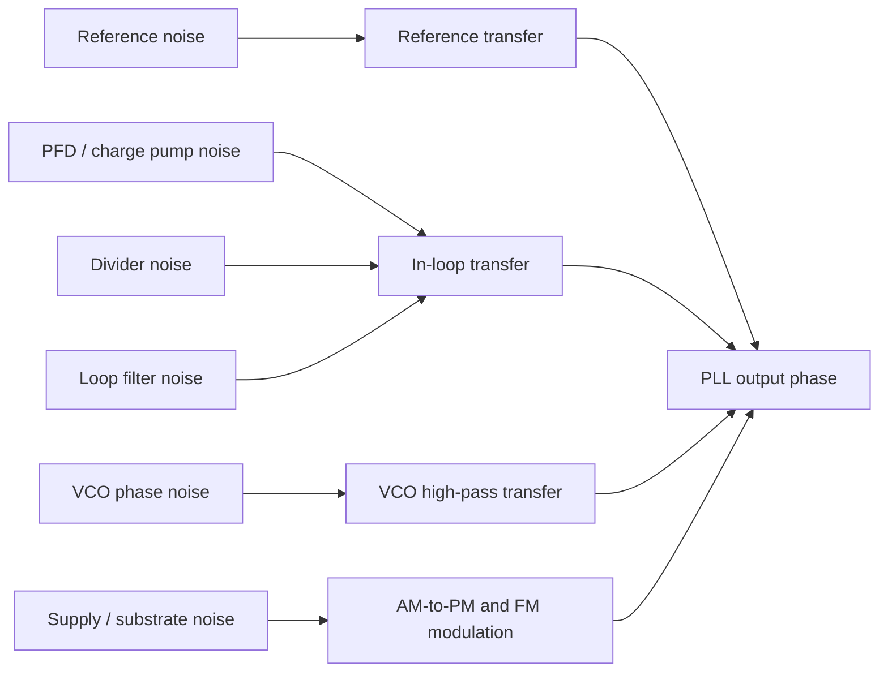

# PLL Phase Noise and Jitter

## Purpose

This note explains how PLL phase noise becomes time-domain jitter and why that matters for PCIe 7.0, CDRs, ADC-based receivers, LDO design, and SerDes verification. It is written as a self-contained study note for interview preparation and early design onboarding.

Related notes: [[pcie7_clocking_notes]], [[cdr_jitter_tolerance]], [[phase_noise_jitter]], [[pll_fundamentals]], [[ldo_psrr_notes]], [[serdes_power_integrity]], [[sampling_jitter_adc]], [[pam4_adc_based_rx]].

## What Phase Noise Means

An ideal clock can be written as:

$$
v(t) = A\cos(2\pi f_0t)
$$

A real clock has amplitude and phase perturbations:

$$
v(t) = A(t)\cos(2\pi f_0t + \phi(t))
$$

For clocking, the phase term \(\phi(t)\) is usually the most important because it moves the zero crossing or sampling edge in time. Phase noise is the frequency-domain description of random phase fluctuation around the carrier. It is usually reported as single-sideband phase noise \(L(f)\) in dBc/Hz at an offset frequency \(f\) from the carrier.

For example, \(L(1\ \text{MHz})=-100\ \text{dBc/Hz}\) means the noise power in a 1 Hz bandwidth at 1 MHz offset is 100 dB below the carrier power.

## Phase Error to Time Error

Phase and time are linked by:

$$
\Delta\phi = 2\pi f_0\Delta t
$$

Therefore:

$$
\Delta t = \frac{\Delta\phi}{2\pi f_0}
$$

This equation is the bridge from phase noise plots to SerDes eye margin. A receiver does not directly care that the oscillator has a phase perturbation in radians. It cares that the sampling edge arrives early or late.

### Worked Example: Radians to Femtoseconds

Assume a 16 GHz clock has RMS phase error:

$$
\sigma_\phi = 0.01\ \text{rad}
$$

Then:

$$
\sigma_t = \frac{0.01}{2\pi \cdot 16\times10^9}=99.5\ \text{fs}
$$

At PCIe 7.0:

$$
UI = 7.8125\ \text{ps}
$$

So:

$$
\sigma_{UI} = \frac{99.5\ \text{fs}}{7.8125\ \text{ps}}=0.0127\ UI
$$

The same phase error becomes a concrete fraction of the sampling interval.

## Integrated RMS Jitter

For small phase noise, integrated RMS jitter is commonly estimated from:

$$
\sigma_t = \frac{1}{2\pi f_0}\sqrt{2\int_{f_1}^{f_2}10^{L(f)/10}df}
$$

where:

| Symbol | Meaning |
|---|---|
| \(\sigma_t\) | RMS timing jitter |
| \(f_0\) | carrier / clock frequency |
| \(L(f)\) | single-sideband phase noise in dBc/Hz |
| \(f_1,f_2\) | integration limits |

The integration band is not a detail. It changes the answer. A PLL can look excellent from 1 MHz to 100 MHz and poor from 100 Hz to 1 MHz, or the reverse, depending on reference noise, loop bandwidth, flicker noise, and spurs.

## A Practical PLL Noise Model

A PLL output phase contains multiple contributors:

For a simplified type-II PLL:

$$
\Phi_{out}(s) \approx H_{ref}(s)\Phi_{ref}(s) + H_{vco}(s)\Phi_{vco}(s)
$$

The reference path is low-pass shaped. The VCO path is high-pass shaped. The loop bandwidth sets the approximate crossover.

## PLL Bandwidth Tradeoff

| Choice | Benefit | Cost |
|---|---|---|
| Wider bandwidth | suppresses VCO close-in noise, faster lock | passes more reference/PFD noise, harder stability, more spur risk |
| Narrower bandwidth | filters reference noise, may reduce in-band noise | more VCO noise, slower lock, weaker tracking |
| Higher loop damping | less peaking | slower response |
| Lower loop damping | faster response | jitter peaking risk |

For SerDes, the PLL bandwidth should not be chosen only from a standalone phase-noise minimum. It must be compatible with CDR behavior, SSC requirements, reference quality, spur limits, lock time, and supply noise sensitivity.

## Noise Slopes and Physical Meaning

Oscillator phase noise is often described by slope regions:

| Region | Slope on log plot | Common physical source |
|---|---|---|
| Flicker FM | \(-30\ \text{dB/dec}\) | flicker noise upconversion |
| White FM | \(-20\ \text{dB/dec}\) | thermal noise in resonator / active devices |
| Flicker PM | \(-10\ \text{dB/dec}\) | device flicker converted to phase |
| White PM floor | \(0\ \text{dB/dec}\) | buffers, dividers, measurement floor |

In an LC PLL, close-in noise may be dominated by flicker upconversion and reference path noise, while far-out noise may be dominated by VCO thermal noise or output buffers. In a ring-oscillator or digitally controlled oscillator, supply sensitivity and device noise may be more severe.

## Spurs Are Not Random Jitter

Reference spurs, fractional-N spurs, supply spurs, and digital coupling spurs create deterministic phase modulation. They may not contribute much to an RMS integrated jitter number, but they can still violate spectral masks or create periodic sampling stress.

For sinusoidal phase modulation:

$$
\phi(t)=\phi_{pk}\sin(2\pi f_mt)
$$

The approximate peak timing error is:

$$
t_{pk}=\frac{\phi_{pk}}{2\pi f_0}
$$

### Worked Example: Spur Phase to Timing

Assume:

| Parameter | Value |
|---|---:|
| Clock frequency | 16 GHz |
| Spur phase modulation peak | 0.005 rad |

Then:

$$
t_{pk}=\frac{0.005}{2\pi\cdot16\times10^9}=49.7\ \text{fs}
$$

This is a bounded sinusoidal jitter component. Treating it as ordinary Gaussian random jitter can hide the real problem.

## Supply Noise Conversion

PLL supplies matter because oscillators, dividers, buffers, and bias circuits convert voltage noise to phase noise and jitter.

### VCO Supply Pushing

Supply pushing is:

$$
K_{VDD} = \frac{\Delta f}{\Delta V_{DD}}
$$

For supply ripple \(v_n(t)\):

$$
\Delta f(t)=K_{VDD}v_n(t)
$$

Phase is the integral of frequency:

$$
\phi_n(t)=2\pi\int\Delta f(t)dt
$$

Low-frequency supply ripple can create large phase modulation because integration divides by modulation frequency.

### Clock Buffer Delay Modulation

Clock buffer delay varies with supply:

$$
\Delta t_d \approx K_{d,VDD}\Delta V_{DD}
$$

If \(K_{d,VDD}=0.5\ \text{ps/mV}\) and residual supply ripple is 0.2 mV:

$$
\Delta t_d=0.5\frac{\text{ps}}{\text{mV}}\cdot0.2\ \text{mV}=0.1\ \text{ps}=100\ \text{fs}
$$

That is already 1.28 percent of a PCIe 7.0 UI.

## PLL Jitter in a PCIe 7.0 Timing Budget

At 128 GT/s:

$$
UI = 7.8125\ \text{ps}
$$

A PLL integrated jitter result should be converted to UI for intuition:

| RMS jitter | Fraction of UI |
|---:|---:|
| 50 fs | 0.0064 UI |
| 100 fs | 0.0128 UI |
| 200 fs | 0.0256 UI |
| 500 fs | 0.0640 UI |

These numbers are not PCIe 7.0 limits. They are scale references. TODO: verify official compliance limits.

## Random, Deterministic, and Correlated Contributions

| Contribution | Add by RSS? | Notes |
|---|---|---|
| Independent thermal phase noise | Usually yes | Gaussian assumption often used |
| Reference and VCO random noise | Usually through transfer functions | integrate spectra, then combine carefully |
| Supply ripple spur | No | deterministic periodic jitter |
| Reference spur | No | bounded spectral component |
| Shared supply noise across lanes | Not independent | may be correlated system-level jitter |
| Data-dependent jitter | No | depends on channel and pattern |

In design reviews, a common failure is to show one RSS number without explaining assumptions. A better review separates the spectral and physical sources.

## Design Implications

### PLL

Phase noise optimization must include loop bandwidth, VCO design, divider noise, reference quality, spurs, supply sensitivity, and post-layout buffers. A PLL that is clean in isolation may fail when connected to real clock distribution or noisy supplies.

### CDR

The CDR shapes how PLL and input data jitter affect sampling. If the PLL is used as a local clock source for a PI-based CDR, high-frequency PLL jitter may appear directly at the sampler while low-frequency data phase may be tracked. The CDR bandwidth must be considered with PLL noise bandwidth.

### SerDes RX and TX

TX sees launch-clock jitter. RX sees sampling-clock jitter. In both cases, the final clock at the load matters more than the nominal PLL output. Clock tree design, shielding, supply isolation, and duty-cycle control are part of the jitter design.

### ADC

ADC aperture jitter limits high-frequency SNDR:

$$
SNR_{jitter}\approx -20\log_{10}(2\pi f_{in}\sigma_t)
$$

At \(f_{in}=16\ \text{GHz}\) and \(\sigma_t=100\ \text{fs}\):

$$
SNR_{jitter}= -20\log_{10}(2\pi\cdot16\times10^9\cdot100\times10^{-15})=40.0\ \text{dB}
$$

This shows why PLL jitter is also an ADC receiver performance issue.

### LDO and Power Integrity

For clocking supplies, LDO PSRR should be evaluated over the frequencies where supply noise couples into phase. Output noise, PSRR peaking, package inductance, decap anti-resonance, and load transient response all affect the real supply seen by the PLL.

### Verification

Verification should include phase noise, integrated jitter, spur analysis, transient noise jitter, supply injection, extracted clock tree, Monte Carlo mismatch, PVT corners, and correlation to link-level margin. Record integration bandwidth and measurement point every time.

## Common Mistakes

1. Saying "PLL jitter is 100 fs" without integration limits.
2. Ignoring spurs because RMS jitter looks acceptable.
3. Optimizing PLL bandwidth without considering reference noise and CDR behavior.
4. Simulating a clean supply when the actual design uses shared rails or switching regulators.
5. Measuring jitter at the PLL output but budgeting it as sampler-clock jitter.
6. Adding deterministic and random jitter together by simple RSS.
7. Forgetting that divider and output buffer noise can dominate far-out phase noise.
8. Treating LDO PSRR as a DC number instead of a frequency-dependent transfer function.

## Interview Q&A

### What is the difference between phase noise and jitter?

Phase noise is frequency-domain phase fluctuation around a carrier. Jitter is time-domain edge uncertainty. They are related by \(\Delta t = \Delta\phi/(2\pi f_0)\). SerDes eye margin is usually interpreted in time, while PLL noise is often simulated in frequency.

### How do you convert phase noise to integrated RMS jitter?

Convert \(L(f)\) from dBc/Hz to linear units, integrate over the offset-frequency band, multiply by two for single-sideband to total phase variance, take the square root, and divide by \(2\pi f_0\).

### Why does PLL bandwidth matter?

PLL bandwidth shapes which noise sources dominate. Inside bandwidth, reference and in-loop noise transfer strongly. Outside bandwidth, VCO noise dominates. Bandwidth also affects lock time, spur behavior, stability, and interaction with CDR.

### Why can a spur matter even if RMS jitter is low?

A spur is deterministic periodic jitter. It can create narrowband stress, spectral-mask failure, or periodic eye closure. RMS integration can understate its system impact.

### How does supply noise create PLL jitter?

Supply noise can modulate VCO frequency, divider delay, buffer delay, charge pump current, bias voltages, and PI delay. The result is phase modulation or edge movement.

### What would you ask when reviewing a PLL jitter plot?

I would ask the carrier frequency, output node, integration bandwidth, PVT corner, included noise sources, loop bandwidth, spur treatment, supply assumptions, and whether the clock tree and load are included.

