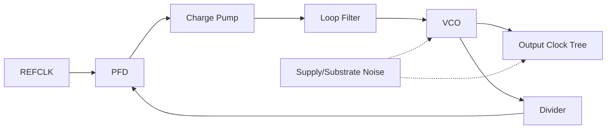
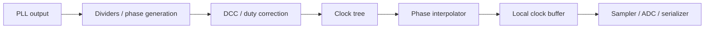
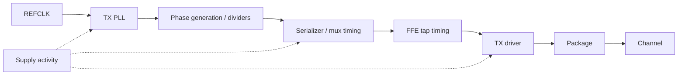
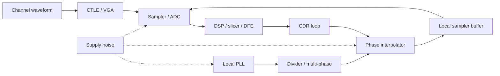
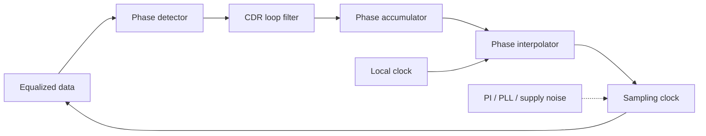
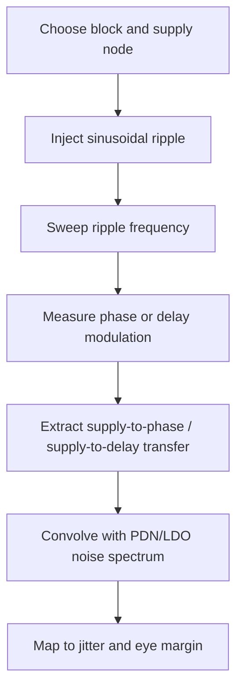
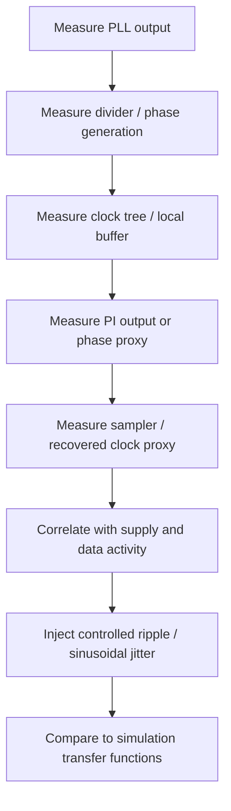

# PLL Phase Noise and Jitter

## 0. Status and Scope

| Item | Content |
|---|---|
| Maturity | Principal / Senior Staff 级 design-review reference；仍需项目 signoff 数据校准 |
| Target role | PCIe 7.0 SerDes clocking、PLL、CDR、ADC-based RX、LDO / power integrity 面试与设计评审 |
| Intended audience | 有经验的 Analog / Mixed-Signal IC、SerDes、PLL/CDR、AMS verification 工程师 |
| Covers | phase noise、integrated jitter、PLL noise shaping、spurs、supply-induced jitter、CDR、PAM4 UI、ADC aperture jitter、simulation、lab debug、review checklist |
| Does not claim | official PCIe 7.0 compliance masks、jitter tolerance limits、Tx/Rx electrical limits、REFCLK requirements 或 pass/fail methodology |
| Spec caveat | 所有官方 spec-level 数值必须查 PCIe 7.0 spec 或 internal IP requirement |

官方合规占位项：

- PCIe 7.0 Tx jitter masks: TODO: verify against PCIe 7.0 spec or internal IP requirement
- PCIe 7.0 Rx jitter tolerance profile: TODO: verify against PCIe 7.0 spec or internal IP requirement
- PCIe 7.0 jitter generation / measurement filters: TODO: verify against PCIe 7.0 spec or internal IP requirement
- PCIe 7.0 REFCLK / SSC assumptions: TODO: verify against PCIe 7.0 spec or internal IP requirement

本笔记不是给出某个项目的 signoff number，而是建立一个可以在 design review 中 defend 的分析框架：从 phase-noise plot 追踪到 TX launch edge、RX sampling instant、ADC aperture、CDR residual error、supply-induced deterministic jitter，以及最终 PAM4 eye / BER margin。

## 1. Executive Summary

Phase noise 是频域的相位扰动描述；jitter 是时域的边沿时间不确定性。二者转换依赖 carrier frequency、offset integration bandwidth、single-sideband convention、spur policy 和 measurement node。

核心关系：

$$
\sigma_t =
\frac{1}{2\pi f_0}
\sqrt{2\int_{f_1}^{f_2}10^{L(f)/10}df}
$$

但在 SerDes 中，PLL output jitter 不是 final sampler jitter。最终 timing margin 还受到 CDR、phase interpolator、clock tree、divider、serializer、TX driver、sampler aperture、ADC clock tree、equalization、LDO output noise、PSRR peaking、package resonance 和 supply pushing 的影响。

PCIe 7.0 PAM4 的关键 timing scale：128 GT/s headline rate 对应 64 Gbaud electrical symbol rate。PAM4 每个 symbol 携带 2 bit，因此：

$$
UI_{sym}=\frac{1}{64\times10^9}=15.625\text{ ps}
$$

$$
UI_{bit,eq}=\frac{1}{128\times10^9}=7.8125\text{ ps}
$$

7.8125 ps 是 bit-equivalent interval，不是 PAM4 symbol UI。讨论 CDR phase placement、sampler timing、horizontal eye closure 时，应默认归一化到 15.625 ps 的 symbol UI，除非上下文明确是在讨论 throughput 或 bit-equivalent 表达。

## 2. Mental Model: From Phase Noise Plot to Eye Closure

phase-noise plot 本身不是 link margin。SerDes review 要把它转成系统影响：phase variance -> RMS time jitter -> TX/RX timing uncertainty -> horizontal eye closure -> timing-to-voltage error -> PAM4 vertical margin loss -> BER / bathtub / link margin。

```mermaid
flowchart LR
  PN[Phase-noise plot<br/>L(f), dBc/Hz] --> VAR[Phase variance<br/>integrate S_phi]
  VAR --> JT[RMS time jitter<br/>divide by 2*pi*f0]
  JT --> PATH[Clock path shaping<br/>PLL / divider / PI / CDR / tree]
  PATH --> H[Horizontal eye closure]
  H --> SLOPE[dV/dt conversion]
  SLOPE --> V[Vertical PAM4 margin loss]
  V --> BER[BER / bathtub / link margin]
```

设计评审中最重要的问题不是 "PLL jitter 几 fs"，而是：这个 jitter number 是哪个节点、哪个 offset band、哪个 carrier、包含哪些 noise sources、是否包含 spurs、经过 CDR 后残留多少、映射到 PAM4 symbol UI 是多少。

## 3. Definitions and Units

### 3.1 Clock and Phase Definitions

Ideal clock:

$$
v_{ideal}(t)=A\cos(2\pi f_0t)
$$

Real clock:

$$
v(t)=A(t)\cos(2\pi f_0t+\phi(t))
$$

其中 $f_0$ 是 carrier frequency，$A(t)$ 是 amplitude variation，$\phi(t)$ 是 phase error。对 clock edge，一阶 timing error 为：

$$
\Delta t(t)\approx \frac{\phi(t)}{2\pi f_0}
$$

### 3.2 Jitter Types

| Quantity | Domain | Unit | Practical use | Notes |
|---|---|---:|---|---|
| phase noise, $L(f)$ | Frequency | dBc/Hz | PLL/VCO spectrum review | Single-sideband, offset from carrier |
| phase-noise PSD, $S_\phi(f)$ | Frequency | rad^2/Hz | 数学积分 | convention 必须明确 |
| RMS phase error, $\sigma_\phi$ | Scalar | rad RMS | Loop/noise budget | 依赖 integration band |
| RMS jitter, $\sigma_t$ | Time | fs, ps | Eye/jitter budget | $\sigma_\phi/(2\pi f_0)$ |
| TIE | Time sequence | s, UI | 长期 edge displacement | edge vs ideal reference |
| period jitter | Time sequence | s RMS | 单周期变化 | 偏重高频 edge noise |
| cycle-to-cycle jitter | Time sequence | s RMS | 相邻周期差 | digital timing 关注 |
| long-term jitter | Time sequence | s RMS/pp | wander | lower integration bound 关键 |
| random jitter, RJ | Statistical | RMS | BER bathtub tail | 常假设 Gaussian，需验证 |
| deterministic jitter, DJ | Bounded | pp | Eye closure | DCD、ISI、spurs、DDJ |
| periodic jitter, PJ | Deterministic | pk/pp | Spur stress | 按 frequency/amplitude 跟踪 |
| data-dependent jitter, DDJ | Pattern | pp | channel/equalization | 与 symbol history 相关 |
| correlated jitter | Cross-domain | RMS/pk/covariance | multi-lane / shared rail | 不能独立 RSS |

### 3.3 Review Terms

| Term | Meaning | Typical review question |
|---|---|---|
| integrated jitter | 对 phase noise 积分得到的 RMS jitter | $f_1$、$f_2$ 是多少？ |
| jitter generation | block 自身产生的 jitter | 是否包含 clock tree？ |
| jitter transfer | input phase modulation 到 output 的传递 | bandwidth 和 peaking？ |
| jitter tolerance | receiver 能承受的 input jitter | spec 还是 internal model？ |
| aperture jitter | ADC/sampler sampling instant uncertainty | 是否 pre-DSP、pre-calibration？ |
| supply pushing | VCO frequency 对 supply 敏感度 | $K_{VDD}(f)$ 和 supply spectrum？ |
| additive jitter | buffer/divider/PI 加入的 jitter | random、deterministic 还是 correlated？ |

## 4. Relationship Between L(f), S_phi(f), Phase Error, and Jitter

Real clock:

$$
v(t)=A(t)\cos(2\pi f_0t+\phi(t))
$$

Small phase-noise 条件下，常用 SSB phase noise 与 phase-noise PSD 的关系为：

$$
S_\phi(f) \approx 2 \cdot 10^{L(f)/10}
$$

其中 $L(f)$ 单位是 dBc/Hz，$S_\phi(f)$ 近似为 rad^2/Hz。Integrated phase variance：

$$
\sigma_\phi^2 = \int_{f_1}^{f_2} S_\phi(f)df
$$

RMS time jitter：

$$
\sigma_t = \frac{\sigma_\phi}{2\pi f_0}
$$

Compact form：

$$
\sigma_t =
\frac{1}{2\pi f_0}
\sqrt{2\int_{f_1}^{f_2}10^{L(f)/10}df}
$$

| Assumption | Why it matters |
|---|---|
| small phase noise | $L(f)$ 到 $S_\phi(f)$ 的近似需要 small-angle |
| single-sideband convention | factor of 2 来自 SSB convention |
| integration offset band | $f_1,f_2$ 改变结果和物理含义 |
| valid carrier frequency | $f_0$ 必须是被转换的 clock carrier |
| spur policy explicit | spurs 可排除、单独表列、或显式建模 |
| linear units | dBc/Hz 必须转 linear 后积分 |
| measurement node | PLL output、divider、PI、sampler clock 不同 |

如果工具直接给 integrated jitter，也必须记录：

$$
\{f_0,\ f_1,\ f_2,\ node,\ PVT,\ supply,\ load,\ spur\ policy\}
$$

## 5. Numerical Integration of Phase Noise

### 5.1 Practical Integration Rules

| Step | Correct method | Common failure |
|---|---|---|
| Convert units | $L_{lin}=10^{L_{dBc/Hz}/10}$ | 直接积分 dB |
| Interpolate | log-frequency / log-density 或足够 dense points | sparse points 漏掉 peaking |
| Integrate | linear frequency domain trapezoid | 目测平均 dBc/Hz |
| Spurs | 单独记录 deterministic tones | 把 spur 混进 RJ |
| Document | 写清 offset band 和 filter | 只说 "100 fs" |
| Resolution | 捕捉 bandwidth / peaking / notch | offset spacing 太粗 |

对相邻点 $(f_i,L_i)$ 与 $(f_{i+1},L_{i+1})$，令：

$$
N(f)=10^{L(f)/10}
$$

若 $N(f)\approx af^m$：

$$
\int_{f_i}^{f_{i+1}}N(f)df=
\begin{cases}
\frac{a}{m+1}\left(f_{i+1}^{m+1}-f_i^{m+1}\right), & m\ne -1 \\
a\ln\left(\frac{f_{i+1}}{f_i}\right), & m=-1
\end{cases}
$$

脚本中也可用 dense interpolation 后做 linear trapezoid：

$$
A \approx \sum_i \frac{N_i+N_{i+1}}{2}(f_{i+1}-f_i)
$$

### Example 1: Flat phase-noise floor

| Parameter | Value |
|---|---:|
| Carrier | 16 GHz |
| $L(f)$ | -120 dBc/Hz |
| Integration band | 1 MHz to 100 MHz |

$$
10^{-120/10}=10^{-12}
$$

$$
A=10^{-12}(100\text{ MHz}-1\text{ MHz})=9.9\times10^{-5}
$$

$$
\sigma_\phi=\sqrt{2A}=0.0141\text{ rad}
$$

$$
\sigma_t=\frac{0.0141}{2\pi\cdot16\times10^9}=140\text{ fs}
$$

### Example 2: Piecewise phase-noise curve

| Offset | L(f) |
|---:|---:|
| 10 kHz | -80 dBc/Hz |
| 100 kHz | -100 dBc/Hz |
| 1 MHz | -115 dBc/Hz |
| 10 MHz | -125 dBc/Hz |
| 100 MHz | -135 dBc/Hz |

| Segment | Approx. slope | Estimated SSB area |
|---|---:|---:|
| 10 kHz to 100 kHz | -20 dB/dec | $9.0\times10^{-5}$ |
| 100 kHz to 1 MHz | -15 dB/dec | $1.69\times10^{-5}$ |
| 1 MHz to 10 MHz | -10 dB/dec | $7.28\times10^{-6}$ |
| 10 MHz to 100 MHz | -10 dB/dec | $7.28\times10^{-6}$ |
| Total |  | $1.21\times10^{-4}$ |

$$
\sigma_\phi=\sqrt{2\cdot1.21\times10^{-4}}=0.0156\text{ rad}
$$

At 16 GHz:

$$
\sigma_t=\frac{0.0156}{2\pi\cdot16\times10^9}=155\text{ fs}
$$

### Example 3: Same phase error at different carrier frequencies

For $\sigma_\phi=0.01$ rad:

| Carrier | RMS jitter | Fraction of 15.625 ps UI |
|---:|---:|---:|
| 4 GHz | 398 fs | 0.0255 UI |
| 8 GHz | 199 fs | 0.0127 UI |
| 16 GHz | 99.5 fs | 0.00637 UI |
| 32 GHz | 49.7 fs | 0.00318 UI |

相同 phase error 在更高 carrier 上对应更小 time error，但这不代表高频 clock 自动更干净；oscillator、divider、phase generation、clock tree 和 edge usage 都会改变。
## 6. PLL Noise Transfer Functions

PLL output phase 是多个 shaped noise contributors 的叠加：

$$
\Phi_{out}(s)=
H_{ref}(s)\Phi_{ref}(s)
+H_{vco}(s)\Phi_{vco}(s)
+H_{div}(s)\Phi_{div}(s)
+H_{pfd/cp}(s)\Phi_{pfd/cp}(s)
+H_{lf}(s)\Phi_{lf}(s)
+\Phi_{add}(s)
$$

Exact equations 取决于架构：integer-N CPPLL、fractional-N CPPLL、sub-sampling PLL、injection-locked PLL、ADPLL、MDLL、ring-PLL、LC-PLL、cascaded clocking 都不同。下面是 Type-II CPPLL 的 review mental model。



Simplified loop gain：

$$
G(s)=\frac{K_{pd}Z(s)K_{vco}}{sN}
$$

Closed-loop reference transfer：

$$
H_{ref}(s)\approx N\frac{G(s)}{1+G(s)}
$$

VCO noise transfer：

$$
H_{vco}(s)\approx \frac{1}{1+G(s)}
$$

Second-order intuition：

$$
H_{ref}(s)\approx N\frac{2\zeta\omega_n s+\omega_n^2}
{s^2+2\zeta\omega_n s+\omega_n^2}
$$

$$
H_{vco}(s)\approx \frac{s^2}{s^2+2\zeta\omega_n s+\omega_n^2}
$$

| Contributor | Transfer intuition | Design knob |
|---|---|---|
| Reference noise | low-pass 到 output，乘以 N | REFCLK quality、PLL bandwidth |
| VCO noise | high-pass 到 output | VCO topology、tank Q、loop bandwidth |
| Divider noise | in-loop contribution | divider topology、swing、supply isolation |
| PFD/CP noise | in-loop contribution | CP current、mismatch、reset timing |
| Loop filter noise | depends on injection point | R/C sizing、active filter noise |
| Fractional-N DSM noise | shaped quantization + spurs | DSM order、dither、calibration |
| Clock buffer additive jitter | post-loop，不被 PLL suppress | buffer sizing、supply、load、layout |
| Post-PLL clocking | 可能主导 sampler jitter | divider、DCC、PI、local routing |

Post-PLL clocking 必须包含：



## 7. PLL Bandwidth and Jitter Peaking

PLL bandwidth 是 tradeoff，不是越大越好或越小越好。Wider bandwidth suppresses VCO close-in noise，但会放过更多 reference、PFD、CP、divider、fractional-N 和 reference spur energy。Narrower bandwidth filters reference path，但暴露更多 VCO noise，也可能影响 lock、SSC tracking 和 CDR interaction。

| PLL bandwidth choice | Improves | Hurts | Review questions |
|---|---|---|---|
| Wider | VCO close-in suppression、lock time、tracking | reference/in-loop noise、spur pass-through、stability margin | REFCLK 是否足够干净？CP/divider noise 是否低？ |
| Narrower | reference filtering、部分 spur attenuation | VCO noise、lock/relock、SSC tracking | VCO 是否主导？系统是否能承受慢 tracking？ |
| Higher damping | less peaking、robust loop | slower response | PVT/extracted phase margin？ |
| Lower damping | faster response | jitter peaking、ringing、limit cycle | peaking 是否计入 integrated jitter？ |

Design-review questions：

- 每个 offset decade 由哪个 noise source 主导？
- reference/VCO crossover 在哪里？
- loop bandwidth 附近是否有 peaking？
- reference/fractional spurs 是否在 loop bandwidth 内？
- SSC 由 PLL 还是 CDR track？
- CDR 在同一频段是 tracking 还是 rejecting？
- 最低 integrated PLL jitter 是否真的对应最大 link margin？

### Example 4: Loop peaking can dominate

假设 5 MHz 附近有 -115 dBc/Hz 的 baseline phase-noise density，宽度 4 MHz；loop peaking 使该区域升高 4 dB。Linear density 增加倍数：

$$
10^{4/10}=2.51
$$

增量 SSB area：

$$
\Delta A=(2.51-1)\cdot10^{-11.5}\cdot4\times10^6=1.91\times10^{-5}
$$

At 16 GHz：

$$
\Delta\sigma_t\approx
\frac{\sqrt{2\Delta A}}{2\pi\cdot16\times10^9}=61.5\text{ fs}
$$

几 dB peaking 在高能量频段上足以成为 budget item。

## 8. Phase Noise Slopes and Physical Interpretation

| Slope | Noise name | Physical source | Circuit-level knob |
|---:|---|---|---|
| -30 dB/dec | flicker FM | 1/f noise upconverted to frequency noise | device sizing、bias point、symmetry |
| -20 dB/dec | white FM | resonator/device thermal noise causing frequency diffusion | tank Q、swing、gm noise、bias current |
| -10 dB/dec | flicker PM | direct flicker phase modulation | buffer flicker、waveform symmetry |
| 0 dB/dec | white PM floor | buffer/divider additive white phase noise、measurement floor | slew rate、load、supply isolation |

LC oscillator 依赖 tank Q、swing、varactor noise、flicker upconversion、supply pushing 和 layout parasitic。Ring oscillator 面积小、tuning range 大，但 delay-cell noise 和 supply sensitivity 往往更强。ADPLL/DCO 把部分问题转移到 quantization、TDC noise、digital supply coupling 和 limit cycle。

Leeson-style intuition：

$$
L(\Delta f)\propto
10\log_{10}\left[
\frac{F kT}{P_s}
\left(1+\left(\frac{f_0}{2Q\Delta f}\right)^2\right)
\right]
$$

这是 intuition，不是 signoff equation；它隐藏了 AM-to-PM、ISF、supply pushing、layout parasitic 和 sampled-loop behavior。

## 9. Spurs and Deterministic Jitter

Spurs 是 deterministic phase modulation，要按 frequency、amplitude、source、transfer path、CDR tracking 分开记录。

| Spur type                      | Typical source                      | Review concern                          |
| ------------------------------ | ----------------------------------- | --------------------------------------- |
| Reference spur                 | PFD/CP ripple、reference feedthrough | in-band PJ、spectral line                |
| Fractional spur                | fractional-N pattern、DSM residue    | deterministic PJ、calibration dependence |
| DSM quantization spur          | limit cycle / tonal quantization    | fractional word dependent               |
| Supply spur                    | DC/DC ripple、digital activity       | correlated jitter、package resonance     |
| Substrate spur                 | digital clocks、memory traffic       | mode-dependent lab failure              |
| Package / decap resonance spur | PDN anti-resonance                  | frequency-specific jitter explosion     |
| Clock-tree periodic modulation | DCC、muxing、divider sequence         | DCD、even/odd jitter                     |
| Pattern-dependent jitter       | ISI、driver level-dependent delay    | DDJ eye closure                         |

Sinusoidal phase modulation：

$$
\phi(t)=\phi_{pk}\sin(2\pi f_mt)
$$

Peak timing jitter：

$$
t_{pk}=\frac{\phi_{pk}}{2\pi f_0}
$$

RMS equivalent for pure sine：

$$
t_{rms}=\frac{t_{pk}}{\sqrt{2}}
$$

Spur 不应 blindly RSS with RJ。一个 RMS 很小的 spur 仍可能造成 deterministic eye closure、CDR stress、spectral failure 或 multi-lane correlated failure。Behavioral model：

$$
t_{edge}(n)=nT+t_{pk}\sin(2\pi f_m nT+\theta)
$$

### Example 5: 16 GHz carrier with 2 MHz supply spur

| Parameter | Value |
|---|---:|
| Carrier | 16 GHz |
| Spur modulation frequency | 2 MHz |
| Peak phase modulation | 0.006 rad |

$$
t_{pk}=\frac{0.006}{2\pi\cdot16\times10^9}=59.7\text{ fs}
$$

$$
t_{rms}=42.2\text{ fs}
$$

如果 2 MHz 在 CDR tracking bandwidth 内，sampler 可能 track 一部分；如果在 tracking region 外，则更直接地成为 residual sampling error。正确结论需要 CDR jitter transfer。

## 10. Supply Noise, LDO, and Power Integrity to Jitter

Supply 是 phase-noise input。SerDes clock rail 要按 frequency-dependent transfer path 审查，而不是只看 DC voltage。

### 10.1 Supply-to-Timing Paths

| Path | Mechanism | Metric |
|---|---|---|
| VCO supply pushing | VDD modulates oscillation frequency | $K_{VDD}=\Delta f/\Delta VDD$ |
| Clock buffer delay modulation | VDD changes delay and slew | $K_{d,VDD}=\Delta t_d/\Delta VDD$ |
| Divider sensitivity | regenerative edge timing shifts | additive jitter vs ripple |
| PI sensitivity | interpolation weights/delay shift | phase INL/DNL vs supply |
| Sampler aperture | latch aperture moves with supply | aperture transfer |
| LDO output noise | regulator noise into PLL rail | output noise density |
| LDO PSRR | upstream ripple attenuation | PSRR(f), including peaking |
| Package/decap resonance | PDN impedance peaks | $Z_{PDN}(f)$ |
| Shared rail coupling | digital activity creates common jitter | covariance / correlation |

### 10.2 VCO Supply Pushing

$$
K_{VDD}=\frac{\Delta f}{\Delta V_{DD}}
$$

$$
\Delta f(t)=K_{VDD}v_n(t)
$$

$$
\phi_n(t)=2\pi\int \Delta f(t)dt
$$

For sinusoidal ripple：

$$
v_n(t)=V_n\sin(2\pi f_mt)
$$

$$
\phi_{pk}\approx \frac{K_{VDD}V_n}{f_m}
$$

Clock buffer delay modulation：

$$
\Delta t_d \approx K_{d,VDD}\Delta V_{DD}
$$

### Example 6: Supply ripple to VCO phase modulation

| Parameter | Value |
|---|---:|
| $K_{VDD}$ | 50 MHz/mV |
| Ripple amplitude | 0.05 mV peak |
| Ripple frequency | 10 MHz |
| Carrier | 16 GHz |

$$
\Delta f_{pk}=50\frac{\text{MHz}}{\text{mV}}\cdot0.05\text{ mV}=2.5\text{ MHz}
$$

$$
\phi_{pk}\approx \frac{2.5\text{ MHz}}{10\text{ MHz}}=0.25\text{ rad}
$$

$$
t_{pk}=\frac{0.25}{2\pi\cdot16\times10^9}=2.49\text{ ps}
$$

这说明 low-frequency supply pushing 可以极其危险；真实系统还需考虑 PLL loop 对注入点的 shaping。

### Example 7: Clock buffer supply sensitivity

| Parameter | Value |
|---|---:|
| Buffer delay sensitivity | 0.8 ps/mV |
| Local ripple | 0.1 mV peak |
| PCIe 7.0 PAM4 symbol UI | 15.625 ps |

$$
\Delta t_{pk}=0.8\frac{\text{ps}}{\text{mV}}\cdot0.1\text{ mV}=80\text{ fs}
$$

$$
\frac{80\text{ fs}}{15.625\text{ ps}}=0.00512\ UI_{sym}
$$

如果该项是 periodic、correlated 或与其它 deterministic terms 同相，不能简单 RSS 掉。

### 10.3 Design Guidance for LDO and PDN

| Review item | Strong answer |
|---|---|
| LDO PSRR | specify PSRR(f)，包含 peaking、dropout、headroom |
| Output noise | integrate LDO output noise over PLL sensitivity bands |
| PDN resonance | simulate/package-measure impedance peaks 和 decap anti-resonance |
| Supply injection | sweep ripple into VCO、divider、buffer、PI、sampler |
| Lab supply | 使用 realistic ripple/noise；clean supply 可隐藏 product problem |
| Shared rails | identify common-mode jitter across lanes / clock domains |

DC PSRR 对 SerDes clocking 通常意义很弱；真正危险的往往是 MHz 到 hundreds of MHz 的 ripple、LDO loop peaking、package inductance、decap anti-resonance 和 load transient。
## 11. PCIe 7.0 PAM4 Timing Scale

PCIe 7.0 headline rate 是 128 GT/s per lane。PAM4 每个 symbol 携带 2 bit：

$$
R_s=\frac{R_b}{\log_2(M)}
$$

For PAM4：

$$
R_s=\frac{128\text{ Gb/s}}{2}=64\text{ Gbaud}
$$

$$
UI_{sym}=\frac{1}{64\times10^9}=15.625\text{ ps}
$$

$$
f_{Nyquist}=\frac{R_s}{2}=32\text{ GHz}
$$

$$
UI_{bit,eq}=\frac{1}{128\times10^9}=7.8125\text{ ps}
$$

| Timing error | Fraction of 15.625 ps symbol UI | Fraction of 7.8125 ps bit-equivalent interval |
|---:|---:|---:|
| 25 fs | 0.00160 UI | 0.00320 UI |
| 50 fs | 0.00320 UI | 0.00640 UI |
| 100 fs | 0.00640 UI | 0.0128 UI |
| 200 fs | 0.0128 UI | 0.0256 UI |
| 500 fs | 0.0320 UI | 0.0640 UI |
| 1 ps | 0.0640 UI | 0.128 UI |

此表不是 PCIe pass/fail limit。Compliance limits: TODO: verify against PCIe 7.0 spec or internal IP requirement

## 12. TX Path Jitter Propagation

TX jitter 是 actual launched waveform 的 edge uncertainty，不只是 PLL output phase noise。



| TX element | Timing concern |
|---|---|
| PLL output | integrated RJ、spurs、supply pushing |
| Serializer clock | mux aperture、bit/symbol slice skew |
| Divider/multi-phase | phase spacing error、DCD |
| FFE taps | tap timing error changes pre/post-cursor waveform |
| TX driver | delay modulation、level-dependent delay、slew variation |
| Supply | data-dependent 或 periodic delay movement |
| Package/channel | jitter becomes waveform timing and ISI stress |

Review questions：

- jitter measured at PLL pin、serializer input、driver input 还是 package output？
- 是否包含 serializer、driver、DCD、TX supply activity？
- FFE tap timing 是否 modeled？
- level-dependent delay 是否从 RJ 分离？

## 13. RX Path Jitter Propagation

RX timing error 是 actual sampling instant 的 residual error：

$$
e_t(t)=t_{sample,actual}(t)-t_{sample,ideal}(t)
$$



| RX contributor | Mechanism | Review point |
|---|---|---|
| Local PLL | phase noise、spurs、supply pushing | transfer through divider/PI/CDR |
| Divider/multi-phase | additive jitter、phase mismatch | extracted layout and supply sensitivity |
| PI | quantization、INL/DNL、thermal noise | step size and limit cycles |
| CDR loop | residual error、PD noise、peaking | jitter transfer/generation/tolerance |
| Local buffer | additive jitter and delay modulation | load and extracted parasitics |
| Sampler/ADC | aperture jitter | convert to voltage error |
| Equalizer | changes slope and PD bias | co-simulate with CDR |

CDR 能 track 一部分 input phase movement，但不能消除 sampling instant 上发生的 local aperture error。PAM4 phase detector uncertainty 与 NRZ 不同，因为 transition amplitude、threshold confidence、residual ISI 和 equalizer state 都会影响 phase estimate。

## 14. CDR Jitter Transfer, Tolerance, and Generation



| Concept | Meaning | Design question | Measurement / simulation method |
|---|---|---|---|
| jitter transfer | input data jitter 到 recovered/sampling clock | 哪些频率被 track？ | sinusoidal jitter injection sweep |
| jitter tolerance | RX 可承受 input jitter | BER/margin criterion 是什么？ | Link sim or lab JTOL；spec values TODO: verify against PCIe 7.0 spec or internal IP requirement |
| jitter generation | RX clocking 自身产生 jitter | quiet input 时 RX 加多少？ | transient noise、phase noise、lab recovered clock |
| input jitter | incoming data phase movement | 是否与 reference correlated？ | Tx/channel model |
| local clock jitter | PLL/PI/sampler clock movement | CDR 是否 track 或 add？ | PLL/CDR co-sim |
| residual sampling error | loop 后 actual sample error | 什么真正 close eye？ | behavioral + transistor-level correlation |

Bang-bang CDR 是 nonlinear，可能产生 limit cycle；linear CDR 容易分析但仍受 PD gain、PAM4 threshold uncertainty、equalization state 和 quantization 影响。Wider CDR bandwidth 更能 track wander/SSC，但通过更多 input jitter 和 PD noise；narrower bandwidth 过滤更多 jitter，但降低 frequency offset、wander、SSC tolerance。Peaking 和 PI quantization 都可成为 residual jitter source。

## 15. ADC-Based RX and Aperture Jitter

ADC-based PAM4 RX 不会消除 clocking problem。采样时间误差发生在 DSP 看到数据之前。

Timing-to-voltage：

$$
\sigma_v \approx \left|\frac{dV}{dt}\right|\sigma_t
$$

Jitter-limited SNR：

$$
SNR_{jitter}\approx -20\log_{10}(2\pi f_{in}\sigma_t)
$$

### Example 8: 16 GHz input with 100 fs jitter

$$
2\pi f_{in}\sigma_t
=2\pi\cdot16\times10^9\cdot100\times10^{-15}
=0.0101
$$

$$
SNR_{jitter}= -20\log_{10}(0.0101)=40.0\text{ dB}
$$

### Example 9: 16 GHz input with 200 fs jitter

$$
2\pi f_{in}\sigma_t=0.0201
$$

$$
SNR_{jitter}=33.9\text{ dB}
$$

Jitter doubling costs about 6 dB。对 high-speed PAM4 ADC-based RX，这不只是 ADC ENOB 问题，而是 pre-DSP vertical eye margin loss。

### TI-ADC Skew and Dynamic Sampling Error

| Issue | Effect | Mitigation / review |
|---|---|---|
| Static TI skew | periodic sampling error and tones | foreground/background skew calibration |
| Dynamic skew | data/supply/temp-dependent jitter | supply isolation、adaptive calibration |
| Phase spacing error | nonuniform sample phases | PI/divider matching and calibration |
| Clock tree mismatch | lane/sub-ADC aperture mismatch | extracted clock-tree simulation |
| Calibration residual | residual floor after correction | PVT and activity stress |

ADC/DSP 不能完全恢复 pre-sampling aperture error 已经损失的信息；只能通过统计估计、equalization 和 calibration 部分缓解。

## 16. Simulation Methodology

### 16.1 VCO phase noise simulation

| Step | Action | Review output |
|---|---|---|
| PSS | oscillator mode PSS | stable frequency / amplitude |
| Pnoise | extract phase noise vs offset | $L(f)$ table and plot |
| Tuning sensitivity | sweep control voltage/code | $K_{VCO}$ and gain variation |
| Supply pushing | sweep or inject supply | $K_{VDD}$ and phase modulation |
| PVT | process/voltage/temp corners | worst-case phase noise and headroom |
| Extracted layout | tank/routing/varactor/supply parasitics | layout-induced degradation |

Cadence / SpectreRF review 要确认 PSS convergence 物理合理、noise contributor 没被 ideal source 隐藏、tank amplitude realistic、far-out floor 不是 simulator artifact。

### 16.2 Closed-loop PLL phase noise

推荐层级：

1. behavioral PLL model with source PSDs and loop transfer。
2. transistor-level VCO / CP / divider / reference path blocks where practical。
3. closed-loop source breakdown：reference、PFD/CP、LF、divider、DSM、VCO、buffer。
4. loop bandwidth / peaking extraction from phase transfer or injected modulation。
5. reference、fractional、supply、substrate spur analysis。
6. documented integration band and inclusion/exclusion policy。

Fractional-N intuition：

$$
\Phi_{out}(z)=NTF_{DSM}(z)Q(z)+STF(z)\Phi_{ref}(z)+\ldots
$$

### 16.3 Transient noise jitter

| Metric | How to extract | Limitation |
|---|---|---|
| Period jitter | measure each period | short run misses low-frequency wander |
| Cycle-to-cycle jitter | adjacent-period difference | emphasizes high-frequency noise |
| TIE | edge time vs ideal index | needs long run and reference |
| Long-term jitter | accumulated TIE statistics | expensive for low offsets |
| Seed sensitivity | multiple noise seeds | runtime cost |

Transient noise 是 Pnoise integration 的 sanity check，特别适合 nonlinear circuits、clock dividers、PIs、samplers、supply injection。

### 16.4 Supply injection simulation



Include LDO output impedance/noise、package inductance、decap、on-die grid、realistic load activity 和 extracted supply routing。Sweep 要覆盖 LDO bandwidth、PLL bandwidth、CDR bandwidth、package resonance 和 digital clock activity bands。

### 16.5 System-level behavioral modeling

Python / MATLAB / internal link tools 中应注入 random jitter、sinusoidal jitter、bounded deterministic jitter、DDJ、correlated jitter、CDR transfer、PI quantization、PAM4 CTLE/FFE/DFE/ADC aperture effects。

$$
t_n=nT+t_{RJ,n}+t_{PJ}\sin(2\pi f_m nT)+t_{DDJ}(pattern)+t_{corr}(n)
$$
## 17. Lab Measurement and Debug

Lab number 只有在 instrument、node、filter、supply condition 明确时才有意义。

| Instrument | Strength | Pitfall |
|---|---|---|
| Phase noise analyzer | low-noise spectral measurement | floor/cross-correlation and carrier setup |
| Real-time oscilloscope | TIE/period/cycle jitter/data waveform | scope floor、trigger artifact |
| Sampling scope | eye/bathtub/high-speed waveform | clock recovery setting may hide jitter |
| Spectrum analyzer | spurs and modulation tones | phase-noise floor often inadequate |
| Power rail probe | supply ripple correlation | probe inductance / ground errors |

Lab debug hierarchy：



Lab review checklist：

- measurement floor 是否低于 DUT noise？
- cross-correlation 是否启用并记录？
- integration filter 和 offset band 是什么？
- spurs 是否包含在 RMS？
- clock 是否先被 divide，scaling 如何处理？
- RMS、pk、pp、BER-extrapolated jitter 是否混用？
- supply 是否 realistic，还是 clean bench supply？
- probes/cables/fixtures 是否 de-embed？
- PLL output 是否被误当成 final sampler clock？
- instrument clock recovery 是否 mask low-frequency jitter？

## 18. Combining Jitter Contributions

Independent RJ 可以 RSS：

$$
\sigma_{RJ,total}=\sqrt{\sum_i \sigma_{RJ,i}^2}
$$

Deterministic、periodic、data-dependent、correlated terms 需要 separate tracking 或 explicit time-domain/statistical modeling。

| Contributor | Type | Example value | Combine method | Notes |
|---|---|---:|---|---|
| PLL integrated phase noise | Random | 80 fs RMS | RSS if independent | state band and node |
| Clock tree additive jitter | Random | 45 fs RMS | RSS if independent | extracted load required |
| PI quantization | Bounded | 35 fs pk | model explicitly | may create limit cycle |
| Supply spur | Periodic | 60 fs pk | separate deterministic | frequency matters |
| DCD | Deterministic | 150 fs pp | separate | edge polarity dependent |
| Sampler aperture jitter | Random | 70 fs RMS | RSS if independent | pre-DSP error |
| Residual CDR error | Mixed | 90 fs RMS | transfer-model dependent | includes PD and loop noise |
| TI-ADC skew residual | Deterministic/dynamic | 100 fs pp | separate/calibrated model | can create tones |

### Example 10: Mixed jitter budget

$$
\sigma_{RJ}=\sqrt{80^2+45^2+70^2+90^2}=145\text{ fs}
$$

$$
\frac{145\text{ fs}}{15.625\text{ ps}}=0.00928\ UI_{sym}
$$

60 fs pk supply spur、150 fs pp DCD、35 fs pk PI quantization、100 fs pp TI skew residual 不能因为 RSS subtotal 小就消失。BER extrapolation 前必须验证 distribution、bandwidth、correlation 和 deterministic stress。

## 19. Design Review Red Flags

1. Jitter number without integration bandwidth.
2. No carrier frequency.
3. No measurement node.
4. No spur inclusion/exclusion policy.
5. No supply condition or rail noise spectrum.
6. PLL output jitter treated as sampler jitter.
7. Clock tree, divider, DCC, or PI not included.
8. CDR jitter transfer ignored.
9. CDR jitter tolerance claimed with no criterion. TODO: verify against PCIe 7.0 spec or internal IP requirement
10. PCIe PAM4 timing normalized to 7.8125 ps without bit-equivalent context.
11. LDO PSRR quoted only at DC.
12. Clean lab supply used as proof of product margin.
13. Deterministic jitter RSS-combined as random.
14. Spurs hidden inside RMS number.
15. PI quantization and INL/DNL ignored.
16. Divider additive jitter ignored.
17. Extracted clock tree not simulated.
18. No PVT coverage.
19. No phase-noise source breakdown.
20. No package resonance or decap anti-resonance check.
21. No supply-to-phase simulation.
22. No supply-to-delay simulation.
23. No transient noise sanity check.
24. No behavioral link-level mapping to PAM4 eye/bathtub.
25. No correlation analysis across lanes/shared rails.
26. Lab measurement floor not shown.
27. Instrument clock recovery settings not documented.
28. Fractional-N DSM tones assumed random without evidence.
29. ADC aperture jitter omitted because "DSP will fix it".
30. Official PCIe pass/fail implied from internal example number. TODO: verify against PCIe 7.0 spec or internal IP requirement

## 20. Common Mistakes

1. Integrating phase noise directly in dB.
2. Comparing jitter numbers with different offset bands.
3. Forgetting SSB factor-of-2 convention.
4. Using wrong carrier frequency for phase-to-time conversion.
5. Treating RMS and peak-to-peak as interchangeable.
6. Reporting PLL jitter without node/PVT/supply/load/source list.
7. Ignoring loop peaking.
8. Assuming wider PLL bandwidth is always better.
9. Assuming narrower PLL bandwidth is always better.
10. Treating reference noise as irrelevant after multiplication.
11. Treating VCO far-out noise as irrelevant because CDR exists.
12. RSS-combining spurs, DCD, DDJ, and RJ.
13. Ignoring low-frequency supply pushing.
14. Treating LDO output noise and PSRR as scalar specs.
15. Missing PSRR peaking near LDO/package resonance.
16. Simulating only ideal supplies.
17. Ignoring divider and buffer additive jitter.
18. Ignoring extracted clock-tree parasitics and loading.
19. Ignoring PI quantization, INL, DNL, and limit cycles.
20. Assuming CDR tracks all low-frequency jitter.
21. Assuming CDR rejects all high-frequency jitter.
22. Using PCIe 7.0 bit-equivalent interval as PAM4 symbol UI.
23. Treating PAM4 jitter as only horizontal.
24. Assuming ADC/DSP can correct aperture jitter after sampling.
25. Ignoring TI-ADC dynamic skew and calibration residual.
26. Measuring divided clocks and scaling incorrectly.
27. Ignoring instrument noise floor and trigger jitter.
28. Forgetting cross-lane correlated jitter from shared rails.
29. Omitting data-dependent TX driver delay.
30. Declaring compliance without official mask/test condition. TODO: verify against PCIe 7.0 spec or internal IP requirement

## 21. Interview Q&A

### Q1. phase noise 和 jitter 的区别是什么？

中文：phase noise 是 clock carrier 周围相位扰动的频域密度，通常以 dBc/Hz versus offset frequency 表示。jitter 是边沿在时域中的 timing uncertainty。二者通过 phase-to-time conversion 关联。

English: Phase noise is the frequency-domain density of phase fluctuation around a carrier, while jitter is the time-domain uncertainty of clock edges. After integration over a defined offset band, RMS phase error is converted to RMS time jitter by dividing by $2\pi f_0$.

### Q2. 如何从 L(f) 转成 RMS jitter？

中文：把 dBc/Hz 转 linear density，按 offset band 积分，按 SSB convention 乘以 2 得到 phase variance，开方得到 $\sigma_\phi$，再除以 $2\pi f_0$。

English: Convert $L(f)$ to linear units, integrate over the offset band, apply the SSB factor, take the square root, and divide by $2\pi f_0$.

### Q3. 为什么 integration bandwidth 很重要？

中文：不同 offset region 对应不同物理源和不同系统传递。低频可能被 CDR track，高频可能直接成为 sampling error，loop bandwidth 附近 peaking 可能主导积分面积。

English: Integration bandwidth defines which physical noise mechanisms are included and whether the result maps to PLL output, CDR residual error, ADC aperture, or compliance measurement.

### Q4. 为什么 carrier frequency 影响 jitter？

中文：phase 是角度误差，jitter 是时间误差；同样的 phase error 在更高 carrier 上对应更短时间。

English: The conversion is $\Delta t=\Delta\phi/(2\pi f_0)$, so the same phase error maps to different timing error at different carrier frequencies.

### Q5. PLL bandwidth tradeoff 是什么？

中文：宽带宽 suppress VCO close-in noise，但通过更多 reference/PFD/CP/divider noise 和 spurs。窄带宽过滤 reference path，但暴露更多 VCO noise，并影响 lock、SSC 和 CDR interaction。

English: PLL bandwidth trades VCO noise suppression against reference and in-loop noise pass-through. The best bandwidth maximizes system margin, not just standalone integrated jitter.

### Q6. loop peaking 为什么危险？

中文：peaking 会在 bandwidth 附近放大 phase noise 或 modulation；几 dB peaking 如果落在高噪声密度区域，会显著增加 jitter。

English: Loop peaking can dominate integrated jitter and jitter transfer near bandwidth, so it must be included in integration and CDR analysis.

### Q7. reference noise 和 VCO noise 谁主导？

中文：简化模型中 bandwidth 内 reference/in-loop noise 更容易到 output，bandwidth 外 VCO noise 更容易主导；实际必须看 source breakdown。

English: Inside loop bandwidth, reference and in-loop noise tend to dominate; outside it, VCO noise tends to dominate. The actual breakdown must be simulated.

### Q8. spurs 和 random jitter 怎么区别？

中文：spurs 是 deterministic periodic phase modulation，应按 frequency、amplitude、source、CDR tracking 单独分析。

English: Spurs are deterministic periodic jitter. I track them separately from random jitter because they can create deterministic eye closure even with small RMS contribution.

### Q9. supply noise 如何变成 jitter？

中文：VCO supply pushing 把 voltage noise 变成 frequency modulation，再积分成 phase modulation；buffer/divider/PI/sampler supply sensitivity 直接调制 delay/aperture。

English: Supply noise creates jitter through VCO frequency pushing and delay modulation in buffers, dividers, PIs, and samplers.

### Q10. LDO PSRR 为什么相关？

中文：LDO 决定 upstream ripple 和自身 output noise 如何进入 PLL rail。SerDes 关心 PSRR(f)、output impedance、peaking 和 package/decap resonance。

English: LDO PSRR matters because supply ripple couples into phase and delay. PSRR versus frequency matters much more than DC PSRR.

### Q11. 为什么 PLL output jitter 不等于 sampler jitter？

中文：PLL 后面还有 divider、multi-phase generation、clock tree、DCC、PI、local buffer、sampler aperture 和 CDR residual error。

English: Final sampler jitter includes post-PLL distribution, PI behavior, local buffers, sampler aperture, supply sensitivity, and CDR residual error.

### Q12. CDR bandwidth 如何影响 jitter？

中文：CDR bandwidth 决定 input phase movement 中哪些被 track，哪些成为 residual sampling error。

English: CDR bandwidth shapes residual timing error and trades tracking ability against jitter/noise pass-through.

### Q13. jitter transfer、tolerance、generation 是什么？

中文：transfer 是 input jitter 到 recovered/sampling clock 的传递；tolerance 是 RX 能承受的 input jitter；generation 是 RX/clocking 自身产生的 jitter。

English: Transfer is how input jitter appears at the recovered clock, tolerance is how much input jitter the receiver tolerates, and generation is internally produced jitter.

### Q14. PCIe 7.0 PAM4 的 UI 怎么说？

中文：128 GT/s PAM4 对应 64 Gbaud，symbol UI 是 15.625 ps。7.8125 ps 是 bit-equivalent interval。

English: For PCIe 7.0 PAM4, the electrical symbol rate is 64 Gbaud, so the symbol UI is 15.625 ps; 7.8125 ps is bit-equivalent.

### Q15. 128 GT/s 和 64 Gbaud 的关系？

中文：PAM4 每 symbol 携带 2 bit，所以 128 Gb/s bit-equivalent rate 除以 2 得到 64 Gbaud。

English: PAM4 carries two bits per symbol, so 128 Gb/s bit-equivalent rate corresponds to 64 Gbaud electrical symbol rate.

### Q16. ADC aperture jitter 为什么重要？

中文：aperture jitter 在 sampling 前发生，DSP 只能处理采样后的数据。timing error 经 $dV/dt$ 变成 voltage error。

English: Aperture jitter converts input slope into voltage noise before DSP can correct anything.

### Q17. TI-ADC skew 和 jitter 有何关系？

中文：static skew 产生 deterministic tones；dynamic skew 是 supply/temp/activity dependent timing error。

English: TI-ADC skew is sampling-time error across interleaved channels; static skew creates tones, dynamic skew behaves like time-varying jitter.

### Q18. PI quantization 为什么不能忽略？

中文：PI step、INL/DNL 和 digital limit cycle 会产生 bounded residual phase error。

English: PI quantization and nonlinearity create bounded phase error and possible limit cycles in the CDR.

### Q19. deterministic jitter 包括什么？

中文：DCD、spurs、DDJ、ISI timing shift、pattern-dependent driver delay、PI limit cycle、supply ripple 都属于 deterministic 或 bounded effects。

English: Deterministic jitter includes DCD, spurs, DDJ, ISI-related shifts, and supply-induced periodic jitter.

### Q20. correlated jitter 怎么处理？

中文：shared supply、reference、package resonance、digital aggressor 会产生 cross-lane correlated jitter，不能当 independent RJ。

English: Correlated jitter should be modeled with covariance, common-mode terms, or explicit time-domain injection, not independent RSS.

### Q21. measurement pitfalls 有哪些？

中文：instrument floor、cross-correlation、filter、clock division scaling、clock recovery settings、spur policy、unrealistic supply 都是常见坑。

English: Measurement pitfalls include instrument floor, filters, division scaling, clock recovery settings, spur policy, and unrealistic supply.

### Q22. simulation flow 如何组织？

中文：VCO PSS/Pnoise -> closed-loop source breakdown -> transient noise sanity -> supply injection -> extracted clock path -> behavioral link mapping。

English: I use device-level phase noise, closed-loop source breakdown, transient noise, supply injection, extracted clock-path simulation, and behavioral link modeling.

### Q23. jitter 过大如何 debug？

中文：按节点切：PLL output、divider、clock tree、PI、sampler；按类型切：RJ、spurs、supply-induced、DDJ、DCD、correlated jitter。

English: I isolate nodes and separate random, deterministic, supply-induced, data-dependent, and correlated components.

### Q24. design review 中如何呈现 jitter？

中文：用表格说明 carrier、node、band、PVT、supply、load、sources、spur policy、CDR transfer、UI normalization 和 link impact。

English: A credible jitter presentation states carrier, node, band, PVT, supply, load, source inclusion, spur policy, CDR transfer assumptions, UI normalization, and eye/BER impact.

### Q25. 如何避免 overclaiming PCIe compliance？

中文：只说内部条件和 margin，不把 example number 当 compliance limit。所有 mask、JTOL、JGEN、filter、test condition 都要官方确认。

English: I avoid claiming compliance unless the result follows official required conditions. Any mask, tolerance, or pass/fail limit must be verified against the PCIe 7.0 spec or internal IP requirement.

### Q26. clean lab supply 为什么会误导？

中文：clean supply 可能掩盖 LDO PSRR peaking、package resonance、digital coupling 和 shared rail correlation。

English: A clean bench supply can hide product failures because real PDN ripple and shared-rail activity may dominate jitter.

### Q27. PAM4 jitter-to-voltage conversion 如何解释？

中文：timing error 乘以 waveform slope 变成 voltage error。PAM4 vertical eye 小，所以 timing 和 vertical margin 强耦合。

English: Timing jitter becomes voltage error through local signal slope; PAM4's smaller vertical eyes make this coupling critical.

## 22. Principal-Level Design Checklist

### PLL architecture

- [ ] Architecture、multiplication ratio、clock rate、output usage 清楚。
- [ ] Integer/fractional mode、DSM behavior、spur risks 已记录。
- [ ] Reference、VCO、divider、PFD/CP、LF、buffer、supply paths 有 source breakdown。
- [ ] Loop bandwidth、damping、peaking、lock time、SSC、CDR interaction 联合 review。

### Phase-noise simulation

- [ ] VCO PSS/Pnoise 覆盖 PVT 和 tuning range。
- [ ] Closed-loop phase noise 包含 realistic reference、divider、CP、LF、VCO、DSM、buffer sources。
- [ ] Integration band 和 spur treatment 明确。
- [ ] Key nodes 有 transient noise sanity check。

### Jitter integration

- [ ] dBc/Hz 先转 linear density。
- [ ] Carrier frequency 和 measurement node 正确。
- [ ] Peaking、sparse offset points、spurs 未漏掉。
- [ ] Random 与 deterministic components 分离。

### Clock tree

- [ ] Divider、multi-phase generator、DCC、clock tree、PI、local buffers、loads 已包含。
- [ ] Extracted layout 和 supply sensitivity 已模拟。
- [ ] DCD、level-dependent delay、buffer supply pushing 已 review。

### CDR

- [ ] Jitter transfer、jitter tolerance、jitter generation 分开定义。
- [ ] Bang-bang/linear CDR assumptions 已记录。
- [ ] PI quantization、INL/DNL、limit cycles 已建模。
- [ ] PAM4 PD uncertainty 和 equalizer interaction 已包含。

### ADC sampling

- [ ] Aperture jitter 已转换为 voltage error 和 SNR impact。
- [ ] TI-ADC static skew、dynamic skew、phase spacing error、calibration residual 已 budget。
- [ ] Sampling clock tree mismatch 已 extracted simulation。

### LDO / supply

- [ ] LDO output noise 和 PSRR(f) 已包含，不只 DC PSRR。
- [ ] PDN impedance、package resonance、decap anti-resonance 已检查。
- [ ] Supply-to-phase 和 supply-to-delay transfer 已 sweep。
- [ ] Shared-rail correlated jitter across lanes 已分析。

### Spurs

- [ ] Reference、fractional、DSM、supply、substrate、clock-tree spurs 已 tabulate。
- [ ] Spur frequency relative to PLL/CDR bandwidth 已 review。
- [ ] Deterministic jitter 已在 system simulation 中显式建模。

### Verification

- [ ] Behavioral link simulation 包含 RJ、PJ、DDJ、correlated jitter、CDR transfer、PAM4 equalization。
- [ ] Results normalized to correct PAM4 symbol UI。
- [ ] PCIe 7.0 compliance claims marked and verified. TODO: verify against PCIe 7.0 spec or internal IP requirement

### Lab correlation

- [ ] Measurement floor、cross-correlation、filters、clock recovery、integration band 已记录。
- [ ] PLL output、divider、clock tree、PI、sampler proxy 可测节点已覆盖。
- [ ] Controlled supply/jitter injection 与 simulation transfer functions correlation 已完成。

### Interview readiness

- [ ] 能推导 $L(f)$ to RMS jitter conversion。
- [ ] 能解释 PLL bandwidth tradeoff 和 loop peaking。
- [ ] 能 defend PCIe 7.0 PAM4 symbol UI vs bit-equivalent interval。
- [ ] 能解释为什么 PLL output jitter 不是 final sampler jitter。
- [ ] 能讨论 supply、CDR、ADC aperture、lab pitfalls，且不 overclaim compliance。

## 23. Digital Clock Distribution Noise

Source update:

- Calosso and Rubiola, "Phase Noise and Jitter in Digital Electronics," arXiv:1701.00094v1, 2017.
- Archived source: [Phase Noise and Jitter in Digital Electronics.pdf](<../../90_Archive/processed/2026/papers/phase_noise_and_jitter_in_digital_electronics/Phase Noise and Jitter in Digital Electronics.pdf>)
- Source confidence: high for phase-noise definitions, digital clock-distribution noise models, FPGA measurement examples, and qualitative design implications. Device-specific numerical results should not be generalized without technology and measurement-context review.

### 23.1 Why This Source Matters

Most SerDes clocking reviews focus on PLL/VCO phase noise, but the final sampling edge also contains noise from digital clock distribution: input threshold conversion, dividers, clock buffers, internal PLL blocks, FPGA-style distribution networks, supply-induced delay, and thermal delay drift. Calosso and Rubiola are useful because they separate two mechanisms that are easy to mix:

- Phase-type noise, where the phase fluctuation is the natural invariant.
- Time-type noise, where the time delay fluctuation is the natural invariant.

That distinction matters whenever a clock is multiplied, divided, buffered, or compared across different carrier frequencies.

### 23.2 Phase-Time Conversion

For a clock at carrier frequency $\nu_0$, phase fluctuation $\phi(t)$ and time fluctuation $x(t)$ are related by:

$$
x(t)=\frac{\phi(t)}{2\pi\nu_0}
$$

and therefore:

$$
S_x(f)=\frac{S_\phi(f)}{4\pi^2\nu_0^2}
$$

where:

- $x(t)$ is edge time fluctuation in seconds.
- $\phi(t)$ is phase fluctuation in radians.
- $S_x(f)$ is time-fluctuation PSD in $\mathrm{s^2/Hz}$.
- $S_\phi(f)$ is phase-fluctuation PSD in $\mathrm{rad^2/Hz}$.
- $\nu_0$ is the carrier frequency in hertz.

For RMS time fluctuation over a defined offset band:

$$
J^2=\int_{f_L}^{f_H} S_x(f)\,df
$$

where $J$ is approximately the RMS jitter for the chosen measurement model, and $f_L$ and $f_H$ must be stated. In digital circuits, $f_H$ is often tied to the sampling/switching process, while $f_L$ depends on the observation interval or maximum differential delay of interest.

Engineering implication:
Do not compare jitter values unless carrier frequency, integration band, and measurement node are all known. The same $S_\phi(f)$ can map to a different time jitter after multiplication, division, or local buffering.

### 23.3 Phase-Type and Time-Type Noise

Phase-type noise is naturally described by $\phi(t)$. If the same phase process is observed at different $\nu_0$, the time jitter scales as:

$$
x(t)\propto\frac{1}{\nu_0}
$$

Time-type noise is naturally described by delay fluctuation $x(t)$. If the same delay process is observed at different $\nu_0$, the phase noise scales as:

$$
S_\phi(f)\propto \nu_0^2 S_x(f)
$$

This gives a practical review rule:

| Observation | Likely interpretation | Review implication |
|---|---|---|
| $S_\phi(f)$ roughly constant as $\nu_0$ changes | phase-type behavior | input threshold or phase-like modulation may dominate |
| $S_x(f)$ roughly constant as $\nu_0$ changes | time-type behavior | clock distribution delay noise may dominate |
| White floor changes with clock rate | aliasing may be involved | confirm analog bandwidth and sampling assumptions |
| Flicker changes with technology size | device volume and distribution complexity may matter | avoid assuming advanced nodes are automatically quieter |

### 23.4 Threshold Noise and Slew-Rate Conversion

For a digital input threshold with voltage noise $n(t)$ and input slew rate $\mathrm{SR}$, edge-time error is approximately:

$$
x(t)=\frac{n(t)}{\mathrm{SR}}
$$

For a sinusoidal input:

$$
v(t)=V_0\cos(2\pi\nu_0 t)
$$

the zero-crossing slew rate is:

$$
\mathrm{SR}=2\pi\nu_0 V_0
$$

so the phase fluctuation caused by threshold noise is:

$$
\phi(t)=\frac{n(t)}{V_0}
$$

where:

- $V_0$ is the input sine amplitude.
- $n(t)$ is input-referred threshold noise.
- $\mathrm{SR}$ is edge slew rate at the switching threshold.

Engineering implication:
Low-slew clocks are vulnerable to threshold noise even if the downstream digital logic is fast. For SerDes clock distribution, this is one reason sinusoidal reference amplitude, buffer input conditions, and receiver threshold noise matter.

### 23.5 Aliased White Noise In Digital Clocking

Digital switching samples broadband noise at clock transitions. For phase-type white threshold noise with voltage-noise PSD coefficient $h_0$ and analog bandwidth $B$, the source gives:

$$
b_0=\frac{h_0B}{\nu_0V_0^2}
$$

and:

$$
k_0=\frac{h_0B}{4\pi^2\nu_0^3V_0^2}
$$

where:

- $b_0$ is the white phase-noise coefficient in $\mathrm{rad^2/Hz}$.
- $k_0$ is the white time-noise coefficient in $\mathrm{s^2/Hz}$.
- $h_0$ is voltage-noise PSD in $\mathrm{V^2/Hz}$.
- $B$ is analog bandwidth in hertz.

For time-type white jitter represented by RMS fluctuation $J$, aliasing gives:

$$
k_0=\frac{J^2}{\nu_0}
$$

and:

$$
b_0=4\pi^2J^2\nu_0
$$

Engineering implication:
The white floor in a clock-distribution phase-noise plot may not scale the way a pure oscillator-noise mental model predicts. When comparing divided clocks, multiplied clocks, FPGA clocks, or digital clock-tree outputs, check whether the observed scaling is phase-type, time-type, or aliased.

### 23.6 Input Chatter And Multiple Crossings

The paper highlights input chatter: multiple switching events can occur when wideband noise has enough slew rate near the threshold. A useful condition is:

$$
\langle \mathrm{SR}_n^2\rangle > \mathrm{SR}_v^2
$$

For noise PSD $S_n(f)$:

$$
\langle \mathrm{SR}_n^2\rangle =
4\pi^2\int_0^\infty f^2S_n(f)\,df
$$

For white voltage noise $S_n(f)=h_0$ over bandwidth $B$:

$$
\langle \mathrm{SR}_n^2\rangle =
\frac{4\pi^2}{3}h_0B^3
$$

With a sinusoidal input, the approximate chatter threshold is:

$$
\nu_0V_0=\sqrt{\frac{h_0B^3}{3}}
$$

Engineering implication:
Input chatter is not just "more random jitter." It can create multiple edge decisions and deterministic-looking failures when the clock amplitude or slew rate is too low. This matters for reference-clock receivers, divider inputs, test setups, FPGA prototyping, and any SerDes lab setup where the reference clock is attenuated, filtered, or poorly terminated.

### 23.7 Internal PLL And Digital Clock Distribution Lessons

The source's FPGA PLL experiments are not a SerDes PLL signoff model, but they give useful debug instincts:

- The dominant noise source can move between input comparator, phase detector, VCO, divider, and output buffer depending on frequency and configuration.
- A PLL used as a "cleanup" clock can still expose phase-detector or in-loop noise if the loop passes that region.
- A PLL used as a multiplier can turn time fluctuation at an internal comparison point into phase noise that scales with output frequency.
- Output buffers and distribution chains can contribute meaningful flicker/time noise even when the oscillator itself looks clean.

SerDes implication:
Do not stop at the PLL macro output. Budget and measure divider, phase-generation, DCC, PI, clock-tree, and local sampler-clock contributions separately where possible.

### 23.8 Thermal Delay And Low-Frequency Wander

The paper models thermal delay transients as:

$$
x(t)=k'\Delta T\left(1-e^{-t/\tilde{\tau}}\right)+k''t
$$

where:

- $x(t)$ is delay change.
- $\Delta T$ is junction-temperature change relative to ambient.
- $\tilde{\tau}$ is an effective thermal time constant.
- $k'$ maps temperature change to delay.
- $k''t$ represents slower environmental drift.

Engineering implication:
Digital activity can heat clock-distribution circuitry and create slow delay wander. In a mixed-signal SerDes, this shows up as a low-frequency timing term that may not appear in a short phase-noise plot. Treat activity-dependent thermal delay as a possible source of correlated lane drift, clock-tree skew drift, or long-time measurement instability.

### 23.9 Design Review Additions From This Source

Add these questions to PLL/CDR/clocking reviews:

1. Is the observed noise phase-type, time-type, or aliased?
2. Does the phase-noise scaling with carrier frequency match the assumed mechanism?
3. Is the digital input slew rate high enough to avoid threshold-noise-driven chatter?
4. Are dividers, buffers, and local clock distribution measured or simulated separately from the PLL core?
5. Are internal PLL phase-detector and divider noise contributors separated from VCO noise?
6. Is low-frequency wander due to thermal activity or environmental drift excluded, modeled, or bounded?
7. Are FPGA/prototype clocking measurements treated as implementation-specific rather than directly portable to silicon SerDes?

## 24. CMOS Oscillator Phase Noise Mechanisms

Source update:

- Razavi, "A Study of Phase Noise in CMOS Oscillators," IEEE Journal of Solid-State Circuits, Vol. 31, No. 3, March 1996.
- Archived source: [A Study of Phase Noise in CMOS Oscillators BRMar96.pdf](<../../90_Archive/processed/2026/papers/a_study_of_phase_noise_in_cmos_oscillators/A Study of Phase Noise in CMOS Oscillators BRMar96.pdf>)
- Source confidence: high for the qualitative noise mechanisms, open-loop Q interpretation, simulation cautions, and measured 0.5 um CMOS ring/relaxation oscillator case studies. Numerical phase-noise values are technology-specific and should not be reused as modern-node design targets without re-derivation.

### 24.1 Why This Source Matters

Razavi 的 1996 JSSC paper 把理想 oscillator phase-noise theory 和实际 CMOS inductorless oscillator 连起来。对 SerDes clocking 来说，这个连接很有价值，因为很多 phase-generation block、ring VCO、relaxation oscillator、DCO-like delay cell、PI clock path 和 divider/buffer chain 都不是高 Q LC tank；如果只用 Leeson 模型的 LC 直觉，很容易低估 delay-cell 噪声、supply pushing、flicker upconversion 和 nonlinear mixing。

Razavi's 1996 JSSC paper connects ideal oscillator phase-noise theory to practical CMOS inductorless oscillators. That connection matters for SerDes clocking because many phase-generation blocks, ring VCOs, relaxation oscillators, DCO-like delay cells, PI clock paths, and divider/buffer chains are not high-Q LC tanks; using only LC-style Leeson intuition can understate delay-cell noise, supply pushing, flicker upconversion, and nonlinear mixing.

这篇 paper 的工程价值不是给现代 PCIe/SerDes PLL 一个可直接复制的相噪指标，而是给 design review 一个分类框架：先区分 additive noise、high-frequency multiplicative noise 和 low-frequency multiplicative noise，再检查这些机制怎样通过 topology、bias、swing、stage count、supply/substrate path 和 simulation method 进入最终 clock edge。

The engineering value is not a directly reusable phase-noise number for a modern PCIe/SerDes PLL, but a review framework: separate additive noise, high-frequency multiplicative noise, and low-frequency multiplicative noise, then inspect how those mechanisms enter the final clock edge through topology, bias, swing, stage count, supply/substrate paths, and simulation method.

### 24.2 Open-Loop Q As Phase-Slope Stiffness

对没有显式 LC tank 的 oscillator，Q 仍然可以用 open-loop phase slope 来理解。直觉上，loop phase 对 frequency 越敏感，oscillator 对频率扰动越“硬”；同样大小的 injected noise 更难把 oscillation phase 拉开。这个定义把 resonator Q 的概念推广到 ring oscillator 和 relaxation oscillator，但它依赖 linearized loop model，不能自动包含强非线性 switching、cyclostationary noise 或 supply modulation。

For an oscillator without an explicit LC tank, Q can still be interpreted through open-loop phase slope. Intuitively, the more sensitive loop phase is to frequency, the "stiffer" the oscillator is against frequency perturbation; the same injected noise produces less phase displacement. This definition extends resonator-Q intuition to ring and relaxation oscillators, but it relies on a linearized loop model and does not automatically include hard nonlinear switching, cyclostationary noise, or supply modulation.

$$
Q_{ol}=\frac{\omega_0}{2}\left|\frac{d\angle H(j\omega)}{d\omega}\right|_{\omega=\omega_0}
$$

其中 $Q_{ol}$ 是 open-loop Q，$\omega_0$ 是 oscillation angular frequency，$H(j\omega)$ 是打开 oscillator loop 后的 small-signal transfer function。这个公式的重点不是把 ring oscillator 伪装成 LC tank，而是把“phase slope”作为 noise shaping 强弱的可审查量。

Here $Q_{ol}$ is open-loop Q, $\omega_0$ is the oscillation angular frequency, and $H(j\omega)$ is the small-signal transfer function after opening the oscillator loop. The point is not to pretend that a ring oscillator is an LC tank, but to use phase slope as a reviewable measure of noise-shaping strength.

### 24.3 Three CMOS Oscillator Noise Mechanisms

Razavi 的分类特别适合长期维护，因为它把“oscillator noise”拆成三种不同 debug 路径。相噪 plot 上相同的 dBc/Hz 斜率或 offset value，背后可能来自完全不同的物理机制；如果分类错了，后续优化会走错方向，例如盲目加 stage、只加 decap、或只提高 swing。

Razavi's classification is useful for long-term maintenance because it splits "oscillator noise" into three different debug paths. The same dBc/Hz slope or offset value on a phase-noise plot can come from different physical mechanisms; if the classification is wrong, optimization can go in the wrong direction, such as blindly adding stages, adding only decap, or increasing only swing.

| Mechanism | Physical source | Engineering implication |
|---|---|---|
| Additive noise | Device noise injected into oscillator signal nodes and shaped by oscillator feedback | Count noisy devices, swing, load, and loop phase slope; this often sets the broadband thermal contribution. |
| High-frequency multiplicative noise | Nonlinear switching mixes high-frequency noise with the carrier and creates near-carrier products | Hard limiting and stage nonlinearity can double or otherwise raise the predicted noise relative to a purely linear stationary model. |
| Low-frequency multiplicative noise | Tail-current, control-voltage, supply, or substrate noise modulates instantaneous frequency through sensitivity such as $K_{VCO}$ | Flicker and bias/control noise can dominate close-in phase noise even when high-offset thermal noise looks acceptable. |

在 CMOS ring oscillator 中，additive noise 通常来自 differential pair、load 和 internal node 的 thermal noise；high-frequency multiplicative noise 来自 nonlinear mixing；low-frequency multiplicative noise 则常由 tail current、control node、supply 或 substrate 对 delay/frequency 的调制产生。一个严谨的 SerDes clocking review 应该分别追踪这三条路径，而不是只问“VCO phase noise 是多少”。

In a CMOS ring oscillator, additive noise often comes from thermal noise in differential pairs, loads, and internal nodes; high-frequency multiplicative noise comes from nonlinear mixing; low-frequency multiplicative noise comes from tail-current, control-node, supply, or substrate modulation of delay/frequency. A rigorous SerDes clocking review should trace these three paths separately rather than asking only "what is the VCO phase noise?"

### 24.4 Low-Frequency Modulation And FM Sensitivity

low-frequency multiplicative noise 的核心是 frequency modulation：bias/control/supply 噪声先变成 instantaneous frequency error，然后 phase 作为 frequency 的积分把低频扰动放大到 close-in phase noise。这个机制解释了为什么 flicker noise、tail-current noise、LDO noise、substrate noise 和 control-line noise 会在 offset 很低的地方变得危险。

The core of low-frequency multiplicative noise is frequency modulation: bias, control, or supply noise first becomes instantaneous frequency error, and phase then integrates frequency error into close-in phase noise. This mechanism explains why flicker noise, tail-current noise, LDO noise, substrate noise, and control-line noise become dangerous at low offset.

$$
\Delta\omega(t)=K_{x}n_x(t)
$$

$$
\phi_n(t)=\int \Delta\omega(t)\,dt
$$

其中 $n_x(t)$ 可以是 control voltage、tail current、supply ripple 或 substrate disturbance，$K_x$ 是对应的 frequency sensitivity。这个表达式在 design review 中应转换为具体可测量项目：$K_{VCO}$、supply pushing、bias-current sensitivity、substrate injection sensitivity 和 LDO/PDN noise transfer。

Here $n_x(t)$ can be control voltage, tail current, supply ripple, or substrate disturbance, and $K_x$ is the corresponding frequency sensitivity. In design review, this expression should be converted into measurable items: $K_{VCO}$, supply pushing, bias-current sensitivity, substrate-injection sensitivity, and LDO/PDN noise transfer.

对 PCIe 6.0/7.0 或高速 SerDes，close-in oscillator noise 不能只按 integrated RMS jitter 做一次性数字比较。CDR loop 会跟踪或抑制一部分低频相位误差，但 supply/substrate-induced frequency modulation 也可能在多 lane 之间形成 correlated jitter 或 slow wander；因此必须同时看 phase-noise integration band、CDR transfer function、lane correlation 和 system-level jitter tolerance。

For PCIe 6.0/7.0 or high-speed SerDes, close-in oscillator noise cannot be reduced to a single integrated RMS jitter number. The CDR loop may track or suppress part of the low-frequency phase error, but supply/substrate-induced frequency modulation can also create correlated jitter or slow wander across lanes; therefore the phase-noise integration band, CDR transfer function, lane correlation, and system-level jitter tolerance must be reviewed together.

### 24.5 Power, Swing, And Stage-Count Tradeoffs

这篇 paper 的一个重要提醒是：降低相噪通常要付出功耗、swing、area 或 tuning-range 代价。理想化地把 $N$ 个相同、同相 oscillator 输出相加时，carrier amplitude coherent addition 近似按 $N$ 增长，uncorrelated noise power 近似按 $N$ 增长，因此 relative phase noise 可以随总功耗近似改善；但这只是 tradeoff intuition，不是免费增益。

One important reminder from the paper is that reducing phase noise usually costs power, swing, area, or tuning range. In an idealized sum of $N$ identical in-phase oscillators, carrier amplitude adds coherently roughly with $N$, while uncorrelated noise power grows roughly with $N$, so relative phase noise can improve with total power; this is tradeoff intuition, not free gain.

$$
\mathcal{L}_{rel}\propto\frac{1}{P}
$$

这个 proportionality 只应作为 first-order sanity check：如果某个方案声称在相同 topology、相同 swing、相同 supply sensitivity 和相同 bandwidth 下大幅降低相噪但没有功耗或 Q 的代价，需要追问噪声源是否被漏算、normalization 是否一致、measurement carrier power 是否稳定。

This proportionality should be used only as a first-order sanity check: if a proposal claims a large phase-noise reduction with the same topology, swing, supply sensitivity, and bandwidth but without a power or Q cost, ask whether noise sources were omitted, normalization is inconsistent, or measured carrier power is unstable.

stage count 也不是单调的相噪优化旋钮。Razavi 的分析显示，在某些 assumptions 下四级 ring VCO 相对三级没有显著相噪优势，主要价值可能是 quadrature phase；更多 stage 还可能提高 linear-model error、增加 noise contributors、改变 swing 和 supply sensitivity。

Stage count is also not a monotonic phase-noise optimization knob. Razavi's analysis shows that under some assumptions a four-stage ring VCO has no major phase-noise advantage over a three-stage implementation, with quadrature phase as the main benefit; additional stages can also increase linear-model error, add noise contributors, change swing, and change supply sensitivity.

### 24.6 Simulation And Measurement Cautions

oscillator 是 time-varying nonlinear system，因此普通 small-signal AC analysis 不能直接给出 phase noise。paper 特别提醒 transient + FFT 也可能产生仿真假象：piecewise-linear pulse waveform、interpolation、record length 和 windowing 都可能制造 coherent sidebands，甚至让 sideband 不按 injected noise amplitude 缩放。现代 PSS/PNoise 工具更强，但这个警告仍然适用于 testbench setup、time-step、hidden periodic sources 和 post-processing。

An oscillator is a time-varying nonlinear system, so ordinary small-signal AC analysis does not directly produce phase noise. The paper warns that transient plus FFT can also create simulation artifacts: piecewise-linear pulse waveforms, interpolation, record length, and windowing can create coherent sidebands and even make sidebands fail to scale with injected-noise amplitude. Modern PSS/PNoise tools are stronger, but the warning still applies to testbench setup, time step, hidden periodic sources, and post-processing.

measurement normalization 也必须小心。paper 中提到 low-frequency flicker noise 会让 spectrum center 漂移；当 spectrum analyzer RBW 改变时，carrier power 的 apparent value 可能变化。工程上应把 phase-noise normalization、carrier amplitude measurement、RBW/VBW、offset band、instrument floor、cross-correlation 和 spur exclusion 记录清楚，否则跨 silicon、跨 lab 或跨 generation 的比较会失真。

Measurement normalization also requires care. The paper notes that low-frequency flicker noise can make the spectrum center fluctuate; when spectrum-analyzer RBW changes, the apparent carrier power can change. In engineering practice, phase-noise normalization, carrier-amplitude measurement, RBW/VBW, offset band, instrument floor, cross-correlation, and spur exclusion must be recorded clearly, or comparisons across silicon, labs, or generations become misleading.

### 24.7 Supply And Substrate Coupling In Differential CMOS Oscillators

differential ring oscillator 并不会自动免疫 supply/substrate noise。mismatch 会破坏 common-mode rejection，common-source capacitance 和 bias path 会把 supply/substrate disturbance 变成 current 或 delay modulation，最后表现为 sideband、deterministic jitter 或 close-in noise。对 mixed-signal SerDes，这条路径经常比 schematic-level differential symmetry 更真实。

A differential ring oscillator is not automatically immune to supply or substrate noise. Mismatch degrades common-mode rejection, and common-source capacitance plus bias paths can convert supply/substrate disturbance into current or delay modulation, which then appears as sidebands, deterministic jitter, or close-in noise. In a mixed-signal SerDes, this path is often more real than schematic-level differential symmetry suggests.

设计审查时应把 oscillator supply、tail/bias generation、substrate guard strategy、LDO PSRR、PDN impedance、digital aggressor spectrum 和 lane-to-lane correlation 放在同一张表里。尤其是 PCIe 7.0/PAM4 系统，clock phase error 会直接吃掉 vertical eye margin 和 timing margin；相关 supply jitter 还可能让 averaging 或 per-lane random assumptions 失效。

During design review, oscillator supply, tail/bias generation, substrate guard strategy, LDO PSRR, PDN impedance, digital aggressor spectrum, and lane-to-lane correlation should be put in the same table. In PCIe 7.0/PAM4 systems especially, clock phase error directly consumes vertical eye margin and timing margin; correlated supply jitter can also invalidate averaging or per-lane random assumptions.

### 24.8 Design Review Additions From This Source

用这篇 paper 更新 PLL/CDR/clocking review 时，最重要的变化是把“phase noise number”拆成 mechanism、transfer path 和 verification method。每个 claim 都应该能回答：噪声从哪里来，怎样被 oscillator 转成 phase，怎样经过 CDR/clock tree 到 sampler，怎样被 measurement 或 simulation 验证。

When this paper updates a PLL/CDR/clocking review, the most important change is to split a "phase noise number" into mechanism, transfer path, and verification method. Every claim should answer: where the noise comes from, how the oscillator converts it into phase, how it travels through the CDR/clock tree to the sampler, and how measurement or simulation verifies it.

| Review question | Why it matters |
|---|---|
| Is the dominant term additive, high-frequency multiplicative, or low-frequency multiplicative? | The correct fix differs: reduce device noise, reduce nonlinear mixing, or reduce sensitivity/filter modulation. |
| Is open-loop phase slope or effective Q explicitly estimated? | Ring/relaxation oscillators need a stiffness metric even without an LC tank. |
| Are $K_{VCO}$, supply pushing, and bias-current sensitivity measured or simulated? | Low-frequency modulation can dominate close-in noise and correlated jitter. |
| Are nonlinear mixing and cyclostationary effects bounded? | Purely stationary linear models can underpredict hard-switching oscillators. |
| Are transient FFT sidebands checked for simulation artifacts? | Numerical artifacts can look like real oscillator spurs. |
| Are carrier normalization and RBW/VBW conditions documented? | Phase-noise comparisons become invalid if carrier power or analyzer settings move. |

如果只能增加一个 checklist item，应增加这一条：不要把 oscillator 相噪当作单一来源的标量；必须按 additive、multiplicative、supply/substrate modulation 和 downstream clock distribution 分解。这个分解比单独追求某个 offset 的 dBc/Hz 数字更能指导实际 silicon debug。

If only one checklist item can be added, add this: do not treat oscillator phase noise as a scalar from one source; decompose it into additive noise, multiplicative noise, supply/substrate modulation, and downstream clock distribution. This decomposition guides real silicon debug better than chasing one dBc/Hz number at one offset.

## 25. Jitter-Power and Ring-Oscillator Design Limits

Source update:

- Razavi, "Jitter-Power Trade-Offs in PLLs," IEEE TCAS-I, Vol. 68, No. 4, April 2021.
- Razavi, "The Ring Oscillator," IEEE Solid-State Circuits Magazine, Fall 2019.
- Archived source packet: [PLL oscillator sources 2026-07-05](<../../90_Archive/processed/2026/papers/pll_oscillator_sources_2026-07-05/>)
- Source confidence: high for first-order jitter-power scaling, LC VCO lower-bound assumptions, ADC jitter penalty derivation, and ring-oscillator supply-sensitivity tradeoffs. Numerical examples are technology/topology dependent and should be used as sanity checks, not design promises.

### 25.1 Why This Source Matters

中文：Razavi 2021 的核心价值是把“低 jitter”从愿望变成 power-scaling constraint。对 SerDes 和 ADC-based receiver 来说，几十 fs 以内的 clock jitter 不是单纯靠 layout polish 就能得到；当 reference noise、charge-pump noise、VCO phase noise 和 ADC aperture constraint 同时进入预算时，PLL power 可能出现非常陡的增长。

English: The core value of Razavi 2021 is that it turns "low jitter" from a wish into a power-scaling constraint. For SerDes and ADC-based receivers, clock jitter below a few tens of femtoseconds is not obtained merely by layout polish; once reference noise, charge-pump noise, VCO phase noise, and ADC aperture constraints enter the budget together, PLL power can rise very steeply.

中文：Ring oscillator source 的核心价值是补齐 ring VCO 的 practical design intuition：ring oscillator 面积小、tuning range 大、多相输出方便，但它用 supply sensitivity、flicker upconversion、swing limitation 和 phase-noise penalty 交换了这些优势。它特别适合提醒 SerDes designer：ring VCO / PI / delay-cell clocking 不能只看频率范围，也要看 $K_{VDD}$、LDO noise、phase spacing 和 integrated jitter。

English: The ring-oscillator source adds practical design intuition for ring VCOs: a ring oscillator is compact, wide range, and convenient for multiphase outputs, but it pays with supply sensitivity, flicker upconversion, swing limits, and phase-noise penalty. It is especially useful for reminding SerDes designers that ring-VCO, PI, and delay-cell clocking cannot be judged only by frequency range; $K_{VDD}$, LDO noise, phase spacing, and integrated jitter matter.

### 25.2 VCO-Only Jitter-Power Scaling

中文：在只考虑 VCO phase noise 的 optimistic case 中，Razavi 给出一个 first-order lower-bound scaling：VCO power 与 RMS jitter 的平方倒数成正比。直觉上，把 jitter 减半需要约 4 倍 VCO power；这已经很贵，但还不是最坏情况，因为它暂时忽略了 reference、charge pump、divider 和 flicker noise。

English: In the optimistic case where only VCO phase noise is considered, Razavi gives a first-order lower-bound scaling: VCO power is proportional to the inverse square of RMS jitter. Intuitively, halving jitter requires roughly 4 times the VCO power; this is already expensive, but it is not the worst case because reference, charge pump, divider, and flicker noise are temporarily ignored.

$$
P_{VCO}=\frac{kT(1+\gamma)}{\pi Q^2 f_2}\frac{1}{\sigma_j^2}
$$

其中 $P_{VCO}$ 是 VCO power，$Q$ 是 oscillator tank/effective quality factor，$f_2$ 是近似 PLL bandwidth / VCO-noise corner，$\sigma_j$ 是 RMS time jitter。这个公式的使用边界很重要：它是 LC VCO optimistic lower-bound style model，不应直接套到 ring VCO、DCO、injection-locked clock 或 heavily nonlinear oscillator。

Here $P_{VCO}$ is VCO power, $Q$ is oscillator tank or effective quality factor, $f_2$ is the approximate PLL bandwidth or VCO-noise corner, and $\sigma_j$ is RMS time jitter. The boundary of this formula matters: it is an optimistic LC-VCO lower-bound style model and should not be applied directly to ring VCOs, DCOs, injection-locked clocks, or heavily nonlinear oscillators.

### 25.3 Reference and Charge-Pump Noise Make Scaling Steeper

中文：当 reference phase noise 也进入最优带宽选择时，tradeoff 变得更陡：$P_{VCO}$ 近似随 $1/\sigma_j^4$ 增长。工程直觉是：loop bandwidth 不能无限加宽，因为 reference noise 会被传进去；为了同时压低 VCO noise 和 reference contribution，PLL 被迫选择更窄 bandwidth 和更低 VCO noise，导致 power 急剧上升。

English: When reference phase noise also enters the optimum bandwidth choice, the tradeoff becomes steeper: $P_{VCO}$ scales approximately with $1/\sigma_j^4$. The engineering intuition is that loop bandwidth cannot be increased without limit because reference noise passes through; to reduce both VCO noise and reference contribution, the PLL is forced toward narrower bandwidth and lower VCO noise, causing power to rise sharply.

$$
P_{VCO}=\frac{kT(1+\gamma)S_{REF}}{\pi^2Q^2f_{REF}^2}\frac{1}{\sigma_j^4}
$$

其中 $S_{REF}$ 是 reference phase-noise density，$f_{REF}$ 是 reference frequency。这个表达式说明高品质 reference 不是“辅助项”，而是低 jitter PLL 的根本约束之一；提高 reference frequency 只有在 $S_{REF}$ 没有按比例变差时才真正有帮助。

Here $S_{REF}$ is reference phase-noise density and $f_{REF}$ is reference frequency. This expression shows that a high-quality reference is not an accessory; it is one of the fundamental constraints of a low-jitter PLL. Raising reference frequency helps only if $S_{REF}$ does not degrade proportionally.

中文：charge-pump noise 可以按 input-referred phase-noise term 合并到 reference contribution 中。若 CP UP/DN current sources 只在每个 reference cycle 的一小段时间导通，白噪声仍会按 duty-cycle folding 进入有效 phase-noise budget；低 CP power 不代表低 CP noise impact。

English: Charge-pump noise can be merged into the reference contribution as an input-referred phase-noise term. Even if the CP UP/DN current sources conduct for only a small fraction of each reference cycle, white noise still enters the effective phase-noise budget through duty-cycle folding; low CP power does not imply low CP noise impact.

$$
S_{CP}(f)=8\pi^2\frac{T_{CP}}{T_{REF}}\frac{\overline{i_n^2}}{I_P^2}
$$

其中 $T_{CP}$ 是 CP effective on-time，$T_{REF}$ 是 reference period，$\overline{i_n^2}$ 是 current-source noise density，$I_P$ 是 charge-pump current。这个公式应转化为 design checklist：CP pulse width、UP/DN mismatch、current-source overdrive、regulator impedance、control ripple 和 spur/noise tradeoff 必须一起审查。

Here $T_{CP}$ is effective CP on-time, $T_{REF}$ is reference period, $\overline{i_n^2}$ is current-source noise density, and $I_P$ is charge-pump current. This formula should become a design checklist: CP pulse width, UP/DN mismatch, current-source overdrive, regulator impedance, control ripple, and spur/noise tradeoff must be reviewed together.

### 25.4 ADC Sampling Jitter Can Dominate The Clock-Generator Budget

中文：对 ADC-based SerDes receiver，clock generation power 可能比直觉更危险。Razavi 将 ADC jitter penalty 写成 sampling-time error 造成的 input-dependent noise，并给出 resolution 与 sampling rate 的强 scaling。对高分辨率、高速 ADC，clock jitter spec 可能让 PLL/VCO power 成为系统瓶颈，而不是 ADC core 本身。

English: For ADC-based SerDes receivers, clock-generation power can be more dangerous than intuition suggests. Razavi expresses ADC jitter penalty as input-dependent noise caused by sampling-time error and shows strong scaling with resolution and sampling rate. For high-resolution high-speed ADCs, the clock jitter specification can make PLL/VCO power the system bottleneck rather than the ADC core itself.

$$
\sigma_j^2=\frac{10^{m/10}-1}{3\pi^2 f_{in}^2 2^{2M+1}}
$$

如果 $f_{in}\approx f_{CK}/2$，可写成：

If $f_{in}\approx f_{CK}/2$, this can be written as:

$$
\sigma_j^2=\frac{10^{m/10}-1}{3\pi^2 f_{CK}^2 2^{2M-1}}
$$

其中 $M$ 是 ADC resolution，$m$ 是允许的 SNR penalty in dB，$f_{in}$ 是 input frequency，$f_{CK}$ 是 sampling clock。这个推导说明：增加 ADC bit 数或 sampling rate 时，clock jitter budget 会急剧收紧；DSP 不能恢复采样瞬间已经由 jitter 转成的 voltage error。

Here $M$ is ADC resolution, $m$ is the allowed SNR penalty in dB, $f_{in}$ is input frequency, and $f_{CK}$ is sampling clock. This derivation shows that increasing ADC bits or sampling rate sharply tightens the clock jitter budget; DSP cannot recover voltage error that has already been created by jitter at the sampling instant.

### 25.5 Ring Oscillator Delay, Power, And Supply Sensitivity

中文：inverter ring oscillator 的基本周期来自 delay accumulation：边沿绕过 $N$ 个 inverter 回来翻转一次形成半周期。因此：

English: The basic period of an inverter ring oscillator comes from delay accumulation: an edge passes through $N$ inverters and returns inverted, forming one half-period. Therefore:

$$
T_0=2NT_D
$$

中文：其中 $T_D$ 是每级 large-signal delay。这个公式很简单，但它把 ring oscillator 的频率、supply sensitivity 和 layout loading 绑在一起：任何改变 inverter drive strength、load capacitance 或 supply voltage 的因素都会改变 delay，进而改变 oscillation frequency 和 phase。

English: Here $T_D$ is the large-signal delay per stage. The formula is simple, but it ties ring-oscillator frequency, supply sensitivity, and layout loading together: anything that changes inverter drive strength, load capacitance, or supply voltage changes delay and therefore oscillation frequency and phase.

中文：对每个 node 有 load capacitance $C_L$ 的 inverter ring，平均 dynamic power 的 first-order estimate 是：

English: For an inverter ring with load capacitance $C_L$ at each node, the first-order dynamic-power estimate is:

$$
P\approx N f_0 C_L V_{DD}^2
$$

中文：这个表达式解释了为什么 linear scaling 可以降低 phase noise 但不能免费：把 devices 按比例放大可以降低噪声，但 power 和 area 也按比例上升，而且 layout parasitic 是否随理想 scaling 变化必须重新验证。

English: This expression explains why linear scaling can reduce phase noise but is not free: scaling devices up can reduce noise, but power and area also rise proportionally, and the assumption that layout parasitics scale ideally must be re-verified.

### 25.6 Supply Noise To Ring-Oscillator Phase Noise

中文：Ring oscillator 的 supply sensitivity 可以用 $K_{VDD}$ 表示。supply noise 先调制 oscillation frequency，再经积分成为 phase noise；这使 LDO output noise、PDN impedance 和 digital aggressor spectrum 直接进入 clock jitter budget。

English: Ring-oscillator supply sensitivity can be represented by $K_{VDD}$. Supply noise first modulates oscillation frequency and then integrates into phase noise; this makes LDO output noise, PDN impedance, and digital aggressor spectrum direct contributors to the clock jitter budget.

$$
\phi_{VDD}(t)=K_{VDD}\int v_n(t)\,dt
$$

$$
S_{\phi,VDD}(f)=\frac{K_{VDD}^2}{(2\pi f)^2}S_{VDD}(f)
$$

中文：这个表达式给出一个 practical review rule：如果 oscillator 通过 linear scaling 把 intrinsic phase noise 降低 20 dB，那么 allowable supply-noise density 也可能被同步推低 20 dB。换句话说，降低 intrinsic oscillator noise 后，原来“足够安静”的 LDO/PDN 可能突然成为 dominant jitter source。

English: This expression gives a practical review rule: if oscillator linear scaling lowers intrinsic phase noise by 20 dB, the allowable supply-noise density may also be pushed down by 20 dB. In other words, after intrinsic oscillator noise is reduced, an LDO/PDN that used to be "quiet enough" can suddenly become the dominant jitter source.

中文：Razavi 的 ring oscillator comparison 也说明 topology choice 与 noise region 有关。Inverter ring 可能在 high-offset thermal regime 因更大 swing 有优势，但 $K_{VDD}$ 很高且 flicker upconversion 明显；differential ring 通常 supply sensitivity 低得多、flicker upconversion 较轻，但 high-offset thermal phase noise 可能因 swing 较小而更差。

English: Razavi's ring-oscillator comparison also shows that topology choice depends on the noise region. An inverter ring may benefit in the high-offset thermal regime because of larger swing, but it has high $K_{VDD}$ and strong flicker upconversion; a differential ring usually has much lower supply sensitivity and less flicker upconversion, but its high-offset thermal phase noise can be worse because of smaller swing.

### 25.7 Design Review Additions From These Sources

中文：这批 source 给 PLL/CDR/clocking review 增加的核心问题是：低 jitter claim 有没有对应的 power lower bound、reference-quality assumption、CP noise assumption、ring-oscillator supply-noise allowance 和 ADC sampling penalty？如果没有，几十 fs 或 sub-10-fs jitter claim 很容易只是未闭合的预算愿望。

English: The core review question added by these sources is: does the low-jitter claim have a corresponding power lower bound, reference-quality assumption, CP-noise assumption, ring-oscillator supply-noise allowance, and ADC sampling penalty? Without these, a tens-of-femtoseconds or sub-10-fs jitter claim can easily be only an unclosed budget wish.

| Review item | Added question |
|---|---|
| VCO-only lower bound | If jitter is halved, where is the roughly 4x VCO-power cost paid? |
| Reference-limited lower bound | If reference noise is included, has the potential $1/\sigma_j^4$ scaling been considered? |
| Charge pump | Is CP current noise input-referred and added to the reference noise budget? |
| ADC-based RX | Is allowable aperture jitter derived from ADC resolution, input spectrum, and allowed SNR penalty? |
| Ring oscillator | Are $K_{VDD}$, intrinsic phase noise, LDO noise, and topology-dependent flicker/thermal regimes reviewed together? |
| SerDes system | Is final sampler jitter budget separated from standalone PLL output jitter? |

## 26. ISF Theory and Sub-Sampling PLL In-Band Noise

Source update:

- Hajimiri and Lee, "A General Theory of Phase Noise in Electrical Oscillators," IEEE JSSC, Vol. 33, No. 2, February 1998.
- Gao, Klumperink, Bohsali, and Nauta, "A Low Noise Sub-Sampling PLL in Which Divider Noise is Eliminated and PD/CP Noise is Not Multiplied by $N^2$," IEEE JSSC, Vol. 44, No. 12, December 2009.
- Archived source packet: [Hajimiri and Gao PLL sources 2026-07-05](<../../90_Archive/processed/2026/papers/hajimiri_gao_pll_sources_2026-07-05/>)
- Source confidence: high for oscillator ISF theory, qualitative flicker-upconversion guidance, sub-sampling PLL loop-noise mechanism, and reported silicon measurements. Use the measured numerical results as historical silicon evidence, not as portable PCIe 7.0 design targets.

### 26.1 Why These Sources Matter

中文：Hajimiri/Lee 1998 的核心价值是把 oscillator phase noise 从简单的 LTI filter picture 提升为周期时变系统问题。对 PLL、CDR、ring VCO、LC VCO 和 clock distribution 来说，同一个噪声脉冲在波形不同相位注入时会产生不同的 phase error；因此“噪声有多大”不够，必须同时问“噪声在 limit cycle 的哪个相位进入、该节点的 phase sensitivity 是多少、波形是否对称、flicker noise 是否通过 ISF 的 dc 分量上变频”。

English: The core value of Hajimiri/Lee 1998 is that it moves oscillator phase noise from a simple LTI filter picture to a periodically time-varying system problem. For PLLs, CDRs, ring VCOs, LC VCOs, and clock distribution, the same noise impulse creates different phase error depending on where it is injected on the waveform; therefore "how much noise exists" is not enough. The review must also ask where the noise enters on the limit cycle, what the phase sensitivity of that node is, whether the waveform is symmetric, and whether flicker noise upconverts through the dc component of the ISF.

中文：Gao/Nauta sub-sampling PLL 论文的核心价值是说明传统整数倍频 PLL 的 in-band noise penalty 不是不可避免的。传统 PFD/CP 的 phase detection gain 被 division ratio $N$ 降低，所以 PD/CP 噪声在输出端表现为 $N^2$ power penalty；sub-sampling PD 直接采样高频 VCO 边沿，用 VCO slew rate 建立高检测增益，在锁定状态下不需要 divider，因此 divider noise 可以被移除，PD/CP noise 也不再按 $N^2$ 放大。

English: The core value of the Gao/Nauta sub-sampling PLL paper is that the in-band noise penalty of a conventional integer-multiplying PLL is not inevitable. In a conventional PFD/CP loop, phase-detection gain is reduced by the division ratio $N$, so PD/CP noise appears at the output with an $N^2$ power penalty. A sub-sampling PD samples the high-frequency VCO edge directly and uses VCO slew rate to create high detection gain; in lock, the divider is not needed, so divider noise can be removed and PD/CP noise is no longer multiplied by $N^2$.

### 26.2 Impulse Sensitivity Function

中文：ISF 的基本思想是把某个节点上的电流噪声脉冲转换成 excess phase step。Hajimiri/Lee 定义的 phase impulse response 是：

English: The basic idea of the ISF is to convert a current-noise impulse at a circuit node into an excess-phase step. The phase impulse response defined by Hajimiri/Lee is:

$$
h_{\phi}(t,\tau)=\frac{\Gamma(\omega_0\tau)}{q_{\max}}u(t-\tau)
$$

中文：其中 $\Gamma(\omega_0\tau)$ 是 impulse sensitivity function，$q_{\max}$ 是该节点的 maximum charge displacement，$u(t-\tau)$ 是 unit step。这个式子表达了一个重要事实：phase error 不像 amplitude error 会被 limiter 恢复；一旦噪声脉冲造成 phase step，这个 phase error 会长期保留并表现为 phase noise 或 jitter。

English: Here $\Gamma(\omega_0\tau)$ is the impulse sensitivity function, $q_{\max}$ is the maximum charge displacement at the node, and $u(t-\tau)$ is the unit step. This expression captures an important fact: phase error does not recover like amplitude error under limiting. Once a noise impulse creates a phase step, that phase error persists and appears as phase noise or jitter.

中文：对任意注入电流 $i(\tau)$，excess phase 可以由 superposition integral 得到：

English: For an arbitrary injected current $i(\tau)$, the excess phase follows from the superposition integral:

$$
\phi(t)=\frac{1}{q_{\max}}\int_{-\infty}^{t}\Gamma(\omega_0\tau)i(\tau)\,d\tau
$$

中文：因为 $\Gamma$ 是周期函数，它可以展开为 Fourier series：

English: Because $\Gamma$ is periodic, it can be expanded as a Fourier series:

$$
\Gamma(\omega_0\tau)=\frac{c_0}{2}+\sum_{n=1}^{\infty}c_n\cos(n\omega_0\tau+\theta_n)
$$

中文：这个展开把 oscillator phase noise 的机制讲清楚了：低频噪声主要通过 $c_0$ 转换成 close-in phase noise；靠近 $n\omega_0$ 的噪声会通过 $c_n$ 折叠到 carrier 附近。也就是说，不同频率的 device noise 不是被同一个固定 transfer function 处理，而是被 ISF 的不同 Fourier coefficient 加权。

English: This expansion makes the mechanism clear: low-frequency noise mainly converts to close-in phase noise through $c_0$, while noise near $n\omega_0$ folds near the carrier through $c_n$. Device noise at different frequencies is therefore not processed by one fixed transfer function; it is weighted by different Fourier coefficients of the ISF.

### 26.3 White Noise, Flicker Upconversion, and Symmetry

中文：对一个节点上的白电流噪声，Hajimiri/Lee 给出 $1/f^2$ phase-noise region 的单边带表达。若 $\overline{i_n^2}/\Delta f$ 表示电流噪声功率谱密度，则：

English: For white current noise at one node, Hajimiri/Lee gives the single-sideband expression for the $1/f^2$ phase-noise region. If $\overline{i_n^2}/\Delta f$ denotes the current-noise power spectral density, then:

$$
\mathcal{L}\{\Delta\omega\}=
10\log\left(
\frac{\Gamma_{\mathrm{rms}}^2}{q_{\max}^2}
\frac{\overline{i_n^2}/\Delta f}{4\Delta\omega^2}
\right)
$$

中文：这个公式的工程意义是：降低 oscillator phase noise 不只是降低器件噪声，还可以降低 $\Gamma_{\mathrm{rms}}$ 或增加有效 swing $q_{\max}$。这解释了为什么更大的 tank swing、更平滑的 switching、更合理的 biasing 和更低的 phase-sensitive injection path 都会改善 phase noise。

English: The engineering meaning is that reducing oscillator phase noise is not only about reducing device noise; it can also come from reducing $\Gamma_{\mathrm{rms}}$ or increasing effective swing $q_{\max}$. This explains why larger tank swing, smoother switching, better biasing, and lower phase-sensitive injection paths improve phase noise.

中文：对 flicker noise，低频噪声通过 $c_0$ 上变频到 close-in phase noise，形成 $1/f^3$ region：

English: For flicker noise, low-frequency noise upconverts through $c_0$ into close-in phase noise, forming the $1/f^3$ region:

$$
\mathcal{L}\{\Delta\omega\}=
10\log\left(
\frac{c_0^2}{q_{\max}^2}
\frac{\overline{i_n^2}/\Delta f}{8\Delta\omega^2}
\frac{\omega_{1/f}}{\Delta\omega}
\right)
$$

中文：对应的 $1/f^3$ corner 为：

English: The corresponding $1/f^3$ corner is:

$$
\omega_{1/f^3}=
\omega_{1/f}\frac{c_0^2}{2\Gamma_{\mathrm{rms}}^2}
\approx
\omega_{1/f}\left(\frac{c_0}{c_1}\right)^2
$$

中文：这条结果非常适合转成 design-review checklist：device flicker corner 不等于 oscillator phase-noise corner。只要 waveform 和 ISF 有足够对称性，$c_0$ 可以很小，phase-noise corner 可以远低于 device flicker corner；反过来，rise/fall asymmetry、tail-current modulation、single-ended switching 或 duty-cycle distortion 会放大 $c_0$，让 close-in noise 明显恶化。

English: This result is ideal for a design-review checklist: the device flicker corner is not the same as the oscillator phase-noise corner. If the waveform and ISF are sufficiently symmetric, $c_0$ can be small and the phase-noise corner can be far below the device flicker corner. Conversely, rise/fall asymmetry, tail-current modulation, single-ended switching, or duty-cycle distortion increases $c_0$ and worsens close-in noise.

### 26.4 Sub-Sampling PLL CP Noise Scaling

中文：Gao/Nauta 论文把 CP noise contribution 写成 CP feedback gain $\beta_{CP}$ 的函数。PLL bandwidth 内，charge-pump current noise 对输出 in-band phase noise 的近似贡献为：

English: The Gao/Nauta paper expresses CP noise contribution as a function of CP feedback gain $\beta_{CP}$. Inside the PLL bandwidth, charge-pump current noise contributes approximately:

$$
\mathcal{L}_{\mathrm{in-band,CP}}
\approx
\frac{S_{iCP,n}}{2\beta_{CP}^{2}}
$$

中文：传统 three-state PFD/CP 的 CP feedback gain 被 division ratio 降低：

English: In a conventional three-state PFD/CP, CP feedback gain is reduced by the division ratio:

$$
\beta_{CP,PFD}
=
\frac{I_{CP}}{2\pi}\frac{1}{N}
=
\frac{K_d}{N}
$$

中文：sub-sampling PLL 的关键优势是 $\beta_{CP,SS}$ 不含 $N$。在 ideal locking point 附近，VCO 正弦波被 reference clock 采样，phase error 被 VCO slew rate 转成 voltage error，再由 transconductor 转成 CP current：

English: The key advantage of the sub-sampling PLL is that $\beta_{CP,SS}$ does not contain $N$. Near the ideal locking point, the reference clock samples the VCO sine wave, phase error is converted into voltage error by VCO slew rate, and a transconductor converts that voltage error into CP current:

$$
\beta_{CP,SS}
=
K_d
\approx
A_{VCO}g_m
$$

中文：若 CP current source 近似为 square-law MOS transistor，论文进一步写成：

English: If the CP current source is approximated as a square-law MOS transistor, the paper rewrites this as:

$$
\beta_{CP,SS}
=
A_{VCO}\frac{2I_{CP}}{V_{gs,\mathrm{eff}}}
$$

中文：对相同 CP bias current，sub-sampling PLL 与传统 PFD/CP PLL 的 CP feedback gain ratio 为：

English: For the same CP bias current, the CP feedback-gain ratio between the sub-sampling PLL and the conventional PFD/CP PLL is:

$$
\frac{\beta_{CP,SS}}{\beta_{CP,PFD}}
=
4\pi N\frac{A_{VCO}}{V_{gs,\mathrm{eff}}}
$$

中文：由于 CP noise contribution 与 $1/\beta_{CP}^2$ 成正比，这个 gain advantage 直接变成 in-band noise advantage。考虑传统 CP 只在 $\tau_{PFD}$ 时间内导通，而 SSPLL CP 持续导通，论文给出总的 CP in-band noise 改善因子：

English: Since CP noise contribution scales with $1/\beta_{CP}^2$, this gain advantage directly becomes an in-band noise advantage. Accounting for the fact that the conventional CP conducts only for $\tau_{PFD}$ while the SSPLL CP conducts continuously, the paper gives the total CP in-band noise improvement factor:

$$
\frac{\mathcal{L}_{\mathrm{in-band,CP,PFD}}}
{\mathcal{L}_{\mathrm{in-band,CP,SS}}}
=
\left(
4\pi N\frac{A_{VCO}}{V_{gs,\mathrm{eff}}}
\right)^2
\left(
\frac{\tau_{PFD}}{T_{ref}}
\right)
$$

$$
=
\left(
4\pi\frac{A_{VCO}}{V_{gs,\mathrm{eff}}}\sqrt{\tau_{PFD}}
\right)^2
\frac{f_{VCO}^{2}}{f_{ref}}
$$

中文：这个结果的 design insight 是：高输出频率、较低 reference frequency、较大 VCO swing 和较小 CP overdrive 都会强化 SSPLL 的 CP-noise 优势。但这不是免费午餐；sub-sampling loop 需要解决 frequency acquisition、false lock、sampler kickback、reference buffer noise、reference spur、sampler-to-VCO isolation 和 aperture/timing sensitivity。

English: The design insight is that high output frequency, lower reference frequency, larger VCO swing, and smaller CP overdrive strengthen the SSPLL CP-noise advantage. This is not free: the sub-sampling loop must still solve frequency acquisition, false lock, sampler kickback, reference-buffer noise, reference spur, sampler-to-VCO isolation, and aperture/timing sensitivity.

### 26.5 Jitter Integration and Reference-Buffer Limit

中文：Gao/Nauta 用标准 phase-noise integration 把 measured phase-noise spectrum 转成 RMS time jitter：

English: Gao/Nauta use standard phase-noise integration to convert the measured phase-noise spectrum into RMS time jitter:

$$
\sigma_t^2=
\frac{2\int_{f_l}^{f_h}\mathcal{L}(f)\,df}
{(2\pi f_{out})^2}
$$

中文：论文中的 silicon result 是 0.18 um CMOS、约 2.21 GHz 输出、division ratio 40、4.2 mA from 1.8 V，200 kHz offset 的 in-band phase noise 约 $-126\,\mathrm{dBc/Hz}$，10 kHz 到 40 MHz integrated jitter 约 $0.15\,\mathrm{ps}_{rms}$。这些数字应作为 sub-sampling PLL 架构潜力的历史证据，而不是现代 SerDes 目标值。

English: The silicon result in the paper is a 0.18 um CMOS PLL with about 2.21 GHz output, division ratio 40, 4.2 mA from 1.8 V, about $-126\,\mathrm{dBc/Hz}$ in-band phase noise at 200 kHz offset, and about $0.15\,\mathrm{ps}_{rms}$ integrated jitter from 10 kHz to 40 MHz. These numbers should be treated as historical evidence of the sub-sampling PLL architecture's potential, not as modern SerDes targets.

中文：一旦 divider noise 被移除且 PD/CP noise 不再按 $N^2$ 放大，reference path 会变得非常重要。论文指出 reference buffer 可以成为 dominant in-band noise source，其 input-referred effect 仍然被 $N^2$ 放大：

English: Once divider noise is removed and PD/CP noise is no longer multiplied by $N^2$, the reference path becomes very important. The paper notes that the reference buffer can become the dominant in-band noise source, and its input-referred effect is still multiplied by $N^2$:

$$
\mathcal{L}_{\mathrm{in-band,RefBuff}}
\approx
\frac{1}{2}N^2S_{\phi,\mathrm{RefBuff},n}
$$

$$
=
4\pi^2N^2f_{ref}
\frac{\overline{v_{out,n}^{2}}}{SR_{out}^{2}}
$$

中文：若 reference buffer 由 sine-wave reference drive，且 output slew rate 近似为 $SR_{out}=G_vA_{ref}2\pi f_{ref}$，则：

English: If the reference buffer is driven by a sine-wave reference and the output slew rate is approximated by $SR_{out}=G_vA_{ref}2\pi f_{ref}$, then:

$$
\mathcal{L}_{\mathrm{in-band,RefBuff}}
=
4\pi^2N^2f_{ref}
\frac{\overline{v_{out,n}^{2}}}
{(G_vA_{ref}2\pi f_{ref})^2}
$$

中文：这条公式应该直接变成 lab/debug checklist：reference amplitude 太小、reference edge 太慢、buffer input noise 太高或 clock source spur 太多，都会吞掉 SSPLL 原本从 PD/CP 和 divider 得到的优势。对 PCIe/SerDes clocking，不能只问 PLL core 的 noise；还要问 reference path、buffer slew、package coupling 和 SSC/reference spur 如何进入最终 sampler jitter。

English: This formula should directly become a lab/debug checklist: too little reference amplitude, too slow a reference edge, too much buffer input noise, or too many clock-source spurs can consume the advantage that the SSPLL gained from PD/CP and divider noise reduction. For PCIe/SerDes clocking, it is not enough to ask about PLL-core noise; the review must also ask how the reference path, buffer slew, package coupling, and SSC/reference spurs enter final sampler jitter.

### 26.6 Design Review Additions From These Sources

中文：这两篇论文把 PLL phase-noise review 从“选一个好 VCO”扩展成“控制 oscillator sensitivity function 与 loop in-band noise architecture”。Hajimiri/Lee 告诉我们应检查 ISF、waveform symmetry、$c_0$、$\Gamma_{\mathrm{rms}}$ 和 effective swing；Gao/Nauta 告诉我们应检查 PD/CP gain scaling、divider noise、reference-buffer noise 和 acquisition loop 是否真的在 locked state 退出 critical noise path。

English: These two papers expand PLL phase-noise review from "choose a good VCO" into "control the oscillator sensitivity function and loop in-band noise architecture." Hajimiri/Lee tell us to inspect ISF, waveform symmetry, $c_0$, $\Gamma_{\mathrm{rms}}$, and effective swing. Gao/Nauta tell us to inspect PD/CP gain scaling, divider noise, reference-buffer noise, and whether the acquisition loop truly leaves the critical noise path in lock.

| Review item | Added question |
|---|---|
| Oscillator waveform | Is the waveform/limit-cycle symmetry good enough to suppress $c_0$ and flicker upconversion? |
| Noise injection phase | Which circuit nodes and waveform phases have the largest ISF magnitude? |
| Effective swing | Is $q_{\max}$ or equivalent voltage/flux swing large enough for the target phase noise? |
| Sub-sampling PLL | Is the PD/CP noise advantage proven by $\beta_{CP}$, not merely by removing a physical divider? |
| Reference path | After PD/CP and divider noise are reduced, does reference-buffer noise dominate? |
| Acquisition loop | Does the FLL or auxiliary divider disengage in lock without adding measurable jitter? |
| SerDes clocking | Does the final jitter budget include PLL core, reference path, clock distribution, PI/CDR, and sampler aperture? |

中文：对长期 Second Brain 来说，这批 source 的知识增长方向很明确：未来如果继续 ingest sub-sampling PLL、injection-locked PLL、digital PLL 或 multiplying DLL 论文，应优先比较它们如何改变 in-band noise multiplication、reference-noise transfer、acquisition robustness 和 spur behavior，而不是只比较一个 integrated jitter 数字。

English: For the long-term Second Brain, the growth direction from these sources is clear: future ingests of sub-sampling PLLs, injection-locked PLLs, digital PLLs, or multiplying DLLs should prioritize how they change in-band noise multiplication, reference-noise transfer, acquisition robustness, and spur behavior, rather than only comparing one integrated-jitter number.

## 27. Deep Ingest 2026-07-05 - Rhee and Yu Spectral Purity, Spur, and Jitter

Source update:

- Woogeun Rhee and Zhiping Yu, *Phase-Locked Loops: System Perspectives and Circuit Design Aspects*, Wiley/IEEE Press, 2024.
- Archived source packet: [Rhee and Yu PLL book 2026-07-05](<../../90_Archive/processed/2026/books/phase_locked_loops_rhee_yu_2024/>)
- Related promoted notes: [[pll_fundamentals]], [[pfd_charge_pump_notes]], [[pll_fractional_n_digital]], [[cdr_fundamentals]].

### 27.1 Why This Update Belongs Here

中文：Rhee 和 Yu 的 spectral purity 章节把 phase noise、spur、frequency modulation 和 time-domain jitter 放在同一个 engineering framework 中。对 SerDes/PCIe clocking 来说，这一点很重要，因为 spur 不是频谱图上的“尖刺”而已；它可以变成 deterministic timing error、CDR residual phase error、sampler aperture error 和 PAM4 horizontal eye closure。

English: Rhee and Yu's spectral-purity chapters put phase noise, spurs, frequency modulation, and time-domain jitter into one engineering framework. This matters for SerDes/PCIe clocking because a spur is not just a “spike” on a spectrum plot; it can become deterministic timing error, CDR residual phase error, sampler aperture error, and PAM4 horizontal eye closure.

中文：本次更新把 book 中的 spur-to-DJ conversion、phase-noise integration convention、divider/multiplier spur scaling、reference-spur scaling 和 optimum bandwidth intuition 加入本 canonical note。PFD/CP leakage 和 dead-zone 细节放入 [[pfd_charge_pump_notes]]，fractional-N spur 和 DSM noise shaping 放入 [[pll_fractional_n_digital]]。

English: This update adds the book's spur-to-DJ conversion, phase-noise integration convention, divider/multiplier spur scaling, reference-spur scaling, and optimum-bandwidth intuition into this canonical note. PFD/CP leakage and dead-zone detail belongs in [[pfd_charge_pump_notes]], and fractional-N spurs plus DSM noise shaping belongs in [[pll_fractional_n_digital]].

### 27.2 Narrowband FM Spur Model

中文：很多 PLL spur 可以用 narrowband FM intuition 建模。若 instantaneous frequency 为：

English: Many PLL spurs can be modeled with narrowband FM intuition. If the instantaneous frequency is:

$$
f(t)=f_o+\Delta f_{pk}\cos(2\pi f_mt+\theta_c)
$$

中文：对应 phase modulation peak 为：

English: The corresponding peak phase modulation is:

$$
m=\frac{\Delta f_{pk}}{f_m}=\Delta\theta_{pk}
$$

中文：当 modulation index 很小时，单边 spur level 近似为：

English: For small modulation index, the single-sideband spur level is approximately:

$$
P_{spur}=20\log_{10}\left(\frac{m}{2}\right)
$$

中文：若 spur 来自 VCO control voltage 上的 sinusoidal ripple，且 ripple peak 为 $\Delta V_{pk}$，则：

English: If the spur comes from sinusoidal ripple on the VCO control voltage with peak amplitude $\Delta V_{pk}$, then:

$$
\Delta f_{pk}=K_v\Delta V_{pk}
$$

$$
P_{spur}=20\log_{10}
\left(
\frac{K_v\Delta V_{pk}}{2f_m}
\right)
$$

中文：这个关系把 layout/circuit disturbance 直接连接到 spectrum。较大的 $K_v$ 虽然让 tuning range 更容易满足，却会把同样 control ripple 放大成更大的 phase spur。

English: This relationship directly connects layout/circuit disturbance to the spectrum. A larger $K_v$ may make tuning range easier, but it converts the same control ripple into a larger phase spur.

### 27.3 Spur-to-Deterministic-Jitter Conversion

中文：narrowband FM spur 对应的 deterministic jitter 可以写成：

English: The deterministic jitter corresponding to a narrowband FM spur can be written as:

$$
DJ=\frac{mT_{CK}}{\pi}
$$

中文：若归一化到 UI：

English: Normalized to UI:

$$
DJ=\frac{m}{\pi}\;\mathrm{UI}
$$

中文：因此若希望某个 isolated spur 贡献小于 $0.01\,\mathrm{UI}$ deterministic jitter，则 $m<0.01\pi$，对应 spur level 约为 $-36\,\mathrm{dBc}$；留 3 dB margin 时，$-40\,\mathrm{dBc}$ 是一个有用的 engineering warning line。这个数值不是 PCIe 7.0 规范，也不应该作为 universal pass/fail mask；它只是把 spur 与 UI-level timing error 联系起来。

English: Therefore, if an isolated spur should contribute less than $0.01\,\mathrm{UI}$ deterministic jitter, then $m<0.01\pi$, corresponding to a spur level of about $-36\,\mathrm{dBc}$; with 3 dB margin, $-40\,\mathrm{dBc}$ is a useful engineering warning line. This number is not a PCIe 7.0 specification and should not be used as a universal pass/fail mask; it simply connects a spur to UI-level timing error.

### 27.4 Division and Multiplication Scaling

中文：frequency divider 会把 phase spur 或 phase noise 以 $20\log_{10}N$ 的方式降低，但 absolute time jitter in seconds 近似保持不变。原因是 phase deviation 以 radian 归一化到更低 output frequency 后变小，但 edge time displacement 本身没有被 divider magically 消除。

English: A frequency divider reduces phase spur or phase noise by $20\log_{10}N$, but absolute time jitter in seconds is approximately unchanged. The reason is that phase deviation in radians becomes smaller when normalized to a lower output frequency, but the edge-time displacement itself is not magically removed by division.

中文：frequency multiplication 的方向相反：相同 input time jitter 在更高 output frequency 上对应更大的 phase deviation，因此 phase noise/spur 通常增加 $20\log_{10}M$。这就是为什么 clock multiplication PLL 不能只看 output spectrum；必须追踪 input reference time jitter、multiplication factor、loop transfer 和 output carrier frequency。

English: Frequency multiplication works in the opposite direction: the same input time jitter corresponds to larger phase deviation at higher output frequency, so phase noise/spur usually increases by $20\log_{10}M$. This is why a clock-multiplication PLL cannot be judged only by output spectrum; input reference time jitter, multiplication factor, loop transfer, and output carrier frequency must all be tracked.

### 27.5 Phase-Noise Integration Convention

中文：单边 phase noise $\mathcal{L}(f_m)$ 与 double-sideband phase-noise density 的 convention 必须写清楚。Rhee 和 Yu 使用的常见关系是：

English: The convention between single-sideband phase noise $\mathcal{L}(f_m)$ and double-sideband phase-noise density must be explicit. Rhee and Yu use the common relationship:

$$
S_\theta(f_m)=2\mathcal{L}(f_m)
$$

中文：因此 integrated RMS phase noise 为：

English: Therefore the integrated RMS phase noise is:

$$
\Delta\theta_n=
\sqrt{\int_a^b2\mathcal{L}(f_m)\,df_m}
$$

中文：换算到 degrees：

English: Converted to degrees:

$$
\Delta\theta_n[deg]=
\frac{180}{\pi}
\sqrt{\int_a^b2\mathcal{L}(f_m)\,df_m}
$$

中文：换算到 RMS time jitter 时，必须除以 carrier angular frequency：

English: To convert to RMS time jitter, divide by carrier angular frequency:

$$
\sigma_t=
\frac{\Delta\theta_n}{2\pi f_0}
$$

中文：任何 jitter number 都必须同时注明 carrier frequency、integration limits、spur inclusion policy、measurement node 和 single-sideband/double-sideband convention。没有这些条件的 “100 fs jitter” 不具备 design-review 意义。

English: Every jitter number must specify carrier frequency, integration limits, spur-inclusion policy, measurement node, and single-sideband/double-sideband convention. A “100 fs jitter” number without these conditions has little design-review meaning.

### 27.6 Reference Spur Suppression Versus Phase Margin

中文：reference spur 常通过 loop-filter high-frequency poles 抑制。若 reference spur frequency 位于 additional poles 之外，pole suppression 可粗略写成：

English: Reference spur is often suppressed by high-frequency loop-filter poles. If the reference spur frequency lies beyond the added poles, pole suppression can be roughly expressed as:

$$
\Delta P_{spur}
=
20\log_{10}\left(\frac{f_{ref}}{f_{p1}}\right)
+
20\log_{10}\left(\frac{f_{ref}}{f_{p2}}\right)
$$

中文：但这些 pole 会消耗 phase margin：

English: But these poles consume phase margin:

$$
\Delta\phi_M=
\tan^{-1}\left(\frac{f_u}{f_{p1}}\right)
+
\tan^{-1}\left(\frac{f_u}{f_{p2}}\right)
$$

中文：因此 spur reduction 不能只靠“加电容”。每个 added pole 都必须和 unity-gain frequency、phase margin、jitter peaking、settling time 和 sampled-data stability 一起评估。

English: Therefore spur reduction cannot be reduced to “add more capacitance.” Every added pole must be evaluated together with unity-gain frequency, phase margin, jitter peaking, settling time, and sampled-data stability.

### 27.7 Optimum Loop Bandwidth Is a Source-Crossover Problem

中文：optimum PLL bandwidth 通常靠近 output-referred low-pass noise sources 与 VCO high-pass noise 的交点。reference、PD、CP、divider 和 digital/TDC in-loop noise 往往被 loop low-pass shaped；VCO intrinsic noise 往往被 high-pass shaped。若 bandwidth 太窄，VCO close-in noise 留得太多；若 bandwidth 太宽，reference/PFD/CP/divider noise 和 spur 被传到输出。

English: Optimum PLL bandwidth is usually near the crossover between output-referred low-pass noise sources and VCO high-pass noise. Reference, PD, CP, divider, and digital/TDC in-loop noise are often low-pass shaped by the loop; VCO intrinsic noise is high-pass shaped. If bandwidth is too narrow, too much VCO close-in noise remains; if bandwidth is too wide, reference/PFD/CP/divider noise and spurs are passed to the output.

中文：这条原则对 SerDes 尤其重要，因为 final timing margin 可能不是由 PLL core 自身的 integrated jitter 单独决定。clock tree、PI、CDR、ADC aperture、sampler supply 和 package resonance 都可能重新加权某些 offset frequency 的 jitter。

English: This principle is especially important for SerDes because final timing margin may not be set by PLL-core integrated jitter alone. Clock tree, PI, CDR, ADC aperture, sampler supply, and package resonances can reweight jitter at specific offset frequencies.

### 27.8 Review Questions Added

| Review item | Deep-ingest question |
|---|---|
| Spur metric | Is the spur reported in dBc, radian modulation index, seconds, or UI? |
| Spur-to-jitter | Has isolated spur contribution been translated to deterministic jitter when relevant? |
| Integration convention | Are SSB/DSB, carrier frequency, and integration limits documented? |
| Loop bandwidth | Is the chosen bandwidth near the true output-referred source crossover? |
| Spur suppression | Do added poles reduce spur without breaking phase margin and settling? |
| SerDes impact | Does the spur fall inside a CDR tracking band, clock-tree resonance, or sampler-sensitive region? |

### 27.9 Balanced Ingest 2026-07-05 - Low-Power Inverse-Class-F DCO Case Study

Source update:

- Peng Chen, Xi Meng, Jun Yin, Pui-In Mak, Rui P. Martins, and Robert Bogdan Staszewski, "A 529-uW Fractional-N All-Digital PLL Using TDC Gain Auto-Calibration and an Inverse-Class-F DCO in 65-nm CMOS," IEEE TCAS-I, Vol. 69, No. 1, January 2022.
- Canonical ADPLL destination: [[pll_fractional_n_digital]].

中文：Chen 等人的 ADPLL paper 对 phase-noise note 的主要价值是 inverse-class-F DCO 的 waveform-shaping insight。该 DCO 使用 transformer tank 让 fundamental resonance 与 second-harmonic resonance 自然对齐，目标是抑制 negative-$g_m$ transistor noise contribution 和 flicker-noise upconversion。用 Hajimiri/Lee ISF 语言说，就是让 effective ISF 的 DC component 更小，从而降低 $1/f^3$ phase-noise corner 的风险。

English: The main value of Chen et al.'s ADPLL paper for this phase-noise note is the waveform-shaping insight of the inverse-class-F DCO. The DCO uses a transformer tank to naturally align the fundamental resonance and second-harmonic resonance, aiming to suppress negative-$g_m$ transistor noise contribution and flicker-noise upconversion. In Hajimiri/Lee ISF language, the goal is to reduce the DC component of the effective ISF and thus reduce the risk of a high $1/f^3$ phase-noise corner.

中文：paper 给出的 harmonic-alignment condition 可以写成：

English: The paper's harmonic-alignment condition can be written as:

$$
16\xi^2+(100k^2-68)\xi+16=0
$$

中文：其中 $k$ 是 transformer coupling coefficient，$\xi=L_SC_S/(L_PC_P)$。paper 的设计选择是接近 $k=0.6$、$\xi=1$，使 $\omega_H/\omega_L$ 对 capacitor variation 不敏感，并避免传统 waveform-shaping oscillator 需要的 two-dimensional capacitor tuning。工程意义是：oscillator FoM 不只由 tank Q 和 bias current 决定，也由 harmonic alignment 对 PVT/mismatch 的 sensitivity 决定。

English: Here $k$ is the transformer coupling coefficient and $\xi=L_SC_S/(L_PC_P)$. The paper chooses near $k=0.6$ and $\xi=1$ so that $\omega_H/\omega_L$ is less sensitive to capacitor variation, avoiding the two-dimensional capacitor tuning required by some waveform-shaping oscillators. The engineering meaning is that oscillator FoM is not set only by tank Q and bias current; it is also set by the sensitivity of harmonic alignment to PVT and mismatch.

中文：该 paper 报告 200 uW DCO、约 196 dB peak oscillator FoM、250 kHz 到 300 kHz measured $1/f^3$ PN corner、以及 ±30% capacitor variation 下小于约 0.8 dB 的 simulated FoM degradation。对 SerDes/PCIe，这些数值不应直接当作目标；更可复用的是设计原则：如果 waveform-shaping oscillator 的 harmonic alignment 需要复杂 tuning，它的 lab robustness 可能比 ideal schematic FoM 更重要。

English: The paper reports a 200 uW DCO, about 196 dB peak oscillator FoM, measured $1/f^3$ PN corner around 250 kHz to 300 kHz, and simulated FoM degradation below about 0.8 dB under ±30% capacitor variation. For SerDes/PCIe, these numbers should not be used directly as targets; the reusable design principle is that if a waveform-shaping oscillator requires complex harmonic tuning, lab robustness may matter more than ideal schematic FoM.

---

## 28. Source Provenance

| Source | Type | Status | Reusable knowledge promoted |
|---|---|---|---|
| Calosso and Rubiola, "Phase Noise and Jitter in Digital Electronics," arXiv:1701.00094v1, 2017 | Paper PDF | Ingested 2026-07-04; archived under `90_Archive/processed/2026/papers/phase_noise_and_jitter_in_digital_electronics/` | Phase-type vs time-type noise, phase-time PSD conversion, digital threshold-noise conversion, aliasing in digital clocking, input chatter condition, internal PLL measurement lessons, thermal delay/wander model |
| Razavi, "A Study of Phase Noise in CMOS Oscillators," IEEE Journal of Solid-State Circuits, Vol. 31, No. 3, March 1996 | Paper PDF | Ingested 2026-07-04; archived under `90_Archive/processed/2026/papers/a_study_of_phase_noise_in_cmos_oscillators/` | Open-loop Q as phase-slope stiffness, CMOS oscillator additive/high-frequency multiplicative/low-frequency multiplicative noise classification, FM sensitivity of tail/control/supply noise, ring oscillator stage-count caution, simulation artifact warnings, measurement normalization cautions, supply/substrate coupling review items |
| Razavi, "Jitter-Power Trade-Offs in PLLs," IEEE TCAS-I, Vol. 68, No. 4, April 2021 | IEEE paper PDF | Balanced Ingest 2026-07-05; archived under `90_Archive/processed/2026/papers/pll_oscillator_sources_2026-07-05/` | VCO-only $1/\sigma_j^2$ lower-bound scaling, reference-limited $1/\sigma_j^4$ scaling, charge-pump noise as reference-like contribution, ADC sampling jitter penalty, low-jitter power-review checklist |
| Razavi, "The Ring Oscillator," IEEE Solid-State Circuits Magazine, Fall 2019 | Magazine tutorial PDF | Balanced Ingest 2026-07-05; archived under `90_Archive/processed/2026/papers/pll_oscillator_sources_2026-07-05/` | Ring oscillator delay/power formulas, inverter versus differential ring supply sensitivity, linear-scaling power/noise tradeoff, $K_{VDD}$ supply-noise-to-phase-noise model, quadrature-ring penalty intuition |
| Hajimiri and Lee, "A General Theory of Phase Noise in Electrical Oscillators," IEEE JSSC, Vol. 33, No. 2, February 1998 | IEEE JSSC paper PDF | Balanced Ingest 2026-07-05; archived under `90_Archive/processed/2026/papers/hajimiri_gao_pll_sources_2026-07-05/` | ISF phase impulse response, white-noise $1/f^2$ phase-noise expression, flicker upconversion through $c_0$, phase-noise corner versus device flicker corner, oscillator waveform-symmetry review rules |
| Gao, Klumperink, Bohsali, and Nauta, "A Low Noise Sub-Sampling PLL in Which Divider Noise is Eliminated and PD/CP Noise is Not Multiplied by $N^2$," IEEE JSSC, Vol. 44, No. 12, December 2009 | IEEE JSSC paper PDF | Balanced Ingest 2026-07-05; archived under `90_Archive/processed/2026/papers/hajimiri_gao_pll_sources_2026-07-05/` | Sub-sampling PLL PD/CP gain scaling, divider-noise elimination in locked state, CP noise not multiplied by $N^2$, reference-buffer noise limit, acquisition-loop review items, measured 0.15 ps rms jitter example |
| Woogeun Rhee and Zhiping Yu, *Phase-Locked Loops: System Perspectives and Circuit Design Aspects*, Wiley/IEEE Press, 2024 | Book PDF | Deep Ingest 2026-07-05; archived under `90_Archive/processed/2026/books/phase_locked_loops_rhee_yu_2024/` | Narrowband FM spur model, spur-to-deterministic-jitter conversion, phase-noise integration convention, division/multiplication scaling, reference-spur suppression versus phase-margin tradeoff, optimum bandwidth source-crossover intuition |
| Peng Chen et al., "A 529-uW Fractional-N All-Digital PLL Using TDC Gain Auto-Calibration and an Inverse-Class-F DCO in 65-nm CMOS," IEEE TCAS-I, Vol. 69, No. 1, January 2022 | IEEE paper PDF | Balanced Ingest 2026-07-05; archived under `90_Archive/processed/2026/papers/chen_529uw_fractional_n_adpll_2022/` | Inverse-class-F DCO waveform-shaping case study, transformer harmonic-alignment condition, effective-ISF flicker-upconversion intuition, PVT-robust oscillator FoM lesson |

## 29. Related Notes

- [[pcie7_clocking_notes]]
- [[pcie7_gtps_vs_gbaud_ui]]
- [[pll_fundamentals]]
- [[pll_loop_bandwidth]]
- [[pfd_charge_pump_notes]]
- [[pll_fractional_n_digital]]
- [[adpll_notes]]
- [[dll_notes]]
- [[cdr_jitter_tolerance]]
- [[cdr_fundamentals]]
- [[pam4_adc_based_rx]]
- [[sampling_jitter_adc]]
- [[ti_sar_mismatch_calibration]]
- [[ldo_psrr_notes]]
- [[serdes_power_integrity]]
- [[serdes_channel_equalization]]
- [[phase_interpolator]]
- [[clock_distribution_jitter]]
- [[serdes_verification_methodology]]
